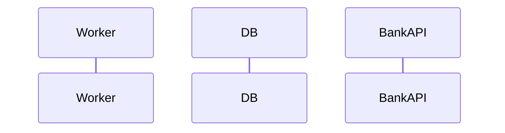

> **SPIKE CHALLENGE — PRODUCTION DOWN**
> This chapter starts as a normal task. Read the story before looking ahead.

---

### Story Context

**#incidents — Slack, Wednesday 2:17 AM**

**PagerDuty Bot** [2:17 AM]
🔴 ALERT: `payment-worker` error rate > 5% — 47 errors in last 5 minutes
Runbook: https://wiki.novapay.internal/runbooks/payment-worker-errors
On-call: @you

**You** [2:19 AM]
Ack. Looking now.

**Dani Osei** [2:21 AM]
I saw the alert. What are you seeing?

**You** [2:23 AM]
Error logs show `duplicate key constraint violation` on `payments.idempotency_key`.
Happening in bursts. Looks like ~200 errors in the last 6 minutes.

**Dani** [2:24 AM]
That's the idempotency guard working. That's not the problem.
Check the bank API response codes on those jobs.

**You** [2:31 AM]
Oh no.

**You** [2:31 AM]
I'm seeing jobs that hit the bank API, got `200 OK` back, then failed to write
to the DB because the connection pool was exhausted. The job went back to the queue.
On retry — the bank API was called *again*. And it processed it again.

**Dani** [2:32 AM]
How many double charges?

**You** [2:33 AM]
Querying now... 23 duplicate charges. Amounts range from $12 to $840.

**Dani** [2:34 AM]
Wake up Priya.

---

**Phone bridge transcript — #incidents-bridge, 2:41 AM**

**Priya Sharma**: How bad?
**Dani**: 23 merchants double-charged. We're issuing refunds now. But we need to
understand the failure mode before we bring the worker back up at full capacity.

**Priya**: What broke the connection pool?

**You**: Kwik ran a flash sale at 2 AM — didn't tell us. We saw 6x normal traffic.
Workers were holding DB connections open while waiting for bank API responses.
Pool hit max connections. Workers failed after bank success. Jobs retried.
Bank has no idempotency key support on their side — they charged again.

**Priya**: I thought we had idempotency keys.

**Dani**: We do — for our system. Not for the bank API call itself. The bank processes
every request that comes in. We assumed our job wouldn't retry after a bank success.
That assumption was wrong.

**Priya**: Fix it. And tell me your design before you deploy. I'm not going back to sleep.

---

**Slack DM — Marcus Webb → You, 3:05 AM**

**Marcus Webb**
I told you to think about what happens when you crash between "bank says yes" and
"you write the DB row." Did you think about it?

**You** [3:06 AM]
I thought idempotency keys on the queue job would protect us. They do — from
double-queueing. But not from what actually happened.

**Marcus Webb** [3:07 AM]
Right. The job *was* unique. It ran exactly once. The bank API call inside the job
was not idempotent. Two different things. You protected the wrong boundary.

**Marcus Webb** [3:08 AM]
Here's a hint. The problem has a name. It's called the "dual write problem."
Your fix will involve writing *before* you call the bank, not after.
Goodnight.

---

**Dani's incident timeline (posted to #incidents at 4:55 AM)**

```
02:17 — PagerDuty fires
02:19 — On-call acks
02:23 — Root cause identified (dual write race condition)
02:33 — 23 duplicate charges confirmed
02:45 — Worker scaled down to 10% capacity
03:15 — Emergency fix deployed (outbox pattern stub)
04:50 — Full capacity restored. Zero new duplicates in 90 minutes of monitoring.
05:00 — Postmortem scheduled for Friday 10am
```

**Aisha Patel (Head of Security)** [5:02 AM]
This is the second payment incident this quarter. PCI-DSS auditors are going to
ask about this. We need a design review before the next deploy.

---

### Problem Statement

The duplicate charge incident exposed a fundamental design flaw: NovaPay's payment
worker calls the bank API and then writes to the database as two separate operations.
When the DB write fails after a successful bank API call, the job retries and calls
the bank API again — causing a double charge.

You must design an idempotency strategy that eliminates this failure mode without
relying on the bank having its own idempotency support.

### Explicit Requirements

1. Guarantee that a single `payment_id` is charged to the bank API at most once,
   even if the worker crashes between the bank API call and the database write
2. Handle connection pool exhaustion gracefully — worker must not hold DB connections
   during external API calls
3. Idempotency check must be atomic — no race condition between two concurrent workers
   picking up the same job
4. System must be self-healing: a payment stuck in PROCESSING must eventually
   resolve (complete or fail), not hang forever
5. Failed payments must be retryable by the merchant without risk of double charge

### Hidden Requirements

- **Hint**: Marcus Webb mentioned writing *before* you call the bank, not after.
  What state do you write before the bank call? How does that pre-write prevent a
  double charge on retry?
- **Hint**: Dani's incident timeline shows the emergency fix was an "outbox pattern
  stub." What is the outbox pattern? How does it ensure at-least-once delivery
  without dual writes?
- **Hint**: Aisha mentioned PCI-DSS auditors. What audit evidence does your
  idempotency design produce? Every bank API call attempt should be traceable.

### Constraints

- **Bank API**: No idempotency key support. Every request is processed independently.
- **Worker concurrency**: Up to 50 concurrent workers during peak
- **DB connection pool**: Max 100 connections (shared across API server + workers)
- **Job queue**: BullMQ on Redis. At-least-once delivery semantics.
- **Max acceptable duplicate rate**: Zero. Not "near zero." Zero.
- **RTO for this fix**: Must be deployable within 2 hours (Priya is waiting)
- **Payment stuck timeout**: Any payment in PROCESSING > 5 minutes must be
  investigated/auto-resolved

### Your Task

Design the idempotency layer for NovaPay's payment worker that prevents double
charges regardless of crash timing, connection pool state, or concurrent retries.

### Deliverables

- [ ] **Mermaid sequence diagram** — the complete worker execution flow showing
  the outbox pattern: pre-write → bank API call → post-write → what happens on crash
- [ ] **Database schema changes** — what new table(s) or columns does your fix require?
  Include the `bank_call_log` or equivalent that captures every bank API attempt
- [ ] **Failure mode analysis** — draw a table: for each crash scenario (crash before
  bank call / crash after bank success / crash after bank failure / crash after DB write),
  what is the outcome and is it safe to retry?
- [ ] **Scaling estimation** — at 50 concurrent workers, each holding a bank API
  call open for up to 3s, how many DB connections does your new design use vs the
  old design? Show the math.
- [ ] **Tradeoff analysis** — minimum 3 tradeoffs:
  1. Outbox pattern vs distributed lock (Redis SETNX) for preventing dual writes
  2. Pre-writing PROCESSING status vs optimistic locking
  3. Automatic stuck-payment recovery vs manual ops intervention

### Diagram Format


