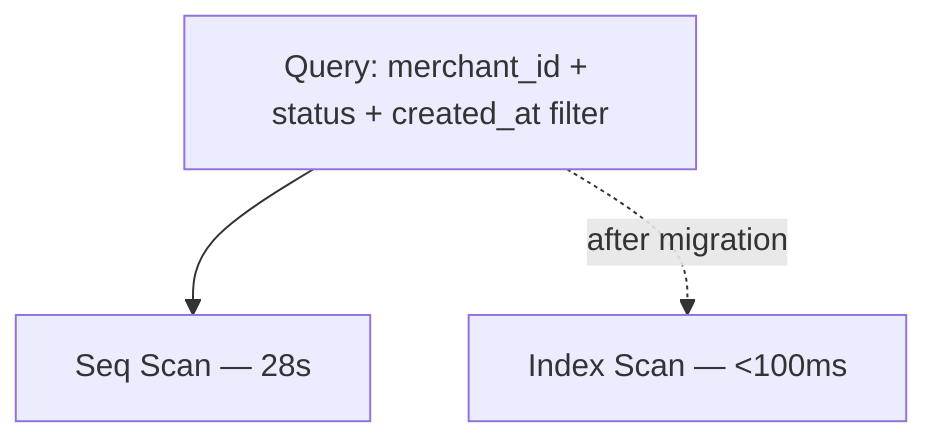

> **SPIKE CHALLENGE — INHERITED DISASTER**
> This chapter starts as a routine task. Something is worse than it looks.

---

### Story Context

**Email chain — Subject: "Merchant dashboard is 'slow'" — Thursday, 9:02 AM**

```
From: Carlos Reyes <carlos@novapay.io>
To: payments-core@novapay.io
Date: Thursday, 9:02 AM
Subject: Merchant dashboard is "slow"

Hey team,

Kwik's ops lead, Taiwo, emailed me yesterday saying their internal dashboard
(which pulls from our API) takes "like 30 seconds to load" for their bigger merchants.
One of their merchants has 400k transactions in the last 90 days. Loading their
transaction history is apparently "unbearable."

Can someone look at this? Kwik's QBR is in 2 weeks. This will come up.

Thanks,
Carlos
```

```
From: Dani Osei <dani@novapay.io>
To: payments-core@novapay.io
Date: Thursday, 9:31 AM
Subject: Re: Merchant dashboard is "slow"

This is the payments table. Probably missing indexes. Can someone pull the
slow query log and see what's actually happening?

Dani
```

```
From: You
To: payments-core@novapay.io
Date: Thursday, 9:45 AM
Subject: Re: Re: Merchant dashboard is "slow"

On it.
```

---

**You, running queries in production (staging read replica, 9:51 AM)**

You pull up the slow query log. The top offender jumps out immediately:

```sql
-- Runs ~150 times/hour. Avg execution time: 28.4 seconds.
SELECT *
FROM payments
WHERE merchant_id = $1
  AND status IN ('COMPLETED', 'FAILED', 'REVERSED')
  AND created_at >= $2
ORDER BY created_at DESC
LIMIT 50 OFFSET $3;
```

The `payments` table has **14.2 million rows**. You run `EXPLAIN ANALYZE`:

```
Seq Scan on payments  (cost=0.00..892341.23 rows=14203847 width=287)
                      (actual time=0.043..28312.442 rows=428193 loops=1)
  Filter: (merchant_id = '...' AND status IN (...) AND created_at >= ...)
  Rows Removed by Filter: 13775654
Planning Time: 2.3 ms
Execution Time: 28315.1 ms
```

A full sequential scan. On 14 million rows. In production.

You look at the table definition. There are **no indexes** except the primary key.

You type a message to Dani, then stop. You run another query first:

```sql
SELECT COUNT(*) FROM payments WHERE merchant_id = 'kwik-merchant-00001';
-- Result: 412,847 rows
```

Then you notice something in the schema that makes your stomach drop:

```sql
-- payments table (actual DDL, retrieved from pg_dump)
CREATE TABLE payments (
  id UUID PRIMARY KEY DEFAULT gen_random_uuid(),
  merchant_id VARCHAR(64) NOT NULL,
  customer_id VARCHAR(64),
  amount_original NUMERIC(18, 2) NOT NULL,
  currency_original CHAR(3) NOT NULL,
  amount_usd NUMERIC(18, 2),
  status VARCHAR(32) NOT NULL DEFAULT 'PENDING',
  idempotency_key VARCHAR(128),           -- no UNIQUE constraint
  created_at TIMESTAMPTZ DEFAULT NOW(),
  updated_at TIMESTAMPTZ DEFAULT NOW(),
  metadata JSONB
);
```

There's no UNIQUE constraint on `idempotency_key`. That means the database isn't
enforcing idempotency at all — the application logic is the only guard. And from
Chapter 2, you know what happens when the application logic fails under load.

---

**Slack DM — You → Dani, 10:03 AM**

**You**: Found the slow query issue. No indexes on the payments table at all.
But I also found something worse. There's no unique constraint on idempotency_key.
The DB is not enforcing idempotency. At all.

**Dani** [10:04 AM]: ...I need a coffee.

**Dani** [10:05 AM]: How far back does this go?

**You**: DDL shows the table was created 3 years ago. The constraint was never added.

**Dani**: Okay. Two problems. Fix the query performance. Fix the idempotency gap.
Both carefully — this is a live production table with 14M rows.
Adding indexes wrong can lock the table and take us down.

---

**Slack DM — Marcus Webb → You, 10:18 AM**

**Marcus Webb**
Heard about the missing indexes. Classic sign of a system built by someone who
tested on 1,000 rows and shipped. The idempotency key thing is more interesting.
Question: if you add UNIQUE on idempotency_key now, what happens to existing rows?
Any duplicates already in the table?

**You** [10:22 AM]
I'd have to check. If there are duplicates already, the constraint will fail to add.

**Marcus Webb** [10:23 AM]
Right. So query before you migrate. And think about whether your index strategy
and your constraint strategy interact. Some things you can do concurrently.
Some things you absolutely cannot.

---

### Problem Statement

NovaPay's `payments` table has 14.2 million rows, no indexes beyond the primary key,
no unique constraint on `idempotency_key`, and is serving live production traffic.
A single merchant query takes 28 seconds. You must fix query performance AND close
the idempotency integrity gap — without taking the table offline.

### Explicit Requirements

1. Reduce the merchant transaction history query to under 100ms P99
2. Add a UNIQUE constraint on `idempotency_key` to enforce DB-level idempotency
3. All index and constraint changes must be non-blocking (use `CREATE INDEX CONCURRENTLY`)
4. Identify the minimum set of indexes needed (over-indexing slows writes)
5. Handle the case where duplicate `idempotency_key` rows already exist before
   adding the unique constraint
6. Document the migration plan with explicit rollback steps

### Hidden Requirements

- **Hint**: Marcus Webb asked "what happens to existing rows?" Before adding a
  UNIQUE constraint, you must audit existing data for violations. What query do
  you run to find them, and what do you do with the results?
- **Hint**: The query uses `LIMIT 50 OFFSET $3` for pagination. This pattern
  has a known performance trap on large offsets — even with indexes. What is it,
  and what's a better pagination strategy for this use case?
- **Hint**: The `status` column is a VARCHAR with low cardinality (~5 unique values
  across 14M rows). When you create a composite index, does column order matter?
  Which column should come first in the index — `merchant_id` or `status`?

### Constraints

- **Table size**: 14.2 million rows, ~4GB on disk
- **Write rate**: ~800 inserts/minute (payments are actively being created)
- **Read replicas**: 1 read replica available; dashboard queries can be routed there
- **Downtime budget**: Zero. This is a live production table.
- **Postgres version**: 14 (supports `CREATE INDEX CONCURRENTLY`)
- **Max acceptable migration time**: Index creation on 14M rows takes ~8 minutes;
  this is acceptable as long as it doesn't lock writes
- **Team constraint**: Only 1 engineer working this (you). Dani is in QBR prep.

### Your Task

Design the complete index strategy and migration plan for the `payments` table.
Address both the query performance problem and the idempotency integrity gap.

### Deliverables

- [ ] **Index plan** — list every index you would add, with the exact SQL DDL,
  justification for each, and expected impact on the slow query
- [ ] **EXPLAIN ANALYZE comparison** — sketch the expected query plan *after*
  your indexes are added (show approximate cost reduction)
- [ ] **Migration plan** — ordered list of steps with the exact SQL for each,
  including the pre-migration data audit query and how to handle any found duplicates
- [ ] **Scaling estimation** — at 800 inserts/minute, how much additional write
  overhead do your new indexes add? Show the math.
- [ ] **Tradeoff analysis** — minimum 3 tradeoffs:
  1. Composite index vs separate indexes for `merchant_id` and `created_at`
  2. Offset-based pagination vs cursor-based pagination
  3. Adding the UNIQUE constraint on idempotency_key now vs a deferred backfill strategy

### Diagram Format


