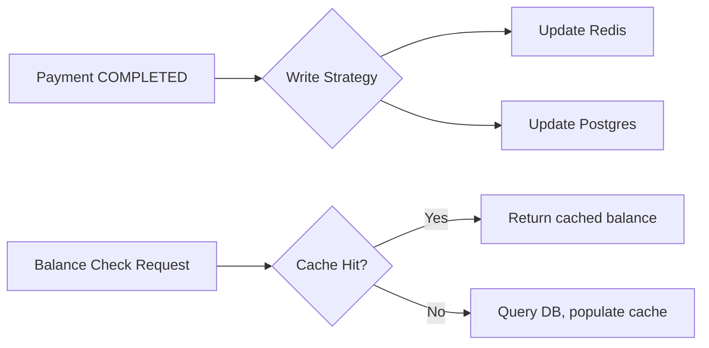

### Story Context

**1:1 session transcript — Dani Osei & You, Friday 2:00 PM**

**Dani**: Okay, the indexes are deployed. Dashboard queries are fast. Good work.
Now I want to talk about the next thing before it becomes an incident.
You know the merchant balance check endpoint?

**You**: `/v1/merchants/{id}/balance`?

**Dani**: That one. Right now every call hits Postgres directly — it aggregates
all completed payments minus all refunds for a merchant. On a merchant like Kwik's
bigger accounts, that's 400k rows it's summing in real time. We call that endpoint
about 12,000 times per day just from our own dashboard and the Kwik integration.

**You**: Is it slow?

**Dani**: P99 is 340ms. P50 is about 80ms. Not dead, but not good. And here's the
thing — Kwik's integration calls it before *every single payment authorization* to
check if the merchant has enough available balance. So when they run a flash sale
and we get 8,000 payment attempts in a minute, we also get 8,000 balance checks.
That's 133 balance queries per second. Postgres is not going to survive that.

**You**: So we cache it.

**Dani**: Yes. But carefully. This is financial data. Balance is not a number you
can be wrong about. I had an engineer at my last company cache balances naively —
cache-aside, no write strategy, 60-second TTL. A merchant did a refund and kept
charging because the cached balance was stale. Twelve minutes of stale data.
Cost the company $90k in chargebacks.

**You**: What's the right approach?

**Dani**: That's your homework. Come back Monday with a design. Think about
write-through, write-behind, and read-through. Think about what "correct" means
when a payment is PENDING vs COMPLETED. Think about what happens when Redis goes down.

---

**Slack thread — #payments-core, Friday 3:14 PM**

**Carlos Reyes**: Hey, Kwik asked about "available balance vs settled balance."
They want to show merchants two numbers: money that's cleared AND money that's
in-flight (authorized but not settled). Is that something we support?

**Dani**: Not today. But it should be in scope for the cache design.
@you — add it to your Monday design.

**You**: Got it. Two balance types: `settled_balance` (COMPLETED payments minus
refunds) and `available_balance` (settled + authorized-but-not-settled).

**Dani**: Exactly. And those two numbers have different staleness tolerances.
Available balance can be a few seconds stale. Settled balance needs to be
exact — it's used for payouts.

---

**Slack DM — Marcus Webb → You, Friday 4:30 PM**

**Marcus Webb**
Write-through cache. Two questions.
First: when you write to cache and DB simultaneously, what happens if the
DB write succeeds but the Redis write fails? Or vice versa?
Second: balance isn't stored. It's computed. So what exactly are you caching —
the computation result, or the inputs to the computation?

**You** [4:35 PM]
I was planning to cache the computed balance value.

**Marcus Webb** [4:36 PM]
Then you have an invalidation problem. Every payment event changes the balance.
Every refund changes the balance. You need to decide: do you recompute on every
write, or do you maintain a running total?
Running total is faster but requires perfect consistency on every write.
Recompute is safer but costs you a DB query on cache miss.
Neither is wrong. Pick one and defend it.

---

**Aisha Patel (DM to you, Friday 5:01 PM)**

**Aisha**: Hey, before you finalize the cache design — remember that balance data
is considered financial data under PCI-DSS scope. If you're storing it in Redis,
Redis needs to be within our PCI network boundary. And data at rest should be
encrypted. Just flagging early so it doesn't bite us at audit time.

---

### Problem Statement

NovaPay's merchant balance endpoint currently performs a real-time aggregation
query over hundreds of thousands of payment rows on every request. With Kwik's
integration calling it before every payment authorization, the system will see
133 balance-check RPS during flash sales — far beyond what Postgres can handle
with live aggregation. You need to design a caching layer that serves accurate
balance data at scale while maintaining financial correctness.

### Explicit Requirements

1. Serve merchant balance checks under 20ms P99 (currently 340ms P99)
2. Support two balance types: `settled_balance` and `available_balance`
3. `settled_balance` must be exact — used for payout calculations (zero tolerance
   for stale data on payout flows)
4. `available_balance` may be up to 5 seconds stale during normal operations
5. Cache must be consistent with the database — a payment that completes must
   update the balance atomically (no window where balance is wrong)
6. System must degrade gracefully when Redis is unavailable (fall back to DB,
   not serve stale data indefinitely)
7. Cache must be within the PCI network boundary; data at rest must be encrypted

### Hidden Requirements

- **Hint**: Marcus Webb asked about the failure case — DB write succeeds, Redis
  write fails (or vice versa). What is your atomicity strategy? Is a two-phase
  commit necessary, or is there a simpler approach?
- **Hint**: Dani mentioned `settled_balance` is used for payouts. What happens
  during a payout if the cache is being refreshed? Is there a race condition
  between reading the balance for a payout decision and the next payment completing?
- **Hint**: Carlos mentioned available balance includes "authorized but not settled."
  Payments in PROCESSING state have been authorized. When does PROCESSING start —
  when the job is dequeued, or when the bank API responds? This affects what you
  cache and when.

### Constraints

- **Read RPS**: 133 balance reads/second at peak (8,000 RPM × 1 balance check each)
- **Write frequency**: Balance changes on every COMPLETED or REVERSED payment event
  (~800 payments/minute at peak = ~13 writes/second to cache)
- **Merchants**: ~400,000 total; ~50,000 "active" in any given day
- **Cache memory budget**: 2GB Redis instance (shared with queue)
- **Target cache hit rate**: > 95% for active merchants
- **Redis fallback**: DB queries must handle 133 RPS if Redis fails (read replica)
- **PCI compliance**: AES-256 encryption at rest on Redis required

### Your Task

Design the write-through caching strategy for merchant balances. Define what is
cached, when it is written, how it is invalidated, and how the system behaves
under failure scenarios.

### Deliverables

- [ ] **Mermaid architecture diagram** — show the write path (payment completes →
  cache update → DB write) and read path (balance check → cache hit/miss)
- [ ] **Cache data model** — what exactly is stored in Redis per merchant?
  Key structure, value structure, TTL strategy
- [ ] **Write strategy document** — step-by-step: when a payment transitions to
  COMPLETED, what exact operations happen, in what order, and what is the
  failure handling at each step?
- [ ] **Scaling estimation** — at 50,000 active merchants × average balance
  record size, what is the Redis memory footprint? Does it fit in 2GB?
- [ ] **Tradeoff analysis** — minimum 3 tradeoffs:
  1. Write-through vs write-behind for balance updates
  2. Cached computed balance vs cached running total delta
  3. Per-merchant TTL expiry vs event-driven invalidation only

### Diagram Format

