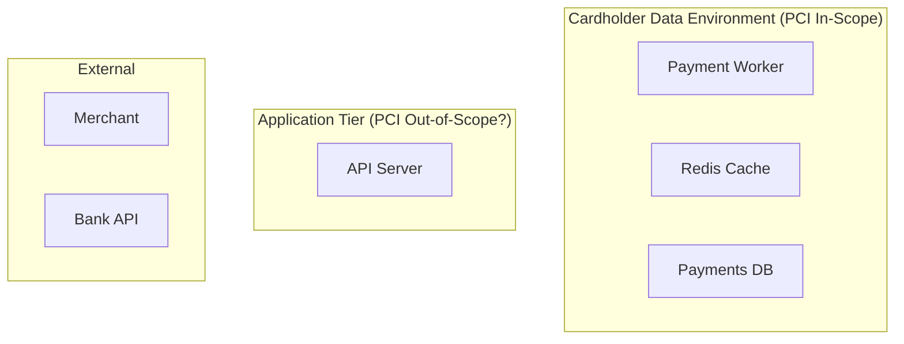

> **SPIKE CHALLENGE — DESIGN REVIEW AMBUSH**
> You've been asked to present your payment architecture to a cross-functional
> review board. You don't know Aisha has invited external auditors until you're
> in the room.

---

### Story Context

**Calendar invite — Thursday 3:00 PM, "Architecture Review: Payments Platform"**

```
Organizer: Aisha Patel
Attendees: You, Dani Osei, Priya Sharma, Carlos Reyes
Location: Conf Room B / Zoom
Notes: Please prepare a 15-min walkthrough of the current payments architecture
       including recent changes. We'll have a few guests joining remotely.
```

You prepare slides covering the async pipeline (Ch. 1), the idempotency fix (Ch. 2),
the index work (Ch. 3), and the cache design (Ch. 4). You feel good about it.

---

**Conf Room B, 3:02 PM — meeting transcript**

**Aisha**: Thanks everyone for joining. I want to introduce two guests on Zoom —
Bradley Kaur and Stephanie Okon from Cipher Advisory. They're the external PCI-DSS
QSA firm we've engaged ahead of our SOC2 Type II audit. I've asked them to sit in
on this review.

*[You close your slide deck mentally and think: QSA auditors. Qualified Security Assessors.
They can fail your audit. This is not a design discussion anymore.]*

**Bradley Kaur (Cipher Advisory)**: Thanks for having us. We'll mostly listen,
but we may ask questions. Please just walk us through the architecture as you
have it.

You begin. The pipeline. The idempotency layer. The cache. Five minutes in —

**Stephanie Okon**: Sorry to interrupt. When a payment is initiated — who sees
the cardholder data?

**You**: The merchant sends us the payment request. We pass the amount, currency,
and merchant reference to the bank API. We don't handle card numbers directly —
merchants tokenize at their end.

**Stephanie**: Does your system ever touch a PAN — a Primary Account Number?
Even transiently?

**You**: I... don't think so. The bank API handles tokenization.

**Stephanie**: "Don't think so" is not an acceptable answer for PCI scope.
Do you have a data flow diagram showing every system that touches cardholder data?

*[Silence.]*

**Bradley**: Let me ask a simpler question. Your cache stores merchant balance data.
Is that cache encrypted at rest? Is it in a network segment that's been scoped
for PCI?

**You**: The Redis instance uses AES-256 at rest. The network segmentation — I'd
have to confirm with our DevOps team.

**Dani**: We have VPCs. Redis is in the private subnet.

**Bradley**: Is the private subnet the same subnet as your application servers?
If so, it's not segmented — it's just on the same flat network. PCI DSS Requirement 1
mandates network segmentation between the CDE and other systems.

**Priya** [quietly, to you]: Can you handle this?

*[Twelve pairs of eyes on you. Auditors taking notes.]*

**Bradley**: Let me give you a framework. PCI-DSS v4.0 has twelve core requirements.
The ones most relevant to what you've described today are Requirements 1, 3, 7, 8,
and 10. I'd like you to walk us through your architecture against each of those.
Take your time. We have the rest of the hour.

---

**Slack DM — Marcus Webb → You, 6:47 PM (after the meeting)**

**Marcus Webb**
Aisha told me how the meeting went. You survived.
PCI is not a checklist. It's a threat model. Every requirement maps to a real
attack vector that has been used in real breaches.
Requirement 3 — don't store sensitive auth data — exists because of Heartland
Payment Systems, 2008. 134 million cards stolen. The attacker didn't need to
break encryption. They found the unencrypted staging database.
Requirement 10 — audit logs — exists because attackers live in systems for
months before they're caught. Without logs, you can't reconstruct what happened.
Your architecture isn't bad. It just wasn't designed with a threat model.
Redesign it with one.

---

**PCI-DSS Quick Reference (Aisha sent to you after the meeting)**

```
Requirement 1: Install and maintain network security controls
               - CDE (Cardholder Data Environment) must be isolated
               - Firewall rules documented and reviewed quarterly

Requirement 3: Protect stored account data
               - Never store full PAN, CVV, or PIN after authorization
               - Stored PAN must be encrypted (AES-256 or stronger)
               - Data retention policy with secure deletion

Requirement 7: Restrict access to system components
               - Role-based access control
               - Least privilege on all DB and service credentials
               - No shared credentials

Requirement 8: Identify users and authenticate access
               - Unique IDs for every user
               - MFA required for CDE access
               - Service accounts must not be used by humans

Requirement 10: Log and monitor all access to system components
                - Audit logs: every read/write to cardholder data
                - Logs must be tamper-evident
                - Retain logs for 12 months (3 months online)
```

---

### Problem Statement

NovaPay is pursuing SOC2 Type II certification and a PCI-DSS assessment is
underway. The current payments architecture was built for functionality, not
compliance. You must redesign the architecture to satisfy PCI-DSS v4.0
Requirements 1, 3, 7, 8, and 10 — without rewriting the core payment logic.

### Explicit Requirements

1. Define the Cardholder Data Environment (CDE) boundary — which services are
   in scope, which are out of scope
2. Ensure network segmentation: CDE components must not be on the same subnet
   as general application services
3. Implement tamper-evident audit logging for every read and write of payment data
4. Enforce least-privilege access: each service has its own DB credentials with
   minimum required permissions (no shared `postgres` superuser)
5. Define data retention: what is stored, how long, and how it is securely deleted
6. Confirm NovaPay's PAN handling scope — does your system ever touch raw card numbers?
   Document the answer with a data flow diagram.
7. MFA required for any human access to production CDE systems

### Hidden Requirements

- **Hint**: Bradley asked if the private subnet is "the same subnet as your
  application servers." If Redis and your app servers are on the same VPC
  subnet without further segmentation, they are technically in scope for PCI.
  What network architecture change is required?
- **Hint**: Marcus Webb mentioned Heartland 2008 and the unencrypted staging
  database. Do you have a staging environment that uses real payment data? This
  is a common audit failure. Your design must address how staging data is
  sanitized.
- **Hint**: Requirement 10 says logs must be "tamper-evident." Your current
  PostgreSQL audit log could be modified by anyone with DB access. Where must
  audit logs be written to be tamper-evident, and who must NOT have write access?

### Constraints

- **Compliance deadline**: PCI QSA assessment begins in 6 weeks
- **Infrastructure**: AWS VPC, current flat private subnet with Redis + app servers
- **Team**: 1 DevOps engineer, 1 Security engineer (Aisha), 2 backend engineers
- **Current audit log**: Single Postgres table `payment_audit_log` — no separate
  log system
- **Card data handling**: Merchants tokenize client-side using a JS library;
  tokens are sent to NovaPay. NovaPay sends tokens (not PANs) to bank API.
  However, there is one legacy endpoint (`/v1/legacy/charge`) that accepts a
  raw PAN for one merchant — this must be addressed.
- **Budget**: No additional managed services without VP approval. Must use AWS
  native services where possible (CloudTrail, CloudWatch Logs are already paid for).

### Your Task

Produce a PCI-DSS compliance architecture for NovaPay's payment platform. Define
the CDE boundary, network segmentation, access controls, and audit logging design.
Include a plan to eliminate the legacy PAN-handling endpoint.

### Deliverables

- [ ] **CDE boundary diagram** (Mermaid) — show which services are in-scope vs
  out-of-scope for PCI; show network segments and where each component lives
- [ ] **Data flow diagram** — trace the path of a payment token from merchant
  through NovaPay to the bank API; explicitly mark where PAN data does NOT exist
- [ ] **Audit log architecture** — where are logs written, who can write vs read,
  how tamper-evidence is achieved, retention period, and secure deletion plan
- [ ] **Access control matrix** — for each service (API server, worker, Redis,
  Postgres), what credentials does it use and what permissions does it have?
- [ ] **Legacy PAN migration plan** — how do you retire `/v1/legacy/charge` and
  migrate that merchant to tokenized flow? What is the rollback plan?
- [ ] **Tradeoff analysis** — minimum 3 tradeoffs:
  1. Storing audit logs in Postgres vs writing to an append-only external log store
  2. Flat VPC subnet vs multi-tier subnet architecture (CDE subnet isolation)
  3. Tokenization at client vs tokenization at NovaPay API gateway

### Diagram Format


