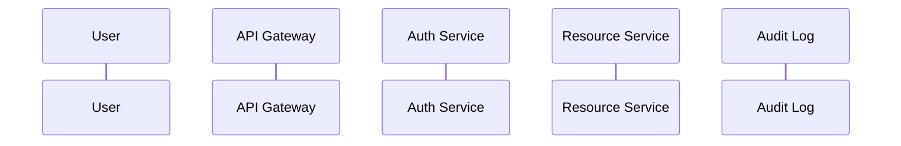

### Story Context

**Email chain — Subject: "Auth overhaul — need a design" — Monday, 8:50 AM**

```
From: Ravi Chandran <ravi@meridianhealth.io>
To: platform-team@meridianhealth.io
Date: Monday, 8:50 AM
Subject: Auth overhaul — need a design

Team,

We have three hospital networks going live in Q2: St. Jude Medical Center,
Valley Primary Care Group, and Mercy Coast Health System. Each has different
requirements for how their staff authenticate to MeridianHealth APIs.

St. Jude: Uses Azure AD. Wants SSO via their existing identity provider.
Valley Primary: Small practice, no enterprise IdP. Username/password + MFA.
Mercy Coast: Epic EHR integration — needs machine-to-machine OAuth2 client
credentials for their Epic backend to query our APIs.

Right now we have a homebuilt auth system: JWT tokens, 24-hour expiry, no
refresh tokens, no MFA, no audit log of who accessed what. The previous tech
lead wrote it. It "works" but I would not feel comfortable showing it to our
HIPAA compliance officer.

Please produce a design for a proper auth system by end of week. I want to
present it to compliance and legal before we onboard any of the new customers.

Ravi
```

```
From: Nalini Obasi (Compliance Officer) <nalini@meridianhealth.io>
To: platform-team@meridianhealth.io
Date: Monday, 11:15 AM
Subject: Re: Auth overhaul — need a design

Adding to Ravi's requirements:

HIPAA requires that we log every access to PHI (Protected Health Information).
That means every API call that returns patient data must be attributed to a
specific human user or system, with timestamp, action, and resource accessed.
Anonymous or shared credentials are not acceptable.

Also: session tokens must expire. 24-hour JWTs are borderline. HIPAA guidance
recommends automatic logoff after a period of inactivity — typically 15 minutes
for clinical workstations. For API access, session duration should be risk-based.

If you have questions about what "audit trail" means in practice, let me know.

Nalini
```

---

**1:1 session — Ravi & You, Tuesday 2:00 PM**

**Ravi**: Did you read Nalini's email?

**You**: Yes. A few thoughts. The three clients you described need three different
auth flows: federated SSO (Azure AD), direct username/password with MFA, and
machine-to-machine. That's fundamentally an OAuth2/OIDC problem, not a custom
JWT problem. We should use a proper identity layer.

**Ravi**: Are you thinking an external IdP — Auth0, Okta, something like that?

**You**: It's worth considering. But we might want more control given HIPAA scoping.
If our auth provider processes PHI-adjacent data, they become a HIPAA Business Associate
and we need a BAA with them.

**Ravi**: Good catch. Nalini will want to know that too. What's your recommendation?

**You**: Let me model out the flows first, then we can make the build-vs-buy call.

**Ravi**: One more constraint. Epic's OAuth2 client credentials flow is non-standard.
They have their own SMART on FHIR authentication spec. Our system has to support that
or we lose the Mercy Coast contract.

---

**Slack DM — Marcus Webb → You, Wednesday 9:30 AM**

**Marcus Webb**
Saw the auth design thread in your team's public channel. Three questions.
1. Where are your JWTs validated — gateway, service, or both?
2. If a user's account is compromised and you revoke their session, how long
   until every service actually rejects their token?
3. What's the difference between authentication and authorization? Your design
   needs to do both. Don't conflate them.

**You** [9:38 AM]
Validated at the gateway. But if we use stateless JWTs, revocation is the classic
problem — we'd need a blocklist or short expiry. The authorization question —
I'm thinking RBAC at the service level.

**Marcus Webb** [9:40 AM]
Right. And in a healthcare context, authorization gets complicated fast.
A nurse at St. Jude should be able to see their own patients' records but not
records from Valley Primary. That's not just RBAC — that's tenant isolation plus
resource-level access control. Make sure your design handles that boundary.

---

### Problem Statement

MeridianHealth's existing auth system — homebuilt JWTs with 24-hour expiry and
no audit log — cannot support the three new hospital network clients or pass a
HIPAA compliance review. You need to design a proper authentication and authorization
system that supports federated SSO, direct login with MFA, and machine-to-machine
OAuth2, while maintaining HIPAA-required audit trails for every PHI access.

### Explicit Requirements

1. Support three auth flows:
   - Federated SSO via OIDC (Azure AD for St. Jude)
   - Username/password + TOTP MFA (Valley Primary Care)
   - OAuth2 client credentials (machine-to-machine for Mercy Coast / Epic)
2. Issue short-lived access tokens (max 15 minutes) with refresh tokens
3. Token revocation must be effective within 60 seconds across all services
4. Every PHI API access must be logged with: user/system identity, timestamp,
   resource ID, and action type (read/write/delete)
5. Tenant isolation: a user at St. Jude must not be able to access Valley Primary
   patient records, even with a valid token
6. Support SMART on FHIR auth spec for Epic EHR integration
7. Build-vs-buy decision must account for HIPAA Business Associate Agreement (BAA)
   requirements for any third-party auth service

### Hidden Requirements

- **Hint**: Marcus Webb asked how long until services reject a revoked token.
  Stateless JWTs cannot be revoked without a blocklist. What is the performance
  cost of a blocklist check on every request, and how do you avoid it becoming
  a bottleneck?
- **Hint**: Nalini said "anonymous or shared credentials are not acceptable."
  Look at the current homebuilt system — does it issue per-user tokens or
  per-tenant tokens? If a hospital's entire team shares one API key, how
  does that fail the audit trail requirement?
- **Hint**: Ravi mentioned SMART on FHIR. SMART on FHIR has specific scopes for
  clinical data (e.g., `patient/*.read`, `user/Observation.write`). Your
  authorization model needs to map these FHIR scopes to your internal RBAC
  roles. Where does that mapping live, and who controls it?

### Constraints

- **Clients**: 3 hospital networks at launch, targeting 50 within 18 months
- **Users**: ~500 clinical staff users initially, scaling to ~25,000
- **Machine-to-machine**: ~10 Epic EHR backend integrations initially
- **Token validation latency**: Must not add > 10ms to API P99 latency
- **Audit log volume**: ~50,000 PHI access events/day at current scale;
  ~5M/day at 50-hospital scale
- **HIPAA retention**: Audit logs must be retained for 6 years
- **Revocation SLA**: Compromised accounts must be locked out within 60 seconds
- **Team**: 2 backend engineers, 1 security engineer, compliance officer as reviewer

### Your Task

Design the authentication and authorization system for MeridianHealth. Include
the token flow, revocation strategy, HIPAA audit trail, and tenant isolation model.
Make a build-vs-buy recommendation with supporting reasoning.

### Deliverables

- [ ] **Auth flow diagrams** (Mermaid sequence diagrams) — one for each of the
  three auth flows: OIDC/SSO, username+MFA, client credentials
- [ ] **Token lifecycle diagram** — issue → validate → refresh → revoke
- [ ] **Audit log schema** — table definition with column types, indexes; how
  it's written (synchronous vs async), and the 6-year retention/archival strategy
- [ ] **Tenant isolation model** — how does your token/session encode tenant
  context? How does the authorization middleware enforce the boundary?
- [ ] **Build vs buy analysis** — table comparing self-hosted (Keycloak/ORY) vs
  managed (Auth0/Okta) vs AWS Cognito, evaluated against: HIPAA BAA availability,
  SMART on FHIR support, cost at 25,000 users, operational complexity
- [ ] **Scaling estimation** — at 5M audit log events/day, what is daily storage
  growth? Over 6 years, what is total storage and monthly cost on AWS S3?
- [ ] **Tradeoff analysis** — minimum 3 tradeoffs:
  1. Short-lived JWTs (15min) vs opaque session tokens with server-side state
  2. Central blocklist (Redis) for revocation vs short-expiry-only approach
  3. RBAC vs ABAC for the tenant isolation + resource-level authorization problem

### Diagram Format


