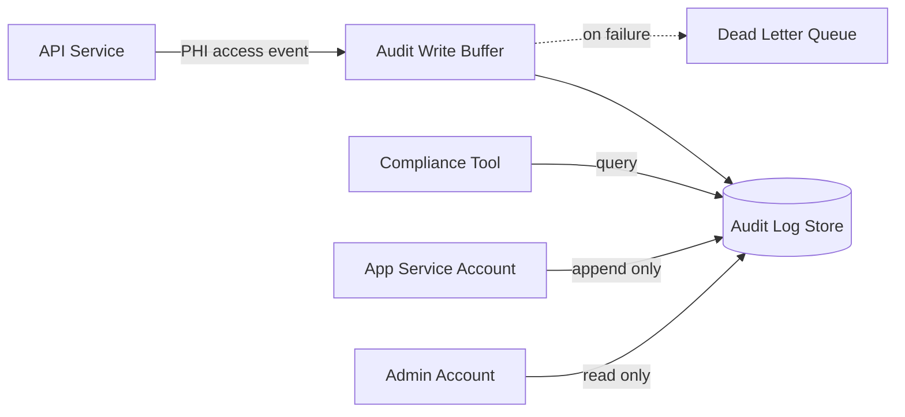

### Story Context

**#platform-team — Slack, Thursday 10:02 AM**

**Nalini Obasi** [10:02 AM]
Quick update: I met with legal yesterday. We need to be ready for a HIPAA audit
within 90 days. One of our prospective hospital clients — Northview Health — has
their own compliance team that audits vendors before signing. They want to see:
1. Access logs showing who queried patient data and when
2. Evidence that logs cannot be tampered with
3. A process for responding to audit requests within 30 days

Right now, do we have any of that?

**Ravi Chandran** [10:08 AM]
We have application logs in CloudWatch. They include some user context.

**Nalini** [10:09 AM]
"Some user context" is not HIPAA-compliant. Under 45 CFR § 164.312(b), we need:
- The identity of the user or system accessing PHI
- The date and time of the access
- The type of access (read, create, modify, delete)
- The patient record or PHI resource accessed
- Whether access was authorized or denied

Do our CloudWatch logs have all of that, structured, queryable, and tamper-evident?

**Ravi** [10:14 AM]
...Not currently.

**Nalini** [10:15 AM]
We need to fix this. @you — this is part of the auth redesign but it's bigger.
Can you scope a proper audit trail system?

---

**1:1 — You & Ravi, later that day**

**Ravi**: I want to be honest with you. The previous tech lead's position was that
our CloudWatch logs were "good enough" for HIPAA. Nalini disagreed. That was the
core of the disagreement before he left.

**You**: CloudWatch logs are not HIPAA audit trails. They're operational logs.
Different purpose, different format, different access controls. A developer can
write to CloudWatch. An audit log must be append-only and outside developer control.

**Ravi**: That's what Nalini said.

**You**: She's right. Here's the challenge: we need audit logging on every PHI
access. That means every API call that touches patient data. At 50 hospitals,
that could be millions of events per day. If we make audit logging synchronous —
log every request before responding — we add latency to every API call. If we
make it async, we risk losing events if the async pipeline fails.

**Ravi**: And losing audit events is itself a HIPAA violation.

**You**: Exactly.

---

**Email — Nalini to You, Friday 9:15 AM**

```
From: Nalini Obasi <nalini@meridianhealth.io>
To: You
Date: Friday, 9:15 AM
Subject: HIPAA audit trail — additional requirements

Two things I forgot to mention yesterday:

1. Right to Access (45 CFR § 164.524): Patients can request their own "access
   log" — i.e., who has accessed their records. We need to be able to produce
   this within 30 days of a patient request.

2. Breach Notification (45 CFR § 164.412): If we discover a breach, we have
   60 days to notify affected patients and HHS. The audit trail is how we
   determine which patients were affected and what data was accessed.

The audit log is not just a compliance checkbox. It's the system we use to
investigate and contain a breach. It needs to be fast to query during an
investigation, not just fast to write.

Nalini
```

---

**Slack DM — Marcus Webb → You, Friday 11:30 AM**

**Marcus Webb**
HIPAA audit trails. Fun. I helped design one at a hospital system in 2014.
We made one mistake that cost us dearly during a breach investigation.
We stored audit logs in the same database as the PHI. Auditor found that
an attacker with DB access could modify both the PHI and the audit logs.
The investigation couldn't prove the attacker hadn't covered their tracks.
We couldn't tell regulators with certainty what was accessed.

Tamper-evidence isn't just about encryption. It's about who can write
to the log store. If the same service that reads patient data can also
delete audit log rows — your audit trail is not tamper-evident.

**You** [11:38 AM]
So the audit log needs to be write-only from the perspective of application code.
Only a separate, privileged process can query it.

**Marcus Webb** [11:40 AM]
Now you're thinking. And what's the single point of failure in that design?

---

### Problem Statement

MeridianHealth needs a HIPAA-compliant audit trail system that captures every
PHI access event across all API services, stores records in a tamper-evident
manner, supports breach investigation queries, and can produce per-patient
access reports within 30 days. The system must handle millions of audit events
per day at scale without adding more than 5ms to API P99 latency.

### Explicit Requirements

1. Capture on every PHI access: user/system identity, timestamp (UTC + timezone),
   action type (read/create/modify/delete/deny), patient ID, resource type,
   resource ID, requesting IP, authorization outcome
2. Audit logs must be tamper-evident: application code must not be able to
   modify or delete audit records
3. Audit logging must not cause data loss: if the audit pipeline is unavailable,
   the system must not silently drop events
4. Support patient "right of access" query: given a patient ID, return all
   access events within a date range, within 30 days
5. Support breach investigation query: given a time window and list of patient
   IDs, return all access events
6. Retain audit logs for 6 years (HIPAA minimum)
7. Latency budget: audit logging must not add more than 5ms to API P99 latency

### Hidden Requirements

- **Hint**: Marcus Webb described the breach investigation problem — if logs are
  in the same DB as PHI, an attacker can modify both. How do you separate the
  write path so that application code cannot modify audit records after writing?
- **Hint**: Nalini mentioned breach notification within 60 days. During a breach
  investigation, you need to query: "which patients had their records accessed
  by user X between date A and date B?" What indexes does your audit log schema
  need to support this query efficiently at 6 years × millions of events?
- **Hint**: Ravi said async logging risks losing events if the pipeline fails.
  But sync logging adds latency. Is there a third option — one that writes
  synchronously to a fast buffer that is durable, then drains asynchronously
  to the long-term store?

### Constraints

- **Current scale**: ~50,000 audit events/day (3 hospital networks)
- **Target scale**: ~5,000,000 audit events/day (50 hospital networks)
- **Retention**: 6 years (minimum); some records may need 10 years for certain
  state regulations
- **Query SLA**: Breach investigation queries must return results within 60 seconds
  on 6-year dataset
- **Write latency budget**: < 5ms added to API P99
- **Tamper-evidence**: Audit log store must be append-only for application
  service account credentials
- **HIPAA**: Audit log itself is considered PHI-adjacent; access to the audit
  log must also be logged (meta-audit trail)

### Your Task

Design the HIPAA audit trail architecture: the data model, write pipeline,
storage strategy, access control model, and breach investigation query interface.

### Deliverables

- [ ] **Audit log data model** — full schema with column types, indexes for
  the two primary query patterns (per-patient and breach investigation)
- [ ] **Write pipeline architecture** (Mermaid) — show how an API request
  generates an audit event, how it flows to the audit store, and what happens
  if the pipeline is unavailable
- [ ] **Storage tiering plan** — hot storage (recent, queryable) vs cold storage
  (archival, cheaper); at what age do records tier out, and how are they queried
  from cold storage?
- [ ] **Access control design** — IAM/credential model that makes the audit log
  append-only for application services but queryable by compliance/investigation tools
- [ ] **Scaling estimation** — at 5M events/day × 365 × 6 years, what is total
  event count? At an average event size of 500 bytes, what is total storage?
  What is the monthly S3 cost for cold storage?
- [ ] **Tradeoff analysis** — minimum 3 tradeoffs:
  1. Synchronous audit writes vs async via durable queue (Kafka/SQS)
  2. Storing audit logs in Postgres (same cluster) vs dedicated append-only store
  3. Structured JSON audit events vs columnar storage (Parquet on S3 + Athena)

### Diagram Format


