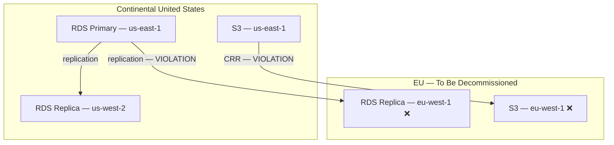

> **SPIKE CHALLENGE — INHERITED DISASTER**
> You're three weeks into the job when you find out the system has been
> operating in violation of a state law since the company was founded.

---

### Story Context

**#platform-team — Slack, Week 3, Tuesday 9:45 AM**

**Ravi Chandran** [9:45 AM]
Everyone join the emergency call in 15 minutes. Conf link in calendar.

---

**Emergency call transcript — 10:03 AM**

**Ravi**: Okay, I'll be direct. Legal called me this morning. One of our hospital
clients — Valley Primary Care Group — is in California. California has a state law,
the CMIA (Confidentiality of Medical Information Act), that adds requirements on
top of HIPAA. One of those requirements: medical records of California patients
must be stored on servers physically located in the United States. We've been
compliant on that one.

But here's the new issue: we just signed a contract with Northview Health, which
has clinics in both California AND Texas. Under a recent Texas Health & Safety Code
amendment, patient records for Texas residents must be stored on infrastructure
within the continental United States, and PHI must not be replicated to international
regions without explicit patient consent.

**Nalini Obasi**: We currently run a multi-region setup: `us-east-1` primary,
`eu-west-1` as a DR (Disaster Recovery) region. We replicate everything — including
PHI — to `eu-west-1`.

**Lawyer (on call)**: That replication to `eu-west-1` is potentially a violation
of the Texas statute. And it may also constitute a transfer of personal health
information outside the US under emerging state privacy laws. We need to know
exactly what data is in `eu-west-1` and we need a remediation plan by end of month.

**Ravi**: The problem is, I don't know exactly how the replication was set up.
The previous tech lead configured it.

*[Silence on the call.]*

**You**: I can investigate. Give me the afternoon.

---

**Your findings, Tuesday 4:30 PM (Slack thread, #platform-team)**

**You**: Here's what I found. We use AWS RDS PostgreSQL with cross-region read
replicas. The primary is in `us-east-1`. There are two replicas: one in `us-west-2`
for west coast read performance, and one in `eu-west-1` — which the previous tech
lead set up as "disaster recovery." All patient PHI replicates to all three.

**You**: Additionally, we use S3 with Cross-Region Replication (CRR) configured.
Our document storage — which includes uploaded lab results and clinical notes —
also replicates to `eu-west-1`.

**You**: There is no mechanism currently to distinguish California patient data from
Texas patient data from other states. It all goes to the same tables, same buckets,
same replication policy.

**Nalini** [4:35 PM]
So we have no data residency controls at all.

**You**: Correct. And this predates me by at least 18 months.

**Ravi** [4:38 PM]
How many patients are we talking about?

**You**: Valley Primary Care: ~12,000 patients in our system. Northview Health goes
live in 6 weeks — that's ~45,000 patients, split roughly 60/40 between CA and TX.

---

**Slack DM — Marcus Webb → You, 5:15 PM**

**Marcus Webb**
Data residency problem. I've seen this three times. Every time, the fix is more
complex than the engineering team thinks.
Let me save you some time. There are three architectural approaches. They have
very different engineering complexity and very different operational complexity.
Think about: (1) single-tenant per state, (2) partitioning within a shared
cluster, (3) policy-based routing to region-specific shards.
Which one lets you move fastest? Which one is most correct long-term?
They're probably not the same answer.
Also: you said there's no mechanism to distinguish California from Texas patients.
That means the first step is tagging. Before you can enforce residency, you have
to know who is where. What's your source of truth for patient geography?

---

### Problem Statement

MeridianHealth has been inadvertently replicating all patient PHI to an EU AWS
region, potentially violating state data residency laws for California and Texas
patients. The system has no data residency controls, no geographic patient tagging,
and serves all patients from a single shared database. You must design a data
residency architecture that enforces per-state storage requirements without
breaking the existing application.

### Explicit Requirements

1. Prevent California and Texas patient data from being stored or replicated to
   infrastructure outside the continental United States
2. Implement per-patient geographic tagging: every patient record must include
   their state of residence (source of truth to be defined)
3. Disable or replace `eu-west-1` DR replication with a US-only DR strategy
4. Support data portability: if a patient moves from California to Texas, their
   records must be migrated to comply with the new state's rules (if different)
5. Application code must not require changes to comply with routing — residency
   enforcement must be transparent to the API layer
6. Produce an audit report: which patients currently have data in `eu-west-1`,
   and is the existing data in violation?

### Hidden Requirements

- **Hint**: Marcus Webb asked "what's your source of truth for patient geography?"
  Patient records contain a home address. But address can change. Is the billing
  address the right residency determinant? What if a patient lives in California
  but their employer (and thus their insurance) is in Texas? Who decides?
- **Hint**: The existing RDS read replica in `eu-west-1` has been serving reads.
  Are there any application features that specifically use the `eu-west-1` replica,
  perhaps for a European-timezone team accessing data? Removing it might break something.
- **Hint**: Nalini mentioned the Texas statute covers "PHI must not be replicated
  to international regions without explicit patient consent." If a future patient
  explicitly consents — maybe for a research study — your system needs to support
  an opt-in exception. Where does consent data live, and how does it affect routing?

### Constraints

- **Timeline**: Remediation plan due end of month; `eu-west-1` replication must
  be stopped within 14 days
- **Patient data currently in eu-west-1**: ~57,000 patients (all existing patients)
- **Database**: AWS RDS PostgreSQL, ~800GB total across all tables including PHI
- **S3**: ~2TB of document storage with CRR to `eu-west-1`
- **DR requirement**: We must still have a DR region; it must be in the continental US
- **Application changes**: Minimize required application code changes (eng bandwidth is low)
- **Zero downtime**: Migration must not take the service offline for any hospital

### Your Task

Design the data residency architecture for MeridianHealth. Define how geographic
routing works, how existing data is migrated, and how the system enforces residency
rules going forward.

### Deliverables

- [ ] **Current state architecture diagram** (Mermaid) — show existing RDS primary,
  replicas, S3 buckets, and replication paths (including the violating `eu-west-1` path)
- [ ] **Target state architecture diagram** — show the residency-compliant design
  with US-only DR and patient geographic routing
- [ ] **Patient tagging schema** — how patient geographic classification is stored,
  what the source of truth is, and how edge cases (interstate patients, consent) are handled
- [ ] **Migration plan** — steps to stop `eu-west-1` replication, migrate existing
  data to US-only storage, and validate no new PHI reaches EU infrastructure
- [ ] **Audit query** — the SQL or query needed to produce the compliance report:
  which patients have data in `eu-west-1` and when was their data last replicated
- [ ] **Scaling estimation** — if MeridianHealth expands to 50 hospitals across
  20 US states, each potentially with different residency laws, how does your
  architecture scale? At what point does the "tag + route" approach break down?
- [ ] **Tradeoff analysis** — minimum 3 tradeoffs:
  1. Single shared database with row-level residency tags vs per-state separate databases
  2. Application-layer routing vs database-proxy-layer routing (e.g., PgBouncer with routing)
  3. Stopping `eu-west-1` replication immediately (risk: no DR) vs gradual migration (risk: ongoing violation)

### Diagram Format

