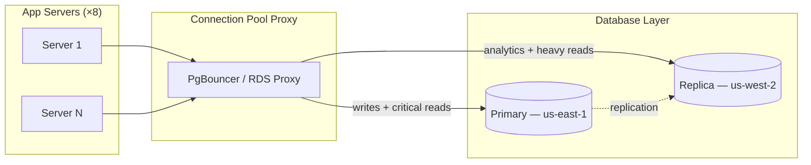

### Story Context

**Incident report — #on-call, Wednesday 3:17 AM**

```
[3:17 AM] PagerDuty: API P99 latency > 2000ms — threshold 500ms
[3:18 AM] On-call acks
[3:24 AM] Root cause: DB primary CPU at 94%, connection pool exhausted
[3:25 AM] Mitigation: Scaled down non-essential batch jobs
[3:31 AM] Latency returning to normal
[3:45 AM] All clear
[4:02 AM] Incident report filed
```

---

**Email — Wednesday morning, 8:30 AM**

```
From: Ravi Chandran
To: platform-team
Subject: Last night's DB incident — we need to talk

Team,

Last night's incident was the third time in two months we've seen the primary DB
choke on read load. The pattern is always the same: batch jobs + real-time queries
competing for the same connection pool, primary CPU spikes, P99 blows up.

We have one read replica right now (us-west-2), but our application doesn't
route reads to it. I have no idea why not. Looking at the codebase, it seems
like the plan was always to "add read routing later."

"Later" is now.

I want a design for:
1. Routing heavy read queries away from the primary
2. Fixing the connection pool situation
3. Making sure the clinical analytics job doesn't murder our API SLAs

This needs to be production-ready. Not a prototype. We're signing Northview
Health in 3 weeks and they have 45,000 patients — that's 3x our current load.

Ravi
```

---

**Slack thread — #platform-team, Wednesday 10:15 AM**

**Kwame Asante (Backend Engineer)** [10:15 AM]
I looked at the read replica situation. The replica is set up and healthy.
Replication lag is currently 140ms (low traffic). But our ORM — TypeORM — doesn't
have a built-in read-routing strategy. We'd need to configure a second datasource
and manually decide per-query.

**You** [10:22 AM]
Or we use a connection pool proxy that handles routing. PgBouncer or RDS Proxy.
But there are HIPAA implications — the proxy becomes part of the data path,
so it's in PCI/HIPAA scope. We need to make sure it's within our security boundary.

**Nalini** [10:28 AM]
If the read replica is used for PHI queries, it's still in-scope for HIPAA.
Routing reads to it doesn't change the compliance posture as long as it's in
the same security boundary as the primary.

**Kwame** [10:31 AM]
What about replication lag? If a nurse writes a patient note and then immediately
queries for it — and we route the query to the replica — they might not see
their own write. That's a correctness issue in a clinical context.

**You** [10:35 AM]
Read-your-own-writes consistency. Classic problem. We need to handle it.

**Ravi** [10:38 AM]
What about the batch jobs? The clinical analytics runs every 4 hours and hammers
the DB for about 12 minutes. Can we route that to the replica too?

**You** [10:42 AM]
Yes, but if the analytics job runs on the replica and replication lag is high
during the job, the analytics data could be stale by 12 minutes. Is that
acceptable for analytics?

**Ravi** [10:43 AM]
For analytics — probably. For real-time clinical queries — absolutely not.
So we need tiered routing: critical clinical queries → primary or replica-with-lag-check,
heavy reads and analytics → replica always.

---

**Slack DM — Marcus Webb → You, Thursday 2:00 PM**

**Marcus Webb**
Read replica routing. Three questions.
First: how do you know when replica lag is too high to safely route a read there?
You need a lag threshold. What is it, and where does it live?
Second: connection pooling. You said "connection pool exhaustion." How many
connections does your primary DB have configured? How many does each app server
hold in its pool? Do the math — I bet you're over-connecting.
Third: what happens to your routing logic if the replica falls behind by 5 minutes
during a large ETL job? Do critical clinical queries silently fail over to primary,
or do they error out? Neither answer is obviously correct.

---

**Connection pool audit (you ran this Wednesday afternoon)**

```sql
-- Current connection pool config (per app server, TypeORM)
-- max connections: 20 per server
-- Current app server count: 8

-- Max possible connections from app layer: 8 × 20 = 160

-- PostgreSQL max_connections setting:
SHOW max_connections;
-- Result: 100

-- Connections currently used by batch jobs (separate process pool):
-- 40 connections reserved for batch
-- Remaining for app: 60

-- At peak: app tries to use 160, DB allows 60.
-- Excess connections: queued by PgBouncer (if we had it), or rejected (current state).
```

---

### Problem Statement

MeridianHealth's single PostgreSQL primary is being overwhelmed by a combination
of real-time clinical queries and scheduled analytics batch jobs. With Northview
Health's 3x load increase arriving in 3 weeks, the system will become unresponsive
without a read replica routing strategy and connection pool architecture. The
solution must maintain read-your-own-writes consistency for clinical workflows
while offloading batch analytics to replicas.

### Explicit Requirements

1. Route read-heavy queries and analytics batch jobs to the read replica
2. Maintain read-your-own-writes consistency for clinical queries (a nurse who
   writes a patient note must immediately be able to see it)
3. Implement connection pooling that prevents the app layer from exceeding
   PostgreSQL's max connection limit
4. Define a replication lag threshold above which critical reads fall back to primary
5. Analytics batch jobs must not compete with real-time API queries for DB resources
6. All routing decisions must be transparent to HIPAA/security controls (no unscoped data path)

### Hidden Requirements

- **Hint**: Marcus Webb asked about the lag threshold. Replication lag is currently
  140ms at low traffic. During the 12-minute batch job, what do you expect lag to
  reach? If lag reaches 30 seconds and a doctor queries a patient's latest vitals —
  what is the clinical risk of returning 30-second-old data?
- **Hint**: The connection pool math Marcus referenced: 8 app servers × 20 pool
  size = 160 desired connections, but PostgreSQL only allows 100. This is already
  broken before Northview goes live. What is the correct connection pool sizing
  formula, and what tool (PgBouncer? RDS Proxy?) helps you exceed PostgreSQL's
  connection limit without actually opening that many DB connections?
- **Hint**: Ravi said "tiered routing" — critical clinical vs heavy reads. How does
  the application signal which category a query belongs to? Do you annotate at the
  query level, the service level, or the connection level?

### Constraints

- **Primary DB**: AWS RDS PostgreSQL, `db.r6g.xlarge` (4 vCPU, 32GB RAM)
- **Current `max_connections`**: 100
- **Current app servers**: 8 × `t3.medium`, TypeORM connection pool size: 20 each
- **Replication lag at low traffic**: ~140ms; at peak analytics: unknown (needs testing)
- **Timeline**: Must be production-ready before Northview goes live (3 weeks)
- **Batch job schedule**: Every 4 hours, runs for ~12 minutes
- **Clinical query SLA**: P99 < 300ms, no stale reads for write-then-read within 2 seconds
- **Analytics query SLA**: Results within 5 minutes of job start (may be slightly stale)
- **Read replica**: 1 existing replica in `us-west-2` (same spec as primary)

### Your Task

Design the read replica routing strategy, connection pool architecture, and
batch job isolation for MeridianHealth's query layer.

### Deliverables

- [ ] **Architecture diagram** (Mermaid) — show primary, replicas, connection
  pool proxy, app servers, and query routing logic
- [ ] **Connection pool sizing calculation** — at 3x current load (Northview),
  what is the correct pool size per app server, and how many app servers will
  you run? Show the math to stay within `max_connections` budget.
- [ ] **Routing decision matrix** — table listing query categories (real-time
  clinical reads, write-then-read queries, analytics batch, administrative queries)
  with: target replica, lag threshold, fallback behavior
- [ ] **Replication lag monitoring plan** — how do you measure lag, where is the
  threshold configured, and what happens when the threshold is breached (alert,
  automatic failover, manual intervention)?
- [ ] **Scaling estimation** — at Northview's load (3x current), what is peak
  RPS to the DB? How many replicas do you need? What is the total connection
  count across all pools?
- [ ] **Tradeoff analysis** — minimum 3 tradeoffs:
  1. PgBouncer (self-managed) vs RDS Proxy (managed) for connection pooling
  2. Application-layer read routing (code change) vs proxy-layer routing (transparent)
  3. Accepting eventual consistency for clinical reads vs always reading from primary

### Diagram Format


