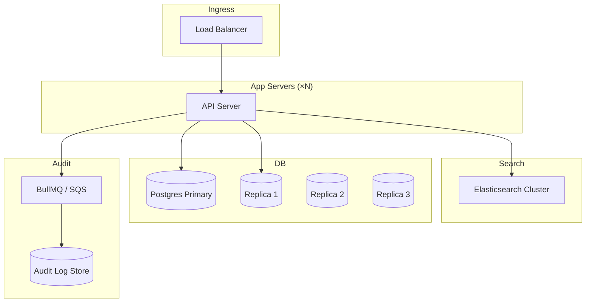

> **SPIKE CHALLENGE — SCALE 10X BY FRIDAY**
> This chapter starts as a routine platform review. Then the CEO emails.

---

### Story Context

**Platform team standup — Monday 9:02 AM**

**Ravi**: Short standup today. Auth is deployed. Audit trail is live. Data residency
is in progress — we've stopped `eu-west-1` replication. Read replica routing goes to
staging tomorrow. We're in good shape for Northview's go-live in 3 weeks.

**Kwame**: The SMART on FHIR integration with Epic is done. Mercy Coast tested it
Friday. They said it's faster than their old vendor.

**You**: Connection pooling fix deploys today. We should be under 100 total connections
even with Northview.

**Ravi**: Perfect. I'll send the weekly update to Priya— *[phone buzzes]* ...hold on.

---

**Slack DM — Ravi → You, 9:09 AM**

**Ravi**
Don't go anywhere after standup. CEO just emailed me.
CC'ing you now.

---

**Email — CEO to Ravi (forwarded), 9:07 AM**

```
From: Sandra Okonkwo (CEO) <sandra@meridianhealth.io>
To: Ravi Chandran
CC: You
Date: Monday, 9:07 AM
Subject: URGENT — Cascade Health partnership

Ravi,

I signed Cascade Health Network last night. It's the largest regional hospital
network in the Pacific Northwest — 23 hospitals, 340 clinics, 2.1 million patients.

They want to go live in 6 weeks, not 6 months. Their contract has a performance
clause: if our platform cannot serve 500 concurrent clinical users with P99 < 400ms
within 30 days of go-live, they can exit the contract with full fee refund.

This is a $14M ARR deal. Largest in our history.

I know this is fast. Tell me what you need.

Sandra
```

---

**Emergency architecture meeting — Monday 10:30 AM**

**Ravi**: Let's be honest about what "2.1 million patients" means for us.
Our largest client right now is Valley Primary: 12,000 patients. Northview is 45,000.
Cascade is 2.1 *million*. That is roughly 46x our current largest client.

**You**: And they want to go live in 6 weeks.

**Ravi**: Six weeks. With a contractual performance SLA. What's our current capacity?

**Kwame**: API servers can handle maybe 400 concurrent sessions with current DB load.
At 500 concurrent clinical users generating 10 requests/second each —

**You**: That's 5,000 RPS. We currently handle about 200 RPS in production.

**Ravi**: Can we just scale horizontally? More app servers, more replicas?

**You**: We can get to maybe 800 RPS with horizontal scaling before the DB becomes
the bottleneck. At 5,000 RPS with 2.1M patient records, we're going to hit schema
limits, index size limits, and query planner issues. This isn't just "add more servers."

**Kwame**: The patient search endpoint alone is a problem. It does a full-text match
across 2.1M records. Our current index is fine for 50,000. Not for 2.1M.

**Ravi**: What do we need?

**You**: A week to do a proper capacity analysis. Then a design. Then 5 weeks to build.

**Ravi**: You have 2 days for the capacity analysis. Then we present to Sandra.

---

**Slack DM — Marcus Webb → You, Monday 1:15 PM**

**Marcus Webb**
46x largest client in 6 weeks. You're in the right kind of trouble.
Don't try to solve all of it. Solve the bottlenecks in order. What breaks first?
That's your first chapter. Then what breaks second. You can't fix everything in 6 weeks.
The art is knowing what to fix and in what order.
Also: the performance clause. "500 concurrent clinical users, P99 < 400ms."
That's a load test specification. Have you run load tests? Do you even know if
you'd pass today at 500 users? Measure first. Guess later.

---

**Your capacity analysis notes (Tuesday evening)**

```
Current bottlenecks (measured against 500-concurrent-user load test):

1. Patient search endpoint: P99 = 4,200ms at 500 users
   - Full-text search on patients table (PostgreSQL tsvector)
   - Table will grow from 50k → 2.1M rows
   - Index will be 40x larger → needs dedicated search solution

2. Patient record fetch (with related data): P99 = 890ms at 500 users
   - N+1 query: 1 patient fetch + N medication queries + N diagnosis queries
   - Needs eager loading or denormalization

3. DB connection pool: maxes at ~380 concurrent users before exhaustion
   - Fixed with PgBouncer (Ch. 9 work) but need more replicas

4. Audit log writes: adding 12ms avg to all API calls at 500 users
   - Synchronous audit log write is the culprit
   - Needs async path

5. Auth token validation: 8ms avg (Redis lookup)
   - Acceptable. Not a bottleneck yet.
```

---

### Problem Statement

MeridianHealth must scale its EHR platform from 50,000 patients to 2.1 million
patients and from ~200 RPS to ~5,000 RPS in 6 weeks, with contractual P99 < 400ms
SLA for 500 concurrent clinical users. Four specific bottlenecks have been identified.
You must design the remediation for each and produce a 6-week execution plan.

### Explicit Requirements

1. Reduce patient search P99 from 4,200ms to < 200ms at 500 concurrent users
2. Eliminate N+1 query pattern on patient record fetch endpoint
3. Scale DB connection handling to 500+ concurrent users without pool exhaustion
4. Move audit log writes to async path without risking audit event loss
5. All changes must maintain HIPAA compliance (data residency, audit trail, access control)
6. System must be testable against the SLA — load test harness required

### Hidden Requirements

- **Hint**: Marcus Webb said "measure first." Your load test revealed P99 = 4,200ms
  for patient search at 500 users. But the test was against 50,000 patients —
  not 2.1 million. What does P99 become at 2.1M rows with your current index?
  (Hint: PostgreSQL query planner behavior changes at certain table sizes)
- **Hint**: Cascade Health's contract specifies "500 concurrent clinical users."
  Clinical users do more than just search — they open patient records, write notes,
  review labs. Each user session generates multiple queries. What is the actual
  RPS implied by 500 concurrent users with realistic clinical workflows?
- **Hint**: Your audit log is currently synchronous and adding 12ms per request.
  At 5,000 RPS, that's 5,000 synchronous DB writes/second to the audit table.
  Even if you move to async, the audit log store must be durable — no events
  can be lost. What durable async pipeline achieves this?

### Constraints

- **Timeline**: 6 weeks to Cascade go-live. 2 days for design. 4 weeks to build.
  1 week for load testing and hardening.
- **Cascade's dataset**: 2.1M patients, ~40M clinical events (labs, vitals, notes)
- **SLA**: P99 < 400ms for all endpoints at 500 concurrent clinical users
- **HIPAA**: All patient data from Cascade must stay in `us-west-2` (their preference,
  also satisfies Oregon state health data law)
- **Budget approved**: 3 additional RDS read replicas, Elasticsearch cluster (t3.medium × 3)
- **Team**: 3 backend engineers, 1 DevOps, 1 QA for load testing
- **Existing tech stack**: TypeORM + PostgreSQL 14, Redis 7, BullMQ, Node.js

### Your Task

Design the scaled architecture for MeridianHealth that handles Cascade Health's
load. Produce a 6-week execution plan assigning work to three engineers. Address
all four bottlenecks from the capacity analysis.

### Deliverables

- [ ] **Scaled architecture diagram** (Mermaid) — target state with Elasticsearch
  for search, multiple read replicas, async audit pipeline, and N+1 fix approach
- [ ] **Search migration plan** — how do you migrate 2.1M patient records into
  Elasticsearch? How do you keep Postgres and ES in sync for new writes?
  How do you handle HIPAA in ES (field-level encryption? access controls?)
- [ ] **N+1 query fix design** — identify the query pattern and design the fix
  (DataLoader pattern, eager loading, or denormalized view). Show before/after query.
- [ ] **Async audit pipeline** — show the pipeline from API request → audit event
  → durable queue → audit store. What happens on queue failure?
- [ ] **6-week execution plan** — week-by-week, engineer-by-engineer assignments.
  What must ship in week 1 to unblock week 2?
- [ ] **Scaling estimation** — at 5,000 RPS with 2.1M patients:
  - How many Elasticsearch nodes do you need?
  - How many PostgreSQL read replicas?
  - What is monthly infrastructure cost delta?
- [ ] **Tradeoff analysis** — minimum 3 tradeoffs:
  1. Elasticsearch for search vs PostgreSQL full-text search at scale
  2. Sync vs async audit logging — durability vs latency tradeoff
  3. N+1 fix via DataLoader vs denormalized materialized view

### Diagram Format


