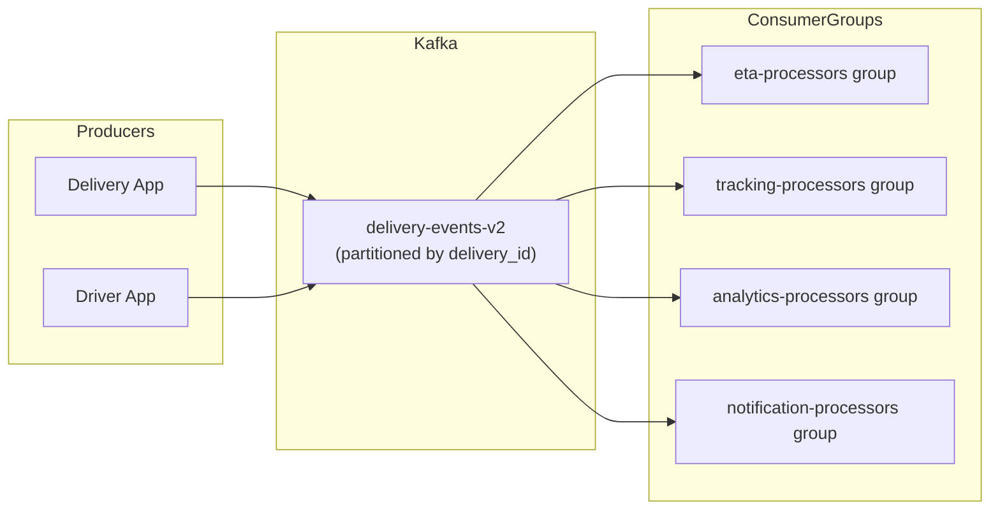

> **SPIKE CHALLENGE — INHERITED DISASTER**
> The Kafka setup "works" but nobody really knows why or for how long.

---

### Story Context

**Post-mortem document — "Kafka Lag Incident — 3 weeks ago" (Confluence, open on screen)**

```
Incident: Kafka consumer lag reached 2.4 million messages on topic delivery-events
Duration: 4 hours before recovery
Impact: ETAs in consumer app delayed by 45 minutes. 140k deliveries affected.
         Merchant dashboards showed stale status for 4 hours.

Root cause: A single slow consumer (analytics-consumer) was in the same consumer
group as the real-time ETA consumer (eta-consumer). When analytics-consumer
got slow (due to an unindexed DB query), the group's offset committed slowly.
The broker held messages for the slow consumer, causing lag across the whole group.

Fix applied: Restarted analytics-consumer. Lag recovered over 2 hours.

Action items:
- [ ] Consider separate consumer groups for analytics vs real-time use cases
- [ ] Look into whether we need more partitions
- [ ] Figure out what "exactly-once" means for us and if we need it

Status: Action items open for 3 weeks.
```

---

**1:1 — Emeka & You, your first day, 2:00 PM**

**Emeka**: So you read the post-mortem. Good. Let me give you the full picture.

We have one Kafka cluster — 3 brokers, self-managed on EC2. We have one main topic:
`delivery-events`. It has 12 partitions. We have four consumers reading from it:

1. `eta-consumer` — real-time, computes ETAs, writes to Redis for the app
2. `tracking-consumer` — updates delivery status in PostgreSQL
3. `analytics-consumer` — writes to our data warehouse (S3/Athena)
4. `notification-consumer` — sends push notifications to consumers when status changes

All four are in the same consumer group: `delivery-processors`.

**You**: That's the problem.

**Emeka**: Explain it to me like I'm a PM.

**You**: If they're in the same group, Kafka treats them as one logical consumer.
The group shares the work — each partition is assigned to exactly one consumer
in the group. But if any one consumer is slow, the whole group's progress stalls
because offsets are committed together. It's like having a race where four runners
are tied at the ankles.

**Emeka**: That's exactly what happened. So the fix is separate groups?

**You**: Partly. Separate groups for each logical use case. But there's more.
At 20M events/day, 12 partitions might not be enough. And your consumers have
different throughput requirements — real-time ETA needs to be milliseconds behind,
analytics can be minutes behind. They should never compete.

**Emeka**: Okay. And the "exactly-once" item in the post-mortem?

**You**: That's the fun one. Do you know what happens right now if `tracking-consumer`
crashes after it updates PostgreSQL but before it commits the Kafka offset?

**Emeka**: ...It re-reads the message on restart.

**You**: And it tries to update PostgreSQL again. So is your delivery status
updatable twice safely? Is it idempotent?

**Emeka**: *[long pause]* ...I'm not sure.

---

**Slack DM — Marcus Webb → You, Day 2**

**Marcus Webb**
Logistics and Kafka. Told you.
Three questions for your new team before you redesign anything:
1. Do any of your four consumers actually need exactly-once semantics?
   Or is at-least-once with idempotent consumers sufficient?
2. What's the partition key on delivery-events? Messages for the same
   delivery MUST land on the same partition or your state machine is broken.
3. Who chose 12 partitions and why? Was it calculated or just a number that felt right?

**You** [response]
Checking now. The partition key appears to be... null. Round-robin distribution.

**Marcus Webb**
There it is. If delivery_id isn't the partition key, two events for the same
delivery can be on different partitions, processed by different consumers, in
any order. Your state machine is not guaranteed sequential.
This is the real problem. Not the consumer groups.

---

**Kafka cluster audit (you run this Day 2)**

```
Topic: delivery-events
  Partitions: 12
  Replication factor: 2
  Partition key: null (round-robin)
  Retention: 24 hours

Consumer group: delivery-processors
  eta-consumer: lag = 0 (healthy)
  tracking-consumer: lag = 3,200 (slightly behind)
  analytics-consumer: lag = 847,000 (very behind)
  notification-consumer: lag = 12 (healthy)

Message volume: ~46 messages/second average, ~800 messages/second peak
Average message size: ~1.2 KB
Broker disk usage: 340 GB / 500 GB per broker
```

---

### Problem Statement

VeloTrack's Kafka setup has three structural problems: all consumers share a
single consumer group causing lag cascades, delivery events use round-robin
partitioning instead of delivery-ID-based partitioning (breaking ordering
guarantees), and idempotency is not guaranteed for consumers that write to
PostgreSQL. You must redesign the Kafka architecture before scaling to 20M events/day.

### Explicit Requirements

1. Separate consumer groups for each logical use case (ETA, tracking, analytics, notifications)
2. Partition key must be `delivery_id` to guarantee ordering per delivery
3. Partition count must support 20M events/day peak throughput without repartitioning
4. All consumers that write to PostgreSQL must be idempotent (safe to process a
   message twice)
5. Analytics consumer lag may be up to 5 minutes; real-time consumers (ETA, tracking)
   must be < 5 seconds behind
6. Brokers must have adequate disk capacity for the retention period at 20M events/day

### Hidden Requirements

- **Hint**: Marcus Webb said "two events for the same delivery on different partitions
  processed in any order." What happens to the delivery state machine if
  `DELIVERY_PICKED_UP` is processed after `DELIVERY_COMPLETED`? Which state wins?
  How does your partition key fix prevent this?
- **Hint**: Changing the partition key on a live topic requires either creating a
  new topic and migrating consumers, or using a rebalance. You cannot change the
  partition key on an existing Kafka topic. What is your migration plan that avoids
  dropping any messages during the cutover?
- **Hint**: At 20M events/day, what is your messages-per-second at peak (assume
  events are not uniformly distributed — peak is 5x average)? How many partitions
  do you need to support that peak, given each partition can handle ~10MB/s?
  At 1.2KB/message, what is your peak throughput in MB/s?

### Constraints

- **Current volume**: 4M events/day, ~46 msg/s average, ~800 msg/s peak
- **Target volume**: 20M events/day (5x growth)
- **Message size**: ~1.2 KB average
- **Retention requirement**: 24 hours (for replay/debugging)
- **Broker disk**: 500GB/broker, 3 brokers, replication factor 2
- **Latency SLA**: ETA consumer must be < 5 seconds behind production head
- **Team**: 2 engineers can work on this; others are on feature work

### Your Task

Redesign VeloTrack's Kafka architecture for the 20M events/day target. Define
consumer groups, partition strategy, partition count, and idempotency guarantees.

### Deliverables

- [ ] **Kafka architecture diagram** (Mermaid) — show topics, partitions, consumer
  groups, and which services consume from each group
- [ ] **Partition count calculation** — show the math: at 20M events/day, what
  peak msg/s do you need to support? At 1.2KB/message, what MB/s? How many
  partitions does that require?
- [ ] **Migration plan** — how do you repartition a live topic? Step-by-step:
  new topic, dual-write, consumer cutover, old topic decommission
- [ ] **Idempotency design** — for the tracking-consumer (writes delivery status
  to PostgreSQL), how do you make the write idempotent? Use the `delivery_id` +
  `event_type` + `event_timestamp` as the idempotency key — show the schema
  change and upsert query.
- [ ] **Disk capacity calculation** — at 20M events/day × 1.2KB × 24h retention
  × replication factor 2, how much disk do you need per broker?
- [ ] **Tradeoff analysis** — minimum 3 tradeoffs:
  1. Exactly-once semantics (Kafka transactions) vs at-least-once + idempotent consumers
  2. Single partitioned topic vs separate topics per event type
  3. Increasing partition count now (operationally disruptive) vs topic migration approach

### Diagram Format


