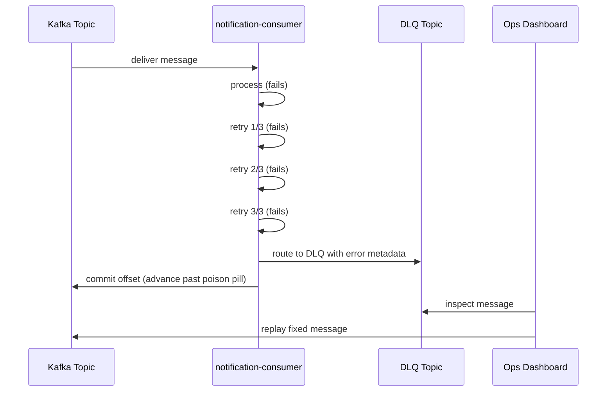

> **SPIKE CHALLENGE — PRODUCTION DOWN**
> The notification consumer is crashing in a loop. 280,000 drivers are
> not getting delivery assignment notifications. The story starts normally.

---

### Story Context

**#velotrack-engineering — Slack, Week 2, Tuesday, apparently normal**

**Emeka Eze** [9:15 AM]
Good morning everyone. Sprint review at 3pm. Looking forward to seeing the Kafka
consumer group work. Anything blocking?

**You** [9:18 AM]
New consumer groups are deployed to staging. Running load tests this afternoon.
Should be ready for prod review Thursday.

**Lindiwe Dlamini (iOS engineer)** [9:20 AM]
Quick question — driver app hasn't been getting assignment push notifications
since last night. Is that a backend thing or a device thing?

**You** [9:22 AM]
Let me check.

---

**#incidents — Slack, 9:27 AM (you create the incident)**

**You** [9:27 AM]
🔴 INCIDENT: `notification-consumer` is crash-looping. Consumer group lag is
at 2.3 million messages. Drivers are not receiving assignment push notifications.
Investigating root cause.

**Emeka** [9:28 AM]
How long has this been happening?

**You** [9:29 AM]
Crash logs go back 9 hours. The consumer has been crash-looping since midnight.

**Emeka** [9:30 AM]
How many affected drivers?

**You** [9:32 AM]
`notification-consumer` handles all push notifications. Looking at our driver
count — approximately 280,000 active drivers in the AU/SEA region expected to
receive an assignment notification during that window.

**Emeka** [9:33 AM]
That's the whole platform. What's causing the crash?

---

**Consumer crash logs (retrieved from CloudWatch, 9:35 AM)**

```
[2024-01-09T00:03:12Z] ERROR notification-consumer: Failed to process message
  delivery_id: "DEL-9483927"
  event_type: "DELIVERY_ASSIGNED"
  error: "Push notification payload exceeds 4096 bytes — APNs limit exceeded"
  stack: NotificationPayloadTooLargeError at buildPushPayload (notification.service.ts:234)

[2024-01-09T00:03:12Z] INFO  Retrying message (attempt 1/3)
[2024-01-09T00:03:13Z] ERROR Same error. Retrying (attempt 2/3)
[2024-01-09T00:03:14Z] ERROR Same error. Retrying (attempt 3/3)
[2024-01-09T00:03:14Z] ERROR Max retries exceeded. Re-queuing to head of partition.
[2024-01-09T00:03:15Z] ERROR Failed to process message delivery_id: "DEL-9483927"
  (same error, infinite loop begins)
```

**You** [9:40 AM]
Found it. A single malformed delivery event has a payload that exceeds Apple's
push notification size limit (4096 bytes). The consumer is retrying it infinitely
and cannot advance past it because it committed the offset optimistically before
processing. The bad message is stuck at partition 7, offset 1,840,221.
Every message behind it — 2.3 million messages — is blocked.

**Emeka** [9:42 AM]
How do we fix it right now?

**You** [9:43 AM]
Immediate fix: manually advance the offset past the bad message. 2-minute recovery.
But this will happen again. We don't have a dead-letter queue.

**Emeka** [9:44 AM]
What's a dead-letter queue?

**You** [9:45 AM]
When a message fails processing after all retries, instead of blocking forever,
it gets moved to a separate "dead letter" topic. The main consumer continues.
Ops can then inspect and replay or discard the bad message.

**Emeka** [9:46 AM]
Why don't we have one?

**You** [9:47 AM]
Nobody built it. It wasn't in the original design.

**Emeka** [9:48 AM]
Add it to this week's work. Fix the immediate issue first.

---

**Slack DM — Marcus Webb → You, 10:15 AM**

**Marcus Webb**
Saw the incident. One bad message blocking 2.3M. Classic poison pill.
The DLQ is the obvious fix — but here's the question that separates a good
engineer from a great one: what do you do with messages in the DLQ?
You can't just ignore them. Each one is a driver who didn't get an assignment.
Each one is a business event that may have financial consequences.
The DLQ isn't a trash can. It's a retry queue with a human in the loop.
Design the DLQ with that in mind.

**Marcus Webb** [10:17 AM]
Also: your consumer committed offsets optimistically before processing succeeded.
That's why the message looks like it was "consumed" but wasn't processed.
The retry logic tried to re-read it by seeking backward — but Kafka offsets
don't work that way reliably with committed offsets. Think about that design choice.

---

### Problem Statement

VeloTrack's `notification-consumer` had no dead-letter queue, so a single malformed
message blocked 2.3 million messages and cut off push notifications to 280,000 drivers
for 9 hours. You must design and implement a Dead-Letter Queue (DLQ) system that
prevents poison pill messages from blocking consumer progress, while ensuring no
messages are silently discarded — every failed message is inspectable and replayable.

### Explicit Requirements

1. Poison pill messages must not block the main consumer from advancing
2. After N failed retry attempts, a message must be routed to a DLQ topic
3. DLQ messages must be inspectable: full original message, error reason,
   retry count, and timestamp of each failure
4. DLQ messages must be replayable: an operator can re-queue a DLQ message
   to the main topic after fixing the underlying issue
5. DLQ replay must be idempotent (replaying a message twice must not cause
   double notification)
6. Alerting: the team must be notified when the DLQ has more than N messages
   (configurable threshold)

### Hidden Requirements

- **Hint**: Marcus Webb said "the DLQ isn't a trash can — it's a retry queue
  with a human in the loop." Each DLQ message represents a business event.
  For notification failures, what does "replay" mean? Can you just re-send the
  push notification hours later, or is there a time window after which the
  notification is meaningless (e.g., a delivery assignment 9 hours ago)?
- **Hint**: The crash log shows the consumer committed offsets optimistically
  before processing succeeded. If you switch to committing offsets only after
  successful processing, what new failure mode does that introduce? (Hint:
  what happens if the consumer crashes *after* successful push send but *before*
  offset commit?)
- **Hint**: The bad message had a payload exceeding APNs 4096-byte limit.
  This is a data quality issue upstream — something in the delivery creation
  flow is generating oversized payloads. The DLQ fixes the symptom. What
  monitoring or validation should you add upstream to prevent the cause?

### Constraints

- **Notification volume**: ~800,000 push notifications/day; ~400,000 to iOS (APNs)
- **APNs payload limit**: 4,096 bytes per notification
- **DLQ retention**: 7 days (operator must review within 7 days or events expire)
- **Replay window**: Notifications older than 30 minutes are considered stale and
  should be discarded rather than replayed
- **Alert threshold**: DLQ > 100 messages → PagerDuty alert to on-call
- **Team**: All 9 engineers. This fix is urgent — needs to ship today for the DLQ
  scaffolding, full implementation by end of week.

### Your Task

Design the DLQ system for VeloTrack's Kafka consumers. Include the DLQ topic structure,
retry logic, offset commit strategy, replay mechanism, and monitoring.

### Deliverables

- [ ] **DLQ architecture diagram** (Mermaid sequence) — show message flow from
  consumer failure through retry logic to DLQ routing, and the replay path
- [ ] **DLQ message schema** — what metadata is stored with each dead-lettered
  message? (original message, error details, retry history)
- [ ] **Offset commit strategy** — design the safe commit pattern that avoids
  both the poison-pill-blocking problem and the "processed but not committed" problem
- [ ] **Replay API design** — endpoint or CLI tool for operators to inspect,
  replay, or discard DLQ messages. Include the idempotency mechanism.
- [ ] **Alerting design** — what metrics do you expose, what is the alert condition,
  and what information does the alert include to help the on-call engineer diagnose fast?
- [ ] **Tradeoff analysis** — minimum 3 tradeoffs:
  1. Kafka-native retry topics vs application-level DLQ (separate service)
  2. Commit-before-process (at-most-once) vs commit-after-process (at-least-once)
  3. Automatic replay on DLQ vs manual review-then-replay

### Diagram Format


