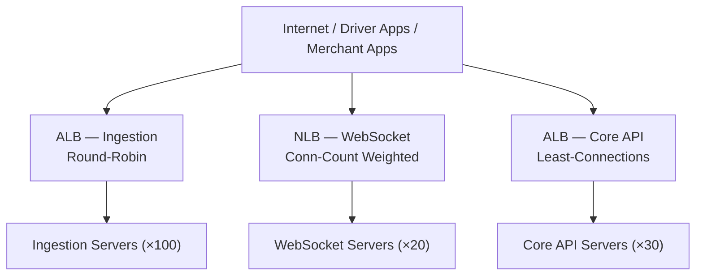

### Story Context

**DevOps review — #infra-team Slack thread, Monday 11:00 AM**

**Chioma Nwosu (DevOps Engineer)** [11:00 AM]
Okay I need some help. We're about to deploy the new WebSocket tier and location
ingestion cluster. I've been researching load balancer strategies and I'm confused
about which one to use for which service. Can someone with backend architecture
knowledge help me think through this?

Here's what we have:
1. **Location Ingestion API** — stateless REST, 100k RPS at peak, each request is ~200 bytes,
   processing is very fast (<5ms), no session needed
2. **WebSocket Server** — stateful (each connection is pinned to one server),
   200k concurrent connections, long-lived (minutes to hours), need reconnect support
3. **Core API** (merchant dashboard, delivery management) — stateless REST,
   mix of fast reads (50ms) and slow queries (500ms-2s), ~5,000 RPS

These three services have completely different traffic characteristics. I was
going to put them all behind the same ALB. Is that wrong?

**You** [11:15 AM]
It's not wrong, but it's suboptimal. Let me explain why and what the better approach is.

---

**Thread continues — 11:20 AM**

**You**: For the Location Ingestion API — stateless, high volume, fast requests.
Standard round-robin or least-connections algorithm is fine. An ALB (Application
Load Balancer) with round-robin handles this well. You want to maximize distribution
across instances to avoid hotspots.

For the WebSocket tier — this is different. WebSockets are stateful. Once a client
connects to Server A, all messages for that connection must go to Server A. If
the LB sends a reconnect to Server B, the socket doesn't exist there. You need
sticky sessions, specifically IP-hash or cookie-based affinity.

**Chioma** [11:23 AM]
But sticky sessions means uneven distribution, right? If a client with a lot
of connections always goes to the same server, that server gets overloaded.

**You**: Correct. That's why the WebSocket tier needs connection-aware load balancing.
Instead of IP hash, you want the LB to distribute based on current connection count —
send new connections to the least-loaded WebSocket server. AWS NLB (Network Load
Balancer) with a custom target group health check can expose connection count.

**Chioma** [11:28 AM]
What about the Core API? It has some very slow queries. If a slow query ties up
a connection, does that affect other requests?

**You**: With a connection-per-request model and async Node.js, it doesn't block
other requests directly. But if slow queries pile up, they increase response time
for other requests on the same server due to event loop pressure. A least-connections
algorithm helps here — don't send new requests to servers that already have many
in-flight requests.

**Chioma** [11:33 AM]
What about health checks? Our current health check is just `GET /health → 200 OK`.
Is that enough?

**You** [11:37 AM]
Shallow health checks can hide real problems. A server can return 200 on /health
while its database connection pool is exhausted and all real requests are failing.
We should look at deep health checks — /health that actually verifies downstream
dependencies are reachable.

---

**Slack DM — Marcus Webb → You, that afternoon**

**Marcus Webb**
Load balancing for WebSockets. One thing you'll learn the hard way if you don't
think about it now: sticky sessions and rolling deployments don't play well together.
When you deploy a new version of the WebSocket server, you need to drain connections
from the old instances gracefully. If you just kill the old instances, 200k clients
get disconnected simultaneously. What's your rollout strategy?

**You** [response]
Graceful drain — stop routing new connections to old instances, wait for existing
connections to close naturally or until a timeout, then terminate.

**Marcus Webb**
How long do you wait? If a client has been connected for 6 hours, are you going
to wait 6 hours to deploy? What's your connection time limit policy?

---

### Problem Statement

VeloTrack needs three different load balancing strategies for three services with
fundamentally different traffic characteristics: a high-RPS stateless ingestion API,
a stateful WebSocket tier with 200k long-lived connections, and a Core API with
mixed fast/slow query patterns. You must design the load balancing architecture,
health check strategy, and rolling deployment strategy for each.

### Explicit Requirements

1. Location Ingestion API: even distribution across instances, handles 100k RPS
2. WebSocket tier: sticky sessions for existing connections, connection-count-aware
   routing for new connections, graceful drain for deployments
3. Core API: least-connections routing to avoid hotspots on slow queries
4. Health checks must be deep enough to detect downstream dependency failures
   (DB pool exhaustion, Redis unavailability)
5. Rolling deployment for WebSocket tier must not simultaneously disconnect
   all 200k connections
6. All load balancers must have automatic failover if a backend instance fails

### Hidden Requirements

- **Hint**: Marcus Webb raised the deployment drain problem. If connections can
  be up to several hours old, what is the maximum acceptable drain timeout before
  you forcibly terminate? What do you tell clients when you forcibly terminate?
  (WebSocket close codes are important here — the client should know to reconnect.)
- **Hint**: Chioma asked about health checks. For the WebSocket tier, what does
  a "healthy" WebSocket server mean? Is it just "can accept a new connection"? Or
  should it also report its current connection count so the LB can make routing
  decisions based on load?
- **Hint**: The Location Ingestion API handles 100k RPS. At this rate, even a brief
  misconfiguration of the load balancer could drop millions of updates. How do you
  test your LB config changes safely before applying to production? (Blue/green
  deployment of the LB tier itself?)

### Constraints

- **Location Ingestion API**: 100k RPS peak, ~100 servers at peak, stateless
- **WebSocket Servers**: 200k concurrent connections, ~20 servers at 10k connections each
- **Core API**: 5,000 RPS peak, ~30 servers
- **Infrastructure**: AWS, using ALB and NLB (both available in budget)
- **Deployment frequency**: Daily deploys for all services
- **Max connection disruption during deploy**: < 1% of WebSocket connections simultaneously

### Your Task

Design the load balancing architecture, health check strategy, and deployment
strategy for all three VeloTrack service tiers.

### Deliverables

- [ ] **Load balancing architecture diagram** (Mermaid) — show all three service
  tiers, their respective load balancers, instance counts, and traffic flow
- [ ] **Health check specification** — for each service tier: check type (shallow
  vs deep), endpoint, check interval, failure threshold, what downstream dependencies
  are verified, and what happens when the check fails
- [ ] **WebSocket rolling deployment plan** — step-by-step procedure for deploying
  a new WebSocket server version while maintaining < 1% connection disruption.
  Include drain timeout policy and forced-disconnect handling.
- [ ] **Routing algorithm comparison table** — for each of round-robin,
  least-connections, IP-hash, and connection-count-weighted, list: suitable service
  types, pros, cons, AWS ALB/NLB support
- [ ] **Scaling estimation** — at 200k WebSocket connections distributed across
  20 servers: what is the memory footprint per server (assume 50KB per connection)?
  What happens when a server fails — how quickly do its 10k clients reconnect?
  At 10k reconnects to the remaining 19 servers simultaneously, what is the
  reconnect storm RPS?
- [ ] **Tradeoff analysis** — minimum 3 tradeoffs:
  1. ALB (L7) vs NLB (L4) for WebSocket load balancing
  2. IP-hash sticky sessions vs cookie-based sticky sessions
  3. Connection-draining timeout: short (fast deploys, more disruption) vs long (slow deploys, less disruption)

### Diagram Format

