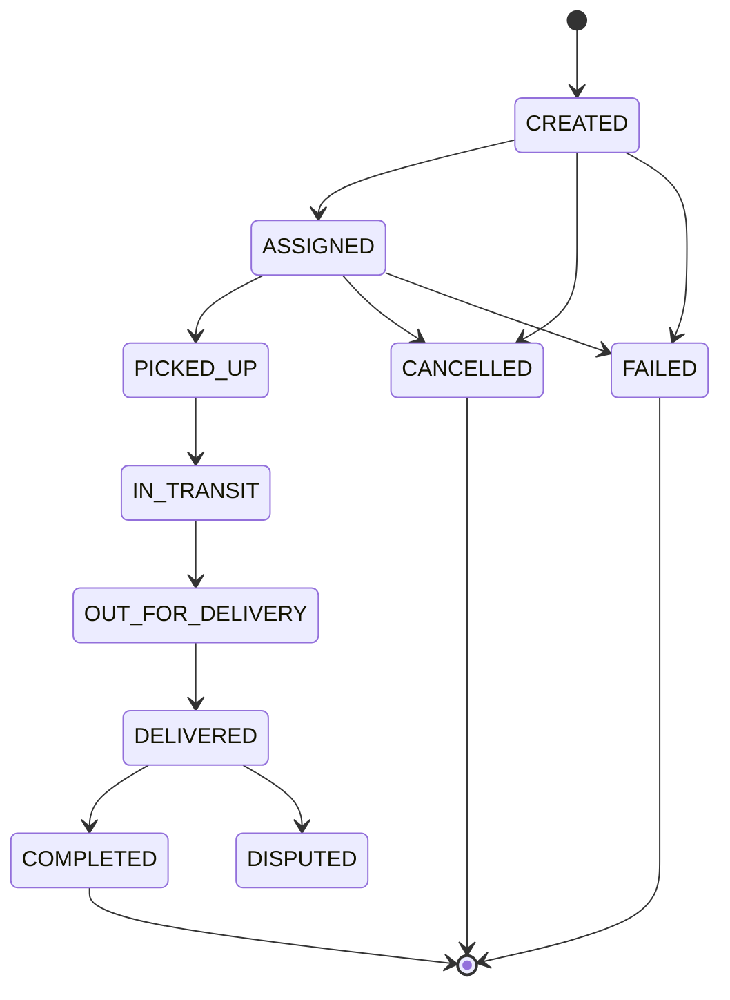

### Story Context

**Email from Emeka, Friday afternoon**

```
From: Emeka Eze <emeka@velotrack.io>
To: You
Date: Friday, 3:47 PM
Subject: The Singapore Problem

Hey,

Just got off a call with our Singapore logistics partner, SupremeFreight.
They're our biggest enterprise customer — 40,000 deliveries per day.

They've filed three support tickets this month about "ghost deliveries" —
deliveries that show as COMPLETED in their system but FAILED in ours,
or vice versa. Their ops team is doing manual reconciliation every morning.
They want a data SLA: delivery state must be consistent between VeloTrack
and SupremeFreight within 30 seconds of any state change.

I dug into the code this afternoon. Here's what I found:

The delivery state machine has 9 states. State transitions happen via Kafka events.
The tracking-consumer reads events and writes to PostgreSQL. But if the same event
is processed twice (because a consumer restarted mid-commit), it tries to write
the same state transition twice. Sometimes that causes a constraint error.
Sometimes it succeeds but the second write has a newer timestamp, overwriting
the first write's data.

This is not idempotent. And we're using at-least-once delivery.

I don't know how many "ghost deliveries" this causes per day. I'm scared to query.

I need this fixed before we sign SupremeFreight's renewal next month.

Emeka
```

---

**Delivery state machine (from code comments, retrieved by you)**

```
States:
  CREATED → ASSIGNED → PICKED_UP → IN_TRANSIT → OUT_FOR_DELIVERY
           → DELIVERED → COMPLETED

  Any state → FAILED (terminal)
  Any state → CANCELLED (terminal)
  DELIVERED → DISPUTED (if customer raises dispute within 24h)

Valid transitions only:
  CREATED → ASSIGNED (driver assigned)
  ASSIGNED → PICKED_UP (driver picks up package)
  PICKED_UP → IN_TRANSIT (driver on route)
  IN_TRANSIT → OUT_FOR_DELIVERY (driver near destination)
  OUT_FOR_DELIVERY → DELIVERED (proof of delivery uploaded)
  DELIVERED → COMPLETED (auto-transition after 24h no dispute)
  DELIVERED → DISPUTED (customer disputes within 24h)
```

---

**Incident data — you query the DB Thursday evening**

```sql
-- How many deliveries have an unexpected state history?
SELECT delivery_id, COUNT(*) as event_count,
       array_agg(to_state ORDER BY occurred_at) as state_history
FROM delivery_events
GROUP BY delivery_id
HAVING COUNT(*) > 9  -- more events than max expected transitions
ORDER BY event_count DESC
LIMIT 20;
```

Results show 847 deliveries in the last 30 days with duplicate state transition
events. Some show `IN_TRANSIT → IN_TRANSIT` (same state twice). Others show
`COMPLETED → ASSIGNED` (regression to earlier state), which should be impossible.

---

**Slack DM — Marcus Webb → You, Thursday night**

**Marcus Webb**
847 ghost deliveries. Let me guess: the duplicate events come from Kafka consumer
restarts, and the state regression comes from events processed out of order?

**You** [response]
Exactly. Two root causes. Duplicate processing because tracking-consumer doesn't
have idempotent writes. Out-of-order processing because after the consumer group
redesign (Ch. 11), we use delivery_id as partition key — but in the old data,
some events for the same delivery were on different partitions. Those old messages
are now being replayed in wrong order.

**Marcus Webb**
Right. So you have two problems that need two different fixes.
For duplicates: idempotent state transitions. Not "write if not exists" — that's
too simple. You need a state machine check: "is this transition valid FROM
the current state?"
For out-of-order: event version numbers. Each event should carry a sequence number.
The consumer should reject events with a lower sequence number than what it's
already applied.
What's the interaction between those two fixes?

**You** [10 minutes later]
...The idempotency check and the ordering check both need to read the current state
before writing. If two events for the same delivery are processed concurrently
by two different workers — they both read the same current state, both decide
the transition is valid, both write. That's a race condition.

**Marcus Webb**
Now you're seeing the whole problem. How do you serialize writes for the same delivery_id?

---

### Problem Statement

VeloTrack's delivery state machine has two structural correctness issues: duplicate
event processing causes state to be applied multiple times (idempotency failure),
and out-of-order events can cause state regression (e.g., COMPLETED → ASSIGNED).
Both issues cause inconsistency between VeloTrack and SupremeFreight, resulting in
"ghost deliveries." You must redesign the state machine persistence layer to be
correct under at-least-once Kafka delivery with potential out-of-order events.

### Explicit Requirements

1. State transitions must be idempotent: processing the same event twice must
   produce the same result as processing it once
2. State regression must be impossible: a delivery in COMPLETED state cannot
   transition back to ASSIGNED even if an out-of-order event arrives
3. Only valid transitions (per the state machine definition) may be applied
4. Concurrent processing of two events for the same delivery must be serialized
   safely (no lost update, no race condition)
5. Every state transition must be auditable: full history with timestamp, from_state,
   to_state, event_id, and sequence number
6. SupremeFreight sync SLA: delivery state changes must be queryable within 30 seconds

### Hidden Requirements

- **Hint**: Marcus Webb raised the race condition between concurrent workers.
  If two workers both read `current_state = IN_TRANSIT` and both try to apply
  an `OUT_FOR_DELIVERY` event, they both check "is IN_TRANSIT → OUT_FOR_DELIVERY
  valid?" (yes) and both write. One write wins; one is silently lost or causes
  a duplicate. What database mechanism prevents this race?
- **Hint**: The state machine has a time-based auto-transition: `DELIVERED → COMPLETED`
  after 24 hours with no dispute. This transition is triggered by a scheduled job,
  not a Kafka event. How does your idempotency design handle scheduler-triggered
  transitions vs event-triggered transitions? Can both use the same mechanism?
- **Hint**: SupremeFreight wants consistency within 30 seconds. Currently they
  poll your API. A better design would be a webhook or event stream. If you push
  state changes to SupremeFreight via webhook, how do you guarantee delivery to
  them? (You've seen this problem before — in a company called NovaPay.)

### Constraints

- **Delivery volume**: 4M deliveries/day currently, targeting 20M/day
- **State transition rate**: ~40M events/day at 20M deliveries (average ~2 transitions
  per delivery per day)
- **Concurrent consumers**: Up to 24 (one per partition) reading delivery events
- **State machine**: 9 states, defined valid transitions only
- **SLA to SupremeFreight**: State changes queryable within 30 seconds
- **Database**: PostgreSQL 14

### Your Task

Redesign the delivery state machine persistence layer to be correct under
at-least-once Kafka delivery with concurrent consumers and potential out-of-order events.

### Deliverables

- [ ] **State machine diagram** (Mermaid stateDiagram-v2) — all 9 states and
  valid transitions, clearly marking terminal states
- [ ] **Database schema** — `deliveries` table (current state), `delivery_events`
  table (history), with: optimistic locking column, sequence number column,
  indexes for SupremeFreight sync query
- [ ] **Idempotent transition algorithm** — pseudocode for the worker's state
  transition logic: read current state → validate transition → optimistic lock
  → write (with retry on lock conflict)
- [ ] **Race condition analysis** — demonstrate with a timeline that two concurrent
  workers processing the same delivery event cannot both write conflicting state
  changes
- [ ] **SupremeFreight sync design** — how do you push state changes within 30
  seconds? Webhook, polling endpoint with sequence cursor, or Kafka topic share?
  Include delivery guarantee.
- [ ] **Scaling estimation** — at 40M state transition events/day across 24 partitions,
  what is the write RPS to PostgreSQL? What is the `delivery_events` table growth
  per day? Per year?
- [ ] **Tradeoff analysis** — minimum 3 tradeoffs:
  1. Optimistic locking vs pessimistic locking for serializing state transitions
  2. Idempotency via sequence numbers vs idempotency via event_id deduplication table
  3. Pushing state changes to SupremeFreight via webhook vs exposing a cursor-based sync API

### Diagram Format


