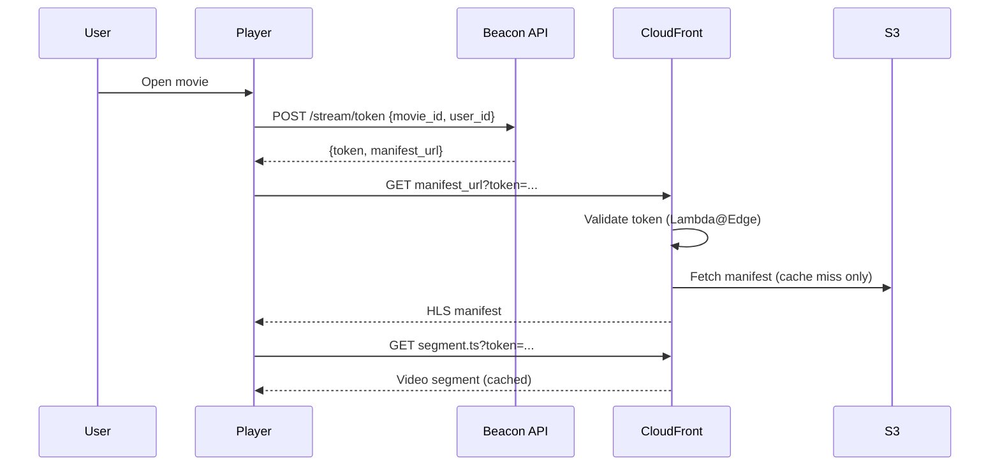

### Story Context

**Email — "Piracy Report" from Legal, Thursday morning**

```
From: Kwabena Adjei (Legal) <kwabena@beaconmedia.io>
To: Fatima Ould, You
Date: Thursday, 9:30 AM
Subject: URGENT — Piracy Investigation Findings

Fatima / [You],

Our content security vendor, ContentArmor, has flagged a serious problem.
They found Beacon Media premium content circulating on three piracy websites —
not just clips, but full movies with full audio/video quality. The video quality
suggests these are direct downloads, not screen recordings.

ContentArmor's analysis: they believe the source is direct S3 URL access.
Someone (or a script) is constructing our video segment URLs directly and
downloading content without authentication.

If true, our S3 buckets are essentially public for anyone who knows the URL format.
Attached is their technical analysis.

This is a content licensing violation. If our studio partners find out, we
risk losing content licenses — which would effectively kill the company.

I need a statement of remediation by end of week.

Kwabena
```

---

**ContentArmor technical analysis (attached PDF, excerpted)**

```
TECHNICAL FINDINGS:

1. Beacon Media S3 bucket policy allows public read access to all objects
   in /content/* path. This was likely intentional for CDN performance
   (no auth overhead) but creates an unrestricted public download vector.

2. URL structure is predictable:
   https://cdn.beaconmedia.io/content/movies/{movie_id}/{bitrate}/{segment}.ts
   Anyone who knows a movie_id can enumerate all segments and download the movie.

3. We found 847 unique movie IDs currently circulating in piracy communities.
   Download traffic from non-CDN sources suggests direct S3 access.

RECOMMENDATIONS:
1. Immediately close public S3 read access
2. Implement signed URL or token-based authorization on all content
3. Implement URL signing that binds to user identity to prevent URL sharing
4. Consider DRM for highest-value content
```

---

**Emergency meeting — Friday 10:00 AM**

**Fatima**: How bad is this?

**Kwabena**: 847 titles. These are licensed movies — we pay studios per-stream royalties.
If a pirate downloads 100,000 copies, we owe the studio for 100,000 streams but
received zero subscriber revenue. We're potentially on the hook for millions.

**You**: I've already reviewed the S3 bucket policy. ContentArmor is right —
the `/content/` prefix has `"Effect": "Allow", "Principal": "*", "Action": "s3:GetObject"`.
That's a fully public bucket for video content. It was set up this way for CDN performance.

**Fatima**: Who approved that?

**You**: Unknown. It predates everyone here.

**Fatima**: Fix it. Today. But do it without breaking video playback for our
28 million users.

**You**: Revoking public access immediately will break every video in production
right now. We need to implement signed URL delivery first, then revoke public access.
That's a 2-step migration, not a flip of a switch.

**Fatima**: How long?

**You**: If we parallelize: signed URL system deployed in 3 days, migration + public
access revocation in 5 days. We can have the security hole closed within a week.

**Fatima**: Do it. What do you need from me?

**You**: Two engineers pulled from feature work. And someone to tell studios we're
fixing it so they don't hear it from ContentArmor first.

---

**Slack DM — Marcus Webb → You, Friday afternoon**

**Marcus Webb**
Public S3 bucket for video content. I've seen this mistake at every media company
that moves fast. They want CDN performance, they open the bucket, they forget to close it.
Presigned URLs fix the public access problem. But they introduce a new problem:
how long is a presigned URL valid? Too short — users get broken links mid-stream.
Too long — piracy-minded users share the URL with 10,000 friends.

There's a more sophisticated design that binds the URL to the user's session
and doesn't put the signed URL on the public CDN. Think about it before
you reach for the obvious solution.

---

### Problem Statement

Beacon Media's S3 video content is accessible to anyone who knows the URL,
resulting in large-scale piracy. You must implement a presigned URL and
token-based authentication system that protects content from unauthorized
access while maintaining smooth video playback for 28 million legitimate users —
without introducing playback latency or breaking the CDN caching strategy
you designed in Chapter 18.

### Explicit Requirements

1. Remove public S3 read access on `/content/` bucket prefix
2. Implement token-based authentication for all video segment requests
3. Tokens must be bound to: user identity, content ID, valid time window
4. Token validation must not add > 50ms to video segment load time
5. CDN caching must still work (cached segments must not require re-authentication
   for each request from each user)
6. Implement URL expiry for presigned URLs: expired links must return 403
7. Migration path: deploy auth system → validate in production → then revoke
   public access. Zero video playback disruption during migration.

### Hidden Requirements

- **Hint**: Marcus Webb raised the URL sharing problem. A presigned URL signed for
  user A can be shared with user B. If you want to prevent this, the token must
  contain something only user A has — like their IP address or a user-specific
  nonce. What are the tradeoffs of IP-binding presigned URLs? (Mobile users'
  IPs change frequently, which would break playback.)
- **Hint**: If you validate auth on every video segment request at the CDN layer
  (Lambda@Edge), you're doing token validation 200+ times per video play (one per
  `.ts` segment). That's wasteful and adds latency. What's a better granularity
  for auth checks — per manifest request, per session, or per segment?
- **Hint**: The migration requires public access and signed access to coexist during
  the transition. But you can't run two CDN distributions simultaneously for the
  same content URL. What's the safest rollout strategy that allows you to validate
  the signed URL system works before you cut off the public access path?

### Constraints

- **Video playback**: HLS format, ~200 segments per movie, each 6-10 seconds
- **Concurrent streams**: ~500,000 at peak
- **Auth validation budget**: < 50ms added to P99 video segment latency
- **Token validity window**: 4 hours (typical movie watch session)
- **Migration window**: 5 days; no video playback disruption permitted
- **Team**: 2 engineers assigned, 5-day deadline

### Your Task

Design the presigned URL and token-based authentication system for Beacon Media's
video content. Include the auth flow, token design, CDN integration, and migration plan.

### Deliverables

- [ ] **Authentication flow diagram** (Mermaid sequence) — user opens video → player
  requests manifest → token issued → CDN validates token → segments served
- [ ] **Token design** — what fields does the auth token contain? How is it signed?
  What is the validation logic at the CDN edge?
- [ ] **CDN auth integration** — how does Lambda@Edge (or CloudFront Function) validate
  the token without calling your backend on every segment request?
- [ ] **Migration plan** — step-by-step: how do you deploy signed URL delivery
  alongside public access, validate it works, then safely revoke public access?
- [ ] **Tradeoff analysis** — minimum 3 tradeoffs:
  1. Per-segment token validation vs per-session token with segment URL signing
  2. IP-bound tokens vs user-identity-bound tokens (piracy prevention vs mobile UX)
  3. CloudFront signed URLs vs custom JWT validation at edge

### Diagram Format


