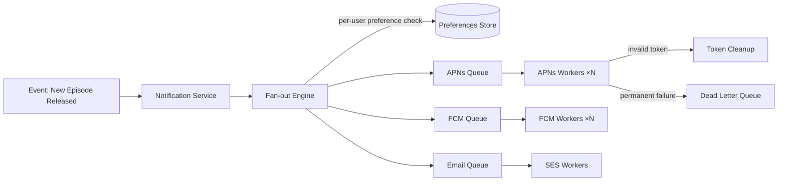

### Story Context

**Product roadmap review — #beacon-product, Monday 9:00 AM**

**Amara Diallo (VP Product)** [9:00 AM]
Okay this week we're kicking off the Notifications feature. This has been on the
roadmap for 8 months. Subscribers are asking for it in every survey. Here's what
users want:

1. "New episode available" — when a show they follow adds an episode
2. "Live event starting in 15 minutes" — sports and live concerts
3. "Continue watching" — re-engagement nudges for incomplete content
4. "New content in your genre" — personalized recommendations
5. "Account security alerts" — suspicious login, payment failed

**Amara** [9:01 AM]
The scale is not trivial. We have 28M MAU. A new episode of a popular show
could trigger 5–10 million push notifications simultaneously. Live event alerts
are even spikier — the "15 minutes before" window for a Champions League match
could be 8 million simultaneous pushes.

**You** [9:15 AM]
That's a fan-out problem. The naive approach — loop through all subscribers and
send a push — won't work at 8 million simultaneous sends. We need to think about
fan-out strategy, channel management, and delivery guarantees.

**Fatima** [9:18 AM]
What are our channels?

**You**: Based on what I see in the mobile app: push (iOS APNs + Android FCM),
email, and potentially in-app notification center. Three channels, each with
different delivery characteristics.

**Amara** [9:20 AM]
Important: users must be able to opt out of each notification type per channel.
"I want new episode push notifications but not emails."

---

**User preference research (Amara sends over, Tuesday)**

```
User survey results — notification preferences (n=12,000):
  - 78% want "new episode" push notifications
  - 62% want "live event starting" push notifications
  - 41% want "continue watching" push (opt-in, not default)
  - 89% want account security alerts via email
  - 31% want personalized recommendation emails (opt-in, very opt-in)

Average subscriptions per user: 4.2 shows
Average subscribers per popular show: 2.3M users
Champions League (biggest live event): estimated 8.5M interested users

Device split:
  iOS: 43%  (APNs — max 4KB payload, token per device)
  Android: 52% (FCM — max 4KB payload, can batch)
  Web: 5%   (Web Push — limited reach, skip for now)
```

---

**Technical constraint from mobile team**

**Lindiwe** (from VeloTrack — you recruited her) [Wednesday DM]
Hey, quick heads up from the mobile side. APNs has rate limits. Apple limits
push notification throughput to 4,000 notifications per second per APNs connection.
FCM is higher — 600,000/second in theory, but practical limits per app.
For 8.5M iOS users in a 5-minute window, that's 28,333 pushes/second. We'd need
at least 8 APNs connections running in parallel.
Also: both APNs and FCM have device token expiry. If a token is stale (user
uninstalled the app), the push fails silently — we need to handle token cleanup.

---

**Slack DM — Marcus Webb → You, Wednesday evening**

**Marcus Webb**
Notification systems. I've designed three. Here's the question nobody asks
until the system is in production and it's too late:
At what point does a notification become spam?
"New episode" for a show with weekly releases: fine.
"Continue watching" sent every 24 hours for a show the user last watched 3 months
ago: spam. Users uninstall the app.
Your notification system needs to be technically correct AND it needs to prevent
the product team from using it to harass users. Rate limiting per user per day
is as important as throughput capacity.
Also: what happens when APNs returns a "token invalid" error? You need to remove
that token from your system and stop sending to it. Stale tokens accumulate.
I once saw a system where 40% of push send attempts were to dead tokens.
Your throughput numbers don't account for that waste.

---

### Problem Statement

Beacon Media needs a notification system capable of fan-out at 8.5 million simultaneous
push notifications for live event alerts, supporting three channels (push, email, in-app),
per-user per-type opt-out preferences, and responsible rate limiting to prevent
spam. The system must deliver live event alerts within 2 minutes of trigger, handle
stale/invalid device tokens, and be extensible for new notification types.

### Explicit Requirements

1. Support three delivery channels: iOS push (APNs), Android push (FCM), and email
2. Per-user, per-notification-type, per-channel opt-out preferences
3. Live event alerts must be delivered within 2 minutes of trigger (8.5M users)
4. New episode notifications may be slower: best-effort within 30 minutes
5. Rate limiting per user: max N notifications per day per channel (configurable)
6. Handle stale device tokens: on "invalid token" response from APNs/FCM, remove
   from send list and flag for cleanup
7. Retry failed deliveries (transient failures) up to 3 times with backoff
8. Dead-letter for permanently failed notifications (invaluable for debugging)

### Hidden Requirements

- **Hint**: Marcus Webb raised the spam question. "Continue watching" at 24-hour
  frequency could be valuable or obnoxious depending on user behavior. Who controls
  the notification rate limits — the product team, the engineering team, or the user?
  Your system needs a configuration layer that allows product to tune frequency
  without engineering deploys.
- **Hint**: The fan-out math: 8.5M users in 2 minutes = 70,833 pushes/second.
  APNs max per connection is 4,000/s. How many APNs connections do you need?
  FCM is higher throughput but has its own limits. Design the send tier to handle
  this burst.
- **Hint**: "Fan-out on write" vs "fan-out on read." For a new episode notification,
  do you write 2.3M rows to an "outbox" table at the time the episode is released
  (fan-out on write), or do you expand the subscriber list at delivery time
  (fan-out on read)? What does each approach cost at 8.5M subscribers?

### Constraints

- **MAU**: 28M (active notification targets)
- **Peak event**: 8.5M simultaneous push notifications (Champions League)
- **Delivery SLA**: Live events: 2 minutes; New episodes: 30 minutes; Account alerts: 60 seconds
- **APNs connection limit**: 4,000 pushes/second per connection
- **FCM throughput**: ~600,000/second in theory, practical ~50,000/second for safety
- **Email volume**: Up to 28M emails/event (lower frequency, higher latency OK)
- **User preferences store**: Must be queryable at fan-out time (not cached too aggressively)
- **Infrastructure**: Kafka available; can add managed email service (SES)

### Your Task

Design the notification system architecture for Beacon Media: preference management,
fan-out strategy, channel delivery, rate limiting, and dead-letter handling.

### Deliverables

- [ ] **Architecture diagram** (Mermaid) — event trigger → notification service →
  fan-out strategy → channel queues (APNs, FCM, SES) → delivery workers → DLQ
- [ ] **Fan-out design** — for an 8.5M subscriber event: do you use fan-out on
  write or fan-out on read? Show the throughput math for each approach.
- [ ] **User preference data model** — schema for storing per-user per-type
  per-channel opt-in/opt-out; how do you query it efficiently at fan-out time?
- [ ] **Send tier capacity planning** — for 70,833 APNs pushes/second:
  how many APNs connections? How many worker processes? How many machines?
- [ ] **Rate limiting design** — per-user daily notification limits per channel.
  Where is this enforced? (Redis? DB?) What happens to a notification that hits
  the rate limit — dropped, or held for next window?
- [ ] **Tradeoff analysis** — minimum 3 tradeoffs:
  1. Fan-out on write (pre-expand subscriber list) vs fan-out on read (expand at delivery)
  2. Push delivery guarantee: at-most-once vs at-least-once (duplicate notification risk)
  3. Storing user preferences in DB vs Redis (read performance vs durability)

### Diagram Format


