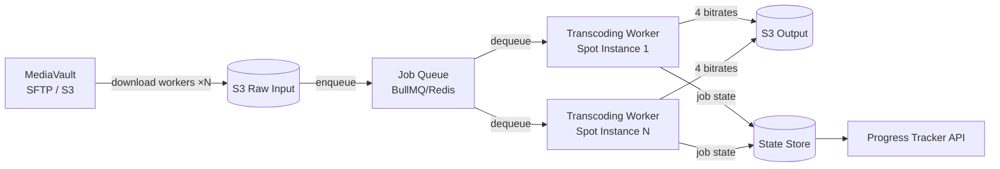

> **SPIKE CHALLENGE — SCALE 10X BY FRIDAY**
> A new content licensing deal is about to overwhelm your transcoding pipeline.

---

### Story Context

**Email from Fatima, Monday 8:45 AM**

```
From: Fatima Ould <fatima@beaconmedia.io>
To: Infrastructure Team
Date: Monday, 8:45 AM
Subject: URGENT — Studio deal requires 20,000 videos in 72 hours

Team,

We just closed a partnership with MediaVault, a content aggregator representing
450 independent studios. They're giving us their entire back-catalog as part of
the deal — 380,000 videos, averaging 94 minutes each.

The rollout is staged: first batch is 20,000 videos, due to be live on the platform
in 72 hours per the contract. The contract has a penalty clause: $5,000/hour for
every hour the content is delayed past the 72-hour window.

Our current transcoding pipeline processes 200 videos per day. We need to process
20,000 in 72 hours. That's 4.7x more volume per hour than our current capacity.

I don't know if this is possible. Tell me by 2pm today.

Fatima
```

---

**Current transcoding pipeline (you review the architecture at 9:00 AM)**

```
Current setup:
- 4 transcoding workers (EC2 t3.2xlarge instances)
- Each worker transcodes 1 video at a time
- Average transcoding time: 12 minutes per video (for 94-min source)
- Bitrates produced: 360p, 480p, 720p, 1080p (4 outputs per video)
- Each output is uploaded to S3
- Throughput: 4 workers × (60min / 12min per video) = 20 videos/hour = 200/day ✓

Required throughput for MediaVault:
- 20,000 videos in 72 hours
- 20,000 / 72 = 277.8 videos/hour required
- 277.8 / 20 (current hourly capacity) = 13.9x more capacity needed

Cost at current worker type:
- t3.2xlarge: $0.333/hour per instance
- 4 instances: $1.33/hour for transcoding

At 14x scale:
- 56 instances: $18.65/hour
- 72 hours: $1,342 total
- vs penalty for missing deadline: $5,000/hour × hours delayed
- Economic case for scaling is overwhelming.
```

---

**Slack thread — #infra-team, 11:00 AM**

**You**: Okay so the math says we need ~56 workers. But there are complications.

**Tariq Hassan (DevOps)** [11:05 AM]
First problem: spinning up 56 EC2 instances takes 5-10 minutes each. If we
do it sequentially, startup alone takes hours. We need auto-scaling or pre-warming.

**You**: Agreed. But there's a more fundamental problem. Our transcoding jobs
are currently managed by a single Postgres "job queue" table — the worker polls
it. At 56 concurrent workers polling the same table, we'll have lock contention
on the queue table.

**Tariq** [11:08 AM]
Switch to BullMQ/Redis?

**You**: Yes. But there's a third problem: the input videos are coming from
MediaVault via SFTP, 20,000 files averaging 4GB each. Total incoming: 80TB.
We need to figure out ingestion — how fast can we pull 80TB from them?

**Tariq** [11:12 AM]
At 1Gbps sustained: 80TB / 1Gbps = ~178 hours. We can't wait for sequential download.
We need to parallelize the download AND the transcoding.

---

**Slack DM — Marcus Webb → You, 11:30 AM**

**Marcus Webb**
You have a compute problem, a storage bandwidth problem, and a queue architecture
problem simultaneously. Classic bulk processing challenge.
Here's the pattern: pipeline the work. Don't wait for all downloads to finish
before transcoding starts. As each video downloads, immediately queue it for
transcoding. Transcoding can start on video 1 while video 200 is still downloading.
Second: spot instances. For batch transcoding, you don't need on-demand compute.
Spot instances are 70% cheaper and appropriate for work that can be retried on interruption.
A transcoding job that gets interrupted just restarts. What does "restart safely"
mean for a 12-minute transcoding job?

---

### Problem Statement

Beacon Media needs to transcode 20,000 videos in 72 hours to meet a contract
deadline — 14x their current transcoding capacity. The current pipeline architecture
(4 workers, Postgres job queue, sequential download) cannot handle this load.
You must design a scalable bulk transcoding pipeline that can burst to the required
capacity within the 72-hour window at minimal cost.

### Explicit Requirements

1. Process 20,000 videos within 72 hours (277 videos/hour minimum)
2. Use spot instances for cost efficiency (70% savings vs on-demand)
3. Pipeline downloads and transcoding (don't wait for all downloads before transcoding)
4. Job queue must handle 56+ concurrent workers without contention
5. Spot instance interruption must not cause job data loss — interrupted jobs must
   resume or restart cleanly
6. Each video produces 4 output bitrates (360p, 480p, 720p, 1080p) uploaded to S3
7. Provide real-time progress tracking: how many videos are done, how many in progress,
   estimated completion time

### Hidden Requirements

- **Hint**: Marcus Webb mentioned "restart safely." A transcoding job for a 94-minute
  video takes 12 minutes. If a spot instance is interrupted at minute 11, you've
  lost 11 minutes of compute. Can you checkpoint a video transcoding job at intervals
  and resume from the checkpoint? Or is it cheaper to just restart from the beginning?
  At 12 minutes per job and spot interruption probability of ~5%, what is the expected
  wasted compute per 1,000 jobs?
- **Hint**: 80TB of input video from MediaVault via SFTP. SFTP is slow and single-stream.
  Is there a better way to ingest 80TB? If MediaVault can provide an S3 bucket or
  a pre-signed download URL, you can use AWS S3 Transfer Acceleration or S3 multipart
  copy — much faster than SFTP.
- **Hint**: "4 outputs per video" — 360p, 480p, 720p, 1080p. Can you parallelize
  the four transcoding passes for a single video across four workers? Or must they
  be sequential (one worker does all 4)? If you can parallelize, what changes in
  your job model?

### Constraints

- **Timeline**: 72 hours from contract start
- **Input data**: 20,000 videos × avg 4GB = 80TB total
- **Ingestion source**: MediaVault SFTP server (negotiable to S3 if you ask)
- **Output per video**: 4 bitrates → average 2GB total output per video
- **Total output**: 20,000 × 2GB = 40TB S3 storage
- **Spot instance interruption rate**: ~5% per hour (AWS historical average)
- **Penalty**: $5,000/hour for every hour past 72-hour deadline
- **Budget**: No hard cap (penalty cost justifies compute spend)

### Your Task

Design the bulk transcoding pipeline for the MediaVault ingestion. Address compute
scaling, job queue architecture, download parallelism, spot instance resilience,
and progress tracking.

### Deliverables

- [ ] **Pipeline architecture diagram** (Mermaid) — MediaVault source → download
  workers → S3 raw → transcoding queue → transcoding workers (spot) → S3 output
- [ ] **Capacity calculation** — workers needed, spot instance type, hourly cost,
  total 72-hour cost. Compare on-demand vs spot pricing.
- [ ] **Job resilience design** — how are interrupted spot instances handled?
  Where is job state stored? How does a new instance know where to resume?
- [ ] **Progress tracking design** — how do you compute "% complete" and ETA in
  real time across 56 workers? What store tracks job state?
- [ ] **Ingestion optimization** — if MediaVault agrees to S3 copy instead of SFTP,
  how does that change the download speed? What is the new bottleneck?
- [ ] **Tradeoff analysis** — minimum 3 tradeoffs:
  1. Spot instances (cheap, interruptible) vs on-demand (expensive, reliable) for transcoding
  2. 4-outputs-per-job (one worker per video) vs 1-output-per-job (4 workers per video)
  3. Postgres job queue vs Redis/BullMQ for 56+ concurrent workers

### Diagram Format


