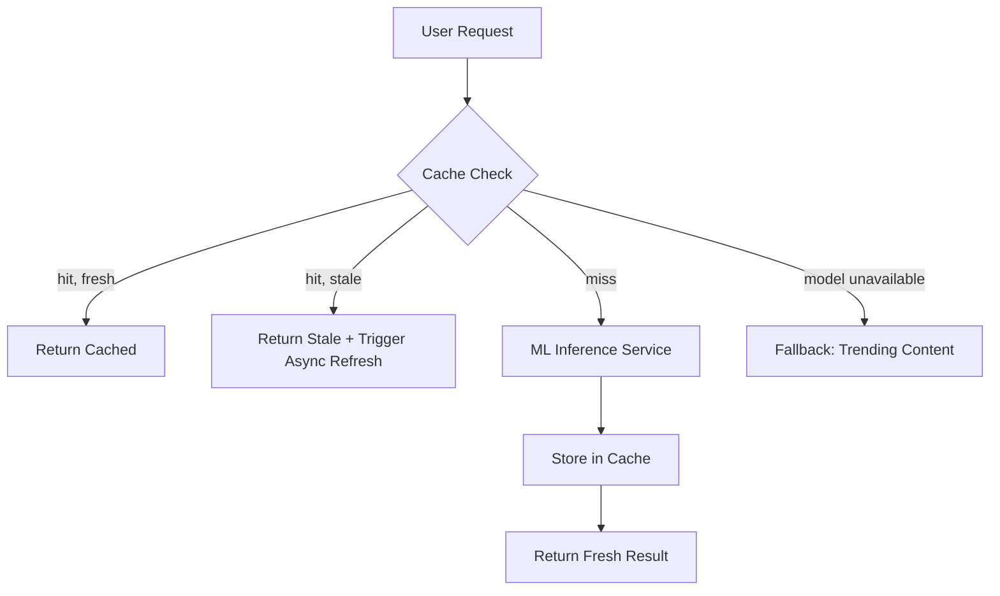

> **SPIKE CHALLENGE — PRODUCTION DOWN**
> The recommendation API was the last thing on your radar. Until 11 PM.

---

### Story Context

**#incidents — Slack, Tuesday 11:03 PM**

**PagerDuty Bot** [11:03 PM]
🔴 ALERT: `/api/v1/recommendations` — P99 latency 8,200ms (threshold 500ms)
Error rate: 23% (threshold 1%)
On-call: @you

**You** [11:05 PM]
Ack. Looking.

**Fatima** [11:07 PM]
What's happening?

**You** [11:14 PM]
The recommendation service is returning 8-second responses. It calls the ML model
for recommendations for each user — no cache. Our ML team released a new
recommendation model today at 5pm. The new model is 3x heavier (inference time
went from 40ms to 128ms per user). Fine for normal traffic.

But we just had the Champions League live match end. 6.8M concurrent users just
finished watching. The app shows recommendations the moment the match ends.
6.8M simultaneous recommendation requests hit the service.
128ms × 6.8M users in a burst = the service is flooded.

**Fatima** [11:16 PM]
Can we roll back the model?

**You** [11:17 PM]
Yes, but it takes 20 minutes to redeploy. Meanwhile users are seeing a blank screen
where recommendations should be. That's churn at Champions League scale.

**Fatima** [11:18 PM]
Mitigation first. Then root cause fix.

**You** [11:19 PM]
Immediate mitigation: serve cached recommendations from Redis (pre-computed).
We have a daily pre-computation job that runs at midnight — the cache is 23 hours
stale but it exists. I can flip the service to serve from cache now.
That gets us stable in 5 minutes.

**Fatima** [11:20 PM]
Do it.

---

**Post-mitigation analysis (Wednesday morning)**

The incident revealed a fundamental design flaw: the recommendation API has no
caching strategy. Every request hits the ML model. For low-traffic periods
this was acceptable. For post-live-event bursts — 6.8M simultaneous users —
it's catastrophic.

But caching recommendations is genuinely hard:
- Recommendations are personalized per user (28M unique users = 28M unique caches)
- The model improves daily (cache invalidation needed after model updates)
- Trending content changes hourly (some recommendations should be fresh)
- User behavior updates recommendations (if a user watches something, recommendations change)

---

**Slack DM — Marcus Webb → You, Wednesday 10:00 AM**

**Marcus Webb**
Recommendation caching is one of those problems that looks simple and isn't.
Two strategies. Both have problems. Think about them:

Strategy 1: Pre-compute all 28M users' recommendations daily (midnight batch).
Cache for 24 hours. Instant serving. Problem: 24 hours is too stale for active users.
And if the model updates mid-day, everyone gets old recommendations until midnight.

Strategy 2: Lazy cache — compute on first request, cache for 1 hour.
Problem: cache cold start. After the Champions League, 6.8M users simultaneously
hit cold cache. You just reproduced tonight's incident.

There's a third strategy. Think about what you need: most users can have stale
recommendations. A small fraction of users (recently active) need fresher ones.
Different staleness tolerances → different caching strategies for different cohorts.

What's the simplest way to differentiate "user was active in the last 1 hour"
from "user hasn't been active in 3 days"?

---

### Problem Statement

Beacon Media's recommendation API has no caching strategy, causing catastrophic
latency during post-live-event traffic bursts when millions of users simultaneously
request personalized recommendations. The ML model used for recommendations has
increased inference time from 40ms to 128ms, making burst traffic unsustainable.
You must design a multi-tier caching strategy for recommendations that handles
burst traffic, supports model updates, and provides personalized results within
acceptable staleness bounds.

### Explicit Requirements

1. Recommendation API P99 latency must be < 100ms at peak (6.8M concurrent users)
2. Serve recommendations from cache; compute via ML model only on cache miss or staleness
3. Recently active users (last 1 hour) get fresher recommendations (< 15 min stale)
4. Less active users (not in last 24 hours) may receive up to 24-hour-stale recommendations
5. Cache must be invalidated on model deployment (without causing a cold-start storm)
6. Cache must be partially invalidated when a user watches content (remove watched
   items from their cached recommendations)
7. Emergency fallback: if cache is empty and model is unavailable, serve top-10
   trending content globally (no personalization, but not a blank screen)

### Hidden Requirements

- **Hint**: Marcus Webb described the "cache cold start" problem after a live event.
  6.8M users hit cold cache simultaneously — that's 6.8M ML inference requests
  in a burst. This is a "thundering herd" problem. How do you prevent a newly
  deployed model from being immediately overwhelmed by simultaneous cache misses?
  (Hint: probabilistic early expiration? Pre-warming the cache before the event ends?)
- **Hint**: "Cache must be partially invalidated when a user watches content."
  At 28M users, if you invalidate and re-compute recommendations on every watch event,
  you're running 28M ML inferences per hour during peak viewing. What's a smarter
  approach — invalidate lazily, or update the cache incrementally?
- **Hint**: Recommendation caching for 28M users at an average serialized size
  of 500 bytes per user = 14GB of cache. That fits in Redis, but barely. What
  happens to cache memory when you have multiple versions (pre-model-update and
  post-model-update) during a rolling invalidation?

### Constraints

- **MAU**: 28M (potential unique cache entries)
- **ML inference time**: 128ms per user (new model)
- **Post-live-event burst**: 6.8M simultaneous recommendation requests
- **Freshness requirements**: Active users (< 1hr): 15-min staleness OK;
  Less active users: 24-hr staleness OK
- **Cache memory budget**: 20GB Redis for recommendations
- **Model updates**: Typically once per day, sometimes mid-day for urgent fixes
- **Content catalog size**: 380,000+ titles post-MediaVault deal

### Your Task

Design the multi-tier recommendation caching strategy for Beacon Media that
handles burst traffic, differentiates staleness by user activity, and prevents
thundering herd on cache miss or model update.

### Deliverables

- [ ] **Caching architecture diagram** (Mermaid) — request flow from user through
  cache tiers (hot/warm/cold) to ML model fallback
- [ ] **Cache tier design** — define the tiers: what qualifies a user for each
  tier, what is the TTL, where is the data stored (Redis key scheme)
- [ ] **Thundering herd prevention** — how do you pre-warm the cache before a live
  event ends? How do you stagger cache misses to prevent a simultaneous ML burst?
- [ ] **Model update invalidation strategy** — how do you invalidate 28M cache
  entries after a model update without causing a cold-start storm?
- [ ] **Memory sizing** — at 28M users × 500 bytes/user, what is total cache size?
  How does your tiered approach reduce the active hot-tier size to fit in 20GB Redis?
- [ ] **Tradeoff analysis** — minimum 3 tradeoffs:
  1. TTL-based expiry vs event-driven invalidation for recommendation cache
  2. Pre-computing all 28M users (batch) vs lazy computation on first request
  3. Single Redis tier vs tiered storage (Redis hot + DynamoDB/S3 for cold)

### Diagram Format

