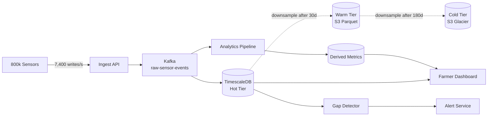

### Story Context

**War room briefing — Monday 9:00 AM**

**Priya Ranganathan**: Here's the problem in plain terms. We have 800,000 sensors.
Each sends a reading every 30 seconds. That's 26.7 million readings per hour,
640 million per day. We store everything in a PostgreSQL table called `sensor_readings`.
That table is currently 4.2 billion rows. Queries on it take 8-12 minutes.

**You**: 4.2 billion rows in PostgreSQL. With what indexes?

**Priya**: One index on `(sensor_id, recorded_at)`. That's it.

**You**: Okay. That index is correct for single-sensor queries. But range queries
across many sensors — like "show me all moisture readings for farm region X for
the last 7 days" — would still be slow. How many sensors per farm?

**Priya**: Average 12 sensors per farm. Some large commercial farms have 200+.

**You**: And how often do farmers query their dashboards?

**Ananya Krishnan (Data Engineer)** [joining late]
Sorry I'm late. The mobile app makes dashboard queries every 30 seconds. Per user.
We have about 40,000 daily active farmers. That's 40,000 × 2 queries/minute =
80,000 queries/minute just from the mobile app.

**You**: Those queries are hitting the same 4.2 billion row table?

**Priya**: Yes.

**You**: And the 6-hour processing lag?

**Ananya**: We have an analytics pipeline that processes the raw sensor data to
compute derived metrics — rolling averages, anomaly detection, irrigation alerts.
That pipeline reads from `sensor_readings` and writes back to `derived_metrics`.
At current data volume, the pipeline takes 6-8 hours to run. So "current" data
on a farmer's dashboard is actually 6 hours old.

**You**: That's not a dashboard. That's a newsletter.

**Priya**: [laughs] Yes. That's why we hired you.

---

**Schema review (Ananya shares the DDL)**

```sql
CREATE TABLE sensor_readings (
  id BIGSERIAL PRIMARY KEY,
  sensor_id UUID NOT NULL,
  farm_id UUID NOT NULL,
  region_code VARCHAR(16),
  reading_type VARCHAR(32) NOT NULL,  -- 'soil_moisture', 'temperature', etc.
  value DOUBLE PRECISION NOT NULL,
  unit VARCHAR(16) NOT NULL,
  battery_level SMALLINT,
  gps_lat DOUBLE PRECISION,
  gps_lng DOUBLE PRECISION,
  recorded_at TIMESTAMPTZ NOT NULL,
  received_at TIMESTAMPTZ DEFAULT NOW()
);

CREATE INDEX idx_sensor_readings_sensor_time
  ON sensor_readings(sensor_id, recorded_at DESC);

-- Table stats:
-- Row count: 4,200,000,000
-- Table size: ~680GB
-- Index size: ~94GB
-- Oldest data: 3 years ago
-- Retention policy: none defined (keep everything)
```

---

**Slack DM — Marcus Webb → You, Day 2**

**Marcus Webb**
Time-series data. Different beast from transactional data. Three fundamental
truths about time-series that change your design:
1. You almost never update or delete old readings. They're immutable. Append-only.
   This changes your write strategy dramatically.
2. Old data is queried less frequently than recent data. Last 24 hours is hot.
   Last year is cold. Last 3 years is barely accessed.
3. Queries are almost always range queries over time, often on a subset of sensors.
   Your index strategy must support time-range scans, not point lookups.

PostgreSQL is a reasonable choice for time-series up to a point. You're past that point.
But before you rip out Postgres, ask: do you need to replace it, or do you need
to partition it properly and add a time-series layer on top?

**You** [response]
I was thinking TimescaleDB — it's a Postgres extension. Native time-series support,
automatic partitioning by time, compression for old chunks.

**Marcus Webb**
Good choice. Incremental — you don't throw away your Postgres knowledge.
One question: how do you handle the migration of 4.2 billion existing rows?

---

### Problem Statement

AgroSense's 4.2-billion-row `sensor_readings` table in standard PostgreSQL is
causing 8-12 minute query times and a 6-hour analytics pipeline lag. The system
ingests 640 million readings per day from 800,000 sensors. You must redesign
the time-series storage layer to support sub-second dashboard queries and
real-time (< 5 minute) analytics processing.

### Explicit Requirements

1. Dashboard queries ("last 24 hours for sensors on farm X") must complete < 2 seconds
2. Analytics pipeline lag must drop from 6 hours to < 5 minutes
3. Support data retention tiers: hot (last 30 days, full resolution), warm
   (31-180 days, 5-minute aggregates), cold (180+ days, hourly aggregates)
4. Ingest 640M readings/day (~7,400 readings/second) without write bottleneck
5. Support "gap detection": identify sensors that haven't reported in > 5 minutes
   (indicates sensor failure or connectivity issue — farmer alert)
6. Storage cost must not exceed current cost (currently ~680GB at $0.023/GB/month on EBS)

### Hidden Requirements

- **Hint**: Marcus Webb mentioned "range queries over time, often on a subset of
  sensors." The current index is `(sensor_id, recorded_at)` — this is excellent
  for "show me all readings for sensor X between time A and time B." But what
  about "show me all soil_moisture readings for farm region 'KENYA-RIFT' for
  the last 24 hours"? This touches many sensors. What additional index or schema
  design supports this multi-sensor range query efficiently?
- **Hint**: The analytics pipeline reads from `sensor_readings` and runs for
  6-8 hours. It reads the entire day's data. At 7,400 writes/second, while the
  pipeline is reading, the table is growing. Long-running reads on a growing table
  can cause PostgreSQL vacuuming and bloat issues. How does time-partitioning
  (TimescaleDB or native PG partitioning) help isolate reads from writes?
- **Hint**: The spec says `Double Precision` for sensor values. Double precision is
  8 bytes. Soil moisture is typically expressed as a percentage (0.0–100.0), which
  could be a 2-byte SMALLINT (0–10000 for 2 decimal places). At 640M readings/day,
  what is the storage savings from using the smaller type?

### Constraints

- **Ingestion rate**: 640M readings/day = 7,407 writes/second
- **Sensors**: 800,000 sensors, each reporting every 30 seconds
- **Daily active farmers**: 40,000 → 80,000 queries/minute to dashboards
- **Current storage**: 680GB for 3 years of data
- **Retention**: Hot (30 days), Warm (6 months), Cold (3+ years)
- **Query SLA**: Dashboard: < 2s; Analytics pipeline: near-real-time (< 5 min lag)
- **Gap detection**: Alert if sensor silent > 5 minutes (within 1 minute of detection)
- **Migration**: 4.2B existing rows must be migrated without taking the system offline

### Your Task

Design the time-series storage and pipeline architecture for AgroSense. Include
the storage layer selection, schema design, partitioning strategy, data tiering,
and migration plan.

### Deliverables

- [ ] **Architecture diagram** (Mermaid) — ingestion path → time-series store →
  analytics pipeline → dashboard query path → alert system for gap detection
- [ ] **Schema redesign** — new table definition with: appropriate column types,
  TimescaleDB hypertable configuration (chunk_time_interval), indexes for both
  single-sensor queries and multi-sensor range queries
- [ ] **Data tiering plan** — define the three tiers (hot/warm/cold), what
  data lives where, automatic downsampling at tier transitions, and estimated
  storage per tier
- [ ] **Gap detection design** — how do you efficiently detect that sensor X
  hasn't reported in 5 minutes, across 800,000 sensors? (Hint: this is a
  "latest heartbeat" problem — what data structure supports it?)
- [ ] **Migration plan** — how do you migrate 4.2B rows from plain Postgres to
  TimescaleDB without downtime? (Hint: TimescaleDB can be added as an extension
  to existing Postgres — the migration can be incremental)
- [ ] **Scaling estimation** — at 640M readings/day × 3 years, with downsampling
  applied to warm and cold tiers: what is total storage? What is monthly storage cost?
- [ ] **Tradeoff analysis** — minimum 3 tradeoffs:
  1. TimescaleDB (Postgres extension) vs purpose-built time-series DB (InfluxDB, Prometheus)
  2. Full-resolution retention vs aggressive downsampling for cost
  3. Push-based analytics pipeline (reading new data as it arrives) vs pull-based
     scheduled batch pipeline

### Diagram Format


