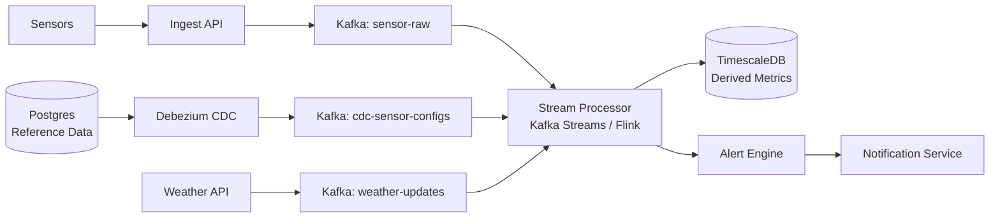

### Story Context

**Data team weekly sync — Wednesday 2:00 PM**

**Ananya Krishnan**: Okay, the TimescaleDB migration is going well. But I want to
talk about the analytics pipeline, because fixing storage is only half the problem.

Even with fast time-series storage, our analytics pipeline is still a scheduled
batch job that runs every hour. Here's the problem: an irrigation alert —
"your soil moisture is critically low, you need to water NOW" — is generated
by the analytics pipeline. If the pipeline runs hourly, an alert for a critical
moisture drop at 2:01 PM isn't processed until 3:00 PM. In hot weather, that
can be the difference between a healthy crop and a dying one.

**You**: So the hourly batch job needs to become a real-time stream.

**Ananya**: That's what Priya wants. But here's the complication: the derived
metrics aren't just about raw sensor readings. They join against a `farms` table
(farm metadata), a `sensor_configs` table (calibration offsets per sensor),
and a `weather_forecasts` table (we pull in external weather data via API).

When a `sensor_config` is updated — say, a sensor is recalibrated — all the
historical derived metrics for that sensor need to be recomputed. If we have
a real-time stream that doesn't know about config changes, the derived metrics
will be wrong until the next recalibration event propagates.

**You**: That's the CDC problem. Change Data Capture — how do you detect and
react to changes in those reference tables?

**Ananya**: Exactly. And the weather data updates every 15 minutes from the
external API. Those updates need to flow into the metrics computation too.

---

**Current pipeline architecture (Ananya's diagram, shared in Confluence)**

```
[Scheduled Job — runs hourly]
1. SELECT all sensor_readings from the last hour
2. JOIN with sensor_configs (calibration)
3. JOIN with farms (region, crop type)
4. JOIN with weather_forecasts (temperature, rainfall forecast)
5. Compute derived metrics (rolling averages, anomaly scores, alerts)
6. Write to derived_metrics table
7. If alert condition: write to alerts table → push notification fired

Problems:
- Alert latency: up to 59 minutes (worst case: event at T+0, processed at T+59m)
- Sensor config updates: not reactive — pipeline uses config snapshot from job start
- Weather data: updated every 15 minutes but pipeline only reads at job start
- Full table scan of sensor_readings hourly: slow and expensive
- If pipeline fails mid-run: all derived metrics for that hour are stale or missing
```

---

**Email — Priya, Thursday morning**

```
From: Priya Ranganathan
To: Data Team, You
Subject: Real-time alert SLA for irrigation partnership

The Kenyan Agricultural Ministry partnership is moving forward. They have a new
requirement: irrigation alerts must be delivered to farmers within 3 minutes of
a critical threshold being crossed.

This is a contractual requirement with a government partner. We cannot miss it.

Current alert latency: up to 59 minutes.
Required alert latency: < 3 minutes.

This is the highest-priority engineering item for Q1.
```

---

**Slack DM — Marcus Webb → You**

**Marcus Webb**
Hourly batch to real-time streaming. Classic evolution. I've done this migration
four times. Every time, the hardest part isn't the stream processing — it's
the joins.

Your analytics pipeline joins sensor readings with reference data (sensor configs,
farm metadata, weather). In a batch job, you join at query time — the data is
always current. In a stream processor, you need to carry that reference data
with you as a local lookup.

Two questions:
1. How do you keep the stream processor's local copy of reference data in sync
   when it changes? That's CDC — Change Data Capture from Postgres.
2. Weather data changes every 15 minutes. If you're processing 7,000 events/second,
   you can't call the weather API for every event. How do you broadcast weather
   updates to your stream processor without polling?

---

### Problem Statement

AgroSense's hourly batch analytics pipeline must be replaced with a real-time
stream processor to meet a 3-minute irrigation alert SLA. The stream processor
must join sensor readings with reference data (sensor configs, farm metadata,
weather forecasts) that changes asynchronously. You must design the CDC architecture
to propagate reference data changes into the stream processor and the ETL design
to handle 7,400 events/second with joins.

### Explicit Requirements

1. Alert latency must be < 3 minutes from threshold crossing to farmer notification
2. Stream processor must join sensor readings with: `sensor_configs` (calibration),
   `farms` (metadata), `weather_forecasts` (external, updates every 15 minutes)
3. When `sensor_configs` is updated in Postgres, the change must propagate to the
   stream processor within 60 seconds
4. Weather forecast updates must propagate to the stream processor within 5 minutes
5. Stream processor must handle 7,400 events/second sustained, 15,000 at peak
6. If the stream processor restarts, it must resume from last committed offset —
   no events dropped, no events double-processed (for alerts specifically)
7. Derived metrics must be written to TimescaleDB for dashboard queries

### Hidden Requirements

- **Hint**: Marcus Webb asked how to keep local reference data in sync via CDC.
  Debezium is the standard tool for PostgreSQL CDC — it reads the Postgres WAL
  (Write-Ahead Log) and emits change events to Kafka. If `sensor_configs` row
  is updated, Debezium emits a CDC event to a Kafka topic. Your stream processor
  subscribes to this topic and updates its local lookup table. But — what happens
  if the stream processor starts up and the CDC topic only has change events (not
  a full snapshot)? How does it bootstrap its local state?
- **Hint**: "Alert latency < 3 minutes" — the stream processor must detect a
  threshold crossing. Soil moisture crosses a threshold when it's below X for
  Y consecutive readings. Your stream processor needs stateful stream processing
  (tracking consecutive readings per sensor). What stream processing framework
  supports stateful per-key windows? (Flink? Kafka Streams? Node.js custom processor?)
- **Hint**: Double-processing protection for alerts. If the stream processor restarts
  and re-processes an event that already triggered an alert, you don't want two
  alerts sent to the farmer. How do you deduplicate alerts? (Hint: the alert itself
  has an idempotency key — sensor_id + threshold_type + time_window)

### Constraints

- **Stream volume**: 7,400 events/second sustained, 15,000 at peak
- **Alert SLA**: < 3 minutes from threshold crossing
- **Reference data update SLA**: sensor_config → stream: < 60 seconds
- **Weather update SLA**: weather → stream: < 5 minutes
- **Sensor config updates**: ~200/day (rare but important)
- **Weather data**: External API, 15-minute update cycle, JSON response ~50KB
- **Infrastructure**: Kafka already in use; can add Debezium, Kafka Streams, or Flink

### Your Task

Design the real-time ETL pipeline and CDC architecture for AgroSense's sensor
data processing, meeting the 3-minute alert SLA.

### Deliverables

- [ ] **Pipeline architecture diagram** (Mermaid) — sensor readings → Kafka →
  stream processor (with CDC reference data injection) → derived metrics +
  alert engine → notifications
- [ ] **CDC design** — how does a sensor_config update in Postgres propagate to
  the stream processor? Show the Debezium → Kafka → stream processor flow with
  bootstrap strategy
- [ ] **Stream processor state design** — for the "consecutive readings below
  threshold" alert condition: what state does the processor maintain per sensor?
  How is state stored (local RocksDB? Redis?)
- [ ] **Alert deduplication** — how do you prevent double alerts on stream
  processor restart? Show the idempotency key structure and check.
- [ ] **Scaling estimation** — at 7,400 events/second with 800,000 sensors,
  what is the state size per sensor (rolling window of last N readings)?
  What is total stream processor memory required?
- [ ] **Tradeoff analysis** — minimum 3 tradeoffs:
  1. Kafka Streams (simple, embedded) vs Apache Flink (powerful, operationally complex) for stream processing
  2. CDC via Debezium (WAL reading) vs polling the reference tables periodically
  3. Stateful stream processing (maintain sensor history in processor) vs lookup
     from TimescaleDB on each event (stateless but higher latency)

### Diagram Format


