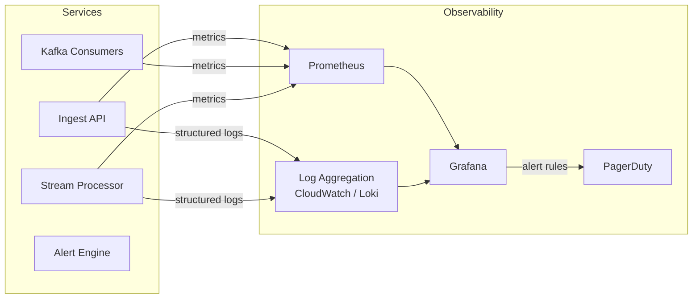

### Story Context

**Post-mortem meeting — 3 weeks in, Tuesday 10:00 AM**

**Priya Ranganathan**: Okay, last week we had a 4-hour sensor ingestion outage.
The stream processor stopped processing events, lag built up to 12 million messages,
and nobody noticed until a farmer called us saying his dashboard was stale.

**Ananya**: We don't have lag monitoring on the Kafka consumer groups.

**Priya**: We don't have monitoring on almost anything.

She pulls up a list:

```
What we do NOT have:
- Kafka consumer group lag monitoring
- Sensor ingestion rate monitoring (are sensors reporting?)
- Stream processor health metrics
- Database query performance metrics
- End-to-end alert delivery tracking (did the alert actually reach the farmer?)
- Structured logging (log lines are printf-style, no fields)
- Dashboards for on-call engineers
- Runbooks for common failures
```

**Priya**: I want an observability design. Not just dashboards — a philosophy.
What do we measure, why, how do we alert, and what do engineers do when the
alert fires? The last part is the one everyone skips.

**You**: The "what do engineers do" part is runbooks.

**Priya**: Exactly. And runbooks are only useful if the alerts give enough context
to follow them. An alert that says "SOMETHING IS WRONG" is worse than no alert
at all — it wakes you up and then leaves you alone to figure it out.

---

**#on-call — Slack, the incident that triggered this meeting (3 weeks ago)**

```
[Week 3, Tuesday 2:17 AM] PagerDuty: Stream processor error rate elevated
[2:18 AM] On-call acks
[2:25 AM] On-call: "What's elevated? Can't find any metric to look at."
[2:31 AM] On-call: "Found a log that says 'connection reset by peer'. Restarted processor."
[2:33 AM] On-call: "Still happening. Lag is growing."
[2:45 AM] On-call: "Gave up. Going to sleep. Will look in the morning."
[6:30 AM] On-call: "Back. Found root cause: Kafka broker 2 had a disk fill.
           Consumer group was rejecting connections because of error on broker side.
           Fixed by cleaning up old log segments. Lag recovered in 90 minutes."
[7:00 AM] Farmer reports stale dashboard: AgroSense team notified.
```

The outage lasted 4 hours and 15 minutes. The on-call engineer had no visibility,
no context, and no runbook. They made the best decision available to them —
wait until they could see clearly.

---

**Slack DM — Marcus Webb → You**

**Marcus Webb**
No observability. Classic.

Here's the test I use for every monitoring system I review:
Given a 3am page, can a reasonably-experienced on-call engineer:
1. Understand what is broken (not "something is broken") within 2 minutes
2. Know the blast radius (how many users/sensors are affected) within 3 minutes
3. Have a clear first action to take (not "poke around") within 5 minutes

If the answer to any of those is "no," the monitoring is insufficient.

The incident you described: the engineer knew "error rate elevated" (generic),
couldn't determine blast radius (no sensor count affected), and had no first action
(no runbook, no related metrics to check).

Design your monitoring to answer those three questions automatically.

**Marcus Webb** [follow-up]
One more thing: structured logging. printf-style logs like
`"Connection reset by peer for broker kafka-2:9092"` are human-readable but
machine-unreadable. You can't aggregate, filter, or alert on unstructured text.
Every log line should be JSON with fields. `{"level":"error", "broker":"kafka-2",
"port":9092, "error":"connection_reset", "consumer_group":"analytics-processors"}`.
That's alertable. That's queryable. That's the difference between 4 hours and 4 minutes.

---

### Problem Statement

AgroSense has no meaningful observability — no consumer lag monitoring, no
structured logging, no runbooks, and no dashboards. A 4-hour outage went undetected
until a farmer called. You must design an observability system for the sensor
platform that answers three questions within minutes of an alert: what is broken,
what is the blast radius, and what is the first action?

### Explicit Requirements

1. Kafka consumer group lag monitoring: alert when lag > 100,000 messages
2. Sensor reporting rate monitoring: alert when ingestion drops > 20% in 5 minutes
   (indicates sensors offline or ingest API failure)
3. Stream processor health metrics: events processed/second, processing latency P99,
   error rate
4. End-to-end alert delivery tracking: from threshold crossing to farmer notification
   (measure the full 3-minute SLA in production)
5. Structured logging: all services must emit JSON logs with standard fields
   (service, level, trace_id, sensor_id where relevant, duration_ms)
6. On-call dashboards: single-pane view answering Marcus Webb's three questions
7. Runbooks: minimum 3 runbooks for the most common failure scenarios

### Hidden Requirements

- **Hint**: Marcus Webb's three questions require three distinct data types:
  (1) What is broken → error metrics and recent log events; (2) Blast radius →
  business metrics (how many sensors, how many farmers affected); (3) First action
  → runbook link in the alert. Your alert payloads must carry all three.
  What does an alert payload look like that contains all of this?
- **Hint**: "Sensor reporting rate drops 20% in 5 minutes" — how do you calculate
  this? You need a baseline. The baseline for sensor reporting is time-of-day
  dependent: fewer sensors report at 2am than at 2pm (sensors in different time zones).
  How do you alert on a 20% drop relative to the expected rate at that time of day?
- **Hint**: Structured logging with `trace_id` allows you to correlate a single
  sensor reading from ingest all the way through the stream processor to the
  alert engine. A single `trace_id` per sensor reading event enables you to
  reconstruct the end-to-end journey of any event. How is the `trace_id` generated
  and propagated across service boundaries?

### Constraints

- **Services to instrument**: Ingest API, Kafka consumers (4 groups), stream processor,
  alert engine, notification service, TimescaleDB query layer
- **Log volume**: at 7,400 events/second, each creating ~2 log lines = ~14,800 log
  lines/second; log storage cost is a concern
- **Alert fatigue**: At 800,000 sensors, a firmware bug could cause 800,000 simultaneous
  "sensor offline" alerts. Alert deduplication/grouping is required.
- **Infrastructure**: Use existing AWS stack; CloudWatch available, Grafana Cloud
  available on free tier, Prometheus for metrics collection

### Your Task

Design the observability architecture for AgroSense's sensor platform. Cover
structured logging, metrics, alerting, dashboards, and runbooks.

### Deliverables

- [ ] **Observability architecture diagram** (Mermaid) — services → metrics (Prometheus
  scrape or push) → Grafana → alerting → PagerDuty
- [ ] **Key metrics specification** — for each service (ingest, stream processor,
  alert engine), list the 3-5 most important metrics with their alert thresholds
  and what the metric means for an on-call engineer
- [ ] **Alert payload design** — what fields does a PagerDuty alert include?
  Show a sample alert for "Kafka consumer lag > 100k" that answers Marcus Webb's
  three questions
- [ ] **Structured log schema** — standard JSON log format with required fields;
  show an example log line from the stream processor during normal operation and
  during an error
- [ ] **Runbook: Kafka consumer lag spike** — step-by-step investigation guide
  for the most common outage scenario. Assumes the engineer has dashboard access.
- [ ] **Tradeoff analysis** — minimum 3 tradeoffs:
  1. CloudWatch vs Prometheus + Grafana for metrics collection
  2. Synchronous structured logging vs async log shipping (latency vs durability)
  3. Per-sensor alerting vs aggregated alerting (granularity vs alert fatigue)

### Diagram Format


