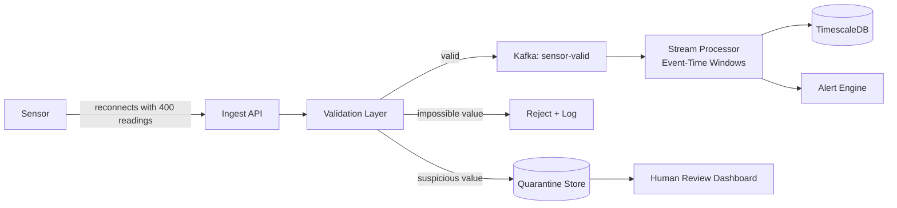

### Story Context

**Customer call — AgroSense quarterly review with AgriPartner Kenya, Monday**

**David Waweru (AgriPartner Kenya, Head of Agronomy)**: We appreciate the improvements.
The real-time alerts have been a significant improvement. But we have a new problem
we'd like you to address.

In our dry season, solar-powered sensors operate at 70% battery during the day
but sometimes drop to 20-30% overnight. When battery is low, a sensor sends
data less frequently — maybe every 5 minutes instead of every 30 seconds. Some
sensors go completely offline for 2-8 hours during overnight low-battery periods.

When the sensor comes back online, it sends a burst of 200-400 queued readings
at once — all the readings it stored locally during the offline period. But your
system treats these as "new" readings arriving right now. Your dashboard shows
a huge spike, your alert engine fires false alarms, and your analytics pipeline
computes wrong rolling averages.

Also — we've been finding data corruption in about 0.3% of readings. A temperature
sensor reporting 847°C on a farm in Nairobi is clearly wrong. These outliers
are getting into your analytics and poisoning the derived metrics.

**Priya** [on the call]: Thank you for flagging this. Both of these are real
problems. Can we get a week to design the fix?

---

**Technical analysis — You and Ananya, Tuesday afternoon**

**Ananya**: Okay, let's break this down. Three edge sensor problems:

1. **Delayed burst delivery**: Sensor goes offline for 4 hours, comes back with
   400 queued readings. Those readings have their original `recorded_at` timestamps
   but we receive them all at once. Our ingest API currently uses `received_at`
   for processing order, not `recorded_at`. So the stream processor sees a burst
   arrival and thinks there's been a spike in sensor activity.

2. **Data quality / outliers**: 0.3% of readings are corrupted or physically
   impossible values. No validation at ingest. They flow straight into TimescaleDB
   and the stream processor. Poison data.

3. **Gap detection false positives**: Our gap detector from Ch. 25 alerts when
   a sensor is silent for 5 minutes. But a battery-low sensor that goes offline
   overnight isn't "failing" — it's expected behavior. We're generating false
   alarm alerts at 3am that wake up agronomists who have learned to ignore them.

**You**: Three different problems with a common theme. The edge is unreliable.
The system needs to understand the difference between:
- Expected absence (sensor went to sleep on schedule)
- Unexpected absence (sensor failure, connectivity issue)
- Delayed data (data is valid but arrived late)
- Invalid data (data arrived on time but is wrong)

---

**Slack DM — Marcus Webb → You, Wednesday**

**Marcus Webb**
"The edge is unreliable." You just described the core challenge of every IoT
system ever built. The cloud is relatively reliable. The sensor is not.

The important architectural insight: you cannot control the edge. You can only
control how you respond to what the edge sends you.

For the delayed burst problem: time is the key. `recorded_at` is when the reading
was taken. `received_at` is when you received it. These should both be stored.
Your analytics pipeline should work on `recorded_at`, not `received_at`.
This is called "event time processing" vs "processing time processing."
Your stream processor needs to understand the difference.

For data quality: validation should happen at the boundary — when data enters
your system, not after it's been stored. Quarantine bad data, don't drop it.
A "bad" reading today might be explainable with more context tomorrow.

For gap detection: sensors should have a "maintenance window" concept.
A sensor that goes offline at the same time every night is not broken.
A sensor that goes offline at an unexpected time might be.

---

### Problem Statement

AgroSense's edge sensors have three reliability patterns that the current system
doesn't handle correctly: delayed burst delivery (offline sensors sending queued
data on reconnect), data quality failures (corrupted/physically impossible values),
and scheduled offline windows (battery-saving mode misidentified as sensor failure).
You must design the sensor data quality and reliability architecture.

### Explicit Requirements

1. Process delayed readings by their original `recorded_at` timestamp, not arrival time
   (event-time stream processing)
2. Validate sensor readings at ingest: reject impossible values (define validation
   rules per sensor type); quarantine suspicious values (possible but unusual) for
   human review
3. Gap detection must distinguish expected offline windows (low battery / maintenance)
   from unexpected failures
4. Burst replay handling: when a sensor sends 400 queued readings at once, the stream
   processor must not generate false alerts or corrupted rolling averages
5. Data lineage: every derived metric must be traceable to its source readings;
   quarantined data must not silently affect derived metrics
6. Sensor metadata must include: last seen timestamp, battery level (when available),
   expected reporting interval, maintenance windows

### Hidden Requirements

- **Hint**: Marcus Webb described "event time vs processing time." Kafka Streams
  and Flink both support event-time processing with "watermarks" — a mechanism that
  says "we've received all events up to time T, it's safe to compute windows up to T."
  For a sensor that goes offline for 4 hours, the watermark cannot advance until
  those events arrive. How do you handle a long offline sensor without stalling
  your stream for everyone else?
- **Hint**: "Quarantine suspicious values" — if a temperature sensor has been
  reporting 22-25°C for 6 months and suddenly reports 847°C, the 847°C value is
  clearly wrong. But if a new sensor starts reporting 0.3°C on day 1 (appropriate
  for a cold storage facility), that's valid. Your validation rules need to be
  per-sensor-type AND aware of historical context for anomaly detection.
- **Hint**: Burst replay of 400 readings arriving at once can cause false rolling
  average computation. If the stream processor is computing "average soil moisture
  over the last 5 minutes," and 400 readings spanning 4 hours arrive simultaneously,
  what does the 5-minute window look like? How does event-time windowing fix this?

### Constraints

- **Sensor types**: soil_moisture (0-100%), temperature (-40°C to 60°C), humidity
  (0-100%), battery_level (0-100%), gps (valid coordinates)
- **Corruption rate**: ~0.3% of readings have impossible values
- **Burst size**: Up to 500 queued readings per sensor reconnect
- **Battery offline windows**: Known for ~30% of sensors (they report their
  sleep schedule); unknown for 70%
- **Stream processor**: Must handle events up to 6 hours out of order (sensors
  may have been offline up to 6 hours)
- **Data quarantine retention**: 30 days (for human review)

### Your Task

Design the sensor data quality, event-time processing, and reliability architecture
for AgroSense.

### Deliverables

- [ ] **Data quality pipeline diagram** (Mermaid) — ingestion → validation layer →
  valid data path vs quarantine path → event-time stream processor
- [ ] **Validation rules specification** — per sensor type, define: valid range,
  physically impossible threshold, suspicious range (quarantine), and the response
  for each category
- [ ] **Event-time processing design** — how do you configure watermarks in your
  stream processor to handle 6-hour-late events without stalling the pipeline?
  What is the tradeoff between watermark latency and event completeness?
- [ ] **Sensor state model** — what metadata does each sensor's state record include?
  How do you represent "expected offline window" and how does the gap detector use it?
- [ ] **Burst replay handling** — given 400 readings arriving at once spanning 4 hours:
  show how event-time windowing correctly distributes these into the right time buckets
  vs what processing-time windowing would incorrectly do
- [ ] **Tradeoff analysis** — minimum 3 tradeoffs:
  1. Event-time processing (correct, complex) vs processing-time processing (simple, wrong for this use case)
  2. Hard reject vs quarantine for suspicious sensor values
  3. Per-sensor maintenance windows (accurate) vs blanket "sensor may be offline overnight" policy

### Diagram Format

