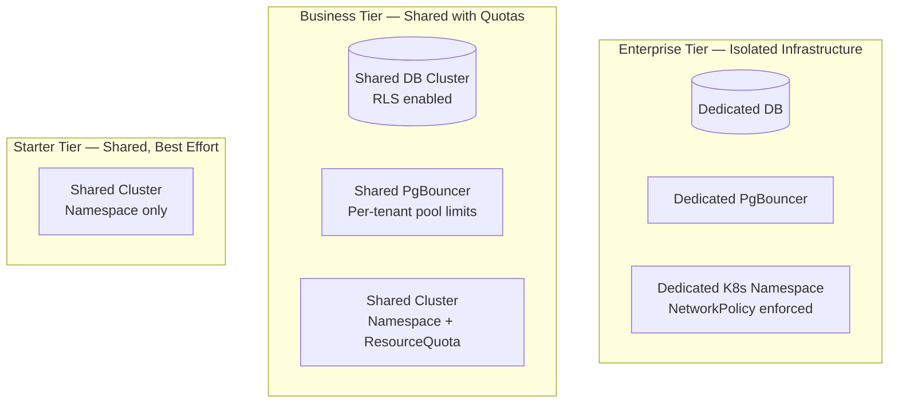

### Story Context

**Architecture review with Seo-yeon, Week 1, Monday 2:00 PM**

**Seo-yeon Park**: I want to show you the three incidents we had this year before
you design anything. Context is everything.

**Incident 1 — March**: Tenant `enterprise-bank-us` ran a database migration that
issued 14,000 concurrent queries on their CloudStack-managed PostgreSQL instance.
Those queries exhausted the shared connection proxy (PgBouncer), which we run
as a single instance for all tenants on that database cluster. 340 other tenants
experienced connection timeouts for 47 minutes.

**Incident 2 — July**: Tenant `ai-startup-sgp` deployed a container that consumed
all available CPU on the shared host it was placed on. Two other tenants on the
same host had latency spikes for 3 hours before our scheduler moved their workloads.

**Incident 3 — November**: A security researcher discovered that our multi-tenant
API responses included a header `X-Shard-Node: db-node-17`. By enumerating
different API endpoints, she was able to map which tenants shared the same database
shard. While this isn't a data breach, it violated our "tenants cannot tell they
share infrastructure" principle and would fail many enterprise security audits.

**You**: Three different isolation failures. Connection pool, compute, and information
leakage.

**Seo-yeon**: Right. Multi-tenancy is not one problem. It's a stack of problems
at every layer. I want a comprehensive isolation design.

---

**Current architecture overview (Seo-yeon's Confluence page, shared)**

```
Current Multi-Tenancy Model:

1. Database: Shared PostgreSQL cluster (4 nodes, 16 shards).
   All tenants' data in the same cluster, separated only by tenant_id column.
   Single PgBouncer instance per shard. Max 100 connections per shard.

2. Compute: Shared Kubernetes cluster. Tenants' containers scheduled on shared nodes.
   No resource quotas enforced on pods.

3. API Gateway: Single shared API gateway. All tenants send requests through it.
   No per-tenant rate limiting.

4. Networking: Tenants share a VPC. No inter-tenant network isolation.
   A container on tenant A's pod can theoretically reach tenant B's pod (different namespace).

5. Storage: Shared S3 buckets per region. All tenant data in same bucket,
   separated by tenant_id prefix. No per-tenant IAM policy enforcement.

Tenant types:
  - Starter (2,100 tenants): Small teams, <$500/month spend
  - Business (900 tenants): Midsize, $500-5k/month
  - Enterprise (200 tenants): Large, $5k-200k/month. SOC2, HIPAA, PCI requirements.
```

---

**Slack DM — Marcus Webb → You, Week 1 Thursday**

**Marcus Webb**
Multi-tenancy isolation design. This is one of the most underrated problems in
enterprise SaaS. Let me give you the framework:

Isolation exists at four layers:
1. **Data isolation**: Can tenant A read tenant B's data?
2. **Performance isolation**: Can tenant A degrade tenant B's performance?
3. **Failure isolation**: Can tenant A's crash take down tenant B?
4. **Information isolation**: Can tenant A infer tenant B's existence or behavior?

Most companies think they have isolation when they only have data isolation.
That's necessary but nowhere near sufficient.

The enterprise clients are the interesting constraint. They'll ask you: "Where
is our data?" You need to be able to answer that question precisely. "In the
same cluster as everyone else" is not an answer they'll accept.

---

### Problem Statement

CloudStack's current multi-tenant architecture provides only basic data-level
isolation (tenant_id columns) with no performance, failure, or information isolation.
Three production incidents have demonstrated failures at compute, connection pool,
and information leakage layers. With 200 Enterprise tenants requiring SOC2/HIPAA/PCI
compliance, you must design a comprehensive tenant isolation architecture that works
across all four isolation layers without requiring completely separate infrastructure
per tenant.

### Explicit Requirements

1. **Data isolation**: No SQL query can access another tenant's data, enforced at
   the database layer (not just application layer)
2. **Performance isolation**: One tenant's workload cannot degrade another tenant's
   SLA — enforced via resource quotas on compute and connection pool limits per tenant
3. **Failure isolation**: A misbehaving tenant cannot exhaust shared resources
   (connection pool, CPU, memory) affecting other tenants
4. **Information isolation**: API responses must not leak tenant placement information
   (shard node, host identity, etc.)
5. Enterprise tenants (200) must be able to answer: "Where is my data physically stored?"
6. Isolation model must be configurable by tenant tier: Starter gets lower guarantees
   than Enterprise

### Hidden Requirements

- **Hint**: Seo-yeon said Enterprise tenants have SOC2/HIPAA/PCI requirements.
  SOC2 Type II requires that you can demonstrate data isolation at audit time —
  not just claim it. How do you produce audit evidence that tenant A's data
  never appeared in a query made by tenant B's application?
- **Hint**: The November incident — the security researcher found `X-Shard-Node`
  in response headers. Are there other places where infrastructure details leak?
  (Error messages? Stack traces? Log entries that reach the tenant?)
- **Hint**: "Tenants share a VPC, no inter-tenant network isolation." A container
  in tenant A's namespace can send network traffic to tenant B's namespace. What
  Kubernetes primitive enforces network isolation between namespaces?

### Constraints

- **Tenants**: 3,200 total (2,100 Starter, 900 Business, 200 Enterprise)
- **Database cluster**: 4 nodes, 16 shards, PgBouncer per shard (max 100 connections)
- **Kubernetes**: Shared cluster, namespaced per tenant (current state)
- **Enterprise SLA**: 99.99% uptime. Their contracts have penalty clauses.
- **No per-tenant infrastructure**: Physical isolation per tenant is not budget-justified
  for Starter/Business tiers (but may be for Enterprise)
- **Migration**: Must not require downtime for existing 3,200 tenants

### Your Task

Design the comprehensive multi-tenancy isolation architecture for CloudStack across
all four isolation layers. Define the isolation model per tenant tier.

### Deliverables

- [ ] **Isolation model matrix** — table: for each tenant tier (Starter, Business,
  Enterprise) × isolation layer (data, performance, failure, information),
  what is the isolation guarantee and how is it enforced?
- [ ] **Database isolation design** — how do you enforce data isolation at the DB
  layer? Options: Row-Level Security (RLS) in Postgres, separate schemas per tenant,
  separate databases per Enterprise tenant
- [ ] **Connection pool isolation** — per-tenant connection pool limits to prevent
  connection exhaustion. Where is this enforced? Show the PgBouncer config change.
- [ ] **Compute resource quotas** — Kubernetes ResourceQuota and LimitRange per
  tenant namespace. Show example YAML.
- [ ] **Network isolation** — Kubernetes NetworkPolicy to prevent inter-tenant
  pod communication. Show example policy.
- [ ] **Information leakage audit** — list all the places your system currently
  leaks internal information, and how each is fixed
- [ ] **Tradeoff analysis** — minimum 3 tradeoffs:
  1. Row-Level Security (shared database) vs separate database per Enterprise tenant
  2. Kubernetes namespace isolation vs separate clusters per tenant tier
  3. Shared PgBouncer (current) vs per-tenant PgBouncer instance

### Diagram Format


