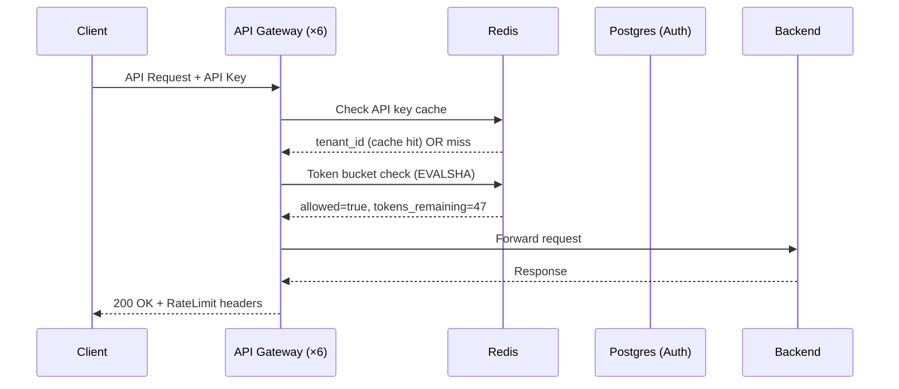

### Story Context

**Post-incident review — Monday 9:00 AM**

**Seo-yeon Park**: The fourth noisy-neighbor incident was last weekend. We didn't
page it because it was below our alerting threshold — but I saw it in the metrics.
Tenant `ml-compute-heavy` sent 47,000 API requests in a single minute. Our API
gateway has no rate limiting. All 47,000 requests hit our backend services.
Backend autoscaled to absorb it. Cost us $2,400 in unexpected EC2 spend.

The tenant's API key is valid. They weren't doing anything wrong — they just
had a runaway job that polled our API in a tight loop. No rate limiting on our
end meant we paid for their mistake.

**You**: How is rate limiting not already in place?

**Seo-yeon**: It was always "on the roadmap." The previous platform team had a
sprint for it three times. Each time it got deprioritized for customer-facing features.
The cost of not having it just became visible enough that we can't deprioritize it anymore.

**You**: What's the requirement?

**Seo-yeon**: Configurable per tenant, per tier, per endpoint. Starters get 100
requests/minute. Business get 1,000/minute. Enterprise get custom limits.
Some endpoints (like our deployment API) should have separate, lower limits —
you don't want someone deploying 500 containers in a loop.

**You**: Where does rate limiting live? API gateway? Application layer?

**Seo-yeon**: That's what I want you to design. I don't have an opinion yet.

---

**API gateway audit (you run Tuesday)**

```
Current API Gateway: NGINX reverse proxy.
Rate limiting: None.
Authentication: API key validation against Postgres (every request).
  Average latency added by auth: 8ms P50, 45ms P99.
Request volume: 2.3M requests/day average, 180,000/hour peak.
API key count: 12,400 (some tenants have multiple keys)

Endpoints with different risk profiles:
  GET /v1/instances — list compute instances (read, fast, high frequency)
  POST /v1/instances — provision new instance (write, slow, has cost implications)
  POST /v1/deployments — deploy container image (write, very slow, highest cost)
  GET /v1/metrics — fetch usage metrics (read, medium frequency)
  POST /v1/databases — provision database (write, slow, has cost implications)
  DELETE /v1/* — delete resources (write, irreversible)
```

---

**Slack thread — #platform-eng, Wednesday**

**Adetoun Obaseki (Senior Engineer)** [2:15 PM]
I've been thinking about the rate limiting algorithm. We have three common choices:
fixed window, sliding window, and token bucket. Each has different burst characteristics.
Fixed window is simplest but has the "double burst" problem at window boundaries.
Sliding window is accurate but expensive. Token bucket is a good middle ground.

**You** [2:22 PM]
For a multi-tenant SaaS, I'd lean toward token bucket. It allows short bursts
(good for legitimate use cases) while preventing sustained overload. The algorithm
is: each tenant has a "bucket" with N tokens that refills at R tokens/second.
Each request consumes 1 token. If bucket is empty, request is rate-limited.

**Adetoun** [2:28 PM]
How do we make this distributed? We have 6 API gateway instances. If each instance
has its own local token bucket, tenant A can make N requests to each instance
simultaneously and bypass the limit.

**You** [2:31 PM]
Centralized counter in Redis. All 6 gateway instances check and decrement the
same counter. But Redis adds ~1-2ms per request for the check. That's the tradeoff.

---

**Slack DM — Marcus Webb → You, Wednesday evening**

**Marcus Webb**
Token bucket in Redis. Classic. Two problems nobody considers until production:

1. What happens when Redis is down? Your rate limiting relies on Redis. If Redis
   fails, you have two choices: fail open (allow all requests, no rate limiting)
   or fail closed (reject all requests, full outage). Most systems choose fail open.
   But then you need a circuit breaker so a Redis outage doesn't cause a runaway
   tenant to take down your backends.

2. The Redis round trip for every request. At 180,000 requests/hour (50/second),
   that's 50 Redis operations/second just for rate limiting. That's fine. But
   your auth check is also hitting Postgres — 8ms P50, 45ms P99. Two external
   service calls per request (Redis + Postgres) for auth + rate limiting.
   Can you combine them?

---

### Problem Statement

CloudStack's API gateway has no rate limiting, resulting in "runaway" tenant
requests causing unexpected costs and potential performance degradation. You must
design a distributed rate limiting system integrated with the API gateway that
supports per-tenant, per-tier, and per-endpoint rate limits with configurable
thresholds — without adding more than 5ms to API gateway latency.

### Explicit Requirements

1. Per-tenant rate limits configurable by tier (Starter: 100 RPM, Business: 1,000 RPM,
   Enterprise: custom)
2. Per-endpoint rate limits: provisioning endpoints (POST /instances, POST /databases,
   POST /deployments) have separate, lower limits than read endpoints
3. Rate limit state distributed across all API gateway instances (no per-instance local state)
4. Rate-limited requests return HTTP 429 with `Retry-After` header (seconds until bucket refills)
5. Rate limiting must not add more than 5ms to P99 API gateway latency
6. System must degrade gracefully when Redis is unavailable (fail-open, with circuit breaker)
7. Rate limit metrics: expose per-tenant rate limit hits for billing/monitoring

### Hidden Requirements

- **Hint**: Marcus Webb raised the Redis + Postgres double round-trip issue.
  Every request currently hits Postgres for API key validation AND (with your design)
  Redis for rate limiting. Can you cache the API key → tenant mapping in Redis or
  local memory to eliminate the Postgres round trip? What is the invalidation
  strategy when an API key is revoked?
- **Hint**: The `Retry-After` header requires knowing exactly when the bucket will
  have a token again. With token bucket algorithm, tokens refill continuously.
  How do you calculate the exact Retry-After value from the current bucket state
  stored in Redis?
- **Hint**: Seo-yeon wants "per-endpoint" rate limits. GET /instances and POST /instances
  have different risk profiles. Does each endpoint have its own bucket, or is there
  a global bucket per tenant with per-endpoint multipliers? If each endpoint has its
  own bucket, a tenant has 12 endpoints × their bucket size = much higher effective
  limit than intended. How do you design this?

### Constraints

- **API gateway instances**: 6 (horizontal)
- **Redis latency**: 1-2ms round trip (within same AZ)
- **Rate limit check budget**: < 5ms added to P99 latency
- **Tenant count**: 3,200 tenants, up to 12,400 API keys
- **Request volume**: 50 RPS average, 180 RPS peak
- **Tenant tier limits**: Starter: 100 RPM, Business: 1,000 RPM, Enterprise: custom (up to 100,000 RPM)
- **Endpoint-specific limits**: Provisioning endpoints: Starter 5/hour, Business 50/hour, Enterprise custom

### Your Task

Design the distributed rate limiting system for CloudStack's API gateway. Include
the algorithm choice, Redis data structure, degradation strategy, and API key caching.

### Deliverables

- [ ] **Architecture diagram** (Mermaid) — request flow through API gateway → Redis
  rate limit check → auth cache check → backend service
- [ ] **Token bucket Redis implementation** — show the Redis commands/Lua script
  for an atomic token bucket check-and-decrement. Lua scripts ensure atomicity.
- [ ] **Rate limit configuration data model** — how are per-tenant, per-tier,
  per-endpoint rate limits stored and looked up? Show the schema.
- [ ] **Retry-After calculation** — how do you compute the exact retry-after
  value from the current bucket state?
- [ ] **Fail-open circuit breaker design** — what is the behavior when Redis is
  unavailable? Show the circuit breaker logic and local fallback.
- [ ] **API key caching design** — how do you eliminate the Postgres round-trip
  for auth? TTL? Invalidation on key revocation?
- [ ] **Tradeoff analysis** — minimum 3 tradeoffs:
  1. Fixed window vs token bucket for rate limiting algorithm
  2. Centralized Redis counter vs distributed local counter with gossip synchronization
  3. Fail-open vs fail-closed when Redis is unavailable

### Diagram Format


