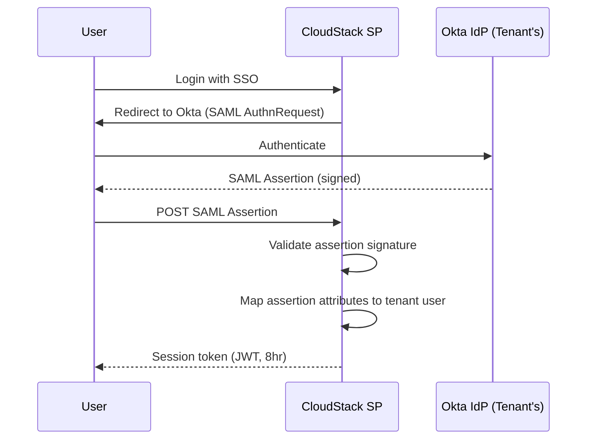

### Story Context

**Email — Enterprise customer, Monday 8:00 AM**

```
From: Michael Tran <m.tran@nexus-financial.com>
To: CloudStack Enterprise Support
Subject: Auth requirement — blocking contract renewal

CloudStack team,

We're due for our annual contract renewal next month. Our security team has
flagged several concerns with your current auth model that must be addressed
before we can renew.

1. SSO Integration: We use Okta for all enterprise SSO. Your platform
   doesn't support SAML 2.0 or OIDC federation with Okta. We cannot
   provision/deprovision user access to CloudStack automatically.
   If an employee leaves Nexus Financial, their CloudStack access is not
   automatically revoked. This is a SOC2 Type II violation.

2. Service Account Security: Our CI/CD pipeline uses a single shared API
   key for all deployments. If that key is compromised, an attacker has
   full write access to our entire CloudStack environment. We need
   short-lived credentials for machine-to-machine auth.

3. Audit Trail: We cannot currently tell who (which human or service account)
   performed which action in CloudStack. The audit log shows API key hashes,
   not user identities. This fails our compliance audit.

Please let us know your timeline for addressing these.

Michael Tran
Head of Infrastructure, Nexus Financial
```

---

**Emergency product review — Seo-yeon, Monday 10:30 AM**

**Seo-yeon**: Nexus Financial is $800k ARR. The contract renewal is in 5 weeks.
How many of their three requirements do we currently support?

**Yuki Tanaka (Product Manager)**: None, fully. We have basic OIDC support but not
SAML. We have API keys but not short-lived credentials. Audit logs exist but only
at the API key level, not the user level.

**Seo-yeon**: What does fixing all three look like?

**You**: First requirement — SSO with Okta — is doable. We need to add SAML 2.0
support alongside our existing OIDC. The more important piece is SCIM provisioning:
Okta pushes user creates/deletes to CloudStack. That's how you get automatic
deprovisioning.

**Seo-yeon**: SCIM?

**You**: System for Cross-domain Identity Management. It's a REST API standard.
Okta calls your SCIM endpoint when a user is added or removed from the CloudStack
app in Okta. You update your user database accordingly.

**Seo-yeon**: What's the timeline?

**You**: SAML + SCIM: 3 weeks with focused work. Short-lived credentials: 1 week.
Audit trail attribution to user identity: depends on SCIM being done first.

**Seo-yeon**: You have 4 weeks. Keep Nexus.

---

**Architecture analysis — you spend Tuesday reviewing Ch. 6 patterns**

Your work at MeridianHealth (Ch. 6) gave you a solid foundation for auth design.
But CloudStack is more complex:
- **At MeridianHealth**: Auth served one company's employees. N users, known identities.
- **At CloudStack**: Auth serves 3,200 tenants, each with their own users, their own
  IdPs, their own SSO configurations. The auth system must be multi-tenant itself.

The new dimension: each Enterprise tenant's users should authenticate through
that tenant's SSO (Okta, Azure AD, Google Workspace) — not through a single
CloudStack identity provider. CloudStack acts as an identity *broker*, not an
identity *provider*.

---

**Slack DM — Marcus Webb → You, Tuesday afternoon**

**Marcus Webb**
Auth at MeridianHealth was simpler than this. You had one company, one identity
system, one set of compliance requirements.

CloudStack is federated identity at scale. Each enterprise tenant has their own
IdP. Your auth system doesn't know who Nexus Financial's users are — Okta does.
Your job is to trust Okta's assertion ("this is Michael Tran, he has the 'admin'
role in your system") and issue your own session token.

The complexity is: each tenant has different IdP configurations. Tenant A uses
Okta. Tenant B uses Azure AD. Tenant C uses Google Workspace. Tenant D uses
nothing (username/password). Your auth system needs to support all of these
simultaneously, with per-tenant configuration.

This is the same problem EVERY multi-tenant enterprise SaaS solves eventually.
The solution pattern has a name: "Bring Your Own Identity" (BYOI). What does
your data model look like for storing per-tenant IdP configurations?

---

### Problem Statement

CloudStack must upgrade its auth system to support enterprise requirements:
SAML 2.0/OIDC federation with tenant-specific IdPs (Okta, Azure AD), SCIM
provisioning for automatic user lifecycle management, short-lived machine
credentials for CI/CD service accounts, and user-level audit attribution.
The system serves 3,200 tenants with heterogeneous identity requirements.

### Explicit Requirements

1. SAML 2.0 + OIDC federation: each Enterprise tenant can configure their own IdP;
   auth is delegated to tenant's IdP; CloudStack issues its own session after
   successful federation
2. SCIM 2.0 provisioning: support Okta/Azure AD SCIM pushes for user
   create/update/deactivate; deactivation revokes CloudStack access within 60 seconds
3. Short-lived service account credentials: CI/CD pipelines get time-limited tokens
   (1-hour expiry, renewable) instead of long-lived API keys
4. Audit trail: every action in CloudStack is attributed to a specific human user
   or service account (not just an API key hash)
5. Multi-tenant IdP configuration: each tenant can configure their own IdP
   independently without affecting other tenants

### Hidden Requirements

- **Hint**: Marcus Webb described BYOI — per-tenant IdP configurations. Where does
  the per-tenant IdP config live? (SAML metadata URL, OIDC issuer URL, entity ID,
  signing certificates). If a tenant rotates their signing certificate, how does
  your system pick up the new certificate automatically?
- **Hint**: SCIM deactivation must revoke access within 60 seconds. CloudStack
  currently uses 24-hour JWT sessions. A user deactivated via SCIM at 9:01 AM
  might still have a valid JWT until 9:01 AM tomorrow. How do you reconcile the
  deprovisioning SLA with the JWT lifecycle?
- **Hint**: Short-lived credentials (1-hour expiry). CI/CD pipelines typically run
  for 20-45 minutes. If the token expires mid-deployment, the deployment fails.
  How do you enable credential renewal mid-deployment without requiring human interaction?

### Constraints

- **Enterprise tenants**: 200, with ~50 using SAML/OIDC (growing to ~150)
- **SCIM deactivation SLA**: 60 seconds from SCIM event to access revoked
- **Current session expiry**: 24-hour JWT (must maintain for non-SAML users)
- **Short-lived token expiry**: 1 hour, renewable up to 8 hours
- **Audit retention**: Actions must be attributable and retained for 1 year
- **Timeline**: 4 weeks to unblock Nexus Financial renewal

### Your Task

Design the federated auth, SCIM provisioning, and short-lived credential system
for CloudStack's multi-tenant auth layer.

### Deliverables

- [ ] **SAML federation flow diagram** (Mermaid sequence) — CloudStack user login via
  Okta SAML: SP-initiated flow, assertion validation, CloudStack session issuance
- [ ] **Per-tenant IdP configuration data model** — schema for storing tenant IdP
  configurations (SAML metadata, OIDC config, certificate fingerprints)
- [ ] **SCIM provisioning design** — how does a Okta SCIM push flow through your
  system? What happens on deactivate? How is the 60-second revocation SLA enforced?
- [ ] **Short-lived credential flow** — how does a CI/CD pipeline obtain a token,
  use it, and renew it without human interaction?
- [ ] **Audit attribution design** — how does your system know that API key
  `abc123` was issued to user `m.tran@nexus-financial.com` for a specific session?
  What is the audit log schema?
- [ ] **Tradeoff analysis** — minimum 3 tradeoffs:
  1. Self-hosted identity broker (Keycloak) vs managed identity (Auth0 Enterprise) for BYOI
  2. SAML 2.0 vs OIDC for enterprise SSO federation
  3. Short-lived tokens via OAuth2 client credentials vs SPIFFE/SVID for service-to-service auth

### Diagram Format


