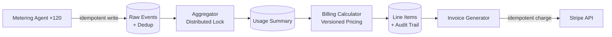

> **SPIKE CHALLENGE — INHERITED DISASTER**
> The billing system was "working fine" until you look at it carefully.

---

### Story Context

**Slack DM — Seo-yeon → You, Week 3, Monday 8:15 AM**

**Seo-yeon**
I need you to look at the billing system. We had a customer complaint on Friday.
Enterprise tenant `fintech-apac-prod` says we overbilled them by $14,000 last month.
They want a full audit of every metered charge.

The billing engineer who built the system left 6 months ago. Nobody has touched
it since. Nobody fully understands it. Yuki (PM) tried to trace the overcharge
and gave up after 2 hours.

Can you spend today understanding how it works?

---

**Your investigation (Monday 9:00 AM — 6:00 PM)**

You start with the code. Four hours later, you have the architecture:

```
Billing system (built ~18 months ago):

1. Metering Agent: Runs on each Kubernetes node. Reads pod CPU/memory usage
   from cAdvisor every 60 seconds. Writes usage records to a shared MySQL table.

2. Usage Aggregator: Cron job running hourly. Reads raw usage records for all
   tenants, computes hourly usage totals, writes to usage_summary table.

3. Billing Calculator: Cron job running daily at midnight. Reads usage_summary,
   applies pricing tiers, writes to billing_line_items table.

4. Invoice Generator: Runs on the 1st of each month. Reads billing_line_items,
   generates invoices, charges Stripe.

Problems found:

Problem 1: The metering agent has no idempotency. If a Kubernetes node restarts,
the metering agent restarts and re-reads the LAST 5 minutes of cAdvisor data —
even data it already sent. No deduplication. These duplicates flow into usage_summary.

Problem 2: The usage_aggregator cron job has no distributed lock. When we scaled
to 3 billing servers (for reliability), all 3 run the aggregator simultaneously.
Three writes of the same hourly total. Three times the actual usage gets billed.

Problem 3: Pricing tiers are hardcoded in the billing calculator. When we changed
pricing for Enterprise customers 3 months ago, the calculator was only updated
for NEW charges. Historical re-computation would have applied the old prices.
Some enterprise customers may have been overbilled retroactively.

Problem 4: There is no audit trail for billing charges. No record of which metering
events contributed to which invoice line item.
```

**You send a Slack message to Seo-yeon at 6:15 PM:**

**You**: Found 4 structural problems with the billing system. The $14k overcharge
is almost certainly Problem 2 (triple aggregation due to 3 servers running simultaneously).
I need to audit how long Problem 2 has been happening.

**Seo-yeon**: How long will the audit take?

**You**: Depends on whether the raw metering data is still there. If so, I can
reconstruct the correct billing. If not, we may not be able to determine the
exact overcharge.

---

**Slack DM — Marcus Webb → You, Tuesday morning**

**Marcus Webb**
Billing systems. The second most consequential thing you'll build (payments being first).
Here's the rule: every dollar charged to a customer must be traceable to a specific
usage event. If you can't trace a charge to a source event, the charge is unjustifiable
and you have to refund it.

Your audit trail problem is not a nice-to-have. It's the foundation. Without it,
you can't debug overcharges, you can't respond to disputes, and you can't pass
a financial audit.

The metering idempotency problem is the other critical one. Billing idempotency is
the hardest version of the problem because the data source (cAdvisor) doesn't have
natural idempotency keys. How do you assign an idempotency key to a CPU reading
that was taken at 14:23:07 from pod `xyz`?

---

### Problem Statement

CloudStack's billing system has four structural defects: metering agent duplicate
writes, concurrent aggregator runs causing triple-counted usage, hardcoded pricing
causing retroactive billing errors, and no audit trail. A $14,000 overcharge has
already occurred. You must redesign the billing and metering architecture to be
correct, auditable, and idempotent.

### Explicit Requirements

1. Metering agent writes must be idempotent: duplicate readings from an agent
   restart must not result in duplicate billing
2. Usage aggregation must have exactly-one semantics: running the aggregator
   on 3 servers must produce the same result as running on 1 server
3. Pricing configuration must be versioned: billing always applies the price that
   was in effect at the time of usage (not current price)
4. Full audit trail: every invoice line item must be traceable to specific
   metering events with timestamps and resource IDs
5. Retroactive audit capability: given a dispute, you must be able to reconstruct
   the correct bill from raw metering data
6. Alert when metering agent is not reporting (sensor gap detection pattern — same
   problem, different domain)

### Hidden Requirements

- **Hint**: Marcus Webb asked about idempotency keys for CPU readings. A CPU reading
  at a specific timestamp from a specific pod on a specific node is naturally unique —
  the composite key `(node_id, pod_id, metric_type, timestamp_bucket)` is the
  idempotency key. A `timestamp_bucket` of 60 seconds means readings within the
  same 60-second window for the same pod/metric are deduplicated. What does the
  deduplication mechanism look like? (Unique constraint? UPSERT? Separate seen-IDs set?)
- **Hint**: "Exactly-one aggregation across 3 servers" requires a distributed lock.
  The simplest approach: a distributed lock in Redis before running the aggregation.
  Only one server holds the lock and runs. But what happens if the server holding
  the lock crashes mid-aggregation? How do you ensure the aggregation is completed
  and not partially applied?
- **Hint**: Pricing versioning — "apply the price that was in effect at the time of
  usage." This means you need a pricing history table (not just a current pricing table).
  Every price change must create a new version. Usage from 3 months ago is billed
  at the price that was active 3 months ago. How do you query "what was the price for
  resource type X on date Y?"

### Constraints

- **Metering agent count**: 1 per Kubernetes node; ~120 nodes
- **Metering frequency**: Every 60 seconds per node
- **Raw usage event volume**: ~7,200 events/minute (120 nodes × 60 events/min)
- **Tenants**: 3,200 (all billed)
- **Billing cycle**: Monthly; disputes must be resolvable with 90-day history
- **Stripe integration**: CloudStack uses Stripe for charging; Stripe has its own
  idempotency key mechanism — use it
- **Current overcharge**: `fintech-apac-prod` claims $14k overcharge; must be audited
  and resolved within this sprint

### Your Task

Redesign CloudStack's billing and metering system to be correct, idempotent, and
auditable.

### Deliverables

- [ ] **Architecture diagram** (Mermaid) — metering agent → raw events store →
  deduplication → aggregation (with distributed lock) → pricing engine (versioned) →
  invoice generation → Stripe
- [ ] **Metering idempotency design** — composite idempotency key, deduplication
  mechanism (UPSERT or seen-set), what happens on agent restart
- [ ] **Distributed lock design for aggregation** — how do you ensure exactly-one
  aggregation across 3 servers? Show the Redis lock acquisition and crash recovery.
- [ ] **Pricing versioning schema** — `pricing_tiers` table with version history;
  query for "price of resource type X at time T"
- [ ] **Audit trail schema** — how does an invoice line item link back to raw metering
  events? Show the referential chain from invoice → line_item → aggregated_usage → raw_events
- [ ] **Retroactive audit query** — SQL to reconstruct the correct bill for
  `fintech-apac-prod` from raw metering data for the overcharged month
- [ ] **Tradeoff analysis** — minimum 3 tradeoffs:
  1. Push-based metering (agent writes to central DB) vs pull-based (billing service
     queries metrics API) for usage collection
  2. Real-time billing vs batch billing (trade-off: latency vs correctness)
  3. Distributed lock (Redis) vs single aggregation server for exactly-one semantics

### Diagram Format


