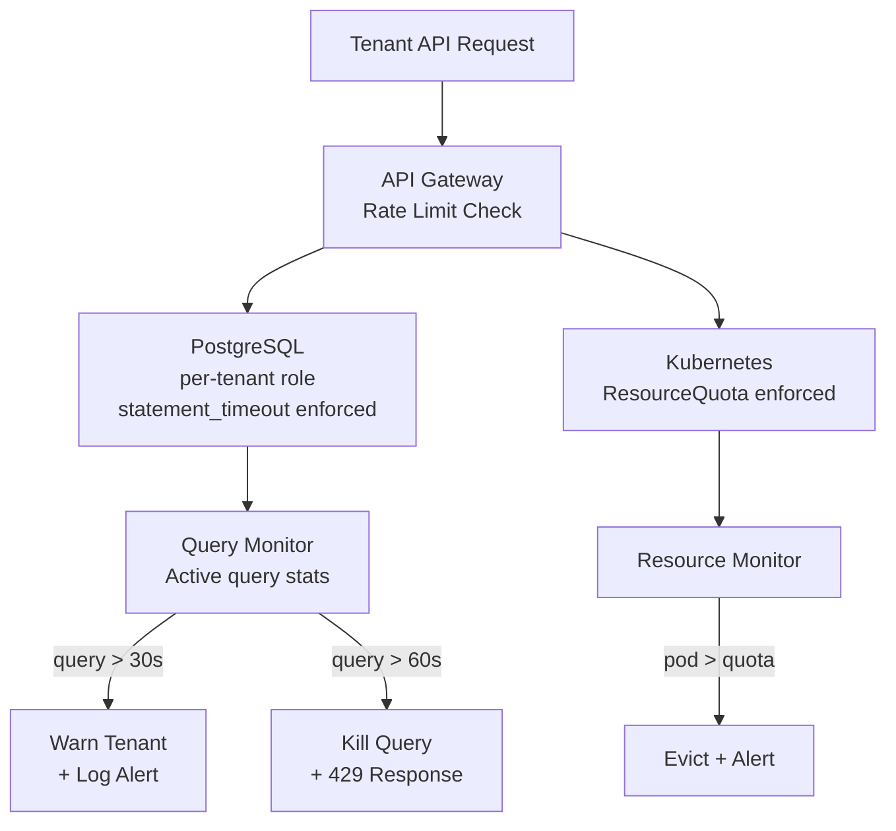

### Story Context

**#incidents — Slack, Thursday 2:45 PM**

**PagerDuty Bot** [2:45 PM]
🔴 ALERT: Database cluster node-db-07 CPU > 95% — sustained 8 minutes
Tenants affected: 847 (all tenants on this database shard)

**On-call (You)** [2:46 PM]
Ack. Looking.

**You** [2:53 PM]
Root cause: tenant `data-analytics-co` is running a complex JOIN across 3 tables —
no query timeout configured, no index, doing a sequential scan on 800M rows.
Query has been running for 9 minutes and is consuming 94% CPU on the shared DB node.
847 other tenants are experiencing degraded query performance.

**Seo-yeon** [2:55 PM]
This is Noisy Neighbor Incident #4. We said after Incident #3 we'd fix this.
The immediate fix for today: kill the query. The permanent fix: needs to be on
your sprint this week.

**You** [2:57 PM]
Killing the query now.

**You** [3:01 PM]
Query killed. node-db-07 back to normal. Affected tenants recovering.
Incident duration: 19 minutes. 847 tenants impacted.

---

**Sprint planning — Friday morning, architecture deep dive**

**Seo-yeon**: We've had four incidents in a year. The pattern is always the same:
one tenant does something resource-intensive (or just stupid), and it bleeds into
other tenants' workloads. We have resource quotas on Kubernetes. We don't have
them on the database layer. Today's incident was a database CPU hog.

But let me be more specific. The incidents have been at three layers:
1. Compute (Incident 2): one tenant's container consumed all CPU on a shared node
2. Database (Incidents 1 and 4): one tenant's queries consumed all DB CPU or connections
3. Information leakage (Incident 3): not a performance issue, but a design violation

We've addressed partial fixes. Kubernetes ResourceQuotas (your design in Ch. 28).
Connection pool limits per tenant (your design in Ch. 28). Rate limiting (your design
in Ch. 29). But there are still gaps.

**You**: The database CPU problem isn't solved by connection pool limits. A tenant
can have their connection pool quota and still run a query that takes 100% of CPU
for 20 minutes.

**Seo-yeon**: Right. And the rate limiting is on API requests — not on database
query cost. A single complex query can bypass both those controls.

**You**: The missing control is database-level resource governance. Statement timeout,
per-tenant CPU/memory quotas at the query planner level. PostgreSQL has some of this.

**Seo-yeon**: Design it. All of it. I want a complete noisy-neighbor prevention
architecture across all layers. And I want an SLA: "one tenant's worst-case behavior
degrades other tenants by no more than X%."

---

**Slack DM — Marcus Webb → You, Friday afternoon**

**Marcus Webb**
The noisy neighbor problem is ultimately about resource fairness in a shared system.
Here's the key insight: you cannot prevent bad tenant behavior. A tenant will always
find a way to use more than their fair share if they're not constrained.
What you can do is make the blast radius of their bad behavior bounded and predictable.

"One tenant's worst-case behavior degrades others by no more than X%."
That's a contract. To fulfill it, you need to know X for every resource type:
CPU, memory, disk I/O, network, database connections, query time.

For each resource type, you need:
1. A measurement mechanism
2. A limit enforcement mechanism
3. A graceful degradation when the limit is hit (throttle, not crash)

The database CPU case is the hardest because PostgreSQL doesn't natively have
per-tenant CPU quotas. You have to approximate them via other controls.
What are those controls?

---

### Problem Statement

CloudStack has experienced four "noisy neighbor" incidents, with the root cause
being the absence of resource governance at the database layer (and inconsistent
enforcement at the compute layer). You must design a comprehensive noisy neighbor
prevention architecture that provides bounded blast radius guarantees across compute,
database, and storage layers — with an explicit SLA that limits the maximum performance
degradation any one tenant can cause on co-tenants.

### Explicit Requirements

1. Define the SLA: one tenant's worst-case behavior must not degrade co-tenants
   by more than 15% on any measured metric
2. Database resource governance: per-tenant query timeout, per-tenant connection limits
   (already partially done), and protection against CPU-intensive queries
3. Compute resource governance: Kubernetes ResourceQuotas already in place; add
   automated detection and eviction of pods exceeding quotas
4. Graduated response: tenant exceeds threshold → warn → throttle → terminate
   (not: exceed threshold → crash system)
5. Tenant dashboard: each tenant can see their resource usage vs their quota
6. Incident escalation: when a tenant's resource usage is causing degradation,
   automatically open an incident and alert both the on-call team and the tenant

### Hidden Requirements

- **Hint**: Marcus Webb described "approximate CPU quotas via other controls" since
  Postgres has no native per-tenant CPU limit. The available controls are:
  `statement_timeout` (kill queries running longer than N ms), `work_mem` limit
  per session (limits sort/hash memory per query), connection limits. Together,
  how do these approximate a CPU quota? What is the blast radius model if each
  tenant is limited to connections C, each running for at most T milliseconds?
- **Hint**: "Graduated response — warn, throttle, terminate." What triggers each
  level? If a query has been running for 60 seconds (warn threshold), how do you
  notify the tenant without interrupting their query? Can you notify them asynchronously
  while their query continues?
- **Hint**: The SLA says "no more than 15% degradation on co-tenants." How do you
  measure this? You need a baseline P99 for each resource type per tenant. If you
  see tenant A's P99 latency increase by 20%, was that caused by a noisy neighbor
  or by a change in tenant A's own query patterns? How do you attribute degradation
  to a specific tenant's behavior?

### Constraints

- **SLA**: ≤ 15% degradation in co-tenant P99 latency/throughput from any single tenant
- **Database**: PostgreSQL on shared cluster (no commercial extensions; only Postgres native)
- **Kubernetes**: Shared cluster, ResourceQuotas already in place
- **Monitoring**: Prometheus + Grafana available
- **Tenant visibility**: Each tenant should see their quotas and usage in the dashboard
- **Response SLA**: Automated throttling must engage within 30 seconds of threshold breach

### Your Task

Design the comprehensive noisy neighbor prevention architecture across compute
and database layers with the bounded blast radius SLA.

### Deliverables

- [ ] **Resource governance matrix** — for each resource type (CPU, memory, DB
  connections, DB query time, storage IOPS, network), list: current state, proposed
  limit mechanism, enforcement point, and graduated response trigger thresholds
- [ ] **Database governance design** — specific PostgreSQL configuration changes:
  `statement_timeout` per tenant role, `work_mem` limits, connection limits.
  Show how these are applied per tenant (Postgres `ALTER ROLE` per tenant).
- [ ] **Blast radius calculation** — given your limits, what is the maximum
  resource a single tenant can consume? Show the math that validates the 15% SLA.
- [ ] **Automated detection and response** — how does the system detect a noisy
  tenant in real-time, send a warning, and then throttle? Show the automation
  flow (monitoring → alert → automated response).
- [ ] **Tenant dashboard design** — what resource usage data does the tenant see?
  What's the UX for "you're approaching your quota"?
- [ ] **Tradeoff analysis** — minimum 3 tradeoffs:
  1. Per-tenant Postgres role with resource limits vs shared role with application-layer
     rate limiting for database resource governance
  2. Automated query termination vs automatic query queuing when resource limits hit
  3. Hard limits (request rejected when quota exceeded) vs soft limits (throttled,
     serves at lower priority)

### Diagram Format

