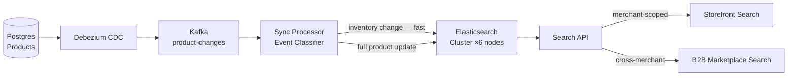

### Story Context

**Onboarding doc — "The Three Problems" (written by Nnamdi Okafor)**

```
Problem 1: Search Quality

Current state: We use PostgreSQL full-text search (tsvector/tsquery).
- 150 million product listings
- Full-text search returns results in ~800ms P50, ~4,200ms P99
- Relevance ranking: none. Results are in insertion order.
- Typo tolerance: none. "Nikke" returns 0 results instead of Nike products.
- Synonyms: none. "Sneakers" doesn't match listings that say "trainers."
- Faceted filtering: not supported. "Show me results under $50 with free shipping"
  requires multiple sequential queries.
- Merchant-scoped search: each storefront shows only their own products.
  But cross-merchant search (for our B2B marketplace) shows everything.
  These are currently handled by the same query with a conditional WHERE clause.
  As you can imagine, this is both slow and fragile.

Why it matters: Our top 3 merchants have emailed to say they're evaluating
moving to a custom storefront with Algolia or Elasticsearch. We're losing
$4M/year in churn risk to better search.

What I want: A search system that returns relevant results in <200ms P99,
supports typo tolerance, synonyms, faceted filtering, and merchant isolation.
```

---

**Technical investigation — Week 1, Wednesday**

You pull the slow query log for the search endpoint:

```sql
-- The current search query (simplified)
SELECT p.*, pi.url as image_url
FROM products p
LEFT JOIN product_images pi ON pi.product_id = p.id AND pi.is_primary = true
WHERE p.merchant_id = $1
  AND to_tsvector('english', p.title || ' ' || p.description) @@ plainto_tsquery($2)
  AND p.is_active = true
  AND p.inventory_count > 0
ORDER BY p.created_at DESC
LIMIT 20 OFFSET $3;

-- EXPLAIN ANALYZE output:
-- Gather  (cost=1000.00..5892341 rows=12847 width=1482)
--   Workers Planned: 2
--   Seq Scan on products  (cost=0.00..5750123 rows=12847 width=1482)
--     Filter: ... (tsvector computation inline — not using an index)
-- Execution Time: 4,247ms
```

The `tsvector` is being computed inline on every query rather than from a
pre-computed indexed column. 150 million rows, no materialized tsvector column.

You also notice: there is no tsvector GIN index on the products table.

---

**Conversation with Priya (Lead Engineer, Catalog team), Thursday**

**Priya Menon**: Before you go full Elasticsearch, consider the migration cost.
150 million documents. We're adding about 100,000 new products per day. Keeping
Postgres and Elasticsearch in sync is an operational burden. CDC, Debezium, sync
lag — you've seen this at AgroSense.

**You**: The Postgres full-text search can be improved significantly — a
materialized tsvector column with a GIN index would drop P99 to ~200ms. But
it still doesn't solve typo tolerance, synonyms, or relevance ranking.

**Priya**: Are those worth the operational complexity?

**You**: Let me look at the search query logs. If 40% of our searches use features
Postgres can't provide, yes. If 5% do, maybe not.

**You** [after 30 minutes of log analysis]
Typo tolerance: 23% of searches have at least one typo or variant spelling.
Synonym queries: 31% of searches have a term that has common synonyms in the catalog.
That's over 50% of searches that could be improved by a proper search engine.

**Priya**: Elasticsearch, then.

---

**Slack DM — Marcus Webb → You, Thursday evening**

**Marcus Webb**
Search is not just an index problem. You're right about the typo tolerance and
synonyms — those need a real search engine.

But here's what I want you to think about: relevance. Elasticsearch can find
all the documents that match a query. That's not the hard part. The hard part is:
out of 5,000 documents that match "running shoes," which 20 do you show first?

Relevance signals for e-commerce:
- Text match quality (obvious)
- Merchant boost (their products, their rules)
- Recency (new products might be preferred)
- Inventory status (in-stock before out-of-stock)
- Conversion rate (if this product has a 15% conversion rate, it's probably good)
- Price (facet + filter, but also a ranking signal)

Who owns the relevance model? Is it engineering (fixed formula), product (tunable
weights), or merchants (each merchant configures their own ranking)?

That question determines your search architecture more than any technical choice.

---

### Problem Statement

PulseCommerce's product search uses PostgreSQL full-text search with no relevance
ranking, typo tolerance, or synonym support. With 150 million product listings
and searches returning results in 4,200ms P99, they're losing merchant contracts
to competitors with proper search. You must design an Elasticsearch-based product
search system that supports relevance ranking, typo tolerance, synonyms, faceted
filtering, and merchant-scoped isolation.

### Explicit Requirements

1. Search latency: P99 < 200ms, P50 < 50ms
2. Typo tolerance: "Nikke running shoes" matches Nike products
3. Synonyms: "trainers" matches "sneakers", "mobile" matches "phone", etc.
4. Faceted filtering: filter by price range, category, brand, availability —
   with facet counts returned in the same query
5. Relevance ranking: in-stock products ranked above out-of-stock; configurable
   merchant boost; conversion rate as a ranking signal
6. Merchant isolation: merchant-scoped search (storefront shows only their products)
   AND cross-merchant B2B search — both from the same index
7. Sync from PostgreSQL: product changes must be searchable within 60 seconds of update
8. Index 150 million products; handle 100,000 new products/day

### Hidden Requirements

- **Hint**: Marcus Webb asked "who owns the relevance model?" If merchants control
  their own ranking, you need per-merchant relevance configuration in Elasticsearch.
  Elasticsearch supports "function score queries" — custom scoring functions. How
  do you store and apply per-merchant scoring configurations without hardcoding them?
- **Hint**: "Sync from Postgres within 60 seconds." At 100,000 product updates/day,
  your sync pipeline must handle: new product (full index), price change (partial update),
  inventory change (partial update — critical for in-stock ranking), product deletion
  (remove from index). Each event type has different urgency. Inventory changes should
  be near-real-time (a flash sale depletes inventory quickly). How do you prioritize
  sync by event type?
- **Hint**: 150 million documents in Elasticsearch — how many shards? Elasticsearch
  recommends 10-50GB per shard. At an average product document size of 2KB,
  150M × 2KB = 300GB total. That's 6-30 shards. But merchant-scoped search means
  every merchant search is a filtered query across all shards. What's the routing
  strategy to make merchant-scoped searches faster? (Hint: Elasticsearch routing key)

### Constraints

- **Product catalog**: 150M documents, 100k new/day, ~2KB average document size
- **Search RPS**: 2,000 RPS average, 8,000 RPS peak (flash sales)
- **Latency SLA**: P99 < 200ms (includes faceted filtering and relevance scoring)
- **Sync SLA**: Product updates searchable within 60 seconds; inventory changes within 15 seconds
- **Merchants**: 8,000 merchants; each needs isolated search
- **Infrastructure budget approved**: 6-node Elasticsearch cluster (i3.xlarge: 30GB RAM, 1.9TB NVMe each)

### Your Task

Design the Elasticsearch-based product search system for PulseCommerce. Cover index
design, relevance model, sync pipeline, merchant isolation, and cluster sizing.

### Deliverables

- [ ] **Architecture diagram** (Mermaid) — Postgres → CDC sync pipeline → Elasticsearch
  cluster → search API → storefront
- [ ] **Elasticsearch index mapping** — show the product document schema with field
  types, analyzer configurations (typo tolerance, synonyms), and the merchant
  routing key
- [ ] **Relevance scoring design** — Elasticsearch function_score query showing
  how you combine text relevance, inventory status, and merchant boost
- [ ] **Sync pipeline design** — CDC events from Postgres → event type classification
  → fast path (inventory) vs normal path (full product update) → Elasticsearch write
- [ ] **Cluster sizing calculation** — 150M docs × 2KB = 300GB. How many shards?
  How many nodes? With 6 × 1.9TB NVMe, what is your total usable storage?
- [ ] **Faceted search design** — show an example Elasticsearch query for "running
  shoes" with price range filter ($20-$100), category facets, and brand facets
- [ ] **Tradeoff analysis** — minimum 3 tradeoffs:
  1. Elasticsearch vs Postgres full-text search with proper GIN index (migration cost vs capability)
  2. Single shared index with tenant routing vs separate index per merchant
  3. Real-time sync (CDC) vs scheduled re-index (simpler but higher latency)

### Diagram Format


