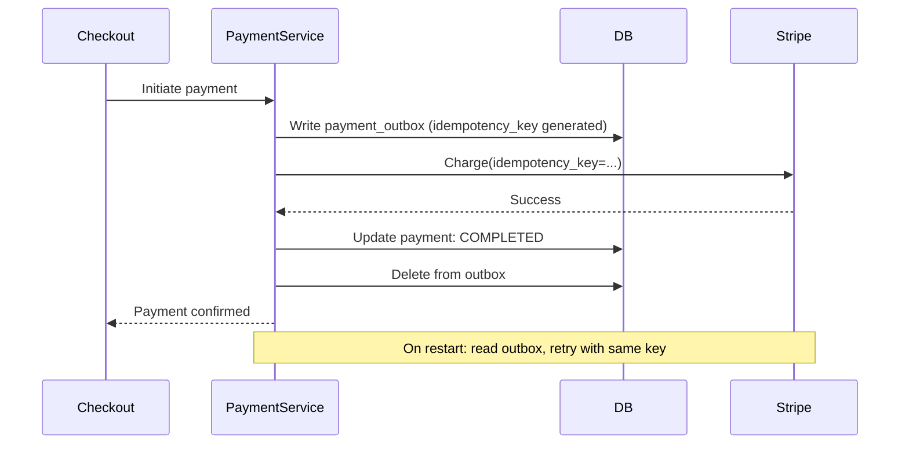

### Story Context

**Quarterly business review — Finance team shares the numbers, Monday 10:00 AM**

**Adaeze Nwosu (CFO)**: Payment processing costs are $1.2M last quarter. That's
3.2% of GMV, which is above industry average for our volume. The board is asking
why. I need an engineering answer.

**Nnamdi**: What's driving the cost?

**Adaeze**: Three things. First, our payment failure rate is 8.2%. Every failed
payment that gets retried costs us a transaction fee even if the retry succeeds.
Second, our dispute rate is 0.4% — twice the industry average. Disputes cost
$15 each in processing fees plus potential chargeback reversal. Third, we're
processing every transaction through Stripe at 2.9% + $0.30, even for merchants
who've been with us for 5 years and have zero fraud history.

**Nnamdi**: That's a payment architecture conversation. [To you] Can you look at this?

---

**Your investigation, Wednesday**

You pull the payment metrics and find several structural issues:

```
Payment failure analysis:
- 8.2% failure rate (industry average: 2-3% for e-commerce)
- Top failure reasons:
  1. Insufficient funds: 34% of failures → legitimate (can't fix)
  2. Card expired: 28% of failures → smart retry logic could help
  3. Network timeout: 22% of failures → retry without idempotency key (double charge risk!)
  4. Fraud decline: 16% of failures → legitimate (don't retry)

Issue: Retrying network timeouts without idempotency keys. Sound familiar?
(NovaPay, Chapter 2)

Dispute analysis:
- 0.4% dispute rate — most disputes are "I didn't authorize this"
- 89% of disputed transactions are from guest checkouts (no account)
- Suspicious patterns: multiple high-value orders from same IP, different cards

Current payment routing:
- 100% of transactions through Stripe
- No direct payment processor relationship for large merchants
- No distinction between fraud-risk profiles

Idempotency implementation:
- Exists for API-level retries (merchant → PulseCommerce)
- Does NOT exist for PulseCommerce → Stripe API calls
- Network timeout → PulseCommerce → Stripe (no idempotency key) → potential duplicate charge
```

---

**1:1 — Nnamdi & You, Thursday 3:00 PM**

**Nnamdi**: Before you redesign everything — give me the three highest-impact changes
that would move the cost needle.

**You**: First: add idempotency keys to all Stripe API calls. This prevents the
double-charge scenario and eliminates those retry fees. Low effort, very high impact.

**Nnamdi**: Second?

**You**: Fix the retry logic. Don't retry fraud declines. Do retry expired cards —
but with a card-update prompt. The "card expired" retries are probably also failing
on the second attempt. We're paying fees for doomed retries.

**Nnamdi**: Third?

**You**: The dispute rate is a fraud signal problem, not a payment problem. 89%
of disputes are guest checkouts. We need to add fraud signals to the checkout flow —
not as a blocker, but as a risk score. Flag high-risk sessions for review before
charging.

**Nnamdi**: What about the Stripe fee rate?

**You**: That's a negotiation conversation for high-volume merchants. At $2.1B GMV,
our top 100 merchants process enough volume to justify direct processor relationships.
But that's a 6-month project. The three changes above can be done in 2 weeks.

---

**Slack DM — Marcus Webb → You, Friday**

**Marcus Webb**
Payment systems. You've seen this before — at NovaPay, you designed the idempotency
layer from scratch. At PulseCommerce, you're retrofitting it onto an existing system.
Retrofitting idempotency is harder than designing it in. The existing code has
assumptions baked in about retry behavior. When you add idempotency keys to Stripe
calls, you need to make sure the keys survive across retries — which means they
need to be stored somewhere between the first attempt and the retry.
Where do you store a Stripe idempotency key that was generated during an in-flight
payment that then got interrupted?

**You**: In the payment record itself. Before calling Stripe, we write the idempotency
key to the payment row. On retry, we read it from the row and reuse it.

**Marcus Webb**
Right. And what happens if the Stripe call succeeds but the payment row write fails?
You're back at the dual-write problem. The outbox pattern, again.

---

### Problem Statement

PulseCommerce's payment processing has three systemic problems: missing idempotency
on Stripe API calls (causing double charges on network timeouts), undifferentiated
retry logic (retrying fraud declines, not retrying card-update-recoverable failures),
and a 0.4% dispute rate driven by inadequate fraud signals on guest checkout.
You must redesign the payment processing layer to reduce payment costs and bring
the dispute rate to industry average.

### Explicit Requirements

1. Add idempotency keys to all Stripe API calls — key must survive process restarts
   via database persistence (outbox pattern)
2. Implement smart retry logic: never retry fraud declines; retry network timeouts
   with the same idempotency key; retry expired cards only after prompting card update
3. Add a fraud risk score to guest checkout sessions; flag high-risk sessions (score > 0.7)
   for manual review before charging
4. Reduce dispute rate from 0.4% to < 0.2% within 90 days
5. Reduce retry-related payment failure rate by 40%
6. Maintain complete payment audit trail compatible with PCI-DSS (from NovaPay work)

### Hidden Requirements

- **Hint**: Marcus Webb raised the dual-write problem — Stripe succeeds but DB write
  fails. The outbox pattern from Ch. 2 applies directly. But PulseCommerce's payment
  service is built on top of Stripe, not a bank API. Stripe already has its own
  idempotency key support. How do your outbox pattern and Stripe's idempotency key
  work together? Is it redundant to have both?
- **Hint**: The fraud risk score system for guest checkout. You mentioned "flag high-risk
  sessions for manual review." But in e-commerce, holding an order for manual review
  means the customer is waiting. If review takes 10 minutes, customers abandon the
  cart. What's the UX for a flagged-but-not-blocked transaction?
- **Hint**: "Retry expired cards after prompting card update." This means interrupting
  the payment flow mid-checkout to ask the customer to enter a new card. This is a
  significant UX disruption. What technical mechanism allows you to resume the
  original checkout after the card is updated, without starting over?

### Constraints

- **GMV**: $2.1B annually; ~$5.75M/day
- **Transaction count**: ~180,000 transactions/day
- **Current failure rate**: 8.2% (target: 4%)
- **Current dispute rate**: 0.4% (target: 0.2%)
- **Current Stripe idempotency**: None on API calls (critical gap)
- **Payment stack**: Node.js → Stripe API → card networks
- **PCI-DSS scope**: Already scoped from prior architecture (Ch. 5 patterns)
- **Timeline**: 2 weeks for idempotency + retry fixes; 8 weeks for fraud scoring

### Your Task

Redesign PulseCommerce's payment processing to add idempotency, smart retry logic,
and a fraud risk scoring system.

### Deliverables

- [ ] **Payment flow with outbox pattern** (Mermaid sequence) — initiate payment
  → write to outbox → call Stripe with idempotency key → on success write completion
- [ ] **Retry decision tree** — for each payment failure code (fraud decline, expired
  card, network timeout, insufficient funds), what is the retry decision?
- [ ] **Fraud risk signal design** — what signals contribute to the risk score?
  (IP, device fingerprint, velocity, order value, guest vs registered account).
  Where is the score computed and stored?
- [ ] **Guest checkout fraud flow** — for a high-risk session: what is the customer
  experience (not blocked outright, but flagged) and what does the ops review UI show?
- [ ] **Impact estimation** — at 180k transactions/day × 22% network timeouts ×
  current retry fee: what is current annual cost of unidempotent network-timeout retries?
  After fix, what is expected cost reduction?
- [ ] **Tradeoff analysis** — minimum 3 tradeoffs:
  1. Synchronous fraud scoring (adds latency to checkout) vs async scoring with delayed approval
  2. Stripe idempotency keys only vs outbox pattern + Stripe keys (double protection)
  3. Hard block high-risk sessions vs soft flag with manual review

### Diagram Format


