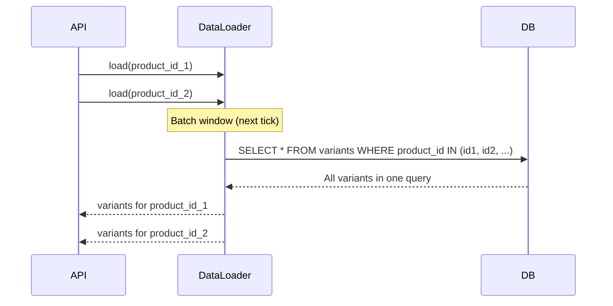

### Story Context

**#platform-eng Slack — Tuesday 11:00 AM**

**Priya Menon** [11:00 AM]
Can someone explain why the product catalog API takes 1.8 seconds to return
a list of 20 products with their variants, pricing, and inventory?

Our competitor's catalog API returns the same data in 90ms. Same data, same
list, same fields. I've been timing it.

**You** [11:08 AM]
One second — pulling up the APM traces.

**You** [11:14 AM]
Found it. For a request to `GET /v1/catalog?limit=20`, here's what happens:

```
1x Query: SELECT * FROM products LIMIT 20            → 8ms
20x Query: SELECT * FROM product_variants             → 12ms each = 240ms
20x Query: SELECT * FROM product_pricing              → 15ms each = 300ms
20x Query: SELECT * FROM product_inventory            → 18ms each = 360ms
20x Query: SELECT * FROM product_images               → 11ms each = 220ms
-------
Total: 8 + 240 + 300 + 360 + 220 = 1,128ms + network/overhead ≈ 1.8s
```

For 20 products, we make 81 database queries. That's 80 N+1 queries.

**Priya** [11:16 AM]
...How long has this been like this?

**You** [11:18 AM]
The code is 3 years old. The N+1 pattern is from the original ORM (TypeORM)
eager-loading defaults. As the DB was small, the query time was fast enough
to hide the issue. At 150M products, the queries are slower, and 80 queries
per request is now very visible.

**Priya** [11:21 AM]
How do we fix it?

**You**: DataLoader pattern — batch all sub-queries into single IN queries.
Instead of 20 queries for variants, one query: `SELECT * FROM product_variants
WHERE product_id IN (id1, id2, ..., id20)`.

**Priya** [11:23 AM]
How hard is that change?

**You**: Depends on the ORM configuration and how consistent the access patterns
are. Let me audit the codebase before I give a time estimate.

---

**Your audit findings, Wednesday**

```
N+1 patterns found across the catalog codebase:

1. ProductCatalogController.getProducts() — 4 relations loaded via N+1
   (variants, pricing, inventory, images) — 80 queries per 20-item page

2. ProductSearchController.search() — results returned from ES, then
   each result enriches from DB via 3 N+1 queries:
   - Inventory availability check per product (blocks showing "In Stock")
   - Merchant name per product (separate SELECT)
   - Price override per product (merchant-specific pricing)

3. OrderController.getOrderHistory() — for each order, fetches line items,
   then for each line item fetches product details. 200-item order history
   can generate 2,000+ DB queries.

4. MerchantDashboard.getTopProducts() — fetches top 50 products with sales data,
   variant counts, and review aggregates. Generates ~250 queries.

Total estimated wasted DB queries per hour (at current traffic): 2.8M extra queries.
```

---

**Slack DM — Marcus Webb → You, Wednesday afternoon**

**Marcus Webb**
N+1 queries. Textbook problem. The fix is always the same in principle:
batch the sub-queries. But the implementation varies:

1. DataLoader pattern (from Facebook's GraphQL ecosystem) — automatic batching
   at the application layer. Works great for GraphQL, works fine for REST.
2. Eager loading configuration in the ORM — if TypeORM supports `findIn` with
   relations, reconfigure to load in a single join or separate batched query.
3. Denormalization — store frequently-joined data in the parent table.
   At the cost of write complexity, eliminates read joins entirely.

For the order history problem (2,000 queries for 200-item history), DataLoader
isn't enough — you need pagination AND batching. 200 items per page means
200 products per batch. How many IN queries can Postgres handle efficiently?

**You** [response]
Postgres handles `IN` with up to ~10,000 values efficiently. So batching 200
product IDs in one query is fine.

**Marcus Webb**
Right. And think about the cache layer. After you fix N+1, product catalog data
is still fetched from DB on every request. Some of these products don't change
for months. What's the cache strategy for product catalog data?

---

### Problem Statement

PulseCommerce's product catalog API makes 81 database queries to return 20 products,
resulting in 1.8-second response times. N+1 patterns are found in four controllers,
generating 2.8 million unnecessary DB queries per hour. You must eliminate the N+1
patterns using DataLoader batching and add an appropriate caching strategy for
product catalog data.

### Explicit Requirements

1. Eliminate N+1 queries in all four identified controllers
2. Product catalog API (GET /v1/catalog, 20 products): < 100ms P99 (from 1.8s)
3. Search enrichment (product details after ES results): < 50ms additional latency
4. Order history API (200-item history): < 300ms (from 2+ seconds)
5. Cache frequently-read, infrequently-updated product data (price, description,
   images) with appropriate TTL and invalidation on update
6. No regression in data consistency — cached product data must reflect updates
   within 60 seconds

### Hidden Requirements

- **Hint**: Marcus Webb asked about `IN` query efficiency. At 200 items per batch
  (order history), the query becomes `WHERE product_id IN (id1, ..., id200)`.
  But what if the same product appears 30 times in an order history? The DataLoader
  deduplication feature means you only query that product once, even if 30 order
  line items reference it. Does your implementation handle this?
- **Hint**: The search enrichment N+1 is different — ES returns results, then 3 DB
  calls per result for live data (inventory, merchant name, price override). You
  can't cache inventory (it changes during flash sales). But merchant name almost
  never changes. And price override changes rarely. Can you batch AND selectively
  cache these fields independently?
- **Hint**: Cache invalidation for product data. When a merchant updates a product
  description, all cached copies of that product must be invalidated. At 8,000
  merchants, product updates are frequent. What invalidation strategy prevents
  the "stale product in cache" problem without adding a round-trip on every request?

### Constraints

- **Catalog queries**: ~2,000 catalog API requests/minute (varies with traffic)
- **Search enrichment**: ~8,000 RPS at peak (all search results need enrichment)
- **Product update frequency**: ~100,000 product updates/day (price, inventory, description)
- **Cache TTL**: Product metadata (description, images): 1 hour; Price: 5 minutes; Inventory: no cache
- **ORM**: TypeORM (Node.js)
- **Cache**: Redis (already available)

### Your Task

Eliminate N+1 patterns in the PulseCommerce catalog API using DataLoader batching
and add an appropriate caching layer for product data.

### Deliverables

- [ ] **N+1 trace comparison** — before/after request trace showing query count
  and total latency for `GET /v1/catalog?limit=20`
- [ ] **DataLoader implementation sketch** — TypeScript interface showing how
  DataLoader batches and deduplicates requests for product variants, pricing,
  and inventory in a single request context
- [ ] **Caching strategy** — what fields are cached, at what TTL, and how
  invalidation is triggered on product update
- [ ] **Search enrichment optimization** — for 20 search results, batch the
  3 N+1 calls into 3 batched calls (one per relation type). Show query count
  before (60 queries) and after (3 queries + 3 batched) for 20 results.
- [ ] **Scaling estimation** — at 8,000 RPS for search enrichment, how many
  DB queries/second before your fix? After? What is the DB query load reduction?
- [ ] **Tradeoff analysis** — minimum 3 tradeoffs:
  1. DataLoader batching vs JOIN queries (batched IN vs single JOIN query)
  2. Per-field cache TTL vs single product cache entry
  3. Cache-aside (check cache, fall through to DB) vs write-through cache on product update

### Code Task

Sketch the TypeScript DataLoader implementation for batching product variant queries:

```typescript
import DataLoader from 'dataloader';

// Sketch only — not a full implementation
const productVariantLoader = new DataLoader<string, ProductVariant[]>(
  async (productIds: readonly string[]) => {
    // Write the batch query here
    // Return results in the same order as productIds
  }
);

// Usage in resolver/controller:
async function getProductWithVariants(productId: string) {
  // ...
}
```

### Diagram Format


