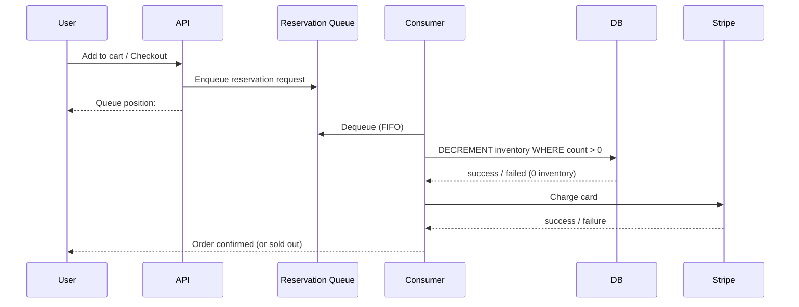

> **SPIKE CHALLENGE — PRODUCTION DOWN + SCALE 10X**
> It starts as a routine flash sale. Then 50,000 people try to buy the same
> 1,000-unit sneaker drop simultaneously.

---

### Story Context

**#incidents — Slack, Saturday 10:00 AM**

**PagerDuty Bot** [10:00 AM]
🔴 ALERT: Order creation error rate: 34% (threshold: 2%)
Orders failing with: `inventory_oversold` exception

**You** [10:01 AM]
Ack. What sale is running?

**Yuki Tanaka** [10:03 AM]
Nike AirMax drop on SportZone's storefront. Limited release — 1,000 units.
They didn't tell us. Just posted on Instagram at exactly 10:00 AM.
1 million followers. We're seeing 50,000 concurrent checkout attempts right now.

**You** [10:05 AM]
50,000 concurrent checkouts for 1,000 items. Let me check the inventory table.

**You** [10:08 AM]
Current inventory: -1,847 units. We've oversold by 1,847 units.

**Yuki** [10:08 AM]
We sold almost 3,000 items when we had 1,000?

**You** [10:09 AM]
Race condition. The inventory check and the inventory decrement are not atomic.
Two concurrent orders both check inventory at the same time, both see 500 units
remaining, both proceed to checkout, both decrement — now inventory is 498 but
we should have 499.

At 50,000 concurrent checkouts, this happens thousands of times simultaneously.

**Nnamdi** [10:11 AM]
How do we stop the bleeding right now?

**You** [10:12 AM]
Immediate fix: set inventory to 0 manually. Stop accepting new orders.
But 1,847 customers already have order confirmations for items we don't have.
SportZone is going to need to cancel those orders.

**Nnamdi** [10:13 AM]
Do it. Then fix the root cause. And tell me how many customers are affected.

---

**Root cause deep dive — Saturday afternoon**

```sql
-- Current inventory decrement code (simplified):
-- Step 1: Check inventory
SELECT inventory_count FROM product_inventory
WHERE product_id = $1 AND variant_id = $2;
-- Returns: 50 (there are 50 left)

-- Step 2: If inventory > 0, create order
INSERT INTO orders (...) VALUES (...);

-- Step 3: Decrement inventory
UPDATE product_inventory
SET inventory_count = inventory_count - 1
WHERE product_id = $1 AND variant_id = $2;

-- Problem: Steps 1 and 3 are not atomic.
-- 50,000 concurrent requests all do step 1 simultaneously → all see 50 units
-- 50,000 concurrent requests all do step 3 → inventory goes to -49,950
```

The fix seems obvious: do it in a single atomic `UPDATE ... RETURNING`.
But there's more complexity:

```
Complicating factors:

1. Order creation is NOT just the inventory decrement. It's a multi-step process:
   - Create order record
   - Reserve inventory
   - Initiate payment (Stripe, can take 2-3 seconds)
   - Send confirmation email
   - Update merchant dashboard

2. Payment can fail AFTER inventory is reserved. If we reserve inventory during
   the order creation, and then payment fails, we must release the inventory.
   But "release the inventory" at scale under flash sale conditions is dangerous —
   a released unit immediately gets grabbed by another of the 50,000 waiting requests.

3. The cart system (not the order system) has its own inventory check. Users see
   "Add to Cart" buttons based on the cart system's inventory data — which is
   cached (Ch. 36 issue) and stale.

4. "Sold out" messaging must propagate within seconds to all 50,000 waiting users.
   If the ATC button stays green after sellout, users waste time filling in payment
   details for items that don't exist.
```

---

**Slack DM — Marcus Webb → You, Saturday evening**

**Marcus Webb**
50,000 concurrent checkouts for 1,000 units. This is the hardest inventory problem
in e-commerce. I've seen it destroy companies that solved it wrong.

Let me give you the three approaches and their failure modes:

1. **Optimistic locking**: Check and decrement with version check. Fast on low contention.
   Under 50,000 concurrent requests, retry storms. Every failed transaction retries.
   The DB gets hammered. Doesn't work at this scale.

2. **Pessimistic locking** (`SELECT FOR UPDATE`): Serialize inventory access with a row lock.
   Correct. But at 50,000 concurrent requests holding locks, you get lock queue buildup
   and the DB serializes 50,000 requests sequentially. 50,000 / 1,000 DB capacity =
   potentially minutes of wait time. Users time out. Still partially works.

3. **Reservation queue**: Don't touch inventory at checkout. Put the order in a queue.
   A single consumer processes the queue sequentially, one order at a time. Inventory
   is decremented by the queue consumer, never from the web tier. The queue is the
   single serialization point. This is what Ticketmaster and Nike's SNKRS app do.

The reservation queue approach has a different problem: how do you tell 50,000 users
in real time "you're #4,823 in queue" and "you got the item!" or "sold out"?

---

### Problem Statement

PulseCommerce's inventory management system has a race condition between inventory
check and inventory decrement, causing 1,847 units to be oversold during a flash sale.
The naive fix (atomic decrement) doesn't address the complexities of multi-step order
creation with payment. You must design an inventory reservation and checkout flow
that prevents overselling under 50,000 concurrent checkout attempts.

### Explicit Requirements

1. Zero overselling: inventory can never go below zero
2. Handle 50,000 concurrent checkout attempts without DB exhaustion
3. Reservation semantics: inventory must be held during payment processing (2-3s);
   released if payment fails
4. Reservation expiry: if a user holds inventory but doesn't complete payment
   within 10 minutes, the reservation is released
5. Real-time "sold out" propagation: once inventory hits zero, all active checkout
   sessions must see "sold out" within 5 seconds
6. Queue position visibility: during high-demand events, users should see their
   position in queue (approximate is fine)

### Hidden Requirements

- **Hint**: Marcus Webb described the reservation queue. The consumer processes
  orders one at a time from the queue. At what rate can the consumer process orders?
  At 1 order/second (Stripe API latency), how long does it take to process 50,000
  queued orders? Is that acceptable, or do you need parallelism in the consumer?
- **Hint**: "Reservation expiry after 10 minutes." A user adds to cart, starts
  checkout, gets distracted, comes back 11 minutes later — their reserved unit
  is released. The unit is now available. But another user is waiting. How do you
  re-release the unit to waiting users atomically and in queue order?
- **Hint**: "Real-time sold out propagation to 50,000 users." 50,000 active checkout
  sessions. When inventory hits zero, all 50,000 must see the state change within
  5 seconds. This is a fan-out problem (from Ch. 20 pattern) but with different
  constraints. WebSockets? SSE? Long polling? What does the broadcast mechanism look like?

### Constraints

- **Concurrent checkout attempts**: 50,000 at peak (flash sale)
- **Inventory units**: 1,000 (typical limited release)
- **Payment processing time**: 2-3 seconds (Stripe API)
- **Reservation hold time**: 10 minutes before expiry
- **Sold out propagation SLA**: 5 seconds after last unit reserved
- **Queue position accuracy**: Within ±50 positions (exact is not required)
- **DB**: PostgreSQL 14

### Your Task

Design the inventory reservation system for PulseCommerce's flash sale scenario.

### Deliverables

- [ ] **Reservation flow diagram** (Mermaid sequence) — user initiates checkout →
  reservation queue → consumer processes → payment → inventory decrement (or release)
- [ ] **Inventory reservation data model** — schema for `inventory_reservations` table
  with expiry, status, and order linkage
- [ ] **Atomic decrement query** — PostgreSQL query that atomically decrements
  inventory, prevents negative values, and returns whether the operation succeeded
- [ ] **Queue consumer design** — the single serialization point: how does the
  consumer process orders from the queue, call Stripe, and handle payment failures?
  What is the consumer throughput?
- [ ] **Sold out broadcast design** — how do you push "sold out" to 50,000 active
  sessions within 5 seconds?
- [ ] **Reservation expiry mechanism** — how do you identify and release expired
  reservations within 1 minute of their 10-minute timeout?
- [ ] **Tradeoff analysis** — minimum 3 tradeoffs:
  1. Optimistic locking vs pessimistic locking vs reservation queue at 50k concurrency
  2. Inventory in PostgreSQL vs inventory in Redis (atomic DECR) for flash sales
  3. Synchronous reservation confirmation vs async queue with position notification

### Diagram Format


