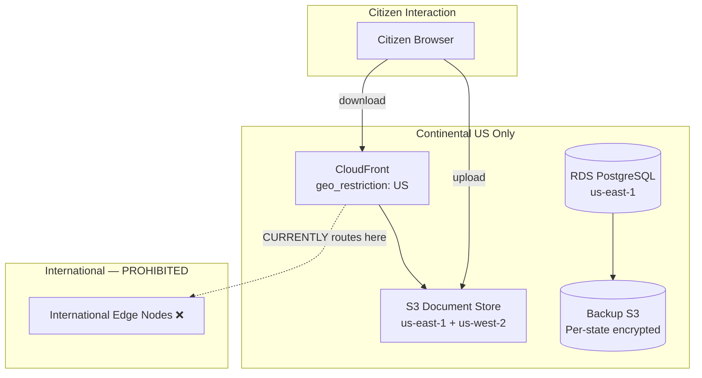

### Story Context

**Security disclosure document (sent Friday, you read over the weekend)**

```
SECURITY DISCLOSURE — CivicOS Platform
Prepared by: Meridian Security Labs (external audit)
Classification: CONFIDENTIAL

FINDING 1 — CRITICAL: Data Sovereignty Violation (CVSSv3: 8.2)

CivicOS hosts government client data in a shared AWS multi-region environment.
Several state government contracts specify that citizen data must remain within
state boundaries or at minimum within the continental United States.

Audit finding: CivicOS uses AWS CloudFront for CDN and S3 for document storage.
Neither service has been configured with geographic restrictions. We identified
that citizen data uploaded via the DMV application workflow (driver's license photos,
proof of residence documents) is being served via CloudFront edge nodes in:
  - Frankfurt, Germany (eu-central-1 PoP)
  - Tokyo, Japan (ap-northeast-1 PoP)
  - Sao Paulo, Brazil (sa-east-1 PoP)

Several state contracts explicitly prohibit storage or transmission of citizen
PII outside the continental United States. This configuration appears to be a
breach of at least 7 state contracts.

FINDING 2 — HIGH: Tenant Data Commingling Risk (CVSSv3: 7.1)

CivicOS serves 23 state government clients from a shared database cluster.
We did not find evidence that state A's data is accessible to state B's application
layer. However, we found that the database backup process writes all states' data
to the same S3 backup bucket without tenant-partitioned encryption. A compromise
of the backup bucket would expose all states' citizen data simultaneously.

FINDING 3 — MEDIUM: Audit Log Insufficiency (CVSSv3: 5.9)

FedRAMP Moderate requires audit logs that include: event type, timestamp, source
IP, user identity, and outcome. CivicOS's current audit logs include event type
and timestamp but not user identity or outcome in all cases.
```

---

**Emergency meeting — Monday 9:00 AM**

**Jasmyn Crawford**: You read the report. Good. I want to be direct: we have a
potential contract breach on 7 state contracts. Legal has been notified. Our
immediate obligation is: assess the actual impact, remediate, and notify affected
states within 72 hours.

**You**: For Finding 1 — the CloudFront data sovereignty issue. What's the citizen
data that's going through CloudFront?

**Tunde Adeyemi (Infrastructure Engineer)**: Document uploads. When a citizen uploads
a license photo or proof of residence, we store it in S3 and serve download links
via CloudFront. The uploads themselves go directly to S3 via pre-signed URLs.
The CloudFront distribution was set up for performance — we never configured
geographic restrictions on it.

**Jasmyn**: So citizen documents are being cached at international CloudFront edge nodes.

**Tunde**: Potentially. CloudFront caches files at edge nodes on first request.
If an admin in our Ohio office opens a citizen document, it might not hit an
international edge. But we can't say definitively without checking the edge logs.

**Jasmyn**: Pull the logs. And design the fix.

---

**Finding 3 briefing — Jasmyn, Monday afternoon**

**Jasmyn**: FedRAMP Moderate is the compliance tier we're targeting for our federal
contracts. It requires NIST 800-53 controls. Audit logging control AU-2 and AU-3
are specific: every privileged operation must log the specific user identity.

Our current audit logs capture what happened but not who did it, in about 35%
of cases. Mostly API calls made through our internal admin tools where session
context isn't being passed to the audit middleware.

**You**: That's the same architecture problem I saw at MeridianHealth — audit logs
that don't attribute actions to specific identities. Different compliance framework,
same root cause.

**Jasmyn**: Exactly. And we need it fixed before our FedRAMP authorization audit
in 4 months.

---

**Slack DM — Marcus Webb → You, Monday evening**

**Marcus Webb**
Government infrastructure. Different animal from commercial SaaS.
Three differences you'll feel immediately:
1. Compliance is not a feature request. It's a contract term. Violate it → contract breach.
2. Your users are citizens. They didn't choose your platform. They have to use it
   to access services they're entitled to. Reliability and accessibility are moral obligations.
3. The data you're handling is often sensitive in ways commercial data isn't.
   A DMV record links a person's address, photo, and government ID. A data breach
   is not just a privacy violation — it can endanger people.

The data sovereignty problem is solvable technically. The policy question is harder:
who defines "state boundary" for cloud data? Is it about where the data is stored,
where it's processed, or where it can be accessed from? Different states interpret
this differently. Build your architecture to accommodate the strictest interpretation.

---

### Problem Statement

CivicOS has three compliance findings: citizen documents being served through
international CloudFront edge nodes (violating state data sovereignty contracts),
database backups stored without tenant-partitioned encryption, and audit logs
missing user identity in 35% of privileged operations. You must design the
compliance remediation architecture and a durable data sovereignty design.

### Explicit Requirements

1. Restrict CloudFront to serve citizen documents only from continental US edge nodes
2. Tenant-partitioned encryption for database backups: each state's backup encrypted
   with a separate key, managed by that state's designated KMS configuration
3. Complete audit log attribution: all privileged operations must log user identity,
   source IP, event type, resource accessed, and outcome
4. Produce a data flow diagram showing where citizen PII travels and at what
   geographic boundaries
5. Design a "data residency attestation" capability: given a specific state contract,
   produce evidence that that state's data has not crossed prohibited geographic boundaries

### Hidden Requirements

- **Hint**: Marcus Webb asked "who defines 'state boundary' for cloud data?" CloudFront
  geographic restriction (`geo_restriction`) blocks by country. But US state contracts
  say "continental US" — CloudFront can restrict to "US" but not to specific AWS regions
  within the US. Does restricting to "US" satisfy a "continental US" contract requirement?
  What about edge nodes in Hawaii or Alaska? Look up `geo_restriction` in CloudFront docs.
- **Hint**: "Tenant-partitioned encryption for backups." AWS RDS automated backups encrypt
  the entire cluster backup with one KMS key. To have per-state encryption, you need either:
  (a) separate RDS instances per state, or (b) application-level encryption before writing
  to the shared DB. What is the operational cost of (a) vs (b)?
- **Hint**: Finding 2 says "a compromise of the backup bucket would expose all states'
  data simultaneously." This is a blast radius problem. With per-tenant encryption keys,
  compromising one key exposes only that state's data. But key management becomes 23×
  more complex. Who holds the root of trust for each state's key?

### Constraints

- **State contracts**: 23 states, each with slightly different data sovereignty language
- **FedRAMP Moderate**: Target certification in 4 months
- **CloudFront distribution**: Single global distribution serving all states' citizen documents
- **Database**: Shared RDS PostgreSQL cluster, row-level state isolation
- **Backup bucket**: Single S3 bucket, all states co-mingled
- **Audit log gap**: 35% of privileged operations missing user identity
- **Timeline**: Finding 1 remediation within 72 hours (legal notification SLA);
  Finding 2 and 3 within 30 days

### Your Task

Design the data sovereignty remediation and durable compliance architecture for
CivicOS. Address all three audit findings.

### Deliverables

- [ ] **CloudFront remediation** — specific configuration changes to restrict
  citizen document distribution to continental US edge nodes only; show how
  to verify that no cached copies exist at international nodes post-remediation
- [ ] **Tenant-encrypted backup design** — architecture for per-state encrypted backups.
  Show two approaches (separate RDS vs application-level encryption), with cost and
  complexity comparison. Recommend one.
- [ ] **Audit log attribution fix** — how do you ensure 100% of privileged operations
  include user identity? Show the middleware fix and the specific code paths (admin
  tool → API calls) that need to propagate session context.
- [ ] **Data flow diagram** (Mermaid) — show where citizen PII travels from submission
  through storage, backup, and CDN serving, with geographic boundaries marked
- [ ] **Data residency attestation capability** — what query or report can you generate
  to show a state "your data has not left the continental US"? What data do you need
  to collect to support this claim?
- [ ] **Tradeoff analysis** — minimum 3 tradeoffs:
  1. Shared multi-tenant RDS vs per-state RDS instances for data residency
  2. CloudFront geographic restriction vs separate CDN distribution per state
  3. AWS-managed KMS keys vs customer-managed KMS keys for backup encryption

### Diagram Format


