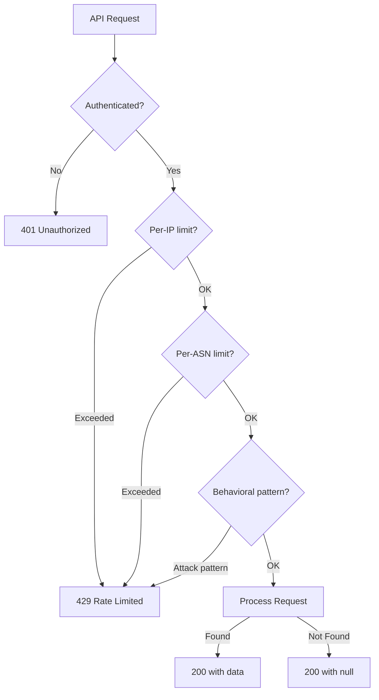

> **SPIKE CHALLENGE — INHERITED DISASTER**
> The security report had a fourth finding that Jasmyn didn't mention on the phone.

---

### Story Context

**Monday evening — reading the full security report more carefully**

You notice a footnote at the end of Finding 1:

```
NOTE: During data flow analysis for Finding 1, our team observed a pattern in
CloudFront access logs that warrants further investigation:

~14,000 requests over a 72-hour period:
- Source: 847 unique IP addresses (likely a distributed botnet)
- Target: GET /api/v1/citizens/search?ssn={sequential values}
- Rate per IP: ~17 requests/hour (below detectable rate limits)
- Response pattern: HTTP 200 (citizen found) vs HTTP 404 (not found)

This pattern is consistent with an SSN enumeration attack.
The binary 200/404 response provides a data oracle.
Shared separately with Jasmyn Crawford.
```

---

**Slack — Jasmyn to You, 11:48 PM**

**Jasmyn**
Did you read the footnote? I didn't mention it on the phone because I wanted you
to find it yourself.

**You** [11:52 PM]
You're not being paranoid. That is a textbook enumeration attack.
17 req/hour × 847 IPs = ~14,400 combined/hour but each IP stays under threshold.

**Jasmyn** [12:05 AM]
How many SSNs could they have verified in 72 hours?

**You** [12:07 AM]
847 × 17 × 72 = 1,036,872 SSN checks. At US distribution of valid SSNs:
potentially ~80,000 valid SSN confirmations.
This may be a reportable breach under state notification laws.

**Jasmyn** [12:09 AM]
Wake me at 6am. We're calling legal.

---

**Emergency meeting — Tuesday 6:30 AM**

Three simultaneous fixes needed:
1. Rate limiting is insufficient against distributed attacks
2. API returns a binary oracle (200 vs 404 reveals data existence)
3. Search endpoint requires no authentication before data lookup

**You**: We need three layers. Layer 1: global distributed rate limiting with
per-IP, per-subnet, and behavioral signals. Layer 2: response normalization —
eliminate the oracle. Layer 3: mandatory authentication gate.

---

**Slack DM — Marcus Webb → You, Tuesday morning**

**Marcus Webb**
The rate limiting at CloudStack (Ch. 29) protected against one tenant sending too many
requests. Government API rate limiting must protect against many sources sending
a modest number that collectively amounts to an attack. Different threat model.
Different solution.

For distributed enumeration:
1. Normalize responses: return 200 with null payload instead of 404 — remove the oracle
2. Require authentication before any citizen lookup
3. Behavioral fingerprinting: limit by subnet, ASN, and query pattern similarity
4. Alert on enumeration signatures: many distinct SSN-like values from related sources

Harder question: 80,000 confirmed SSNs may already be out there. Your incident
response plan matters as much as the rate limiting design right now.

---

### Problem Statement

CivicOS's citizen search API has three security failures: no authentication required,
binary HTTP 200/404 response revealing data existence (oracle attack), and rate limiting
that is insufficient against distributed enumeration attacks (847 IPs each staying
below individual thresholds). An enumeration attack may have confirmed ~80,000 valid
SSNs. You must design a multi-layer rate limiting and anti-enumeration architecture
for government citizen APIs.

### Explicit Requirements

1. Require authentication for all citizen data lookup endpoints
2. Normalize API responses: when a citizen record is not found, return HTTP 200
   with null/empty payload (not 404) — eliminate the oracle
3. Implement distributed behavioral rate limiting that detects and blocks coordinated
   attacks even when individual IPs stay below per-IP thresholds
4. Incident response: produce a forensic analysis of the suspected enumeration window
   and determine whether breach notification is required
5. Rate limiting must not degrade legitimate citizen users (elderly users on slow
   connections, mobile users with high latency)
6. All rate limiting decisions must be logged for FedRAMP audit compliance

### Hidden Requirements

- **Hint**: Marcus Webb said "behavioral fingerprinting: limit by subnet, ASN, and
  query pattern similarity." The attack used 847 IPs. How do you detect that 847 IPs
  are a coordinated attack? Common signals: (1) all requests arrive within the same
  time window, (2) the queried values are sequential or follow a pattern, (3) the IPs
  are in the same ASN or CIDR block. What Redis data structure lets you efficiently
  track "requests per ASN per hour"?
- **Hint**: Response normalization — returning 200 with null for a not-found citizen.
  This helps against the oracle. But it changes the API contract. The client code
  that today handles 404 differently from 200 will break. How do you migrate existing
  API consumers without breaking their error handling?
- **Hint**: FedRAMP requires logging all rate limiting decisions. At 14,000 requests/hour
  during the attack, how many rate limit decision logs/hour must you retain? At typical
  normal traffic, what is the steady-state log volume? What is your log retention strategy?

### Constraints

- **Attack scale**: 847 IPs, ~17 req/hour per IP, 72 hours
- **Normal traffic**: 80,000 authenticated sessions/day on citizen APIs
- **Legitimate RPS**: ~50 RPS average, ~200 RPS peak
- **Attack RPS**: ~4 RPS per IP × 847 IPs = potentially ~3,400 RPS during coordinated bursts
- **Rate limit latency budget**: < 3ms additional to API gateway (same as Ch. 29)
- **FedRAMP log retention**: 1 year for security-relevant events
- **Government API consumers**: State agency portals, call center agents, citizen self-service

### Your Task

Design the multi-layer anti-enumeration and rate limiting architecture for CivicOS.
Include the forensic analysis for incident response.

### Deliverables

- [ ] **Multi-layer rate limiting architecture** (Mermaid) — show the decision tree:
  IP check → subnet check → ASN check → behavioral pattern check → allow/block
- [ ] **Oracle attack mitigation** — show the API response change (before: 200 vs 404;
  after: always 200 with typed response). Show the migration plan for existing clients.
- [ ] **Behavioral fingerprinting design** — what signals identify a coordinated attack?
  Show the Redis data structure for tracking per-ASN, per-subnet request rates.
- [ ] **Incident forensics query** — SQL/query to determine: which SSN ranges were
  queried, how many 200 vs 404 responses were returned, time distribution of the
  attack, and estimated breach scope for notification purposes
- [ ] **Rate limit logging design** — what fields are logged per rate limit decision?
  At what granularity? How long is it retained?
- [ ] **Tradeoff analysis** — minimum 3 tradeoffs:
  1. Per-IP rate limiting (simple) vs behavioral rate limiting (complex, more effective)
  2. Hard block on detection vs CAPTCHA challenge vs silent throttle
  3. Response normalization (200 always) vs authenticated 404 (no oracle for auth users only)

### Diagram Format


