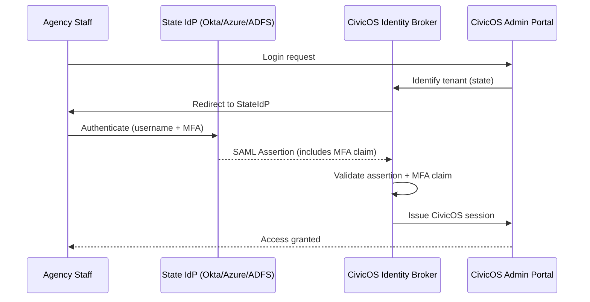

### Story Context

**FedRAMP readiness gap analysis — shared by Jasmyn, Week 2**

```
FedRAMP Moderate — Identity & Access Management (IA) Controls Gap Analysis

IA-2: Identification and Authentication (Organizational Users)
  Status: PARTIAL
  Gap: CivicOS uses username/password auth for agency staff accessing the admin portal.
  FedRAMP IA-2 requires MFA for all privileged access. We do not enforce MFA for
  agency staff users.

IA-8: Identification and Authentication (Non-Organizational Users)
  Status: PARTIAL
  Gap: Citizens authenticate using state-issued ID numbers and date of birth.
  No secondary factor. FedRAMP IA-8(1) requires "acceptance of PIV credentials" —
  Personal Identity Verification cards issued by federal agencies.

IA-4: Identifier Management
  Status: PARTIAL
  Gap: Agency staff in 14 of 23 state clients still use shared accounts ("admin@state.gov").
  FedRAMP requires individual, non-shared accounts for all privileged users.

IA-12: Identity Proofing
  Status: NOT MET
  Gap: NIST SP 800-63 IAL2 required for access to sensitive citizen data.
  Our current citizen authentication does not meet IAL2 requirements (no identity proofing).
```

---

**State SSO requirements matrix (compiled by Tunde Adeyemi)**

```
23 State Clients — Identity Provider Survey:

  State A (California): Microsoft Azure AD, uses OIDC
  State B (Texas): Okta, uses SAML 2.0
  State C (Florida): Legacy on-prem ADFS, uses SAML 2.0
  State D (New York): Azure AD, OIDC + conditional access policies
  State E (Ohio): Google Workspace, OIDC
  ...
  States F-W: Mix of Azure AD, Okta, Google, and 2 states with no enterprise IdP

  Agency staff across all states: ~12,000 users
  Citizen users: 4M transactions/month (mostly unauthenticated sessions today)
  Shared accounts ("admin@..."): found in 14 of 23 states
```

---

**Meeting with California and Texas agency representatives, Week 2**

**Patricia Nguyen (California DMV, IT Director)**: Our agency staff should log in
with their existing Azure AD credentials. They already have MFA through Azure.
We should not need a separate CivicOS account. Whatever CivicOS deploys needs to
trust our Azure AD as the authoritative identity source.

**Marcus Rodriguez (Texas DPS, CIO)**: Same for us with Okta. And I want to be clear:
we will not allow CivicOS to store our employees' credentials. Identity stays with
the state. CivicOS gets a token. That's it.

**You**: This is a standard SAML/OIDC federation. CivicOS acts as the Service Provider.
Each state's IdP is the Identity Provider. We trust each state's IdP to authenticate
their users.

**Jasmyn**: We've been talking about this for a year. What's been blocking it?

**You**: I reviewed the code. We have a single hardcoded OIDC configuration.
It doesn't support multiple IdPs per tenant. Every state's users would be routed
through the same identity provider. That's the architecture change needed.

---

**Slack DM — Marcus Webb → You, Week 2**

**Marcus Webb**
Government SSO. You've done this at CloudStack (Ch. 30). But there's a key difference.

At CloudStack, enterprise tenants wanted to use their own Okta. That was a product
differentiator. At CivicOS, government clients are REQUIRING you to use their IdP.
It's a compliance requirement, not a nice-to-have. The word "must" appears in state
procurement contracts with respect to identity federation.

The technical architecture is the same as Ch. 30. The stakes are different.
One more thing: NIST SP 800-63 IAL2. This is about identity proofing for citizens —
verifying that the person claiming to be Jane Smith is actually Jane Smith.
For DMV transactions, this matters enormously. What's your strategy for citizen
identity proofing at IAL2 without requiring everyone to visit a government office?

---

### Problem Statement

CivicOS must implement federated SSO for 23 state government clients (each with their
own enterprise IdP — Azure AD, Okta, Google, ADFS), eliminate shared accounts, enforce
MFA for all agency staff, and design a citizen identity proofing approach meeting NIST
SP 800-63 IAL2 requirements. The architecture must extend the multi-IdP patterns from
Ch. 30 to a government compliance context.

### Explicit Requirements

1. Support per-state IdP configuration: SAML 2.0 and OIDC, configurable per tenant
2. Eliminate shared accounts: all 12,000 agency staff must have individual accounts,
   federated to their state's IdP
3. MFA enforcement: FedRAMP IA-2 requires MFA for all privileged access — enforced
   at the IdP level (each state's IdP must confirm MFA was used)
4. SCIM provisioning: when a state employee leaves, their access to CivicOS must be
   revoked within 24 hours via SCIM
5. Citizen identity proofing: design an IAL2-compliant remote identity proofing flow
   for citizen self-service transactions requiring elevated identity assurance
6. Support 2 state clients that have no enterprise IdP: username/password + TOTP MFA

### Hidden Requirements

- **Hint**: Marcus Webb asked about IAL2 for citizen identity proofing. IAL2 requires
  "remote unsupervised" proofing — the citizen doesn't visit an office, but must
  provide evidence strong enough to establish identity remotely. The standard approach:
  knowledge-based authentication (KBA) + document verification (driver's license scan)
  + facial matching. Which of these does your platform do vs which do you integrate
  via a third-party identity verification vendor (IDV)?
- **Hint**: Texas DPS CIO said "CivicOS gets a token. That's it." This means CivicOS
  must accept SAML assertions from Texas's Okta but never store Texas employee
  passwords or personal details beyond what's in the assertion. What user data
  does CivicOS store vs what does it only read from the SAML assertion at login?
- **Hint**: 14 of 23 states have shared accounts. Migrating them means creating individual
  accounts for potentially hundreds of agency staff at each state. Who creates these
  accounts? Does CivicOS provision them, or does the state agency send a user list?
  The SCIM approach (state's IdP manages the lifecycle) is the correct answer — but
  for states with no SCIM capability, what's the fallback?

### Constraints

- **Agency staff**: ~12,000 users across 23 states
- **State IdPs**: 14 OIDC (Azure AD/Google), 7 SAML (Okta/ADFS), 2 no enterprise IdP
- **MFA enforcement**: Cannot be optional — FedRAMP mandates it
- **SCIM deprovisioning SLA**: 24 hours (from termination to access revoked)
- **IAL2 citizen proofing**: Required for DMV, benefits, and licensing transactions
- **Budget**: Can integrate with one third-party IDV vendor (e.g., ID.me, Socure)
- **Timeline**: SSO federation in 8 weeks; IAL2 proofing in 16 weeks

### Your Task

Design the federated identity architecture for CivicOS's 23 state government clients,
including agency SSO federation, shared account elimination, and citizen IAL2 proofing.

### Deliverables

- [ ] **Multi-IdP federation architecture** (Mermaid) — show: state agency staff →
  state IdP (Okta/Azure/ADFS) → SAML/OIDC assertion → CivicOS identity broker →
  CivicOS session
- [ ] **Per-state IdP configuration data model** — extend the schema from Ch. 30 for
  government-specific fields: MFA requirement assertion, SCIM endpoint, IdP type
- [ ] **Shared account elimination plan** — step-by-step for migrating 14 states
  from shared accounts to individual federated accounts; handle states with no SCIM
- [ ] **Citizen IAL2 proofing flow** — describe the citizen-facing proofing steps
  (document upload, facial match, KBA); where does the third-party IDV vendor
  integrate; how do you store the proofing result and its expiry?
- [ ] **MFA enforcement design** — how does CivicOS verify that the state IdP used
  MFA during authentication? (SAML authn context classes; OIDC AMR claim)
- [ ] **Tradeoff analysis** — minimum 3 tradeoffs:
  1. CivicOS as SAML IdP (all states use CivicOS accounts) vs CivicOS as identity broker
     (states keep their own IdP, CivicOS federates)
  2. In-house citizen identity proofing vs third-party IDV vendor
  3. Separate CivicOS user record vs stateless token relay (no user stored in CivicOS)

### Diagram Format


