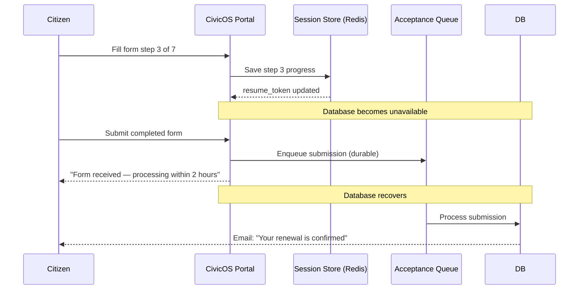

### Story Context

**Incident debrief — Thursday 2:00 PM, Week 3**

The DMV renewal service had a 4-hour outage on Wednesday. Post-mortem notes:

```
Root cause: Database connection pool exhaustion during state of California renewal
surge (license renewal deadlines cluster at end of month).

Impact:
- 12,400 citizens received error pages during the 4-hour window
- 89 citizens had reached the final step of DMV renewal (payment entered) when
  the system failed. Their payment information was cleared. They will need to
  restart the application.
- Call center received 2,147 calls during the outage window (vs. 340 normal)
- 41 citizens drove to a physical DMV office unnecessarily

Context: California required the physical DMV to stop accepting walk-ins for these
transactions precisely because CivicOS handles them online. During the outage,
there was no physical fallback.
```

**Jasmyn**: What bothers me most is the 89 citizens who had payment entered and
lost their work. These aren't like e-commerce customers who can retry in 10 minutes.
Some of them are elderly. Some drove an hour to a library with internet to do this.
Some don't speak English as a first language and needed an hour on the phone with
a relative to navigate the form. Losing their progress is not a minor UX issue.
It's a failure of the service.

**You**: The system needs to be resilient at the user level, not just the infrastructure
level. "Stateful form recovery" — preserve in-progress transactions so users can
resume from where they left off.

**Jasmyn**: Yes. And more broadly — our resilience design needs to think about the
citizen experience during degradation, not just system uptime metrics.

---

**Accessibility audit results (shared by Jasmyn, Week 3)**

```
External accessibility audit — CivicOS citizen-facing portal:

WCAG 2.1 Level AA compliance: PARTIAL (67% compliant)

Critical failures:
1. Timeout warnings not accessible to screen readers
2. Form error messages not associated with specific fields (ARIA labels missing)
3. Session timeout of 15 minutes — too short for users who read slowly or use assistive tech
4. No option for larger text or high-contrast mode
5. Multi-step forms lose progress on browser back button

Section 508 compliance (required for federal/state contracts): FAILING

ADA Title II (state government obligations): PARTIAL
```

---

**Conversation with Jasmyn, Friday**

**Jasmyn**: The accessibility failures are as important as the security findings.
Section 508 is a federal requirement for government technology. We cannot operate
government contracts with a failing 508 assessment. It's not optional.

But I want to go beyond "fix the checklist." When you design the resilience architecture,
I want you to think about the citizen who is NOT a tech-savvy 30-year-old with fast
internet and a modern browser. Design for: the 75-year-old with low vision using
a screen reader on a 2018 Android phone with a 3G connection. If the system works
for her, it works for everyone.

**You**: That's a design constraint, not just an accessibility checkbox. It means:
- Graceful degradation (the form still works if JavaScript is disabled)
- Progress preservation (losing work is catastrophic, not inconvenient)
- Session management that accommodates slow readers
- Error recovery that doesn't require the user to start over

---

**Slack DM — Marcus Webb → You, Week 3**

**Marcus Webb**
The insight Jasmyn is giving you is important. Most system design interviews and
most engineering teams optimize for the 95th percentile user. Government digital
services must optimize for the 5th percentile user — the most constrained,
the least technical, the one with the most to lose from a system failure.

"Design for your most vulnerable user" is not just an accessibility principle.
It's a systems principle. Systems that are resilient under constrained conditions
are more resilient everywhere.

What does "resilient progress for a multi-step government form" look like architecturally?
Think: server-side session, resume token, idempotent form submission...

---

### Problem Statement

CivicOS's government platform failed 89 citizens who lost in-progress form data
during a 4-hour outage, and has a failing Section 508 accessibility assessment.
You must design a resilient, accessible citizen service architecture that preserves
form progress across failures, accommodates users with diverse abilities and
connectivity, and degrades gracefully rather than catastrophically during infrastructure
issues.

### Explicit Requirements

1. Form progress must be preserved: a citizen who loses connectivity or encounters
   a system error mid-form can resume from the same step without re-entering data
2. Session timeout must be configurable per form type and accessible to screen readers:
   minimum 60 minutes for complex forms; timeout warnings must be announced via ARIA
3. System degradation plan: during a database outage, forms in progress must be
   queueable — accepted and processed when the system recovers
4. Section 508 and WCAG 2.1 AA compliance: form errors associated with specific fields,
   keyboard navigation, screen reader compatibility
5. Payment recovery: if a citizen has entered payment but the transaction fails on
   the backend, their payment details must not be stored (PCI) but their form position
   must be preserved so they only need to re-enter payment, not restart
6. Low-bandwidth mode: critical transaction forms (DMV, permits) must function with
   page sizes < 100KB and minimal JavaScript

### Hidden Requirements

- **Hint**: Marcus Webb mentioned "server-side session, resume token, idempotent form
  submission." A resume token is a cryptographically signed reference to a server-side
  session state. The citizen can bookmark it or have it emailed to them. The form
  state is on the server, not the browser. How do you expire these tokens, and what
  PII is stored in them? (Reminder: Ch. 7 HIPAA parallels apply here — citizen form
  data may include SSN, address, medical info for benefits forms.)
- **Hint**: "Queueable forms during outage" — if the database is down, you can't write
  the completed form immediately. But you can accept the form, acknowledge it, and
  process it when the system recovers. What is the citizen-facing UX for "your form
  has been accepted but not yet processed"? How do you notify them when it processes?
- **Hint**: Payment recovery without PCI risk. The scenario: citizen completes the form,
  enters payment, the backend payment service is down, the citizen sees an error.
  Next day they return. You want them to NOT have to re-enter the 40-form-field
  application, but you CANNOT store their card number (PCI). The only thing that
  persists is a Stripe PaymentIntent ID. How do you resume the payment without
  re-entering card details? (Hint: Stripe's PaymentIntent can be re-presented
  to the user without exposing the card number.)

### Constraints

- **Target users**: Citizens aged 16-90, English and Spanish speakers, low-vision,
  screen readers, mobile, 3G connections
- **Complex forms**: 15-45 minutes to complete; multiple pages; document uploads
- **Section 508**: Federal requirement, non-negotiable
- **Session timeout**: Max 15 minutes today (must increase to 60 minutes minimum)
- **Payment**: PCI-DSS scope (no card storage; Stripe tokenization)
- **Outage tolerance**: Must be able to accept form submissions during a DB outage
  and process them when DB recovers

### Your Task

Design the resilient, accessible citizen service architecture for CivicOS.

### Deliverables

- [ ] **Form progress persistence design** — architecture for server-side session
  state, resume token generation/validation, and expiry. What data is stored?
  How is it encrypted?
- [ ] **Outage queue design** — how do you accept form submissions during DB
  unavailability? What message queue? What is the citizen-facing acknowledgment?
  How does the system process the queue when DB recovers?
- [ ] **Payment recovery flow** — step-by-step: citizen completes form → payment
  step fails → citizen returns next day → how they resume payment without re-entering
  card. Show Stripe's PaymentIntent in this flow.
- [ ] **Section 508 remediation checklist** — for the top 5 critical 508 failures
  identified in the audit, describe the specific technical fix
- [ ] **Resilience design under constraint** — for a citizen with a 3G connection
  and screen reader: what is the page-weight budget per form step? What JavaScript
  is non-negotiable vs optional?
- [ ] **Tradeoff analysis** — minimum 3 tradeoffs:
  1. Client-side form state (localStorage) vs server-side session state for form progress
  2. Synchronous form processing vs async queue with "accepted but pending" state
  3. Single-page form (all fields at once) vs multi-step wizard (easier to save progress, slower overall)

### Diagram Format


