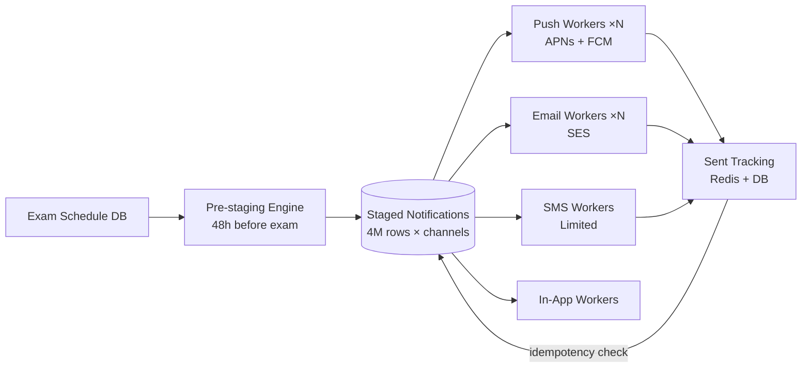

### Story Context

**#incidents — Slack, last month's finals week (shared by Obi as context)**

```
[Finals Week Incident — Harvard Law School Finals]

Monday 8:00 PM: NeuroLearn scheduled to send study reminders to 12,000 Harvard
Law students for exams starting Tuesday morning.

Monday 8:00 PM: Notification service begins processing
Monday 8:47 PM: Notification service crashes — memory exhaustion
Monday 8:47 PM: Alert fires — no on-call picks up for 8 minutes (timezone gap)
Monday 8:55 PM: On-call restarts notification service
Monday 8:55 PM: Notification service re-processes ALL 12,000 reminders from scratch
Monday 9:03 PM: 3,400 students receive duplicate notifications
Monday 9:12 PM: Notification service crashes again (same issue)
Monday 9:20 PM: On-call escalates to Obi
Monday 9:35 PM: Service stabilized; 8,700 of 12,000 students received reminders
               (some received 2-3 duplicates; 3,300 received none)

Post-mortem: The notification service loads all recipients into memory before processing.
At 12,000 recipients × average message size of 2KB = 24MB in memory, plus metadata:
total memory footprint during processing exceeds container limits.
Also: no idempotency on send attempts. Restart = re-send everything.
```

---

**Obi's brief — Monday morning, your first week**

**Obi**: Here's the full picture. We send study reminders for 380 universities.
Different universities have different exam schedules. Our notification scheduler
queues up reminders based on exam schedules. On a quiet day, we send 200k notifications
total across all channels. During the overlap of three major university finals weeks,
we send 6 million notifications in a 90-minute window.

That 90-minute window is the problem. The system can handle 200k/day. It cannot
handle 6M/90 minutes. The math: 6M / 90 min = 66,667 notifications/minute = 1,111/second.
We're designed for 40/second.

You: This is the same fan-out problem I solved at Beacon Media. Except instead of
a Champions League match, you have finals week. The difference:
- At Beacon Media: 8.5M users, but only 28% opted in to live sports alerts.
  The event is unpredictable in timing.
- At NeuroLearn: 4.2M students, 89% opted in to exam reminders.
  The timing is predictable — we know the exam schedules.

Obi: Right. Unlike Beacon, we can pre-compute and pre-stage everything.
We know MIT's finals start December 14th. We can start preparing those notifications
on December 13th.

You: That changes the architecture significantly. Pre-staging vs real-time fan-out.

---

**Notification complexity at NeuroLearn (technical brief from the platform team)**

```
Notification types:
1. Exam reminders: "Your Physics 101 exam is in 24 hours"
   Recipients: ~120 students/course × ~8,000 courses with active exams this week
   Timing: 24h and 1h before each exam
   Volume: up to 4M in 90 minutes during peak overlap

2. Study streak alerts: "You haven't studied in 3 days"
   Recipients: individualized, computed per-student
   Timing: daily, staggered by student timezone
   Volume: ~500k/day, well-distributed

3. Grade posted notifications: "Your assignment was graded"
   Recipients: individual student per event
   Timing: immediate on professor action
   Volume: ~50k/day, bursty during grading periods

4. Peer collaboration: "Your study group partner responded"
   Recipients: individual
   Timing: real-time
   Volume: ~200k/day

Channels:
- Push (iOS + Android): 3.8M enrolled devices
- Email: 4.2M email addresses
- In-app notification center: unlimited (async, stored)
- SMS (urgent only): 800k opted in
```

---

**Slack DM — Marcus Webb → You, Wednesday**

**Marcus Webb**
You've built a notification system before (Beacon Media, Ch. 20). That was
real-time fan-out for unpredictable events. This is pre-staged fan-out for
predictable events.

The key insight: when the event is predictable, you can front-load the work.
At Beacon, you couldn't pre-write 8.5M notifications before the match started —
you didn't know who would be watching.

At NeuroLearn, you DO know. You know which students are enrolled in Physics 101
at MIT. You know the exam is December 14th. You know who has opted in to push.
You can pre-write all 120 notifications for that course at any point before the
exam. When the 24h window opens, they're ready to send — not to fan out.

What changes in your architecture when "fan-out on write" happens hours or days
before the send event?

Also: the duplicate send problem at Harvard. Idempotency. You've solved this before.
Same pattern. Same fix. What's the idempotency key for a study reminder notification?

---

### Problem Statement

NeuroLearn's notification system collapses during finals week when 6 million
notifications must be sent in 90 minutes — 28x the system's designed throughput.
The system also has no idempotency, causing duplicates on crash recovery.
You must redesign the notification system to handle peak finals-week throughput
using predictive pre-staging, while maintaining idempotency across all channels.

### Explicit Requirements

1. Handle 6M notifications in 90 minutes (1,111/second sustained)
2. Pre-stage exam reminder notifications up to 48 hours before send time —
   all recipients, all personalizations computed in advance
3. Idempotency: if the notification service crashes and restarts, no student
   receives duplicate notifications
4. Channels: push (iOS/Android), email, in-app center, SMS (urgent only)
5. Study streak alerts must continue without disruption during finals week surge
6. Per-student preference management: opt-out per notification type per channel
7. Rate limiting per student per day across all notification types (prevent spamming)

### Hidden Requirements

- **Hint**: Marcus Webb described pre-staging. If you pre-write 4M notifications
  to a `notifications_staged` table 24 hours before sending, that table has
  4M rows. Each row is a specific student × exam × channel. When the send window
  opens, workers pick up rows from this table and send. What is the worker
  concurrency model? How do workers avoid picking up the same notification twice?
  (Hint: this is the same distributed work queue problem you solved at VeloTrack/CloudStack)
- **Hint**: Idempotency key for a study reminder notification. The natural key is:
  `student_id + exam_id + notification_type + send_window`. If a notification was
  sent successfully and the system crashes before marking it as sent, on restart
  it would re-send. What does "marking as sent" look like — a DB update, a Redis
  key, or both?
- **Hint**: Pre-staging 4M notifications 24 hours in advance requires knowing
  which students are enrolled in which exams 24 hours in advance. But students
  drop and add courses up to the day before an exam. How does late enrollment
  changes affect your pre-staged notifications? Do you need to support adding
  a notification to the send queue after pre-staging has already run?

### Constraints

- **Peak throughput**: 1,111 notifications/second for 90 minutes (6M total)
- **Channels**: Push (4k/s limit APNs; 50k/s FCM), Email (SES: 14k/s), SMS (100/s, expensive)
- **Pre-staging window**: Up to 48 hours before send time
- **Idempotency requirement**: Zero duplicate notifications to same user for same event
- **Student preferences**: ~4.2M preference records, updated by students at any time
- **Daily notification budget per student**: 3 push, 1 email, 1 SMS (maximum)

### Your Task

Redesign NeuroLearn's notification system for 6M/90min peak throughput with
predictive pre-staging and full idempotency.

### Deliverables

- [ ] **Architecture diagram** (Mermaid) — pre-staging pipeline (48h before) →
  staged notifications table → send workers → APNs/FCM/SES/SMS → sent tracking
- [ ] **Pre-staging algorithm** — how do you compute 4M staged notifications
  efficiently? Show the query/process that generates the notification table.
- [ ] **Idempotency design** — idempotency key structure; what "sent" state looks
  like; how crash recovery handles partially-processed batches
- [ ] **Worker concurrency model** — how many workers process staged notifications
  in parallel? How do they claim work without conflicts? (Row locking? Redis LPOP?)
- [ ] **Throughput calculation** — at 1,111/second across 4 channels, how many
  workers per channel? Show APNs capacity math (connections × 4k/s each).
- [ ] **Tradeoff analysis** — minimum 3 tradeoffs:
  1. Pre-staged fan-out on write vs real-time fan-out on read at finals-week scale
  2. Row-level locking in Postgres vs Redis-based work queue for worker coordination
  3. Per-channel separate worker pools vs unified multi-channel workers

### Diagram Format


