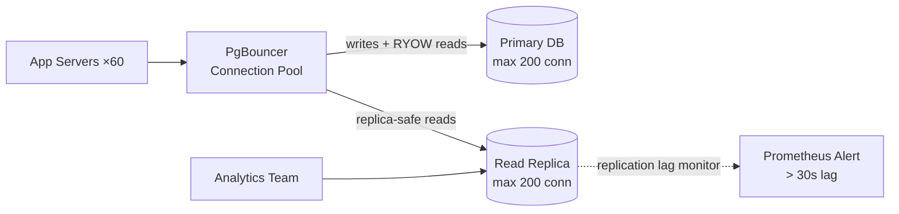

### Story Context

**#on-call — Slack, during last semester's finals week**

```
[Week 16 — Finals Period — All universities in same timezone]

Monday 9:00 PM: API P99 > 800ms (threshold: 300ms)
Monday 9:07 PM: DB connection pool saturation — 100% utilization
Monday 9:15 PM: 3,200 students reporting "study session won't load"
Monday 9:22 PM: DB primary CPU: 91%

Identified queries causing load:
1. "Get my study history for this course" — 47ms avg, run 8,200 times/minute
2. "Show all practice questions for topic X" — 210ms avg, run 4,100 times/minute
3. "Compute my current score in adaptive quiz" — 340ms avg, run 1,800 times/minute
4. "Load course recommendations" — 890ms avg, run 900 times/minute

All four are read queries. None hit the primary database for any good reason.
We have a read replica. It's being used for approximately nothing.
```

---

**Post-mortem findings shared by Obi**

```
Why is the read replica unused?

1. ORM configuration: TypeORM is configured with a single datasource pointing
   to the primary. Read replica is defined but never used.
   (This is the same problem as MeridianHealth — Ch. 9)

2. Adaptive quiz scoring: The quiz engine checks "current user score" on every
   answer submission — a read query that REQUIRES real-time data (the last answer
   just submitted). This is a legitimate write-then-read pattern; it must use primary.

3. "Load course recommendations": This is a 6-table JOIN that runs in 890ms.
   It could run on the replica but the developer "wasn't sure if the replica was
   safe to use" and left it on primary.

4. Connection pool: 15 app servers × 20 connections each = 300 desired connections.
   Primary max_connections: 200. Connection pool proxy: none.

5. Analytics queries from the learning analytics team: Run directly on primary DB
   during business hours. Nobody told them not to.
```

---

**1:1 — You & Obi, Week 1 Wednesday**

**Obi**: I know what the problem is. I need someone to fix it properly. We tried
to route some reads to the replica last semester but made a mistake — we routed
the adaptive quiz scoring queries there and students started seeing wrong scores
mid-quiz because their latest answer was on primary but the score read hit replica
before the answer had replicated. We broke the quiz engine and had to roll back.

**You**: Read-your-own-writes violation. The quiz engine writes an answer, then
immediately reads to compute a new score. The answer is on primary, the replica
hasn't caught up, the score is computed from stale data.

**Obi**: Exactly. So we rolled back all replica routing. Now we're over-loading
the primary.

**You**: The fix is more nuanced than "route all reads to replica." You need to
identify which read queries are safe to route to replica (don't need to see the
latest writes) and which are not (read-your-own-writes scenarios). Then route appropriately.

**Obi**: How do you identify which is which?

**You**: Application-level tagging, or session pinning after a write. I've done
both at MeridianHealth. Let me propose a design.

---

**Slack DM — Marcus Webb → You**

**Marcus Webb**
Read replica routing. You've done this before (MeridianHealth, Ch. 9). But there's a
nuance at NeuroLearn that didn't exist at MeridianHealth.

At MeridianHealth, the consistency requirement was clinical: "a nurse who writes a note
must immediately see it." Simple rule.

At NeuroLearn, the consistency requirement is per-student, per-session.
A student submitting an answer must see their score update immediately.
But a student browsing study materials doesn't need to see the changes another
student made 30 seconds ago.

The routing rule is: after a write by user X, route user X's reads to primary
for the next 5 seconds (enough for replication to catch up). All other reads go
to replica.

This is "sticky primary reads for the writing user, replica reads for everyone else."
Can you implement this without adding session state to every request?

---

### Problem Statement

NeuroLearn's database primary is overloaded during finals week because all reads —
including slow analytics joins and course recommendations — hit the primary despite
a read replica existing but unused. A previous attempt to route reads to replica
failed because of read-your-own-writes violations in the adaptive quiz engine.
You must design a read routing strategy that correctly distinguishes write-sensitive
reads from replica-safe reads.

### Explicit Requirements

1. Route replica-safe reads to the read replica (course recommendations, study history,
   practice question browsing, learning analytics)
2. Maintain read-your-own-writes for write-sensitive reads (adaptive quiz scoring,
   recent submission history during active quiz)
3. Implement connection pooling to prevent the 300-desired vs 200-max connection problem
4. Isolate analytics queries to the replica; prevent them from running on primary
5. Connection pool must handle finals week peak (estimate 8x normal load)
6. Replication lag monitoring: alert if replica is more than 30 seconds behind primary

### Hidden Requirements

- **Hint**: Marcus Webb described "sticky primary reads for 5 seconds after a write."
  How do you implement this without adding a round-trip? Option 1: set a short-lived
  Redis key `sticky_primary:{user_id}` on every write, check it on every read.
  Option 2: pass a "primary only" flag in the request context after a write,
  propagate it through the request chain. Which is simpler? Which is more correct?
- **Hint**: The connection pool math: 15 servers × 20 connections = 300, but primary
  max is 200. At 8x normal load (finals week), how many app servers do you autoscale
  to? If autoscaling adds 15 more servers, you'd have 30 servers × 20 connections = 600
  desired connections — still over capacity. The solution: move pool sizing from the
  app server to a shared pool proxy (PgBouncer). With PgBouncer, each app server can
  use 200 "connections" (to PgBouncer) while PgBouncer only opens 150 connections to
  Postgres. Show the calculation.
- **Hint**: Analytics team runs queries on primary "because they don't know better."
  This is a process problem, not just a technical problem. How do you technically
  prevent them from accidentally hitting primary? (Service-level network policy?
  Separate read-only analytics DB user that only has connection privileges to replica?)

### Constraints

- **App servers**: 15 normal, up to 60 during finals week (autoscaling)
- **Primary max_connections**: 200
- **Replica max_connections**: 200
- **Connection pool proxy**: PgBouncer (to be added)
- **Replication lag**: 50ms average; spikes to 3-8 seconds during peak
- **Analytics team**: 8 analysts, run ad hoc queries during business hours
- **Read replica**: 1 existing (`us-east-1`), same spec as primary

### Your Task

Design the read replica routing strategy and connection pool architecture for
NeuroLearn's finals week load.

### Deliverables

- [ ] **Read routing decision matrix** — for each query type (quiz scoring,
  study history, course recommendations, practice questions, analytics):
  route to primary vs replica, with justification
- [ ] **Sticky primary implementation** — show the Redis key structure and
  application middleware for "route to primary for 5 seconds after a write"
- [ ] **PgBouncer sizing calculation** — at 60 app servers × 20 pool each = 1,200
  desired connections: how does PgBouncer translate this to 200 actual DB connections?
  Show the PgBouncer config parameters.
- [ ] **Analytics isolation design** — technical mechanism to prevent analytics
  queries from hitting primary
- [ ] **Replication lag monitoring** — metric to track lag, alert threshold, and
  fallback behavior if lag exceeds 30 seconds
- [ ] **Tradeoff analysis** — minimum 3 tradeoffs:
  1. Session-pinning to primary (safe but wastes replica capacity) vs per-query
     routing (efficient but complex)
  2. PgBouncer (self-managed, lightweight) vs RDS Proxy (managed, more expensive)
  3. Hard route decision (routing code in ORM) vs proxy-level routing (transparent to app)

### Diagram Format


