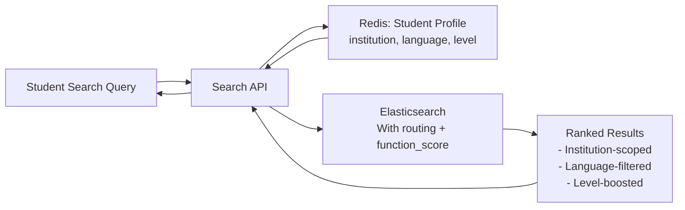

### Story Context

**Student feedback email (forwarded by Obi, Week 2)**

```
From: Maya Oduya (student, University of Lagos campus)
To: NeuroLearn Support
Subject: Search is broken for me

Hello,

I've been using NeuroLearn for two years. The search used to be okay.
Now when I search for "thermodynamics laws," I get results from chemistry
courses at universities I've never attended and study notes in French and
Portuguese (I study in English).

I also searched for "mitochondria" and got flashcards from a medical school course
that uses completely different terminology than my undergraduate biology course.
The content was technically correct but completely unhelpful at my level.

My university (University of Lagos) has its own NeuroLearn instance. Why am I
seeing content from other universities?

Thanks,
Maya
```

---

**Technical investigation — Week 2**

The search system is Elasticsearch (deployed 18 months ago). You pull the index
mapping:

```
Index: neurolearn_content
Documents: 48M (flashcards, practice questions, study notes, lecture summaries)
Languages: 23 languages (index treats them all as one)
Institutions: 380 universities (no per-institution routing)
Content levels: undergraduate, graduate, professional (no level field in index)
User context in queries: none (search is executed as anonymous — no user context sent)

Recent problems:
1. Cross-institution content leakage: Maya's issue above — no institution scoping
2. Language mixing: results in French appearing for English-language searches
3. Level mismatch: medical-level content returned for undergraduate queries
4. Relevance drift: as content grew from 5M to 48M docs, results quality degraded
   because early flashcards were over-indexed (more interactions = higher score)
5. The query: simple match query with no field boosting, no user context

Current query:
  {
    "query": {
      "multi_match": {
        "query": "thermodynamics laws",
        "fields": ["title", "content", "tags"]
      }
    }
  }
```

---

**1:1 — You & Obi, Week 2 Thursday**

**Obi**: When we had 5M documents, the search was acceptable. At 48M, the relevance
signals that worked at 5M are diluted. There are just more documents matching any
given query, and we have no way to distinguish "this is a good match for Maya specifically"
from "this technically matches the term."

**You**: At PulseCommerce (Ch. 33), I dealt with the relevance problem for products.
The answer was function_score queries with business-context signals: in-stock, conversion rate,
merchant boost. Here, the equivalent signals are: institution match, language match,
content level match, interaction rate for this user's course level, and recency.

**Obi**: Can you implement all of that?

**You**: The institution and language filtering is straightforward — filter, not scoring.
Level and interaction rate require user context in the query. We'd need to pass
user profile data to the search service. That's the architecture change.

**Obi**: We've never done that. Search is stateless right now.

**You**: Right. And that's a reasonable design for public search. But NeuroLearn's
content is not public — it's personalized by institution, language, and academic level.
Passing user context to search is the right move.

---

**Slack DM — Marcus Webb → You**

**Marcus Webb**
You saw this problem at PulseCommerce (Ch. 33). Product search needed merchant context.
Educational search needs student context. Same pattern. Different signals.

The new dimension here: personalized search at 48M documents with user context
is a recommendation problem, not just a search problem. You're not finding "all
documents that match this query" — you're finding "all documents that match this
query AND are appropriate for this student's context."

The architecture question: does user context go into the Elasticsearch query at
search time, or is it used to pre-filter the corpus before search runs?
Pre-filtering (index per institution, or per-institution routing) is efficient.
Context injection (pass user profile into function_score) is flexible.
These are not mutually exclusive.

What happens to your index design if you go per-institution? 380 institutions × 48M/380 avg
= ~126k documents per institution. Index per institution changes everything.

---

### Problem Statement

NeuroLearn's Elasticsearch content index has grown to 48M documents across 380 institutions
and 23 languages, causing cross-institution content leakage, language mixing, and
relevance degradation. The search system has no user context and cannot distinguish
appropriate content for a specific student's institution, language, or academic level.
You must redesign the search architecture to provide institution-scoped, language-aware,
level-appropriate results.

### Explicit Requirements

1. Institution scoping: students only see content from their own institution (or explicitly shared)
2. Language filtering: results must match the student's preferred language by default
3. Academic level matching: undergraduate content ranked above graduate/professional
   content for undergraduate students (configurable per query)
4. User context in search: pass student profile (institution, language, level) to queries
5. Relevance signals: interaction rate within student's institution > global interaction rate
6. Handle 48M documents growing to 100M within 18 months
7. Search latency: P99 < 200ms at current load; maintain at 100M documents

### Hidden Requirements

- **Hint**: Marcus Webb asked about per-institution index vs context injection.
  Per-institution index (380 indices) makes institution filtering free (just search
  the right index). But 380 indices × management complexity × index overhead =
  operational nightmare. The middle path: Elasticsearch index aliases with routing.
  You use one index with an `institution_id` field, but route queries to specific
  shards based on institution_id. Less overhead than 380 indices, faster than
  filtering all 48M documents. How does Elasticsearch routing work with aliases?
- **Hint**: "Relevance drift as content grew from 5M to 48M." The drift is caused
  by early content having more interaction signals than new content. A flashcard
  created in 2020 has 3 years of student interactions; one created in 2024 has none.
  How do you normalize interaction rate for document age? (Hint: interaction rate
  decay function — decay recent-created documents less harshly)
- **Hint**: "Search latency P99 < 200ms at 100M documents." With 100M docs on the
  same cluster, query time increases roughly logarithmically with doc count. At
  48M with 200ms P99, what cluster upgrade (more nodes? more shards?) keeps you
  within SLA at 100M?

### Constraints

- **Current documents**: 48M; target: 100M in 18 months
- **Institutions**: 380, each with isolated content (with institution-defined sharing rules)
- **Languages**: 23 (English dominant at 70%, French 12%, Spanish 8%, others 10%)
- **Students**: 4.2M; search queries: ~200k/day
- **Current cluster**: 6-node Elasticsearch (same size as PulseCommerce — you know the topology)
- **User context**: Student profile available in Redis (institution_id, language, level)
- **Search latency SLA**: P99 < 200ms

### Your Task

Redesign NeuroLearn's Elasticsearch search architecture for personalized, institution-scoped,
language-aware academic content search.

### Deliverables

- [ ] **Index architecture diagram** (Mermaid) — show the index strategy, shard routing,
  and per-institution scoping approach
- [ ] **Elasticsearch query design** — show the full query including: institution routing,
  language filter, level boost, interaction rate decay function, and user-context signals
- [ ] **User context injection design** — how does the search API retrieve the student
  profile (from Redis?) and inject it into the Elasticsearch query?
- [ ] **Relevance decay formula** — how do you normalize interaction rate for document age?
  Show the mathematical formula and the Elasticsearch function_score implementation.
- [ ] **Cluster scaling plan** — at 100M documents, what is your cluster size? How many
  shards? How many nodes? Maintain P99 < 200ms.
- [ ] **Tradeoff analysis** — minimum 3 tradeoffs:
  1. Per-institution index (380 indices) vs routing key (one index, institution routing)
  2. User context in search query (personalized, slower) vs post-search filtering (faster, less personalized)
  3. Interaction-rate-based relevance (popularity bias) vs content-similarity-based relevance (quality bias)

### Diagram Format


