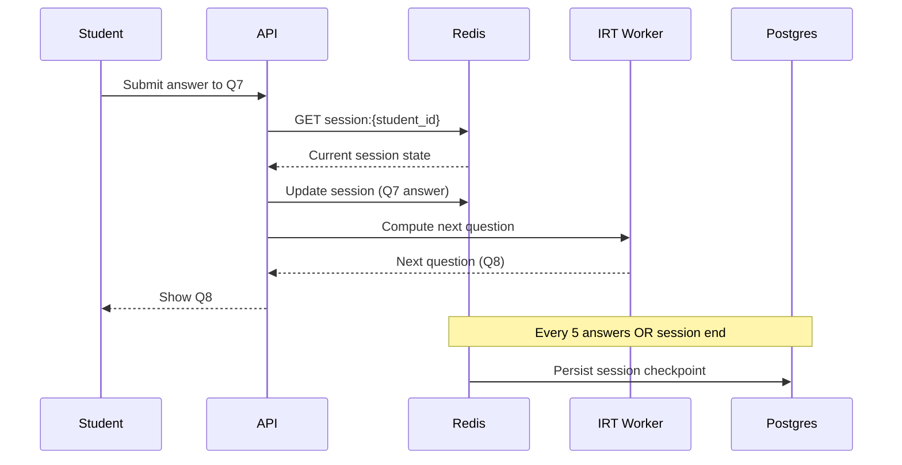

### Story Context

**Product spec review — Week 3, Wednesday**

**Obi Mensah**: The adaptive quiz engine is our core product differentiator.
Most quiz platforms show fixed question sets. We use Item Response Theory (IRT) —
an algorithm that estimates a student's knowledge level from their answers and
selects the next question to maximize information gain. The better the student performs,
the harder the next question. The algorithm requires real-time computation after
every answer.

You review the current implementation:

```
Current adaptive quiz flow (per answer submission):

1. Student submits answer to question N
2. Backend receives answer
3. Load student's answer history for this quiz session (DB query)
4. Load all questions in the question bank for this course (~2,000 questions, full load)
5. Run IRT algorithm (in-process, Node.js) — takes 80-120ms
6. Select next question
7. Update student score and position in DB
8. Return next question to student

Problem: Steps 3-4 are slow:
  - Step 3: 35ms (read all answers for this session from DB)
  - Step 4: 480ms (load 2,000 questions with metadata from DB — NOT cached)
  - Step 5: IRT algorithm runs in 80-120ms
  - Total: ~600ms per answer submission

During finals week, 40,000 concurrent quiz sessions → 40,000 answer submissions/minute
→ Step 4 (480ms DB query for 2,000 questions) × 40,000/minute = DB killing itself
```

---

**Your analysis — Week 3 Thursday**

Three problems in the adaptive quiz engine:

**Problem 1: Question bank not cached**
The 2,000-question question bank for a course is loaded from DB on every single
answer submission. This is the expensive query killing the DB. The question bank
changes rarely — maybe once a week when a professor adds questions. It should be cached.

**Problem 2: Session state in DB**
Quiz session state (current position, answers given, current IRT estimate) is
read from and written to the DB on every answer. With 40,000 concurrent sessions,
that's 40,000 read-write cycles per minute to the DB for session state.
This state could live in Redis during the active quiz session.

**Problem 3: IRT algorithm single-threaded in Node.js**
The IRT computation takes 80-120ms per answer. In Node.js's event loop, this
blocks request processing for that duration. At 40,000 submissions/minute,
you need 40,000 IRT computations/minute = ~667/second. Each taking 80-120ms.
The event loop cannot handle this without workerThreads or offloading.

---

**Slack DM — Marcus Webb → You**

**Marcus Webb**
You're solving three problems: caching, session state management, and computation offloading.
Each is a well-known pattern.

But there's a fourth problem you haven't named yet: consistency at session end.

At the end of a quiz session, the final score, the questions answered, and the IRT
knowledge estimate need to be durably written to Postgres (for academic records,
for the learning analytics dashboard, for the professor's gradebook). If the
session state is in Redis during the quiz, what happens if the student's quiz
ends (normally or because of a crash) and the Redis data needs to be persisted?

What's the persistence strategy for going from "live session in Redis" to
"completed quiz record in Postgres"?

Also: academic integrity. If a student's session state is in Redis, can they see
their IRT estimate and use it to "choose" answers? The IRT estimate should be
opaque to the student. Where does that opacity get enforced?

---

### Problem Statement

NeuroLearn's adaptive quiz engine has three performance bottlenecks: the 2,000-question
bank loaded from DB on every answer submission (480ms), quiz session state read/written
to DB on every answer (DB write amplification), and the IRT computation blocking Node.js
event loop. At 40,000 concurrent sessions during finals week, these combine to kill the
database. You must redesign the quiz engine architecture for peak load while maintaining
data durability and academic integrity.

### Explicit Requirements

1. Question bank loading: < 5ms per answer submission (from 480ms) — cache the question bank
2. Session state: maintain in Redis during active session; reduce DB writes to
   one write at session end (not every answer)
3. IRT computation: offload from Node.js event loop; target < 50ms response after answer
4. Final session state must be durably persisted to Postgres at session end — no data loss
5. IRT knowledge estimate must not be exposed to students in API responses
6. Support 40,000 concurrent quiz sessions during finals week
7. Session recovery: if a student loses connection mid-quiz, they can resume from their
   last answer (no repeated questions, no score reset)

### Hidden Requirements

- **Hint**: Marcus Webb raised persistence from Redis to Postgres at session end.
  What happens if the student closes their browser at question 8 and never submits
  the final answer? Is the session "ended"? Should partial sessions be saved?
  The academic integrity case: a student might intentionally close to avoid a bad
  score. Does closing the browser constitute quiz completion? Your persistence
  design needs a session expiry policy.
- **Hint**: "Session recovery — resume from last answer." The session state in Redis
  includes: questions already shown, answers given, current IRT estimate. If the
  student reconnects, you load this from Redis and continue. But Redis is volatile —
  if it restarts, the session is gone. How do you provide durability for in-progress
  sessions without writing to Postgres on every answer?
- **Hint**: "IRT computation offloading." Options: Node.js worker threads (same process,
  separate thread), a dedicated IRT computation microservice (separate deployment),
  or pre-computing the next question in the background while the student is reading
  the current question (hide latency). Which approach works at 667 computations/second?

### Constraints

- **Concurrent sessions**: 40,000 during finals week peak
- **Question bank size**: ~2,000 questions per course; ~8,000 courses active
- **IRT computation time**: 80-120ms (JavaScript)
- **Session duration**: 15-90 minutes
- **Answer submission rate**: 1 answer/30-60 seconds per student (human-paced)
- **Redis instance**: 8GB RAM available for quiz session state
- **Academic integrity**: IRT knowledge estimates must not be exposed to students

### Your Task

Redesign the adaptive quiz engine for 40,000 concurrent sessions with session state
in Redis, cached question banks, and offloaded IRT computation.

### Deliverables

- [ ] **Architecture diagram** (Mermaid) — answer submission → Redis session update →
  IRT worker → next question → background: periodic Redis-to-Postgres sync
- [ ] **Question bank caching design** — cache key structure, TTL, invalidation on
  professor adding a question. Show memory footprint at 8,000 courses × 2,000 questions.
- [ ] **Redis session state schema** — what fields does each session entry contain?
  How is it structured (Hash? String?)? Key expiry policy.
- [ ] **Persistence strategy** — how does "live Redis session" become "completed Postgres record"?
  Show the flush mechanism for normal completion, timeout, and crash recovery.
- [ ] **IRT offloading design** — which approach (worker threads, microservice, pre-computation)?
  Show the concurrency model at 667 computations/second.
- [ ] **Tradeoff analysis** — minimum 3 tradeoffs:
  1. Redis session state with periodic Postgres sync vs write-through to Postgres on every answer
  2. Worker threads vs dedicated IRT microservice for computation offloading
  3. Pre-computing next question while student reads current question vs on-demand computation

### Diagram Format


