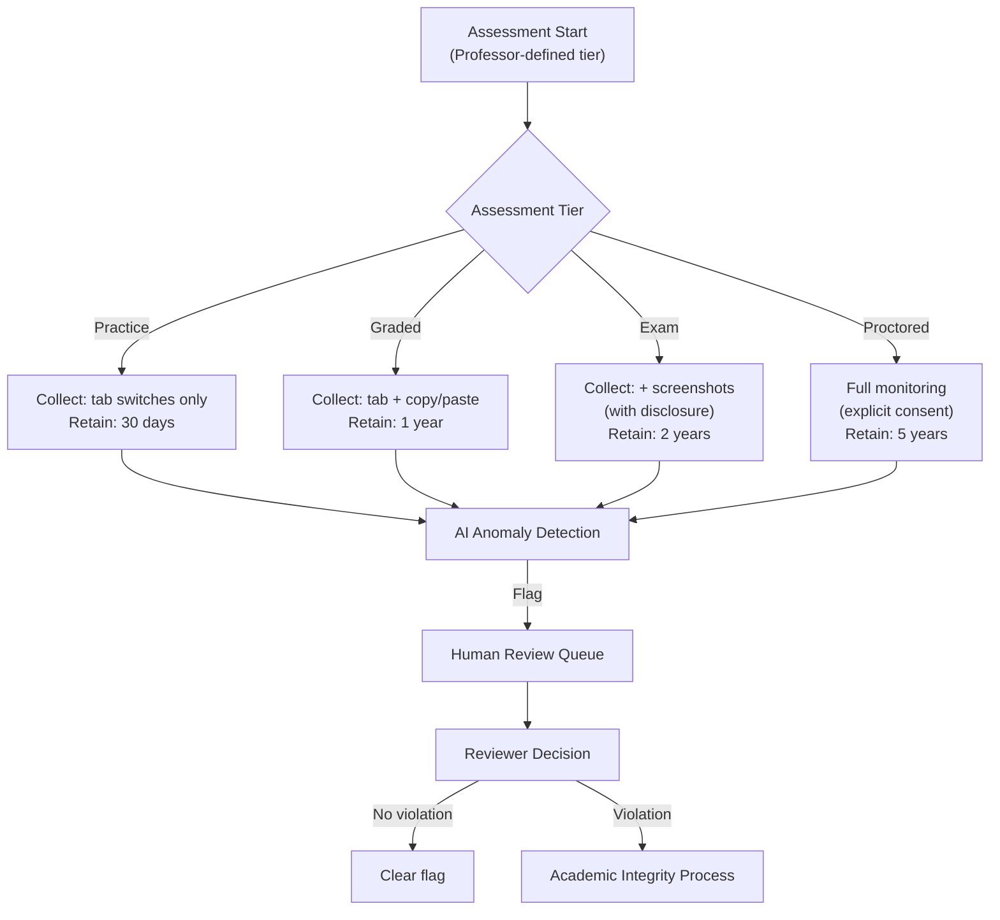

> **SPIKE CHALLENGE — DESIGN REVIEW AMBUSH**
> You've been working on notification and DB fixes for 3 weeks. Obi said
> there was a "third problem." This is it. And it's more complex than he let on.

---

### Story Context

**Slack DM — Obi → You, Friday Week 3, 4:45 PM**

**Obi**
Hey — I've been putting off telling you about the third problem because I wanted
you to get your feet under you first. But we can't wait any longer.

Monday I'm presenting our academic integrity monitoring system to the University
of Toronto, Oxford, and MIT consortium. They want to evaluate it for adoption.
These are three of the most prestigious academic institutions in the world.
They have strong opinions about both academic integrity AND student privacy.

Our current system "monitors" students during online assessments. But when I
say "monitors," I mean: it records keystrokes, takes random screenshots, detects
tab switching, and logs mouse movements. For unproctored quizzes.

The Oxford representative emailed me yesterday. She used the words
"surveillance infrastructure" and "not fit for academic deployment."

I need you to understand the current system, understand what these universities
need, and help me design something defensible. Monday morning. Can you spend
the weekend on it?

---

**Current academic integrity system (technical overview you pull Saturday morning)**

```
NeuroLearn Academic Integrity Module — Technical Summary:

Monitoring capabilities:
1. Keystroke logging: every keystroke during assessment captured and sent to backend
2. Screenshot capture: random screenshots every 30-60 seconds, stored in S3
3. Tab/window switching: browser events detected via JavaScript visibility API
4. Mouse movement tracking: pointer coordinates logged at 10Hz
5. Copy/paste detection: clipboard events intercepted
6. Second device detection: browser fingerprinting + IP correlation
7. AI plagiarism: text submissions compared against corpus

Data stored:
- Keystroke logs: per-assessment, per-student
- Screenshots: per-assessment, stored for 2 years
- Mouse data: per-assessment, stored for 6 months
- All behavioral data: stored in S3 with student_id + assessment_id key

Data access:
- Professors: can review all data for any assessment in their course
- NeuroLearn staff: full access (for debugging and support)
- Students: no access to their own data

Consent mechanism:
- Students see: "By starting this assessment, you agree to NeuroLearn's
  assessment monitoring policy." Link to 40-page terms of service.
- Students cannot opt out of monitoring while taking an assessment.
```

---

**Oxford's specific concerns (email forwarded by Obi)**

```
From: Dr. Helena Fitzgerald (Oxford, Centre for Teaching & Learning)
To: Obi Mensah

My concerns with the current NeuroLearn academic integrity system:

1. Proportionality: keystroke logging and screenshot capture for an unproctored
   online quiz is disproportionate to the academic stakes. This data collection
   level is appropriate for a final exam, not a 10-question practice quiz.

2. Student data rights: UK GDPR (and US FERPA) require that students can access
   and request deletion of personal data. NeuroLearn stores behavioral data for
   2 years with no student access. This is likely non-compliant.

3. Data minimization: the system collects everything. It should collect only what
   is needed to assess academic integrity. Most of the collected data is never
   reviewed by anyone.

4. Algorithmic fairness: AI flagging systems have documented bias against
   non-native English speakers, students with certain disabilities, and students
   in non-standard home environments (e.g., typing while sick, typing on a mobile).
   What is NeuroLearn's process for human review of AI flags?

5. Transparency: students do not know what specific behaviors are flagged,
   what the thresholds are, or what happens when they are flagged.

I am supportive of tools that help maintain academic integrity. I am not supportive
of surveillance infrastructure masquerading as educational technology.
```

---

**Slack DM — Marcus Webb → You, Saturday morning**

**Marcus Webb**
Academic integrity monitoring. You've dealt with compliance before — PCI, HIPAA,
FedRAMP. This one adds a new dimension: ethical design.

The Oxford professor is right. There's a difference between "detecting academic
dishonesty" and "surveilling students continuously." The first is a narrow,
justified purpose. The second is overreach.

The technical question is: what is the minimum data you need to detect
academic dishonesty, and how do you collect only that?

For tab-switching detection: yes, a tab switch during an exam is suspicious.
Store: (tab_switch_event, timestamp, duration_away). You don't need keystroke logs.
For plagiarism: compare submitted text against corpus. You don't need mouse coordinates.
For high-stakes proctored exams: yes, screenshots may be justified. For practice quizzes: no.

This is also a product design problem, not just a systems problem. The architecture
should be data-minimization-first: collect what you need, keep it only as long as needed,
give students access to their own data, and have a human review process for AI flags.

---

### Problem Statement

NeuroLearn's academic integrity monitoring system collects disproportionate student
behavioral data (keystroke logs, screenshots, mouse movements) for all assessment types
including practice quizzes, has no GDPR/FERPA-compliant data access mechanism for
students, provides no transparency into flagging thresholds, and has no human review
process for AI-generated flags. You must redesign the system to be proportionate,
privacy-compliant, transparent, and defensible to Oxford, MIT, and University of Toronto.

### Explicit Requirements

1. Monitoring proportionality: define data collection tiers by assessment type
   (practice quiz vs graded assignment vs final exam vs high-stakes proctored)
2. Data minimization: collect only the minimum data needed per tier
3. Student data rights: students can access their own monitoring data, request
   deletion of practice quiz data, and see what was flagged about their sessions
4. Human review: AI-flagged sessions must have a human review step before any
   academic integrity consequence
5. Transparency: students see what monitoring is active before starting an assessment
6. GDPR/FERPA compliance: data retention periods defined per tier; automatic deletion
   when retention period expires
7. Algorithmic fairness documentation: what biases are known, what accommodations exist

### Hidden Requirements

- **Hint**: "Assessment tiers" — you need to design the monitoring configuration per
  tier. But who sets the tier for each assessment? The professor (who creates the
  quiz) should choose: "this is a low-stakes practice quiz" vs "this is a final exam."
  What's the UI/configuration model for professors? And what prevents a professor
  from setting high-stakes monitoring on a practice quiz?
- **Hint**: FERPA (US) gives students the right to access "education records."
  Behavioral monitoring data (keystrokes, screenshots) may qualify as an education
  record under FERPA — legal interpretation varies. Your system should be designed
  as if they DO qualify, which means: retention policy, access portal, deletion
  mechanism. What does the student-facing data access portal look like?
- **Hint**: Dr. Fitzgerald raised "algorithmic fairness — non-native English speakers."
  If a student types slowly and has more "unusual typing patterns" (measured against
  a US-English speaker baseline), the system may flag them unfairly. How do you
  measure and mitigate this? (Hint: per-student baseline, not global baseline, for
  behavioral anomaly detection)

### Constraints

- **Institutions targeted**: Oxford (UK — GDPR), MIT + U of T (US/Canada — FERPA/PIPEDA)
- **Assessment tiers**: Practice, Graded, Exam, High-Stakes Proctored (4 tiers)
- **Data retention**: Practice: 30 days; Graded: 1 year; Exam: 2 years; Proctored: 5 years
- **Student data access**: Must be downloadable within 30 days of request (GDPR Article 20)
- **AI flagging**: Flag for human review only; no automatic consequence
- **Screenshots**: Only permitted for Exam and Proctored tiers; require explicit
  additional consent disclosure

### Your Task

Design the redesigned academic integrity monitoring architecture — privacy-compliant,
proportionate, transparent, and defensible to the three university consortium.

### Deliverables

- [ ] **Monitoring tier data model** — define exactly what is collected at each tier:
  Practice (tab switches only?), Graded (+copy/paste), Exam (+screenshots with consent),
  Proctored (+full monitoring with explicit disclosure)
- [ ] **Student data access architecture** — how does a student request their data?
  What does the portal show? How is deletion handled per tier?
- [ ] **AI flagging + human review workflow** — when the AI flags a session, what
  happens next? Show the review queue, the reviewer interface, and the consequence chain.
- [ ] **Retention and deletion pipeline** — automated deletion after retention period;
  what does the deletion record look like (you can't delete the fact that monitoring
  occurred, only the data itself)?
- [ ] **Bias mitigation design** — per-student behavioral baseline vs global baseline
  for anomaly detection. How is the baseline established for a new student?
- [ ] **Transparency UX specification** — what does the student see before starting
  each assessment tier? Write the disclosure text for the Exam tier.
- [ ] **Tradeoff analysis** — minimum 3 tradeoffs:
  1. Comprehensive monitoring (more data, more flags) vs minimization (less data, fewer false positives)
  2. Real-time AI flagging vs post-assessment batch analysis (latency vs server load)
  3. Student-accessible monitoring data (privacy-compliant) vs restricted access (easier to build, not compliant)

### Diagram Format


