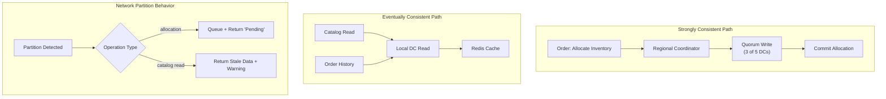

### Story Context

**Architecture briefing — Day 1, Monday 10:00 AM**

**Kwame Asante**: Let me show you the incident that made me hire you.

He pulls up a Confluence post-mortem:

```
INCIDENT: Inventory Double-Allocation
Date: September 12th
Duration: 4 hours until detected; 3 days to resolve

Sequence of events:
09:00 AM GMT: Client Ford Motor buys 10,000 steel fastener units from OmniLogix.
  - Order processed by North America DC (primary region for Ford)
  - Inventory reserved: 10,000 units from EU Supplier Depot
  - Inventory counter decremented in NA data center: 15,000 → 5,000 units

09:03 AM GMT: Network partition between NA and EU data centers.
  - EU, APAC, and SEA data centers lose connection to NA
  - EU data center still shows 15,000 units (hasn't received NA's decrement yet)

09:05 AM GMT: Client BMW buys 8,000 steel fastener units.
  - Order processed by EU data center (primary region for BMW)
  - EU inventory shows 15,000 units (stale due to partition)
  - Inventory reserved: 8,000 units from the SAME EU Supplier Depot
  - Inventory counter decremented in EU data center: 15,000 → 7,000 units

09:47 AM GMT: Network partition heals.
  - NA and EU data centers sync
  - Combined decrement: 15,000 - 10,000 - 8,000 = -3,000 units
  - ALERT: Inventory below zero — double allocation detected

09:47 AM → 12:15 PM GMT: Incident investigation
12:15 PM GMT: Decision: fulfill Ford order; cancel BMW order; explain to BMW

BMW penalty: $240,000 contract penalty for failed order
Ford: unaffected (order fulfilled)
EU Supplier: not at fault; not overcharged
```

**Kwame**: The technical problem is clear. We chose availability over consistency.
When the partition happened, EU processed orders using stale data. We should have
refused the BMW order until we could confirm inventory with NA. But if we did that
— stopped accepting all orders during network partitions — we'd be unavailable for
hours every year. Supply chain clients can't tolerate that either.

**You**: This is the CAP theorem, in a $240,000 lesson.

**Kwame**: Exactly. I need you to design a system that makes the right tradeoff.
Not "always consistent" or "always available." Somewhere defensible in between.

---

**Current distributed architecture**

```
14 Data Centers: NA-1 (primary), NA-2, EU-1, EU-2, APAC-1, APAC-2, APAC-3,
                 SEA-1, SEA-2, SA-1, LATAM-1, LATAM-2, IN-1, ME-1

Replication: PostgreSQL streaming replication
  - Each DC has a primary + 1 local replica
  - Cross-DC replication: async (average lag: 150ms EU↔NA, 400ms APAC↔NA)
  - On network partition: each DC operates independently (no consensus)

Current consistency model: "Eventual consistency with last-write-wins"
  - On partition heal: Postgres WAL-based conflict resolution
  - Conflict resolution: newer timestamp wins
  - Problem: Both Ford and BMW orders had valid timestamps; neither "lost"

Order volume:
  - 45,000 orders/day across all regions
  - Peak: 800 orders/minute (global, distributed across regions)
  - Per-region average: ~3,200 orders/day

Network partition frequency:
  - Minor (< 1 minute): ~12/month
  - Moderate (1-60 minutes): ~3/month
  - Major (> 60 minutes): ~1/quarter
```

---

**Slack DM — Marcus Webb → You, Day 2**

**Marcus Webb**
The CAP theorem. You've been building systems for years and this is your first
explicit confrontation with it. Let me be precise.

CAP says: in a distributed system, during a network partition, you must choose
between Consistency and Availability. You cannot have both.

OmniLogix chose Availability. Every region kept accepting orders during the partition.
The price: the BMW double-allocation.

If they had chosen Consistency: when the NA↔EU partition started at 09:03, EU would
have stopped accepting inventory-related orders until the partition healed. BMW would
have been told "cannot process order — system unavailable." BMW's order: never placed.
Ford: fulfilled. BMW: angry but not double-allocated. $240k penalty: avoided.

The practical question is not "C or A" — it's "for which operations do we need
strong consistency, and for which can we tolerate eventual consistency?"

Reading a catalog (prices, product descriptions): eventual consistency is fine.
Allocating specific inventory units: strong consistency required.
Processing a payment: strong consistency required.
Viewing an order history: eventual consistency is probably fine.

Draw the line. Decide per operation.

---

### Problem Statement

OmniLogix's multi-region architecture chose availability over consistency during
network partitions, resulting in a double-allocation incident that cost $240,000
in penalties. The system must be redesigned to provide strong consistency guarantees
for inventory allocation operations while maintaining high availability for read-heavy
operations. The design must be explicit about the CAP tradeoff per operation type.

### Explicit Requirements

1. Inventory allocation must be strongly consistent: allocating inventory from a supplier
   depot must prevent double-allocation even during network partitions
2. Non-allocation operations (catalog reads, order history, reporting) may use eventual
   consistency for performance
3. During a network partition, strongly-consistent operations must fail gracefully
   (not double-allocate) — acceptable to return "system unavailable for allocation"
4. Partition heal must be automatic — no manual intervention needed for conflict resolution
5. Define the maximum acceptable time for a strongly-consistent allocation operation (latency SLA)
6. Support the current order volume: 800 orders/minute peak globally

### Hidden Requirements

- **Hint**: Marcus Webb described the per-operation consistency choice. But "strong
  consistency for inventory allocation" across 14 data centers is expensive — it
  requires consensus (Paxos/Raft) or a centralized coordinator. What is the
  performance cost of a consensus-based allocation that must contact a quorum
  of data centers before committing? With 150ms EU↔NA latency, what is the
  minimum allocation operation latency if you need a quorum of 3 data centers?
- **Hint**: "Fail gracefully during partition — return unavailable." The OmniLogix
  clients (Ford, BMW) have their own systems that depend on OmniLogix. What does
  "system unavailable for allocation" look like in their workflow? Is there a grace
  period where OmniLogix can queue orders and process them when partition heals?
  At what partition duration does queuing become unacceptable?
- **Hint**: The current conflict resolution is "newer timestamp wins." This failed
  because both Ford and BMW had valid timestamps. What conflict resolution strategy
  works for inventory allocation? (Hint: inventory allocation is not a last-write-wins
  problem — it's a counting problem. The solution involves treating allocations as
  append-only events and computing current inventory as a sum.)

### Constraints

- **Data centers**: 14 globally; cross-DC latency range: 50ms to 600ms
- **Network partition frequency**: ~3 moderate (1-60 min) partitions/month
- **Order volume**: 800 orders/minute peak
- **Allocation latency SLA**: < 500ms P99 (current is ~80ms without consistency — you're adding latency)
- **Partition duration tolerance**: If partition > 30 minutes, clients can accept "queued" status
- **Client SLA**: No double-allocations. Zero. This is the hard requirement.

### Your Task

Design the consistency model for OmniLogix's multi-region inventory allocation system.
Define the per-operation consistency tier and the architecture that enforces it.

### Deliverables

- [ ] **CAP analysis table** — for each operation type (inventory allocation, order
  creation, catalog read, order history, payment, reporting), list: consistency
  requirement, availability behavior during partition, rationale
- [ ] **Consistency architecture diagram** (Mermaid) — show the strongly-consistent
  allocation path (which DCs are involved, what consensus looks like) vs the
  eventually-consistent read path
- [ ] **Inventory as append-only events** — design the event-sourced inventory model:
  instead of a `inventory_count` number, model inventory as a stream of allocation and
  release events. Current count = sum of all events. How does this model prevent
  double-allocation?
- [ ] **Partition behavior specification** — for each partition scenario (minor, moderate,
  major), what is the system's behavior? What does the client see? When do queued orders
  process?
- [ ] **Consensus mechanism selection** — Paxos, Raft, or a lighter-weight approach
  (e.g., fencing tokens + single writer per inventory depot)? Show your reasoning.
- [ ] **Latency impact analysis** — at 150ms EU↔NA latency, what is the minimum
  consensus-required allocation latency? Is this within the 500ms SLA?
- [ ] **Tradeoff analysis** — minimum 3 tradeoffs:
  1. Strong consistency for all operations vs per-operation consistency tiers
  2. Consensus-based allocation (complex, slower) vs single-writer per region (simpler, regional SPOF)
  3. Optimistic allocation (allow and detect conflict) vs pessimistic allocation (prevent conflict)

### Diagram Format


