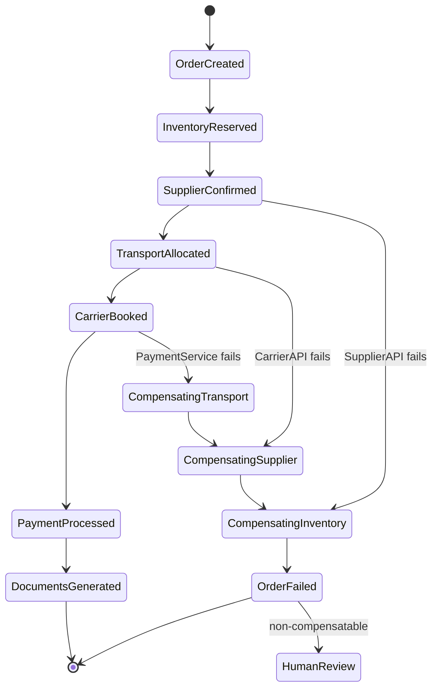

### Story Context

**Architecture deep dive — Week 1, Wednesday**

**Kwame**: Now that you understand the CAP problem at the data layer, let me show
you the transaction problem at the application layer.

A single supply chain order at OmniLogix involves 7 services. Not one of them is
controlled by OmniLogix alone — three are third-party APIs.

```
Order fulfillment flow (current state):

1. OrderService: Create order record
2. InventoryService: Reserve inventory from supplier depot
3. SupplierAPI (external): Confirm order with physical supplier (HTTP call to supplier's API)
4. TransportService: Allocate transport capacity (truck/ship/air freight booking)
5. CarrierAPI (external): Book with physical carrier (HTTP call to carrier's API)
6. PaymentService: Process payment or issue invoice
7. DocumentService: Generate customs documentation, bill of lading

If step 3 (SupplierAPI) fails: we have an inventory reservation but no supplier confirmation.
If step 5 (CarrierAPI) fails: we have a supplier confirmation but no transport.
If step 6 (PaymentService) fails: everything is booked but we can't charge the client.

Currently: each service calls the next in sequence. On failure, manual operations
team intervention. We have 12 engineers in an "order operations" team whose job
is to manually fix broken multi-step orders. They fix ~300 orders/day.
That's 300 orders/day that the system can't handle itself.
```

---

**Conversation with the order operations team lead, Adaora Nwosu, Thursday**

**Adaora**: You want to automate us out of a job?

**You**: I want to automate the mechanical part of your job — detecting and recovering
from failures — so you can focus on the ones that actually need human judgment.
The 300 failures per day — what percentage require actual business decision-making?

**Adaora**: Maybe 20%. The other 80% are cases where a service timed out and
we just retry. Or where the carrier didn't respond and we need to try a different carrier.
That stuff doesn't need a person.

**You**: Right. The saga pattern handles those 80%. The compensating transactions
handle the automatic rollbacks. You handle the 20% that require genuine judgment.

**Adaora**: What's the saga pattern?

**You**: Instead of one big transaction across 7 services, you design each step
as a reversible action with a compensating action. If step 5 fails, you run the
compensating action for step 4 (cancel the transport allocation), then step 3
(cancel the supplier confirmation), then step 2 (release the inventory). Each step
is independently idempotent and reversible.

**Adaora**: And if the saga itself crashes halfway through compensation?

**You**: That's the key design challenge.

---

**Slack DM — Marcus Webb → You**

**Marcus Webb**
Saga pattern. I designed one for a global bank in 2016. The technical implementation
is not the hardest part. The hardest part is defining the compensating actions correctly.

For inventory: "release reservation" is the compensating action for "reserve inventory."
But what if the inventory was already shipped when you try to release? The real world
has moved on. The compensation must handle "too late to compensate."

For payment: "issue refund" is the compensation for "charge client." But a refund is
not always possible immediately (takes 3-5 business days). Your saga must know the
difference between "compensation succeeded" and "compensation initiated — pending."

For supplier confirmation: some suppliers have cancellation windows. Cancel within
1 hour: free. Cancel within 24 hours: 10% fee. Cancel after 24 hours: 50% fee.
Your compensating action must know these rules.

This is not just distributed systems. It's domain modeling.

---

### Problem Statement

OmniLogix's 7-step supply chain order fulfillment has no automatic failure recovery,
requiring 300 manual fixes per day by an operations team. Each failed step leaves
partial state across services, and manual recovery is error-prone. You must design
a saga-based orchestration layer for the multi-step fulfillment flow with idempotent
steps, compensating transactions, and automatic recovery.

### Explicit Requirements

1. Each step in the fulfillment flow must be idempotent (safe to retry)
2. Each step must have a defined compensating transaction (the rollback action)
3. The saga orchestrator must automatically execute compensation on step failure
4. Compensation must handle "too late to compensate" scenarios (e.g., item already shipped)
5. Saga state must be durable — orchestrator crash must not result in permanently
   stuck orders
6. External API calls (SupplierAPI, CarrierAPI) must have retry logic with exponential backoff
7. Human escalation: define which failure scenarios require human review vs automatic compensation

### Hidden Requirements

- **Hint**: Marcus Webb raised the "compensation too late" problem. Your saga must
  distinguish between: (1) compensatable state — compensation can fully undo the step,
  (2) partially compensatable — compensation happens but with a cost (cancellation fee),
  (3) non-compensatable — compensation is impossible, human intervention required.
  How does the saga orchestrator know which case applies?
- **Hint**: "Saga state must be durable." If the orchestrator crashes at step 4
  (TransportService has allocated, but CarrierAPI not yet booked), the saga must
  resume correctly. This requires the saga orchestrator to write its state to a
  durable store before each step. What does the saga state machine look like?
  What fields does each state entry need?
- **Hint**: The SupplierAPI and CarrierAPI are external (third-party). They may be
  slow (5-30 second responses), unreliable (5% error rate), or rate-limited. Your
  saga must handle: (a) timeout (no response), (b) transient error (retry), and
  (c) permanent error (supplier out of stock, carrier not available). How do you
  distinguish transient from permanent errors, and what does the saga do for each?

### Constraints

- **Saga steps**: 7 (OrderService, InventoryService, SupplierAPI, TransportService,
  CarrierAPI, PaymentService, DocumentService)
- **External API SLAs**: SupplierAPI: 5-30s response, 5% error rate; CarrierAPI: 2-15s, 3% error rate
- **Order volume**: 45,000 orders/day = ~31 orders/minute (global average)
- **Manual fix count today**: 300/day → target: 60/day (20% requiring human judgment)
- **Cancellation windows**: SupplierAPI: 1 hour (free), 24 hours (10% fee), >24 hours (50% fee)
- **Payment compensation**: Refund takes 3-5 business days; returns a refund_id immediately

### Your Task

Design the saga orchestration architecture for OmniLogix's 7-step supply chain order
fulfillment, with idempotent steps, compensating transactions, and automatic recovery.

### Deliverables

- [ ] **Saga state machine diagram** (Mermaid stateDiagram) — all states and transitions
  including compensation states for each step
- [ ] **Step definition table** — for each of the 7 steps: action, compensating action,
  idempotency key, retry policy, and "too late to compensate" condition
- [ ] **Saga orchestrator persistence model** — schema for the saga instance state.
  What is stored, how is it updated atomically with the step execution, and how is
  it recovered on restart?
- [ ] **External API retry design** — retry policy for SupplierAPI and CarrierAPI:
  max retries, backoff interval, timeout, and how you distinguish transient from permanent errors
- [ ] **Compensation decision tree** — when step N fails, what is the saga's decision process?
  Show the logic for determining: auto-compensate vs escalate to human
- [ ] **Tradeoff analysis** — minimum 3 tradeoffs:
  1. Choreography-based saga (events trigger next steps) vs orchestration-based saga (central coordinator)
  2. Synchronous compensation (block until compensation complete) vs async compensation (fire and forget)
  3. Single saga for all 7 steps vs nested sagas (3-step sub-sagas that can compose)

### Diagram Format


