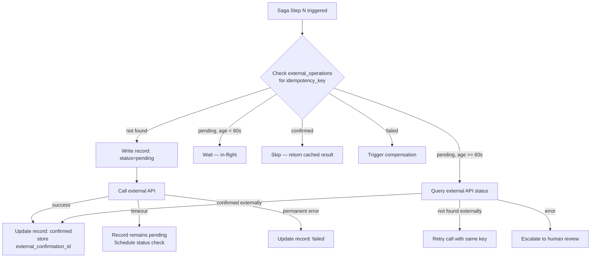

### Story Context

**Architecture review — Week 2, Monday**

The saga pattern design is approved. Before implementation begins, Kwame pulls you
into a review session with the infrastructure team.

**Kwame Asante**: Before you start building, I want to walk you through the one
thing that killed the last team that tried to fix this. They built the saga. They
didn't build idempotency into the steps. Their saga could retry. But retrying a
non-idempotent step is worse than not retrying at all.

He pastes an incident postmortem from 14 months ago:

```
INCIDENT PM-1442: Duplicate Supplier Confirmations
Filed: March 2025
Severity: P1 (revenue impact)

Root cause:
  The saga orchestrator retry logic sent a confirmation request to SupplierAPI
  for Order #OS-8821 a total of 3 times. The first request timed out at 5s.
  The second succeeded but was not recorded before the orchestrator pod restarted.
  The third was sent after pod restart.

  SupplierAPI does not deduplicate confirmation requests.
  SupplierAPI confirmed the order 3 times.

  Result: OmniLogix was billed for 3 × $84,000 = $252,000 in supplier
  confirmation fees. We owed $84,000. Accounts receivable disputed for
  4 months. Resolved at $168,000 (2× billed, 1× credited after dispute).

What failed:
  - No idempotency key sent to SupplierAPI
  - Saga state was not written before the external call — on pod restart,
    the saga had no record that step 3 had been attempted
  - The retry treated a timeout as "not attempted" rather than "unknown status"

This incident cost $84,000 in fees and 4 months of disputes.
```

**Kwame**: The lesson is: idempotency is not "don't retry." Idempotency is
"retrying is safe." Those are different designs.

---

**Slack thread — #distributed-systems, Monday afternoon**

**You**: Reviewing PM-1442. The problem wasn't the retry — it was that the saga
couldn't tell the difference between "step failed" and "step succeeded but we
lost the record of success." Those require different responses.

**Lola Adebayo** [Senior Backend]: Right. The "unknown" state. The worst state.
If you know it failed, you retry. If you know it succeeded, you skip. But if you
don't know — that's where the double-billing happens.

**You**: So the idempotency key doesn't just prevent duplicate execution on the
server side. It also gives you a query key — you can ASK the server "did this
succeed" using the same key, without re-executing.

**Lola Adebayo**: Exactly. "Check before retry." But that only works if the
external API supports it. SupplierAPI doesn't.

**You**: Then we need to build the idempotency layer in front of SupplierAPI.
A proxy that we control. We send the key to ourselves. We track it ourselves.

**Lola Adebayo**: The "wrapper idempotency" pattern. I've seen it at two other
companies. It works, but it has its own failure modes.

---

**Slack DM — Marcus Webb → You, Monday evening**

**Marcus Webb**
PM-1442. Kwame showed you the right postmortem.

Here's what most engineers miss: idempotency has TWO requirements, not one.

Requirement 1: The operation must produce the same result when called multiple
times with the same input. "Same input, same output, no side effects."

Requirement 2: The system must be able to DETECT whether the operation was
already executed. Detection is separate from execution.

Most engineers build Requirement 1 (the server rejects duplicates). They skip
Requirement 2 (the caller can query status without re-executing). You need both.

The canonical form: every operation gets an idempotency_key. The server stores
(key → result). On duplicate: return stored result. The caller can also query:
GET /operations/{key} → returns {status: "completed", result: ...}

For external APIs that don't support this: you build a proxy service that does.
The proxy stores your key → their confirmation ID mapping. Before forwarding a
request, check if you already have a mapping. If yes, return the cached result.

But here's the failure mode no one talks about:
The proxy received the request. Forwarded to SupplierAPI. SupplierAPI responded.
The proxy CRASHED before storing the mapping.

Now you have an external confirmation with no record.
Now you'll retry. And SupplierAPI will confirm again.

This is the "write-then-confirm" vs "confirm-then-write" problem.
If you write to your store BEFORE calling SupplierAPI, you guarantee deduplication.
If SupplierAPI fails, you retry. If SupplierAPI succeeds, your record is there.
But: you wrote a record for an operation that hasn't happened yet.
What status do you write? "pending." Then update to "confirmed" after success.
Then on retry: check the record. If "pending" and old enough, assume SupplierAPI
may have received it — try a confirmation status check first before re-sending.

This is not trivial. Think through the state transitions.

---

**Engineering design session — Tuesday, 10 AM**

**Lola Adebayo**: Let me show you what our current call looks like.

```typescript
// CURRENT (non-idempotent)
async function confirmWithSupplier(orderId: string, items: OrderItem[]): Promise<SupplierConfirmation> {
  const response = await supplierClient.post('/confirmations', {
    order_id: orderId,
    items: items,
  });
  return response.data;
}
```

**You**: The problem is immediate. No idempotency key. No record of the call.
No way to distinguish "never called" from "called and timed out."

**Lola Adebayo**: And SupplierAPI gives us a confirmation ID back. But we don't
record where that confirmation ID maps to our order. So if we lose it, it's gone.

**You**: We need a `supplier_operations` table. Before we call SupplierAPI, we
write a row. After SupplierAPI responds, we update the row. On retry, we check
the row first.

**Lola Adebayo**: What about the SupplierAPI that actually does support
idempotency keys? Their docs say you can send `X-Idempotency-Key: <your_key>`
and they'll deduplicate on their side.

**You**: Then we use it. But we still track the call locally. Defense in depth.
Their deduplication protects against duplicate billings. Our local record protects
against losing the confirmation ID.

**Lola Adebayo**: And for CarrierAPI?

**You**: Same pattern. Every external API call is wrapped in a local operation
record. Every operation record has an idempotency key. Every retry checks the
record first.

---

### Problem Statement

OmniLogix's saga orchestrator requires idempotent steps to enable safe retries.
However, PM-1442 revealed that idempotency failures can cost more than the
original failures they were trying to prevent. The current external API calls
are non-idempotent, have no local tracking, and cannot distinguish "not called"
from "called with unknown result." You must design the idempotency layer for
all 7 saga steps, with special focus on the 3 external API calls (SupplierAPI,
CarrierAPI, PaymentService).

### Explicit Requirements

1. Every saga step must be idempotent: calling the same step twice with the same
   idempotency key must be safe (no double-execution)
2. Every external API call must have a local operation record created BEFORE
   the call is made
3. The system must distinguish three states: `not_attempted`, `pending` (called
   but no response yet), `confirmed`, `failed`
4. On saga retry, each step must check its local operation record before
   re-executing
5. For external APIs that support idempotency keys, send the key in the
   API request
6. Idempotency keys must be deterministic — generated from order ID + step
   number, not random (so that on pod restart, the same key is regenerated)

### Hidden Requirements

- **Hint**: Marcus Webb described the "write-then-confirm" problem. Your
  `supplier_operations` record is written as "pending" before the SupplierAPI
  call. But what happens to "pending" records that are old? A record can be
  "pending" because: (a) the call is in flight right now, (b) the call was
  made but the pod crashed before recording the response, (c) the saga
  was paused intentionally. How does the idempotency layer distinguish these?
  What is the maximum time a "pending" record should live before it triggers
  a status check?

- **Hint**: Lola mentioned that SupplierAPI "sometimes" supports idempotency
  keys. But OmniLogix uses 7 different supplier APIs across different regions —
  not all of them support the `X-Idempotency-Key` header. The design must work
  for BOTH cases: APIs that support the key (leverage it) and APIs that don't
  (proxy-only idempotency). How does the system know which supplier supports
  which model?

- **Hint**: The idempotency key design says "deterministic — generated from
  order_id + step_number." But what if the same order is LEGITIMATELY retried
  after a business-level cancel-and-reorder? The client cancels order OS-8821
  and places a new order for the same items. The new order gets a new order ID.
  But what about the supplier confirmation that was already sent for OS-8821?
  Does the deterministic key design cause problems here?

### Constraints

- **Saga steps**: 7 (see Ch. 50 for full list)
- **External APIs**: SupplierAPI (7 regional variants, some support idempotency
  keys, some don't), CarrierAPI (3 carrier partners), PaymentService (internal
  but third-party payment processor gateway underneath)
- **Operation record retention**: Must retain records for 90 days (audit requirement)
- **Pending timeout threshold**: SupplierAPI max response time is 30s; a pending
  record older than 60s is "suspect" and should trigger a status check
- **Order volume**: 45,000 orders/day = ~31 orders/minute

### Your Task

Design the idempotency layer for OmniLogix's saga steps. Define the operation
record schema, the key generation strategy, and the retry-check flow for both
idempotency-aware and idempotency-naive external APIs.

### Deliverables

- [ ] **Operation record schema** — the `external_operations` table schema.
  Include: operation_id, idempotency_key, saga_instance_id, step_number,
  status, created_at, updated_at, external_confirmation_id, error_detail.
  What indexes are needed?

- [ ] **Idempotency key generation spec** — how is the key generated for each
  step? What inputs? What format? Show examples for step 3 (SupplierAPI)
  and step 5 (CarrierAPI)

- [ ] **Retry-check flow diagram** (Mermaid flowchart) — for a saga step that
  calls an external API: check operation record → decide action →
  (not_attempted: call; pending: check status; confirmed: skip; failed: compensate)

- [ ] **Supplier capability registry** — how does the system know which
  SupplierAPI variants support idempotency keys? Design a simple supplier
  capability config. What fields does it need?

- [ ] **Pending record resolution policy** — for records stuck in "pending"
  state: define the age thresholds, the resolution action (status check vs
  assume-success vs assume-failure), and the escalation path if the external
  API can't confirm either way

- [ ] **Idempotency for internal steps** — steps 1 (OrderService), 2
  (InventoryService), 4 (TransportService), 7 (DocumentService) are internal
  services. They don't need a proxy layer — but they still need idempotency.
  Design the idempotency key handling for internal steps: how does each service
  receive, store, and honor the key?

- [ ] **Tradeoff analysis** — minimum 3 tradeoffs:
  1. Deterministic idempotency keys (order_id + step) vs random UUIDs per attempt
  2. Write operation record before API call (write-first) vs after API call (write-after)
  3. Idempotency proxy for all external APIs (uniform) vs per-API idempotency
     handling (leverage native support where available)

### Diagram Format


