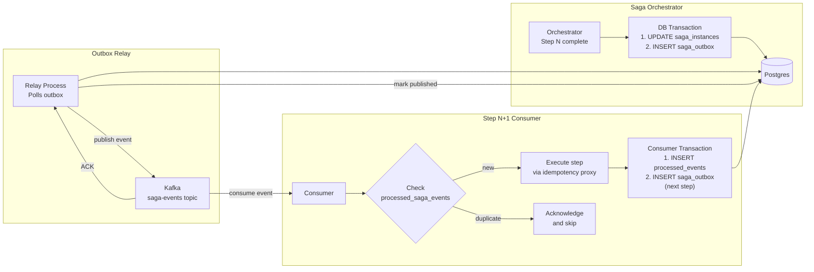

### Story Context

**#platform-engineering Slack channel — Wednesday, 9:14 AM**

```
Tobias Krenn [Platform]: @channel — heads up. We're hitting a known Kafka issue
  on the saga event stream. I've been investigating the duplicate saga-step events
  since Monday. Summary below.

Tobias Krenn: Background: when the saga orchestrator publishes a "step completed"
  event to Kafka, it does two things: (1) writes saga state to Postgres,
  (2) publishes event to Kafka. These are NOT atomic. One can succeed without
  the other.

Tobias Krenn: What we're seeing: orchestrator pod crashes after Postgres write
  but before Kafka publish → step is recorded as done in DB, but the event that
  triggers the next step is never sent → saga is stuck indefinitely.

Tobias Krenn: Alternative failure: orchestrator publishes to Kafka successfully,
  then crashes before committing saga state to Postgres → event triggers next
  step → step N+1 starts executing → but saga DB shows step N as still
  "in_progress" → we now have DB state and Kafka event stream out of sync.

You: This is the classic dual-write problem. We saw this at NovaPay.
  We need the outbox pattern here, not just at the payment layer.

Tobias Krenn: Exactly what I was going to say. But there's a wrinkle.
  At NovaPay, the outbox was for a single service. Here, the saga orchestrator
  is publishing events that multiple downstream services consume. And some
  of those consumers update their own state when they receive a saga event.
  If the consumer processes the event twice — the event is published twice
  due to a producer retry — we have the same duplicate execution problem
  we designed the idempotency layer to solve.

You: Right. Exactly-once semantics at the application level. Not just at the
  broker level.

Tobias Krenn: The broker-level exactly-once (Kafka's enable.idempotence +
  transactional API) handles producer-to-broker deduplication. It doesn't
  handle consumer idempotency. A consumer can still receive and process an
  event multiple times if it doesn't implement application-level idempotency.

Lola Adebayo [Backend]: So we need both? Kafka transactional producer AND
  application-level idempotency in every consumer?

You: Yes. Two different guarantees. Kafka guarantees the message lands in
  the partition exactly once. Application-level idempotency guarantees that
  the business logic executes exactly once when the consumer processes the
  message — regardless of how many times the message is delivered.

Tobias Krenn: And we have 7 saga step consumers. Each one needs to be
  idempotent.
```

---

**1:1 — You and Tobias Krenn, Wednesday 2 PM**

**Tobias**: Let me show you what the outbox table looks like in the current
design. It doesn't exist yet. But here's what I was thinking.

```sql
-- Current saga state (what we have)
CREATE TABLE saga_instances (
  id UUID PRIMARY KEY,
  order_id UUID NOT NULL,
  current_step INTEGER NOT NULL,
  status VARCHAR(50) NOT NULL,  -- 'in_progress', 'compensating', 'completed', 'failed'
  step_results JSONB,
  created_at TIMESTAMPTZ NOT NULL DEFAULT NOW(),
  updated_at TIMESTAMPTZ NOT NULL DEFAULT NOW()
);

-- No outbox. No event record.
-- Saga state is written to Postgres.
-- Events are published directly to Kafka.
-- These two operations are not atomic.
```

**You**: The fix is to add an outbox table. The saga orchestrator, in a single
transaction: updates `saga_instances`, inserts an event into `saga_outbox`.
Then a separate relay process reads from `saga_outbox` and publishes to Kafka.

**Tobias**: So the relay process is the only thing that writes to Kafka. The
orchestrator never writes to Kafka directly.

**You**: Exactly. The relay process is responsible for at-least-once delivery
to Kafka. But at-least-once delivery from the relay means a consumer might
get the same event twice.

**Tobias**: So consumers must be idempotent.

**You**: Yes. Every consumer that receives a saga event must check: "have I
already processed this event?" If yes, acknowledge it and skip. If no, process
it and record that it was processed.

**Tobias**: That's a `processed_saga_events` table in every downstream service?

**You**: Or a shared events deduplication service. Depends on the trade-off.
A shared service is simpler to operate, but it's a single point of failure
and a coupling point. Per-service deduplication tables are more robust but
require every service to implement the same pattern correctly.

**Tobias**: Which would you choose here?

**You**: Per-service. The services are already separated. The failure isolation
is more important than the operational simplicity. We document the pattern
once, and every service owner implements it.

---

**Slack DM — Marcus Webb → You, Wednesday evening**

**Marcus Webb**
Exactly-once semantics. The most misunderstood guarantee in distributed systems.

There are THREE layers:
1. Producer-to-broker: Kafka's `enable.idempotence = true` + `acks = all`.
   The broker deduplicates retried publishes using producer sequence numbers.
   Result: exactly-once from producer to Kafka partition.

2. Broker-to-consumer: Kafka guarantees at-least-once delivery to consumers.
   Consumers can receive a message multiple times (rebalance, crash, etc.).
   The broker does NOT prevent this. Kafka has a "read committed" isolation
   level but that prevents reading uncommitted transactional messages —
   it doesn't prevent redelivery after a consumer crash.

3. Consumer processing: application-level idempotency. This is YOUR problem.
   Kafka doesn't solve it. You do.

The Kafka transactional API (begin transaction, produce, commit) DOES give you
atomic multi-partition writes. You can write to the output topic and commit
your consumer offset atomically. This prevents "processed but offset not committed"
AND "offset committed but processing failed." But it only works if both
the input and output are Kafka topics. Once you involve a database, you're
back to dual-write.

Outbox pattern is the right answer for DB + Kafka. It's the only way to make
a DB write and a Kafka publish atomic without 2PC.

One more thing: your outbox relay needs to be idempotent too. What happens
if the relay publishes an event, crashes before deleting the outbox row, and
then restarts and publishes it again? Your consumer idempotency handles it —
but it's worth tracking metrics on how often this happens. If it's > 0.1%,
your relay or Kafka is unhealthy.

---

**Engineering session — Thursday 10 AM**

**Lola Adebayo**: I'm looking at the consumer implementation. Here's the
pattern I want to standardize across all 7 saga step consumers:

```typescript
// Pattern proposal: Idempotent saga event consumer
async function handleSagaEvent(event: SagaStepEvent, db: Database): Promise<void> {
  // Step 1: Check if we already processed this event
  const existing = await db.query(
    'SELECT id FROM processed_saga_events WHERE event_id = $1 AND consumer_name = $2',
    [event.event_id, CONSUMER_NAME]
  );

  if (existing.rows.length > 0) {
    // Already processed — acknowledge and skip
    logger.info({ event_id: event.event_id }, 'Duplicate event — skipping');
    return;
  }

  // Step 2: Process the event
  const result = await executeStepLogic(event);

  // Step 3: Record processing and update saga state atomically
  await db.transaction(async (tx) => {
    await tx.query(
      'INSERT INTO processed_saga_events (event_id, consumer_name, processed_at, result) VALUES ($1, $2, NOW(), $3)',
      [event.event_id, CONSUMER_NAME, JSON.stringify(result)]
    );
    await tx.query(
      'UPDATE saga_instances SET current_step = $1, step_results = step_results || $2 WHERE id = $3',
      [event.step + 1, JSON.stringify({ [event.step]: result }), event.saga_instance_id]
    );
    await tx.query(
      'INSERT INTO saga_outbox (saga_instance_id, event_type, payload) VALUES ($1, $2, $3)',
      [event.saga_instance_id, `step_${event.step + 1}_ready`, JSON.stringify(result)]
    );
  });
}
```

**You**: Two issues with this. First, the check-then-insert between Step 1
and Step 3 is a TOCTOU race condition. Between the check and the insert,
a duplicate event could be processed by another pod simultaneously.

**Lola Adebayo**: Right. We need the insert in Step 3 to have a UNIQUE
constraint on `(event_id, consumer_name)` — and we need to handle the
unique violation as "already processed."

**You**: Exactly. `INSERT ... ON CONFLICT DO NOTHING` with a check of
`rows_affected`. If 0 rows were inserted, it means a duplicate raced us —
abort the transaction and return.

**Lola Adebayo**: Second issue?

**You**: Step 2 — `executeStepLogic` — might call an external API. That
external call is not inside the transaction. If the external call succeeds
but the transaction fails, we've called the external API but not recorded it.

**Lola Adebayo**: So we're back to the idempotency layer from Ch. 51.

**You**: Exactly. The `external_operations` table is the bridge. The consumer
calls the external API through the idempotency proxy. The proxy creates the
`external_operations` record. Then the consumer writes to `processed_saga_events`
and `saga_outbox` in a single transaction. The external operation record and
the saga event record are in separate tables, but both are durably written.

---

### Problem Statement

OmniLogix's saga orchestrator uses Kafka to coordinate step execution across
services, but the current design has a dual-write problem: saga state is written
to Postgres and events are published to Kafka in two separate operations, with
no atomicity guarantee. Additionally, consumers lack idempotency, meaning event
redelivery (which Kafka guarantees at-least-once) can trigger duplicate
step execution. You must design the outbox pattern for the saga orchestrator
and the application-level idempotency contract for all saga step consumers.

### Explicit Requirements

1. The saga orchestrator must write saga state and publish step events atomically
   (the outbox pattern — single transaction, relay process handles Kafka publish)
2. The outbox relay must handle Kafka publish failures with retries
3. Every saga step consumer must be idempotent: processing the same event twice
   must produce the same result as processing it once
4. Consumer idempotency must be implemented at the DB level (UNIQUE constraint
   on processed events) — not just in application logic
5. The Kafka producer must use `enable.idempotence = true` and `acks = all`
6. Consumer offset commits must happen AFTER successful processing — not before

### Hidden Requirements

- **Hint**: Tobias described the relay process: "reads from saga_outbox, publishes
  to Kafka." But what if the relay publishes the event, Kafka ACKs it, and then
  the relay crashes before deleting the outbox row? On restart, the relay will
  republish the event. This is expected — it's the at-least-once guarantee.
  But the relay needs to track which outbox rows it has already published,
  so it doesn't publish every row on every restart. What does the relay's
  internal state look like? How does the relay mark rows as "published"?
  Is marking them "published" itself an atomic operation with the Kafka publish?

- **Hint**: Lola's code has `INSERT INTO saga_outbox` inside the consumer
  transaction. This means every consumer that processes a saga event also
  writes to the saga_outbox, triggering the next step. But the outbox relay
  is a separate process. What is the latency between a consumer writing to
  the outbox and the relay picking it up and publishing to Kafka? If the relay
  polls every 100ms, is that acceptable for the OmniLogix saga flow? What are
  the options for lower-latency outbox relay? (Hint: consider PostgreSQL LISTEN/NOTIFY)

- **Hint**: The `processed_saga_events` table is per-service. Over time,
  this table will grow without bound. Orders processed 90 days ago don't need
  their event records anymore. But deleting rows from a high-write table has
  its own performance implications. What is the retention and cleanup strategy
  for `processed_saga_events`?

### Constraints

- **Order volume**: 45,000 orders/day = ~31 orders/minute; each order has 7 steps
  = ~217 saga events/minute across all services
- **Kafka redelivery rate**: ~0.1% of events are redelivered (consumer crash,
  rebalance) — ~13 duplicates/hour
- **Outbox relay latency target**: < 500ms from saga state write to Kafka publish
- **Consumer processing latency**: Each saga step consumer must process and
  acknowledge within 30s (external API SLA)
- **Event retention**: `processed_saga_events` must retain 90 days minimum

### Your Task

Design the complete Kafka exactly-once architecture for OmniLogix's saga
orchestration layer, including the outbox schema, relay design, and consumer
idempotency contract.

### Deliverables

- [ ] **Outbox schema** — the `saga_outbox` table. Include: id, saga_instance_id,
  event_type, payload, status (pending/published/failed), created_at, published_at,
  retry_count. What indexes are needed? What is the relay's query?

- [ ] **Outbox relay design** — how the relay process works: polling vs
  LISTEN/NOTIFY, batch size, retry logic on Kafka publish failure, marking
  rows as published (atomic with Kafka ACK or separate?), what happens on
  relay crash and restart

- [ ] **Consumer idempotency contract** (Mermaid flowchart) — the standard
  pattern all 7 consumers must implement: receive event → check for duplicate
  → UNIQUE constraint guard → process → write processed_events + outbox
  atomically → acknowledge offset

- [ ] **`processed_saga_events` schema** — the deduplication table per service.
  Include: event_id, consumer_name, saga_instance_id, processed_at, result_summary.
  What is the UNIQUE constraint? What is the cleanup strategy?

- [ ] **Kafka producer configuration** — the settings for the saga orchestrator's
  Kafka producer: `enable.idempotence`, `acks`, `max.in.flight.requests.per.connection`,
  `retries`, `delivery.timeout.ms`. Show the values and explain each.

- [ ] **Event schema design** — what fields does a `SagaStepEvent` Kafka message
  contain? Show the JSON structure. What fields are required for idempotency?
  What fields are required for routing to the correct consumer?

- [ ] **Tradeoff analysis** — minimum 3 tradeoffs:
  1. Outbox polling (simple, latency) vs Postgres LISTEN/NOTIFY (lower latency,
     more complex)
  2. Per-service `processed_saga_events` table vs shared event deduplication service
  3. Kafka transactional producer (exactly-once to broker) vs simple idempotent
     producer (simpler, at-most-once deduplication)

### Diagram Format


