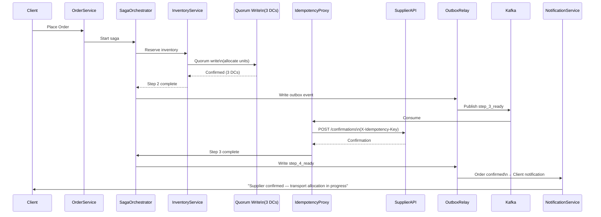

### Story Context

**Engineering All-Hands — Week 3, Monday 11 AM**

**Kwame Asante**: Three weeks in, and I want to do something I don't normally
do in all-hands. I want to show you something broken and watch us fix it live.

He brings up the incident board. There are four open P2 incidents, each with
a different root cause. But they all affect the same thing: inventory numbers
that don't match across data centers.

**Kwame**: EU-1 shows 2,400 units available for a steel component. NA-1 shows
1,800. APAC-2 shows 3,100. The actual number — the number in the supplier's
warehouse — is 2,100.

**Kwame**: Three weeks ago, I gave our new hire [you] three separate problems:
CAP theorem and consistency tiers, the saga pattern for step failures, and
idempotency for external API calls. These aren't three problems. They're one
problem viewed from three angles.

The room goes quiet.

**Kwame**: Our inventory system is broken because we made three separate bad
decisions that each seemed reasonable in isolation:

One: We chose availability over consistency at the data tier. Each DC processes
orders locally with stale reads. Result: BMW double-allocation.

Two: We had no rollback mechanism when multi-step orders partially fail.
Result: Adaora's team fixes 300 orders a day by hand.

Three: Our external API calls are non-idempotent and our saga has no memory
across pod restarts. Result: supplier triple-billing incident PM-1442.

**Kwame**: Fix one without fixing the others and you have a system that's
consistent but unrecoverable, or recoverable but inconsistent, or idempotent
but still double-allocating. You need all three to work together.

---

**Email — Adaora Nwosu to Engineering, Monday 2 PM**

```
From: Adaora Nwosu <adaora.nwosu@omnilogix.com>
To: Engineering Team <engineering@omnilogix.com>
Subject: Operations team perspective on the inventory system redesign

Team,

I want to give the operations perspective as you design the new system.

We currently handle 300 broken orders per day. Here's the breakdown:
- 180 (60%): timeout failures on external APIs (SupplierAPI, CarrierAPI)
  that left partial state. We retry manually.
- 75 (25%): conflicting inventory numbers between DCs during active orders.
  We reconcile manually by calling the supplier directly.
- 30 (10%): payment failures after everything else succeeded.
  We either retry payment or cancel and compensate.
- 15 (5%): actual business exceptions (supplier truly out of stock, client
  cancelled mid-flight). These require judgment.

The first three categories (285 orders/day) should be system-automatable.
The fourth category (15 orders/day) is where my team actually adds value.

One operational requirement I want to flag that isn't in the technical docs:
When the system automatically compensates an order, my team needs visibility.
We get calls from clients asking "why was my order cancelled?" We need to be
able to see, in plain language, exactly what happened and why the system decided
to compensate rather than retry.

The saga state machine must produce an audit trail that humans can read.
Not just technical state transitions — a narrative log.

Also: sometimes compensation isn't possible (Marcus Webb's "too late to
compensate" scenario) and we need to reach out to the client proactively.
The system should alert us BEFORE the client calls us, not after.

Adaora
```

---

**Design review — Thursday, 2 PM**

This is the synthesis review. Kwame has invited Adaora Nwosu (operations),
Tobias Krenn (platform), Lola Adebayo (backend), and the VP of Product,
Rafael Soares. Marcus Webb dials in remotely.

**Rafael Soares [VP Product]**: Before we look at diagrams, I want to
understand the user impact. Right now, when an order fails, a client gets
a notification 4-12 hours later, after Adaora's team has investigated.
What does the new system give them?

**You**: Real-time status. When a saga step fails, the client sees "Order
processing — supplier confirmation delayed" within seconds. If the saga
auto-compensates, they see "Order cancelled — full details available" within
minutes. If it needs human review, they see "Order requires manual review —
expected resolution within 2 hours."

**Rafael Soares**: That's a 4-12 hour improvement to 2 hours for the hard ones.
What about the soft ones — the auto-compensatable failures?

**You**: Minutes, not hours. The saga runs the compensation sequence automatically.
The client gets a notification when compensation completes.

**Marcus Webb** [remote]: I want to push on the consistency model. You've
designed per-operation consistency tiers — strong consistency for allocation,
eventual consistency for reads. But the saga spans 7 steps, some of which
are strongly consistent (inventory allocation) and some of which are eventually
consistent (document generation). What happens to the strong consistency
guarantees when the saga is in a compensation sequence? Is a compensation
operation also strongly consistent?

**You**: Great question. Yes. Compensation for inventory allocation —
"release the reservation" — must also go through the quorum write path.
If we release the reservation without quorum, we might release it in EU-1
but not NA-1, and NA-1 continues to see the inventory as allocated. We
could re-introduce the double-allocation problem in the compensation path.

**Marcus Webb**: Write that down somewhere. That's the failure mode I'd
probe in an interview. Compensation operations inherit the consistency
requirements of their corresponding forward operations.

**Kwame**: Let's talk about the global picture. We have 14 DCs. We have a
quorum-based allocation system. We have a saga orchestrator with an outbox
relay. We have an idempotency layer for external APIs. How does a single
order flow through this architecture from start to finish?

**You**: [presents end-to-end flow]

**Adaora**: Last question from me: what happens during a major network partition
— the kind that lasts 60+ minutes? The saga is running for an order when the
partition starts. The saga orchestrator can't reach the quorum. What does the
client experience?

**You**: The saga pauses at the step that requires quorum. The order status
transitions to "processing_delayed — network partition in progress." The saga
orchestrator persists this state. When the partition heals, the saga resumes
from the last confirmed step. The client is proactively notified. If the saga
has been paused for more than 30 minutes, Adaora's team is alerted.

**Adaora**: What if the partition heals but the saga was mid-compensation?

**You**: Compensation also pauses. This is the harder case — the client's
order is being cancelled, but the cancellation is incomplete. The system
must communicate: "cancellation in progress." This is distinct from
"cancelled" — it avoids a client re-placing the same order when they see
a stale "cancelled" status.

---

### Problem Statement

After three weeks of design work on OmniLogix's distributed systems problems —
CAP theorem and consistency tiers (Ch. 49), saga pattern with compensating
transactions (Ch. 50), idempotency at scale (Ch. 51), and Kafka exactly-once
semantics (Ch. 52) — you must now design the complete, integrated global
inventory consistency architecture. This is the synthesis chapter: all four
designs must work together as a coherent system.

### Explicit Requirements

1. Inventory allocation must use quorum-based strong consistency (prevent
   double-allocation)
2. Failed orders must be automatically compensated via the saga pattern
   (target: 240 of 300 daily manual fixes eliminated)
3. All saga steps must be idempotent; external API calls must use the
   idempotency proxy layer
4. Saga state must be durable via the outbox pattern; no permanently stuck
   orders on orchestrator crash
5. Compensation operations must inherit the consistency requirements of their
   forward operations (quorum for inventory release)
6. The system must produce a human-readable audit trail for every order
   (Adaora's requirement)
7. During network partitions, orders must transition to a "delayed" state
   — not silently stuck or cancelled

### Hidden Requirements

- **Hint**: Rafael Soares asked about "the soft ones — the auto-compensatable
  failures." The saga auto-compensates when a step fails. But how does the
  client notification system know when to send a status update? The saga
  orchestrator writes state transitions to Postgres and publishes events to
  Kafka. But is the notification system a saga consumer? If the notification
  system subscribes to saga events, it must also be idempotent. If it
  double-sends a "your order was cancelled" notification to a client, that's
  a significant business problem. How does notification idempotency work
  in the context of the saga?

- **Hint**: Marcus Webb raised the point that "compensation operations
  inherit consistency requirements." But quorum writes require at least
  3 of 14 DCs to be reachable. During a partition that isolates a single
  DC, what happens to compensation operations that are in progress in that
  isolated DC? The saga was running in DC EU-1. EU-1 is now partitioned.
  The saga must release an inventory reservation — but it can't reach quorum.
  Does the saga pause compensation? Does it proceed with an eventual-consistency
  release? What is the right behavior and what are the risks?

- **Hint**: Adaora's email mentions "a narrative log — not just technical
  state transitions." The current saga state machine stores events like
  `STEP_3_CONFIRMED`, `STEP_5_FAILED`, `COMPENSATION_STEP_4_STARTED`.
  These are machine-readable. To produce a human-readable narrative, you
  need a translation layer. Where does this translation live? Is it a
  template engine that maps state transitions to messages? Who maintains
  the templates? What language(s) must they support (OmniLogix operates
  in 47 countries)?

### Constraints

- **Data centers**: 14 globally; quorum = 3 of 14 (any 3 must be reachable)
- **Allocation consistency**: quorum write, < 500ms P99
- **Saga orchestrator**: 1 active + 1 standby per region (7 orchestrator pairs)
- **Order volume**: 45,000 orders/day = ~31 orders/minute globally
- **Manual fix target**: 60/day (down from 300/day) — 20% requiring human judgment
- **Client notification SLA**: within 5 minutes of saga state change
- **Partition behavior**: orders queue up to 30 minutes; beyond 30 minutes,
  Adaora's team is alerted; beyond 60 minutes, clients are proactively notified
- **Audit trail retention**: 7 years (supply chain compliance requirement)

### Your Task

Design the integrated global inventory consistency architecture for OmniLogix.
This is a synthesis design — you must show how the four subsystems (consistency
tiers, saga orchestration, idempotency layer, Kafka exactly-once) compose into
a coherent whole.

### Deliverables

- [ ] **End-to-end order flow diagram** (Mermaid sequence diagram) — a single
  order from creation through all 7 saga steps to completion. Show:
  which steps use quorum writes, which steps use the idempotency proxy,
  how the outbox relay fits in, where client notifications are triggered

- [ ] **Failure scenario matrix** — for each of the 7 saga steps, define:
  (a) most likely failure mode, (b) saga response (auto-retry, auto-compensate,
  human escalation), (c) client notification content, (d) Adaora's team
  alert condition

- [ ] **Compensation consistency design** — show that compensation operations
  for inventory allocation use the same quorum write path as forward operations.
  Define what happens when a partition prevents quorum during compensation.

- [ ] **Narrative audit log design** — the schema and template engine for
  human-readable order event logs. Show: how a `STEP_3_FAILED` event becomes
  "Supplier confirmation could not be completed — automatic cancellation initiated."
  What is the data model? Who can update templates?

- [ ] **Network partition response matrix** — for minor (< 1 min), moderate
  (1-60 min), and major (> 60 min) partitions: system behavior, order status
  exposed to client, Adaora's team alert, automatic recovery trigger

- [ ] **Cost estimation** — estimate the infrastructure cost of the new design
  vs the current design. Include: quorum write overhead (extra DC calls),
  outbox relay process, idempotency proxy service, `processed_saga_events`
  table storage. Compare to the $84,000/incident cost of PM-1442 and the
  operational cost of 12 engineers fixing 300 orders/day.

- [ ] **Tradeoff analysis** — minimum 3 tradeoffs:
  1. Centralized saga orchestrator (single coordinator, SPOF risk) vs
     choreography-based saga (event-driven, harder to debug)
  2. Quorum writes for all allocations (consistent, higher latency) vs
     per-operation consistency tier (complex, right-sized)
  3. Synchronous compensation (block until compensation complete, simpler
     client communication) vs asynchronous compensation (faster, harder
     to communicate intermediate state)

### Diagram Format


