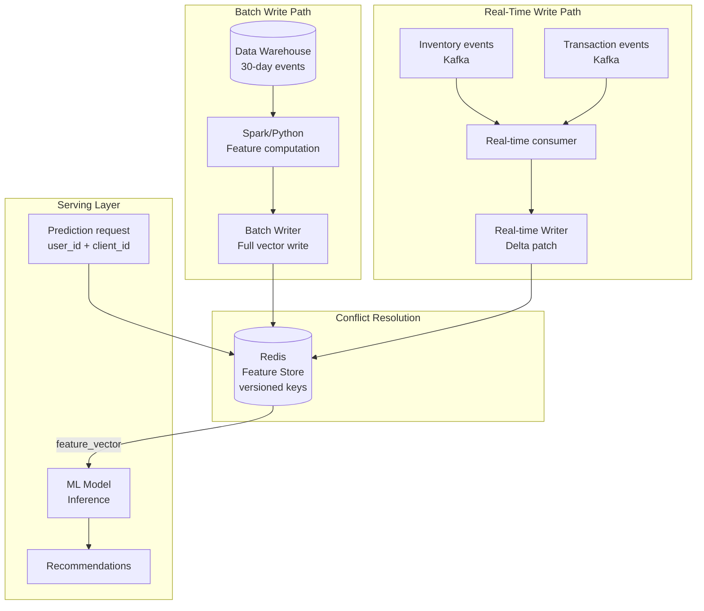

### Story Context

**Onboarding — Day 1, Thursday 10 AM**

Dr. Nadia Osei walks you through the current architecture on a whiteboard.

**Dr. Nadia Osei**: Let me show you how recommendations work today. At midnight,
a batch job runs. It reads user event data from our data warehouse — clicks,
purchases, views from the last 30 days. It computes feature vectors for every
active user: "this user has clicked 14 electronics products in the last 7 days,
purchased 2 items in the >$100 range, viewed 6 products from Brand X." These
feature vectors go into a Redis cache. We call this the feature store.

**You**: And the model reads from Redis at prediction time?

**Dr. Nadia Osei**: Exactly. User makes a request. We look up their feature
vector in Redis. We run the model. We return recommendations. The whole thing
is 18ms P99.

**You**: What's the TTL on the Redis entries?

**Dr. Nadia Osei**: 24 hours. The batch job writes new entries every night.
The old ones expire after 24 hours.

**You**: So if a user makes a purchase at 9 AM on Monday, the feature vector
doesn't reflect that purchase until Tuesday's midnight batch job. Nearly 40
hours of lag.

**Dr. Nadia Osei**: Correct. And for most users on most days, 40 hours is fine.
The recommendation quality doesn't change dramatically because they bought
a book. But for inventory — a product going out of stock — the feature matters
immediately. If we don't know a product is unavailable, we recommend it.
The client shows "add to cart," the user clicks, and... out of stock. That's
the complaint we're getting.

**You**: So the inventory feature needs to be near-real-time, but the user
behavioral features don't?

**Dr. Nadia Osei**: That's my hypothesis. But I want you to design it properly,
not just fix the inventory case. We have more clients coming in Q2. TechMart
alone will double our prediction volume. We need a feature store that can
handle real-time features for some data and batch features for others — without
the serving layer needing to know the difference.

---

**Email chain — feature store design discussion**

```
From: Jeroen van der Berg <jeroen@luminaryai.com>
To: You, Dr. Nadia Osei <nadia@luminaryai.com>
Subject: RE: Feature store latency requirements

Quick note from the serving side: whatever you build, the feature lookup
at prediction time must remain < 5ms. Right now it's ~2ms (Redis lookup).
If we add a real-time feature pipeline, I don't want the p99 to go above 5ms.

The serving layer does NOT want to know where features come from — batch
or real-time. It sends a feature_key, it gets a feature_vector back. The
feature store is the abstraction layer.

- Jeroen

---

From: You
To: Jeroen, Dr. Nadia Osei
Subject: RE: Feature store latency requirements

The < 5ms constraint is achievable if we keep Redis as the read layer.
The feature store needs TWO write paths:

1. Batch write path: nightly job writes full feature vectors for all active
   users. Bulk Redis SET with 24h TTL.

2. Real-time write path: when a product goes out of stock (inventory event),
   or a user completes a purchase (transaction event), a streaming pipeline
   updates ONLY the affected keys in Redis. Not a full recompute — a targeted
   patch of specific feature fields.

Jeroen's requirement is easy to satisfy: the serving layer still reads from
Redis. The only change is that Redis now gets updates from two places instead
of one.

The complexity is in the write paths: making sure batch writes and real-time
writes don't conflict, and making sure the feature vector is always consistent
(we don't want a half-patched feature vector from a race between batch and
real-time writes).

---

From: Dr. Nadia Osei
To: You, Jeroen
Subject: RE: Feature store latency requirements

One thing to flag: the batch write path computes feature vectors using a
trained model pipeline (Python/Spark). The real-time write path would be a
streaming update (Kafka → consumer → Redis patch). These two pipelines have
different data access patterns.

The batch path reads 30 days of history to compute a user's full feature vector.
The real-time path reads only the triggering event (one purchase, one inventory
change). If the real-time path patches a field without the full 30-day context,
the feature vector could become inconsistent. For example: a user buys a product.
We update their "recent_purchases" feature. But that feature is computed as
"count of purchases in last 30 days" — we can't compute that from one event.
We need to increment the existing count, not recompute it.

This is a delta update problem. Real-time path should apply DELTAS, not
full rewrites. The batch path writes the full vector. The real-time path
applies incremental updates.

Is that how you're thinking about it?
```

---

**Slack DM — Marcus Webb → You, Friday evening**

**Marcus Webb**
Feature stores. Welcome to the data tier of ML.

Here's the mental model: a feature store is a specialized caching system
with two unusual requirements.

First requirement: point-in-time correctness. When a model was trained on
features computed "as of September 1," the serving layer must serve features
that match what the model was trained on — not features computed at a different
point in time. If you train on "last 30 days of purchases" but serve features
that include today's purchases (which didn't exist during training), the
model is looking at data it never saw. This is called training-serving skew.
It degrades model quality in ways that are invisible until you A/B test.

Second requirement: feature freshness vs consistency. Fresh features are
good. But a partially-updated feature vector is worse than a stale one.
If batch writes user ID 12345's full feature vector, and simultaneously a
real-time write patches one field of that vector, you might serve a
frankenstein vector: 29 fields from batch, 1 field from a conflicting
real-time update. The model was never trained on that combination.

The solution: versioned writes. Each feature vector has a version. Batch
write increments the version. Real-time write only applies if the base
version matches. If there's a conflict, the batch write wins (it has
full context). Real-time updates are "best effort" — if they lose a race
with batch, they're discarded.

Think about how you'd implement this in Redis.

---

### Problem Statement

LuminaryAI's feature store is batch-only, resulting in 40-hour feature
lag that causes out-of-stock products to be recommended and recently-purchased
products to appear in recommendations repeatedly. The feature store must be
redesigned to support real-time feature updates for high-priority signals
(inventory status, recent transactions) while maintaining batch processing
for historical behavioral features, all without exceeding 5ms feature lookup
latency at prediction time.

### Explicit Requirements

1. Feature lookup at prediction time must remain < 5ms P99 (Redis as read layer)
2. Inventory features must be updated within 60 seconds of a stock change
3. Recent purchase features must be updated within 5 minutes of a transaction
4. Behavioral history features (30-day click/view history) may remain batch-updated
   (nightly is acceptable)
5. The serving layer must not know whether a feature came from batch or real-time —
   it reads one Redis key and gets one feature vector
6. Batch and real-time writes must not produce inconsistent feature vectors
   (no frankenstein vectors with conflicting field sources)

### Hidden Requirements

- **Hint**: Dr. Nadia raised training-serving skew in her email. The feature
  store must ensure that features served at prediction time match the
  distribution of features the model was trained on. If the batch training
  pipeline uses "last 30 days of purchases counted as of midnight," but the
  real-time pipeline increments a purchase counter immediately, the model
  was never trained on a feature vector where "recent_purchases = 3 at 9:47 AM."
  What are the implications for model quality? When you design the versioned
  write system, should training also use the versioned feature store — or
  is training always re-reading from the raw data warehouse?

- **Hint**: Jeroen's 5ms latency requirement assumes Redis. But Redis is
  in-memory. A feature vector for a user with 30-day behavioral history
  might be several KB. For 50 million active users across 47 clients,
  what is the total Redis memory requirement? Is it within budget?
  What is the eviction strategy for users who haven't been active recently?

- **Hint**: The TechMart client mentioned in the intro will double prediction
  volume. But TechMart also has 10 million daily active users — larger than
  any current client. If TechMart's users have their own feature vectors,
  and TechMart's products go out of stock frequently (flash sales), TechMart
  alone might dominate the real-time write pipeline. Is there a multi-tenant
  isolation concern in the feature store? Should each client's features be
  namespaced separately?

### Constraints

- **Prediction volume**: 140M predictions/day = ~1,620/sec, peak 4,000/sec
- **Active users across all clients**: ~50M unique users
- **Feature vector size**: ~2KB per user (average)
- **Feature lookup latency SLA**: < 5ms P99 (currently ~2ms)
- **Real-time update latency**: inventory < 60s, purchases < 5 minutes
- **Batch job**: nightly, runs 2-4 AM UTC (4-hour window)
- **Redis memory budget**: available for estimation (no hard cap given)

### Your Task

Design the dual-path feature store architecture: batch pipeline for historical
features, real-time streaming pipeline for high-priority signals, and a
conflict resolution strategy that prevents inconsistent feature vectors.

### Deliverables

- [ ] **Feature store architecture diagram** (Mermaid) — show both write
  paths (batch and real-time) converging on the Redis read layer. Show
  the conflict resolution point. Show the serving layer reading from Redis.

- [ ] **Feature vector schema** — define the structure of a feature vector
  for a recommendation model user. What fields are batch-computed? What fields
  are real-time-updated? Show an example JSON structure.

- [ ] **Versioned write design** — how do batch and real-time writes avoid
  producing inconsistent vectors? Define the version field, the Redis write
  logic (Lua script or transaction), and the conflict resolution rule.
  Show the TypeScript interface for the feature write operation.

- [ ] **Real-time pipeline design** — Kafka topic → consumer → Redis patch.
  What events trigger real-time feature updates? What is the consumer's
  processing logic for an inventory event? For a purchase event?

- [ ] **Redis memory estimation** — 50M users × 2KB average = how many GB?
  At what cost? What is the LRU eviction policy? What is the expected cache
  hit rate for active vs inactive users?

- [ ] **Multi-tenant isolation** — should feature vectors be namespaced by
  client? How does the serving layer specify which client's features to use
  for a given user? Can a user appear in multiple clients' feature stores?

- [ ] **Tradeoff analysis** — minimum 3 tradeoffs:
  1. Single unified feature store (simple) vs per-client feature stores
     (better isolation, more operational complexity)
  2. Delta updates for real-time (complex, consistent) vs full vector
     recompute on every real-time event (simple, expensive)
  3. Redis as feature store (fast, expensive at scale) vs a purpose-built
     feature store (Feast, Tecton) (more features, operational overhead)

### Diagram Format


