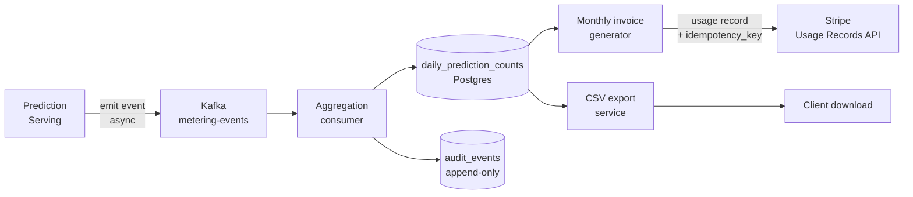

### Story Context

**Week 3 — Board meeting outcome**

**Email — Jeroen van der Berg to Engineering, Tuesday**

```
From: Jeroen van der Berg <jeroen@luminaryai.com>
To: Engineering <engineering@luminaryai.com>
Subject: Q2 billing model change — technical impact

Team,

The board approved the new usage-based billing model starting Q2. Moving from
flat monthly subscription to prediction-based pricing.

New model:
- Base fee: $500/month (includes 5M predictions)
- Overage: $0.000018 per prediction above 5M
- Premium feature tier: $0.000035 per prediction if using real-time inventory
  features (coming in Q3)

Key constraint: clients contract on "predictions served," not "predictions
requested." A prediction that returns a cached result counts as 0.
A prediction that runs the model counts as 1.

This has two implications for the engineering team:

1. We need metering. We need to count every prediction, by client, by whether
   the model ran. Currently we have no per-client prediction counter.

2. We need this to be auditable. Clients will dispute bills. They need a way
   to download their prediction usage by day.

Timeline: billing model goes live June 1. We have 8 weeks.

Jeroen
```

---

**Slack DM — Lena Kirchhoff [Head of Finance] → You, Wednesday**

**Lena Kirchhoff**: I was told you're the right person to talk to about the
metering system. Can I walk you through the compliance requirements?

**You**: Of course.

**Lena Kirchhoff**: Three things. First: the metering must be tamper-evident.
We had a dispute with a client last year — they claimed our counts were wrong.
We couldn't prove they weren't because our logs were mutable. We need immutable
usage records.

**You**: Like an append-only audit log.

**Lena Kirchhoff**: Exactly. Second: invoicing goes through Stripe. We already
use Stripe for our current flat billing. The usage-based billing needs to use
Stripe's usage records API. Have you used it?

**You**: I've used Stripe idempotency keys and their payment intents API. I haven't
used usage records specifically. I'll review the documentation.

**Lena Kirchhoff**: Third — and this is the one I'm most worried about: our
biggest clients (TechMart, RetailCo) have procurement teams that review invoices
line by line. They want daily breakdowns, not just monthly totals. "You served
us 847,210 predictions on March 14th" — not just "you served us 26M predictions
in March."

**You**: So we need daily aggregates, not just monthly totals. That's a different
storage model.

**Lena Kirchhoff**: Yes. And they want to be able to download the data in
CSV format. Their finance teams work in Excel.

**You**: Understood. One question: what happens if we over-bill due to a
metering bug? What's the SLA for dispute resolution?

**Lena Kirchhoff**: Under our contracts, disputes must be resolved within
30 days. If we can't prove our counts, we issue a credit. Last year we issued
$140,000 in credits for a count error we couldn't verify.

**You**: That's the business case for immutable metering.

---

**Engineering design session — Thursday 11 AM**

**Dr. Nadia Osei**: I want to flag something about the "predictions served"
definition. The board said "model runs, not cached results count as zero."
But we have three prediction tiers:

1. Full model inference: runs the ML model, reads features from Redis, returns
   fresh recommendations. Count: 1.

2. Cached recommendations: we cache the model output for 5 minutes per user.
   If a user makes the same request within 5 minutes, we return the cached
   recommendation list without re-running the model. Count: 0.

3. Fallback recommendations: if the feature store has no vector for a user
   (new user, feature miss), we serve popularity-based recommendations without
   running the personalization model. Count: 0.

There's also a fourth case: partial inference. If the real-time inventory
feature update takes > 30ms (our cutoff), we serve a prediction with slightly
stale inventory features rather than wait. We still ran the model. Count: 1.

**You**: We need to instrument all four cases. The metering event must capture
which tier was served — not just "prediction made."

**Dr. Nadia Osei**: And the "premium real-time feature tier" for Q3 pricing
means we need to track which features were used in each prediction, not just
whether a prediction was made.

**You**: That's a per-prediction feature provenance log. That's significantly
more storage than a simple counter.

**Jeroen van der Berg**: For Q2, we just need the counter. Per-prediction feature
provenance is a Q3 problem. But design it so Q3 is an extension, not a rewrite.

---

**Slack DM — Marcus Webb → You, Friday**

**Marcus Webb**
Third time you're designing a payments/billing system. Notice what changes
and what stays the same.

What stays the same:
- Idempotency keys (you cannot double-bill a client)
- Immutable audit trail (you cannot modify usage records after the fact)
- Reconciliation (your count must match the payment processor's count)

What changes:
- The billing model is now usage-based. This is fundamentally different from
  a flat subscription. You're not processing one payment per month. You're
  metering millions of events per day and aggregating them into a bill.
- The audit trail isn't just "payment processed." It's "prediction made at
  this timestamp for this client at this tier."
- The volume is 140 million events per day. You cannot write every prediction
  to a relational database row. You need a time-series aggregation strategy.

This is fintech meets data engineering. The correctness requirements of payments
with the scale requirements of a data pipeline. Don't underestimate either side.

---

### Problem Statement

LuminaryAI is transitioning from flat-fee to usage-based billing, requiring a
metering system that counts predictions per client per day, produces an immutable
usage audit log, integrates with Stripe's usage records API for invoicing, and
supports per-client daily usage reports. The system must handle 140 million
prediction events per day with billing correctness and tamper-evident audit
capabilities.

### Explicit Requirements

1. Every prediction must be metered: capture client_id, prediction_type
   (full inference, cached, fallback), timestamp
2. Metering records must be immutable — append-only, no updates after write
3. Daily aggregates must be computed per client (for invoicing and client reports)
4. Monthly invoice must be generated via Stripe usage records API with
   idempotency keys
5. Clients must be able to download CSV usage reports by day
6. The metering system must not add > 1ms latency to the prediction path

### Hidden Requirements

- **Hint**: Lena mentioned a $140,000 credit issued due to a "count error
  we couldn't verify." The count error was not a bug — it was a reconciliation
  failure: LuminaryAI's internal count disagreed with the client's count, and
  LuminaryAI couldn't prove theirs was correct. What does a reconcilable
  metering system look like? The client needs to be able to independently
  verify the count. How?

- **Hint**: Dr. Nadia identified four prediction tiers. The billing model
  says "model runs = billed." But what about partial inference (tier 4 —
  the model ran, but with stale features)? If a client argues "the prediction
  was wrong because you used stale inventory data," should they be billed for
  a "full inference" prediction that was effectively degraded? This is a
  contractual question, but it requires the metering system to capture enough
  metadata to resolve it.

- **Hint**: The metering pipeline is in the hot path of every prediction (1,620/sec
  average, 4,000/sec peak). If the metering write fails or is slow, should it
  fail the prediction? Fail open (serve the prediction, skip the meter) or
  fail closed (reject the prediction, don't serve it)? The business case for
  each is: fail open = never miss a prediction (good for client experience),
  but might miss billing events. Fail closed = never miss billing events, but
  degrades prediction availability. What is the right choice and what does it
  mean for monthly revenue reconciliation?

### Constraints

- **Prediction volume**: 140M/day = ~1,620/sec average, 4,000/sec peak
- **Metering write latency budget**: < 1ms added latency to prediction path
- **Audit log retention**: 7 years (financial record requirement)
- **Daily aggregate computation**: must be available by 2 AM UTC for
  previous day (Stripe invoice generation runs at 3 AM UTC)
- **Client report format**: CSV, daily breakdown, available via API download
- **Billing dispute SLA**: disputes resolved within 30 days

### Your Task

Design the prediction metering, aggregation, and billing pipeline for
LuminaryAI's usage-based billing model.

### Deliverables

- [ ] **Metering event schema** — the structure of a single metering event.
  Include: event_id, client_id, prediction_type, timestamp, feature_tier,
  model_version, latency_ms. What is the storage format? (Kafka topic? Direct
  DB write? Time-series?)

- [ ] **Metering pipeline architecture** (Mermaid) — from prediction request
  → metering event → Kafka topic → aggregation consumer → daily_usage table
  → Stripe usage records API

- [ ] **Aggregation design** — the `daily_prediction_counts` table schema.
  Granularity: client_id × date × prediction_type. Show the incremental
  aggregation strategy (streaming aggregation, not batch-only). What
  happens if an aggregation consumer crashes mid-day?

- [ ] **Stripe integration design** — how the monthly invoice is generated.
  How do you call Stripe's usage records API idempotently? What happens
  if Stripe's API is down at invoice generation time?

- [ ] **Immutable audit log design** — how are metering records protected
  from modification? Options: append-only table (no UPDATE/DELETE permissions),
  cryptographic chaining (each record includes hash of previous), or
  external audit service. Which do you choose and why?

- [ ] **Client CSV export** — how a client downloads their daily usage data.
  What API endpoint? What data format? How is it generated (on-demand query
  vs pre-computed file)?

- [ ] **Tradeoff analysis** — minimum 3 tradeoffs:
  1. Fire-and-forget metering (fail open, low latency) vs synchronous metering
     (fail closed, guaranteed billing accuracy)
  2. Raw event log (every prediction) vs aggregated counts (daily totals only)
  3. Stripe for invoicing (simple, less control) vs custom invoicing
     (full control, significant build cost)

### Diagram Format


