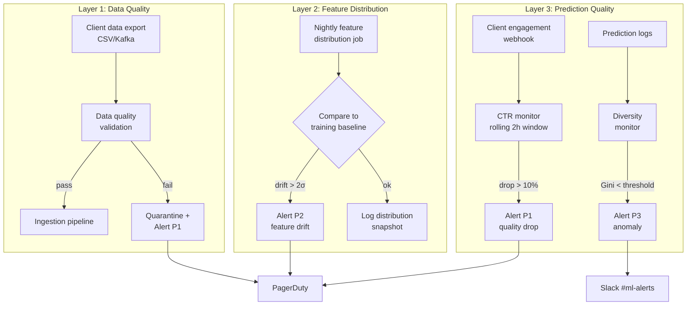

### Story Context

**Week 4 — the invisible failure**

Six weeks after you shipped the real-time inventory feature pipeline, prediction
quality is up. Client satisfaction scores are higher. The Monday morning incident
looks like ancient history. Then Dr. Nadia Osei walks over to your desk.

**Dr. Nadia Osei**: Something is wrong with the FashionHub recommendations.
I don't know what. But the click-through rate dropped 18% over the last 10 days.

**You**: Did anything change in their infrastructure? New product catalog?

**Dr. Nadia Osei**: Nothing I know of. I've been looking at the model metrics —
loss looks fine, feature distribution looks similar to training. But the
recommendations feel wrong. A/B test is showing users clicking significantly
less on the personalized recommendations than on the popularity-based fallback.

**You**: That's... the personalized model performing worse than the fallback.
That's a serious degradation.

**Dr. Nadia Osei**: And we didn't notice for 10 days.

**You**: How long has the degradation been going on?

**Dr. Nadia Osei**: I think it started about 12 days ago. But I only noticed
because a client success manager mentioned that FashionHub's contract renewal
is at risk.

**You**: We found out from account management, not from our monitoring.

**Dr. Nadia Osei**: That's the problem. Our monitoring alerts on infrastructure —
CPU, latency, error rates. It doesn't alert on recommendation quality. By the
time quality degrades visibly in business metrics, it's been degrading
technically for days.

---

**Root cause investigation — Tuesday**

**You**: Let me look at the feature vectors for FashionHub users from 12 days ago.

```
FashionHub feature vector sample (March 12, baseline):
{
  "user_id": "FH-29847",
  "client_id": "fashionhub",
  "recent_views_7d": 12,
  "recent_views_30d": 34,
  "category_preference_top3": ["dresses", "shoes", "accessories"],
  "price_range_avg": 85.40,
  "brand_affinity": ["Zara", "H&M", "Mango"],
  "feature_version": "batch_20250312",
  "feature_age_hours": 8
}

FashionHub feature vector sample (March 18, current):
{
  "user_id": "FH-29847",
  "client_id": "fashionhub",
  "recent_views_7d": 0,
  "recent_views_30d": 12,
  "category_preference_top3": ["dresses", "shoes", "accessories"],
  "price_range_avg": 85.40,
  "brand_affinity": ["Zara", "H&M", "Mango"],
  "feature_version": "batch_20250318",
  "feature_age_hours": 32
}
```

**You**: The `recent_views_7d` field is 0. That's wrong. FashionHub users are
actively browsing — this user had 12 views last week. A zero view count means
the real-time behavioral event pipeline stopped ingesting FashionHub events.

**Dr. Nadia Osei**: The batch job recomputed this field last night. But if the
event pipeline has been down for 10 days, the batch job is computing "7-day
views" from data that's only in the data warehouse — which is itself synced
from FashionHub's daily export. The daily export from FashionHub has been
arriving corrupted for 10 days.

**You**: So FashionHub's export job has been broken for 10 days. The data
warehouse is missing 10 days of behavioral events. The feature vectors look
"fresh" (batch job ran last night) but they're based on incomplete data.

**Dr. Nadia Osei**: The model is running on technically valid features. The
features just don't reflect reality. And nothing in our monitoring caught it.

**You**: Because our monitoring checks feature age, not feature correctness.

---

**#infra-review Slack thread — Tuesday afternoon**

```
You: Root cause on FashionHub: their daily export has been arriving with
  corrupted event counts for 10 days. The data warehouse ingested the corrupt
  data. The batch job computed features from corrupt data. The features look
  fresh but are wrong. Our monitoring didn't catch it.

Jeroen van der Berg: What would have caught it?

You: Several things. First: data quality checks on incoming exports.
  If FashionHub's export shows "total events = 0" when we expect > 10,000,
  that's an anomaly we should reject and alert on.

You: Second: feature distribution monitoring. The distribution of
  "recent_views_7d" across all FashionHub users should be roughly stable
  day over day. A sudden shift from mean=8.4 to mean=0.2 is statistically
  significant. We should alert when a feature distribution shifts > 2 sigma.

You: Third: prediction quality monitoring. Even without ground truth labels,
  we can monitor proxy metrics in real-time: click-through rate, add-to-cart
  rate, bounce rate. A 10% drop in CTR should page someone in hours, not days.

Priya Subramaniam: The first two I can build in the data pipeline.
  The third requires tying into the client's engagement analytics.

You: Exactly. That's where it gets complicated — we need client webhooks
  or API access for engagement signals. Not all clients will agree to that.

Jeroen van der Berg: FashionHub will. After this incident.

Dr. Nadia Osei: I want a fourth check: model-level monitoring. When the model
  produces recommendations that are outliers — recommending items with zero
  inventory, or recommending the same item to 40% of users — we should catch
  that at inference time, not 10 days later.
```

---

**Slack DM — Marcus Webb → You, Tuesday evening**

**Marcus Webb**
ML observability is qualitatively different from infrastructure observability.

Infrastructure observability: "is the system up? Is it fast? Are there errors?"
These are binary or quantitative questions with clear thresholds.

ML observability: "is the system producing correct outputs?" This is a subjective
question that requires context. The model might be "correct" by its training
metrics and "wrong" by business outcome.

The three layers of ML observability:

Layer 1 — Data quality: is the input data correct? This is the cheapest
to check and catches the most problems. Data quality checks on the ingestion
pipeline should run before data reaches the model.

Layer 2 — Feature distribution: are the features within the expected range?
Feature drift (features shifting relative to training distribution) is the
most common cause of model degradation. Monitor mean, variance, and quantiles
for each feature, daily.

Layer 3 — Prediction quality: are the predictions producing expected outcomes?
This requires feedback — click rates, conversion rates, engagement signals.
Latency: days to weeks (waiting for downstream signals). But it's the only
layer that catches "model is technically correct but business irrelevant."

You caught a Layer 1 failure (corrupted input data). The absence of Layer 2
monitoring meant it propagated. The absence of Layer 3 monitoring meant it
took 10 days to surface.

Build all three layers. In that order.

---

### Problem Statement

LuminaryAI discovered a 10-day model quality degradation only after a client
success manager raised a contract renewal concern — not through automated
monitoring. The root cause was corrupted input data from FashionHub's daily
export pipeline, which propagated through the data warehouse and feature store
undetected. The system needs three layers of ML-specific observability: data
quality checks at ingestion, feature distribution monitoring, and prediction
quality proxies. This must integrate with the existing infrastructure monitoring
(latency, error rates) to create a unified observability system.

### Explicit Requirements

1. Incoming client data exports must be validated before ingestion (data quality layer)
2. Feature distributions must be monitored daily; shifts > 2 sigma must alert
3. Prediction quality proxy metrics (CTR, bounce rate) must be monitored for
   clients that provide engagement webhooks
4. Data quality validation failures must halt ingestion and alert (not silently
   corrupt the feature store)
5. All observability signals must flow into a unified alerting system (PagerDuty)
   with severity levels
6. The monitoring system must not add > 2ms to the prediction path

### Hidden Requirements

- **Hint**: Dr. Nadia mentioned "model-level monitoring — recommending items
  with zero inventory to 40% of users." This is a prediction-time anomaly
  detector: a rule that runs at inference time and flags unusual recommendation
  patterns before they're served. But if the anomaly detector runs synchronously
  on the prediction path, it adds latency. If it runs asynchronously, it
  can't prevent a bad prediction from being served. What is the architecture?
  Does the anomaly detector block or observe?

- **Hint**: Feature distribution monitoring compares today's distribution to
  the training distribution. But the training distribution was computed months
  ago, and the model is periodically retrained. When the model is retrained,
  the "expected distribution" baseline must be updated. Who updates it?
  Automatically on every training run, or manually by a data scientist?
  What happens if the baseline is stale?

- **Hint**: The observability system needs to alert when prediction quality
  drops. But "quality" is measured by CTR, which requires client engagement
  data. Not all clients share engagement data. For clients without engagement
  data, how do you monitor prediction quality? Are there internal proxy metrics
  — like "recommendation diversity" (are we recommending the same few products
  to everyone?) — that don't require external client data?

### Constraints

- **Prediction volume**: 140M/day = ~1,620/sec average
- **Client count**: 47 clients; ~12 provide engagement webhooks
- **Feature vector fields**: ~40 fields per user; ~50M active users
- **Feature distribution monitoring**: run nightly (compares yesterday's
  distribution to training baseline)
- **Data quality checks**: run on every ingestion event (< 100ms per check)
- **Prediction quality alert SLA**: alert within 2 hours of metric drop
  (vs current 10 days)

### Your Task

Design the three-layer ML observability system for LuminaryAI: data quality
at ingestion, feature distribution monitoring, and prediction quality proxies.

### Deliverables

- [ ] **Three-layer observability architecture** (Mermaid) — show data quality
  checks at ingestion, feature distribution monitoring job, engagement webhook
  collector, and their connections to alerting

- [ ] **Data quality check design** — for incoming client exports: what
  fields are validated? What validation rules? What happens on failure
  (halt ingestion, alert, quarantine)? Show the validation schema for
  a client event export.

- [ ] **Feature distribution monitoring** — how is the training distribution
  baseline stored? What statistical test is used to detect drift (KL divergence,
  Wasserstein distance, simple 2-sigma threshold)? What is the alerting logic?
  Define the `feature_distribution_baselines` table schema.

- [ ] **Prediction quality monitoring** — for clients with engagement webhooks:
  how are CTR and bounce rate computed? What is the statistical test for
  detecting a significant drop vs normal variance? Define the alerting threshold.

- [ ] **Internal proxy metrics** — for clients without engagement data:
  define 2-3 internal prediction quality proxies that can be computed without
  external data. Show how "recommendation diversity" (Gini coefficient across
  recommended items) is computed.

- [ ] **Unified alerting taxonomy** — define the severity levels and escalation
  paths:
  - P1 (client SLA at risk): page on-call immediately
  - P2 (quality degrading, no immediate SLA risk): Slack alert within 1 hour
  - P3 (anomaly detected, investigate): Slack alert, no page
  Map each monitoring type (data quality, feature drift, CTR drop) to a severity.

- [ ] **Tradeoff analysis** — minimum 3 tradeoffs:
  1. Synchronous prediction anomaly detection (blocks bad prediction) vs
     asynchronous (observes but doesn't block)
  2. Per-client observability (granular, expensive) vs shared observability
     thresholds (cheaper, less sensitive)
  3. Custom observability pipeline (tailored to ML needs) vs off-the-shelf
     ML monitoring tools (faster to deploy, less customizable)

### Diagram Format


