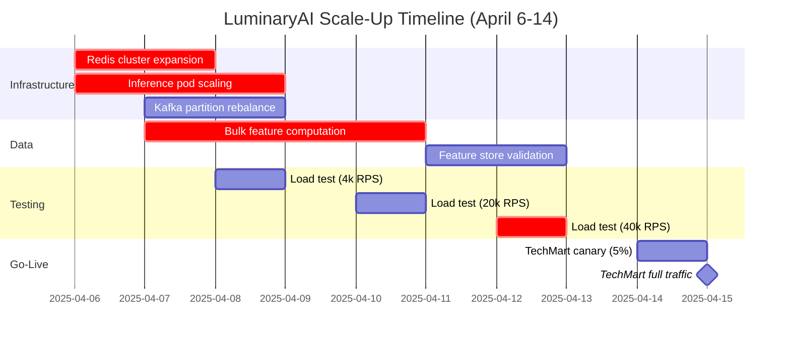

### Story Context

**SPIKE — Scale 10x by Friday**

**Wednesday, 11:47 AM — Slack #leadership**

```
Jeroen van der Berg: Urgent call at 1 PM. All engineering leads.
```

**Wednesday, 1:02 PM — Call transcript**

**Kwame Asante** [not yet — wrong company, strike that]

**Rafael Mensah [CEO]**: I'll be brief. TechMart signed the enterprise expansion.
They're bringing us 6 additional subsidiary brands. Combined, these brands
have 200 million monthly active users. Our current total MAU is 40 million.
This is a 5x volume increase in users and roughly a 10x increase in prediction
requests because TechMart subsidiaries have more mobile traffic than desktop.

**Jeroen van der Berg**: When?

**Rafael Mensah**: Go-live is April 15th. That is 9 days.

**Jeroen van der Berg**: [silence]

**Rafael Mensah**: I know what you're going to say.

**Jeroen van der Berg**: Nine days is not enough time to redesign anything.
We can scale what exists. We cannot safely introduce new architecture in 9 days.

**Rafael Mensah**: What do we need to do?

**Jeroen van der Berg**: I'm going to put our backend engineer on this today.
We'll have a capacity plan and a risk assessment by Thursday morning.

---

**Wednesday 2 PM — your desk**

**Jeroen van der Berg**: Current numbers. 140M predictions/day. Peak: 4,000 RPS.
TechMart expansion will bring us to roughly 1.5 billion predictions/day. Peak:
possibly 40,000 RPS. That's 10x on RPS.

Current infrastructure (rough):
```
Prediction serving: 24 pods × 8 vCPU = 192 vCPU total
  Each pod handles ~170 RPS peak
  Model inference: 12ms avg, 18ms P99

Feature store (Redis): 2 nodes × 64GB = 128GB total
  Current utilization: ~65GB (50M users × ~1.3KB avg feature vector)
  Read latency: 2ms P99

Data pipeline:
  Nightly batch job: 4-hour window, 40M user feature vectors
  Real-time streaming: 2 consumers, handles inventory + transaction updates

Kafka: 3 brokers, 12 partitions on metering-events topic
```

**You**: At 10x volume, what breaks first?

**Jeroen van der Berg**: I expect: Redis memory (200M users × 1.3KB = 260GB),
then prediction serving capacity, then the Kafka metering pipeline.

**You**: Does TechMart's expansion include 200M new user feature vectors that
we need to precompute?

**Jeroen van der Berg**: Yes. We have their historical data already — TechMart
shared a 12-month user behavior export. We need to compute feature vectors
for 200M users before April 15th.

**You**: The batch job currently processes 40M users in 4 hours. 200M new
users would take 20 hours. That doesn't fit in the nightly window.

**Jeroen van der Berg**: I know.

---

**Slack DM — Dr. Nadia Osei → You, Wednesday 4 PM**

**Dr. Nadia Osei**: One more constraint you should know about before your
capacity plan. TechMart's subsidiaries have different behavioral patterns
from our current clients. Their users are more mobile-heavy, which means
shorter session times — 3-5 minutes per session instead of 8-12 minutes.
This affects prediction cache hit rates.

We currently cache the model's output (recommendation list) for 5 minutes
per user. For desktop users with 10-minute sessions, that's roughly 2
prediction requests per session, and the second one hits the cache.
Cache hit rate: ~45%.

For mobile users with 4-minute sessions, they might make 1 prediction
request per session — and leave before the 5-minute cache window is useful.
Expected cache hit rate: ~10-15%.

This means our effective RPS (model actually runs) is much higher than raw
RPS for TechMart subsidiaries. If we naively scale to 40,000 RPS, we might
be running the model 35,000 times per second instead of ~21,000 times.

**You**: Because the cache is less effective for short sessions.

**Dr. Nadia Osei**: Yes. You need to account for this in your capacity plan.

---

**Slack DM — Marcus Webb → You, Wednesday evening**

**Marcus Webb**
9 days. You can't redesign. You can scale and you can cache smarter.

Identify the bottlenecks in order. Fix the biggest one first. Don't gold-plate
the solution — your job is April 15th, not a perfect architecture.

Three things I would look at:

1. Feature store memory: 260GB won't fit in your current Redis. You have
   two options — add more Redis nodes (expensive, fast) or implement a
   tiered cache (hot users in Redis, cold users in disk-backed store).
   For 9 days: add nodes. Note it for redesign after go-live.

2. Model inference: the model is running on CPU. For 10x RPS with a lower
   cache hit rate, you need either more CPU pods or GPU inference.
   GPU inference can reduce model latency from 12ms to 2ms — meaning
   each GPU pod serves ~5x more RPS than a CPU pod. Cost tradeoff:
   GPUs are expensive. Spot instances can help.

3. Initial feature computation: 200M users, batch job can't process in one night.
   You need a parallel bulk-compute job. This is a one-time operation.
   Use Spark with a larger cluster for the initial load.

This is not a design problem. It's a capacity planning and operational problem.
Show your math.

---

### Problem Statement

LuminaryAI must scale from 140M to 1.5B predictions/day in 9 days to accommodate
TechMart's enterprise expansion. Current infrastructure cannot handle the 10x
RPS increase: Redis memory (65GB of 128GB used for 50M users) will be exceeded
with 250M users, prediction serving is CPU-bound, and the nightly batch job
cannot compute 200M new user feature vectors in a single 4-hour window. A
capacity plan and execution timeline must be delivered by Thursday morning.

### Explicit Requirements

1. Prediction serving must handle 40,000 RPS peak by April 15th
2. Feature store must accommodate 250M user feature vectors (50M existing + 200M new)
3. Initial feature computation for 200M TechMart users must complete before April 15th
4. The metering pipeline must handle 10x event volume without data loss
5. All scaling decisions must include cost estimates
6. The execution must be achievable in 9 days — no architectural redesign

### Hidden Requirements

- **Hint**: Dr. Nadia flagged that TechMart's mobile-heavy user base has
  shorter sessions, reducing cache hit rate from ~45% to ~10-15%. This means
  the number of actual model inference runs per second is higher than raw RPS
  suggests. If raw RPS is 40,000 but cache hit rate is 12%, how many model
  inferences per second is the system actually doing? Does this change the
  pod count calculation compared to applying the same 45% hit rate assumption?

- **Hint**: Jeroen said "we'll scale what exists" — but the feature store has
  a structural constraint beyond memory. The batch job produces feature vectors
  for ALL users in a single pass. With 250M users, the batch job writes
  250M Redis keys in a 4-hour window. At what write RPS does the batch job
  need to operate to complete 250M writes in 4 hours? Is Redis's write
  throughput the bottleneck? What is Redis's maximum write throughput?

- **Hint**: TechMart's historical data is 12 months of user behavior — a
  one-time 200M user feature computation. But after April 15th, TechMart's
  users generate ongoing behavior that must be ingested daily. What is the
  steady-state nightly batch job load after go-live? Does the 4-hour window
  still work with 250M users instead of 50M? If not, what is the long-term
  solution that must be planned now even if not implemented by April 15th?

### Constraints

- **Current state**: 140M predictions/day, 4,000 RPS peak, 50M users in Redis
- **Target state**: 1.5B predictions/day, ~40,000 RPS peak, 250M users
- **Timeline**: 9 days (April 6 → April 15)
- **Cache hit rate (current clients)**: ~45%; **TechMart subsidiaries**: ~12%
- **Current Redis**: 2 nodes × 64GB; **Model inference**: 12ms avg, CPU
- **Budget**: not specified — include costs, Jeroen will review
- **Risk tolerance**: no redesign; only scale existing components

### Your Task

Produce a capacity plan and execution timeline for scaling LuminaryAI to
handle TechMart's expansion by April 15th.

### Deliverables

- [ ] **Bottleneck analysis** — list the 5 likely bottleneck points in order
  of expected impact. For each: current capacity, required capacity, the
  calculation showing the gap.

- [ ] **Scaling math** — show all calculations:
  - Effective inference RPS (accounting for cache hit rate difference)
  - Pod count required for 40,000 peak RPS at 12ms P99
  - Redis memory required for 250M users × 1.3KB
  - Batch job write RPS required for 250M writes in 4 hours
  - Kafka partition count for 10x metering event volume

- [ ] **Redis scaling plan** — how to expand from 128GB to the required capacity.
  Options: add nodes to existing cluster, add a second Redis cluster, implement
  key eviction for inactive users. Show the plan, the timeline, and the risk.

- [ ] **Inference scaling plan** — CPU pod scaling vs GPU inference migration.
  Show cost comparison: X CPU pods vs Y GPU pods at the required RPS.
  What can realistically be done in 9 days?

- [ ] **Bulk feature computation plan** — how to compute 200M user feature
  vectors before April 15th. What Spark cluster size? How long will it take?
  What is the Redis write strategy to avoid overwhelming the cluster
  during the bulk load?

- [ ] **9-day execution timeline** — day-by-day plan from April 6 to April 14.
  What gets done on each day? What are the dependencies? What is the
  go/no-go decision point?

- [ ] **Tradeoff analysis** — minimum 3 tradeoffs:
  1. Add Redis nodes now (fast, expensive) vs tiered cache design (slower to
     implement, better long-term)
  2. CPU pod scaling (immediately available) vs GPU migration (2x-5x more
     efficient, requires model deployment change)
  3. Full 250M user feature precompute (complete coverage) vs on-demand
     feature computation for new users (lower upfront cost, cold-start latency)

### Diagram Format


