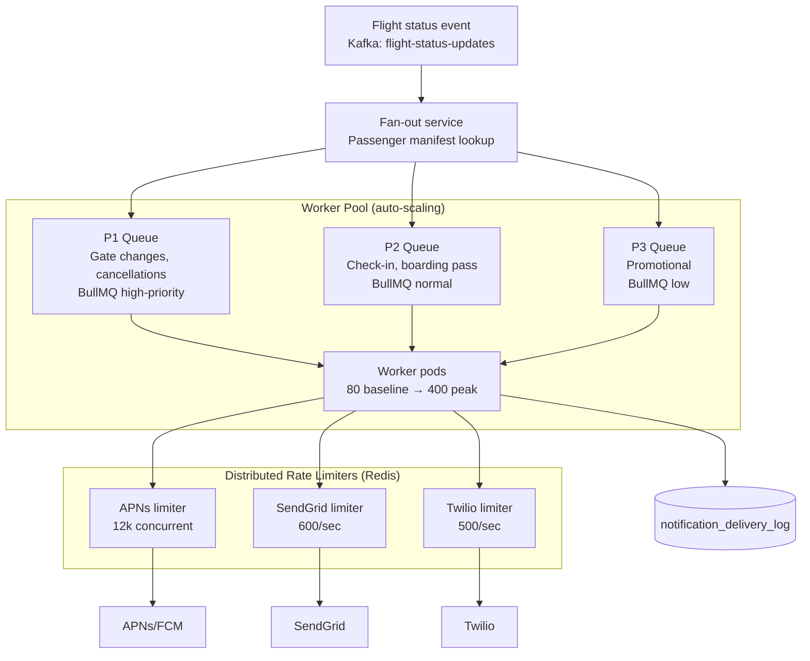

### Story Context

**Incident postmortem review — Day 1, Thursday afternoon**

Amina Diallo hands you a postmortem document without preamble.

```
INCIDENT PM-SR-2291: Notification System Cascade Failure
Date: July 14, 2025 (Chicago O'Hare weather delay event)
Severity: P0
Duration: 2 hours 17 minutes of degraded notification delivery

Timeline:
14:00 CDT: United Airlines reports 47 gate changes at ORD due to storm
  rerouting. SkyRoute receives 47 flight status update events.

14:03 CDT: Flight status events trigger notification fan-out.
  47 flights × average 180 passengers/flight = 8,460 passengers.
  Each passenger: up to 3 notification channels (push, SMS, email).
  Total notification jobs enqueued: ~22,000.

14:07 CDT: STORM_FRONT_1 expands. United reports 89 additional gate changes.
  ORD is now at 136 affected flights.
  Additional notification jobs enqueued: ~48,000.

14:11 CDT: AA, Southwest, and Delta begin reporting delays at ORD.
  Total affected flights: 412. Total passengers: ~74,000.
  Total notification jobs enqueued in 11 minutes: ~212,000.

14:12 CDT: BullMQ job queue saturates. 212,000 jobs pending.
  Worker pool: 80 workers × 3 concurrent jobs = 240 jobs/second capacity.
  At 240 jobs/second: 212,000 jobs would take 883 seconds (14+ minutes).

14:18 CDT: APNs begins rate-limiting SkyRoute's push notification requests.
  APNs HTTP/2 multiplexed limit: 1,500 concurrent streams per connection.
  SkyRoute has 8 APNs connections = 12,000 concurrent push requests max.
  At 240 jobs/second, SkyRoute was sending pushes faster than APNs could handle.
  APNs starts returning 429 responses.

14:22 CDT: Email provider (SendGrid) also rate-limiting. SMS provider (Twilio)
  begins queuing.

14:35 CDT: Worker pool is spending 40% of cycles on retry logic for 429 errors.
  Effective delivery rate drops to 140 notifications/second.
  Queue depth growing, not shrinking.

15:47 CDT: Worker pool exhausted. 87,000 notifications undelivered.
  Passengers receiving gate change notifications after gate had already closed.

Root cause:
  - No rate limiting against APNs/SendGrid/Twilio
  - Fan-out triggered immediately — no pre-staging or batching
  - Worker pool not scaled for irregular operations volume
  - No priority queue — gate closure notification same priority as
    "your boarding pass is ready" email
```

**Amina Diallo**: 87,000 undelivered notifications. Passengers at the wrong
gate. Seven airlines called us within 48 hours about SLA violations. Two are
in penalty clause review.

**You**: The root cause is clear. Three interconnected failures:
no provider rate limiting, no priority tiers, no horizontal scaling trigger.

**Amina**: I know the root cause. What I need is the design that prevents it.

---

**1:1 — You and Tariq Nassar [Lead Notification Engineer], Day 2**

**Tariq Nassar**: Let me walk you through the current notification system
before you redesign it. We've been iterating on it for 3 years.

Current architecture:
- Flight status events arrive via Kafka (`flight-status-updates` topic)
- A fan-out service consumes the events
- For each event: looks up all passengers on the flight, enqueues a
  notification job per passenger per channel in BullMQ
- BullMQ workers process jobs: call APNs, SendGrid, or Twilio

**You**: What's the max events per second from Kafka?

**Tariq Nassar**: Normal operations: 40-60 flight updates per minute.
  Irregular operations (what happened July 14): 200-400 per minute.
  The all-time peak was during a North Atlantic winter storm in 2024:
  1,100 flight updates in 8 minutes.

**You**: And each flight update fans out to how many passengers?

**Tariq Nassar**: Average 180 passengers per flight. But ORD, JFK, LHR
  flights average 280 passengers. International flights: up to 450.

**You**: At 1,100 flights × 280 passengers × 3 channels = 924,000 notification
  jobs in 8 minutes. That's 1,925 jobs per second for 8 minutes.

**Tariq Nassar**: Our current worker pool handles 240 jobs per second.
  We knew the math. We didn't fix it before it happened.

**You**: The math isn't even the biggest problem. The biggest problem is
that all notifications are the same priority. A gate change 30 minutes
before departure is not the same as a boarding pass email 2 days before
the flight. We need a priority system.

**Tariq Nassar**: What are the priority tiers you're thinking?

**You**: At minimum three. P1: operational — gate change, departure delay,
  flight cancellation, boarding now. These must arrive within 5 minutes.
  P2: pre-departure — check-in reminder (24h before), boarding pass ready.
  Target: within 30 minutes. P3: promotional — upgrade offers, lounge access.
  Best-effort, can be delayed during high load.

---

**Slack DM — Marcus Webb → You, Day 2**

**Marcus Webb**
Third time you're designing a notification system. Let me give you the arc.

First time (Beacon Media, Ch. 20): 8.5M push notifications, Champions League.
Fan-out on write, APNs batch API, basic rate limiting. Problem: single event
type, predictable volume.

Second time (NeuroLearn, Ch. 43): 6M notifications in 94 minutes, exam reminders.
Pre-staged fan-out (48h in advance), idempotency via staged table. Problem:
predictable timing, but tight 90-minute delivery window.

This time (SkyRoute): 8M notifications in 40 minutes, irregular operations.
Unpredictable: no 48-hour warning. Massive: 10x peak vs baseline.
Time-critical: gate change must arrive before the gate closes.
Multi-channel: push + SMS + email, each with different rate limits.

The new dimensions:
1. Priority. Not all notifications are equal. A gate closure is different
   from an upgrade offer. Your fan-out must maintain priority ordering.

2. Provider rate limit management. APNs, Twilio, SendGrid each have rate
   limits. Your system must stay under those limits globally, across all
   workers, using distributed rate limiters.

3. Pre-staging doesn't work for operational notifications. You can't pre-stage
   a gate change 48 hours in advance. But you can pre-build the passenger
   manifest — know who is on each flight before the event fires.

4. Backpressure. When the queue is overloaded, what do you shed? P3 first.
   Then P2. Never P1. This requires the queue to have a shed policy.

The pattern that changes: fan-out is not just "for each passenger, enqueue
a job." Fan-out must be priority-aware and backpressure-aware from the start.

---

### Problem Statement

SkyRoute's notification system fails during irregular operations (mass delays,
cancellations) because the fan-out is not priority-tiered, there is no
distributed rate limiting against delivery providers, and the worker pool
cannot scale fast enough to handle 10x volume spikes. 87,000 notifications
went undelivered in one incident, causing SLA violations with 7 airline
partners. The system must be redesigned to handle irregular operations peaks
of 900,000+ notification jobs within a 40-minute window while maintaining
sub-5-minute delivery for critical operational notifications.

### Explicit Requirements

1. Three priority tiers: P1 (gate changes, cancellations, boarding — 5 min SLA),
   P2 (check-in reminders, boarding pass — 30 min SLA), P3 (promotional — best effort)
2. Distributed rate limiting against APNs (12,000 concurrent streams),
   SendGrid (600 emails/second), Twilio (100 SMS/second per phone number)
3. During overload, P3 notifications are shed first, then P2 is delayed —
   P1 is never shed
4. Worker pool must auto-scale horizontally based on queue depth
5. Pre-built passenger manifests: load passenger lists for all flights
   before flight status events arrive (avoid lookup latency during fan-out)
6. Duplicate suppression: a passenger must not receive the same notification
   twice even if the fan-out retries

### Hidden Requirements

- **Hint**: Tariq mentioned the 1,100-flight North Atlantic storm event —
  924,000 jobs in 8 minutes. But there's a detail in the incident postmortem
  that hints at a different problem: "APNs begins rate-limiting. Workers spending
  40% of cycles on retry logic for 429 errors." The retry logic is competing
  with new notification delivery. When a provider returns 429, the system
  should not immediately retry — it should back off. But how does the worker
  know when to retry if it's busy processing new notifications? The backoff
  must be implemented at the queue level (delay the job), not at the worker
  level (block the worker). What does the Kafka consumer / BullMQ job design
  look like to handle 429 backoff without blocking workers?

- **Hint**: Amina said "seven airlines called us within 48 hours about SLA
  violations." SkyRoute's contracts with airline partners define notification
  delivery SLAs per notification type. If SkyRoute breaches the SLA (notification
  delivered late), the airline may be entitled to a credit. For the system to
  dispute or honor those credits, SkyRoute needs delivery timestamps for every
  notification. The audit log must capture: event_time (when the flight status
  changed), enqueue_time (when the notification job was created), send_time
  (when the provider was called), delivered_time (for push, when APNs confirmed).
  Where does this audit log live? How does it scale to 8M events per day?

- **Hint**: "Pre-built passenger manifests" is mentioned as a requirement.
  But flight manifests change up to the moment of departure — passengers check
  in, seats are reassigned, standby passengers are added. If you pre-load
  the manifest at T-4 hours and a passenger is added at T-30 minutes, do they
  miss the gate change notification? How does the manifest update mechanism
  work?

### Constraints

- **Normal operations**: 8M notifications/day = ~92/second average
- **Irregular operations peak**: 900,000 notifications in 40 minutes = ~375/second
- **1-in-18-months extreme event**: 924,000 jobs in 8 minutes = ~1,925/second
- **APNs rate limit**: 12,000 concurrent HTTP/2 streams (8 connections × 1,500)
- **SendGrid rate limit**: 600 emails/second (contractual)
- **Twilio rate limit**: 100 SMS/second per number (SkyRoute has 5 numbers = 500/second)
- **P1 delivery SLA**: < 5 minutes from flight status event to passenger device
- **Channel mix**: 60% push (APNs/FCM), 30% email, 10% SMS

### Your Task

Design the priority-tiered, rate-limit-aware notification system for SkyRoute.
Define the fan-out architecture, priority queue structure, distributed rate
limiting per provider, shedding policy under overload, and notification
delivery audit log.

### Deliverables

- [ ] **Notification system architecture diagram** (Mermaid) — from flight
  status event → fan-out service → priority queues → provider rate limiters
  → APNs/SendGrid/Twilio → audit log

- [ ] **Priority queue design** — how are P1, P2, P3 notifications queued
  separately? What queue technology? What is the worker pool's consumption
  order (always drain P1 before P2)? What is the shed policy under overload?

- [ ] **Distributed rate limiter design** — per provider (APNs, SendGrid,
  Twilio): how is the rate limit enforced globally across all workers?
  (Redis token bucket, same pattern as Ch. 29) What is the key structure?
  What happens when a worker hits the rate limit — backoff the job or
  block the worker?

- [ ] **Pre-built passenger manifest design** — the `flight_passenger_manifests`
  cache. When is it built? How is it updated when passengers are added/removed?
  How does the fan-out service use it to avoid real-time DB lookups?

- [ ] **Auto-scaling trigger** — what metric triggers horizontal pod scaling?
  Queue depth? Queue age (time the oldest P1 job has been waiting)?
  Show the scaling rule.

- [ ] **Notification audit log schema** — the `notification_delivery_log`
  table. Include: notification_id, flight_id, passenger_id, channel,
  notification_type (P1/P2/P3), event_time, enqueue_time, send_time,
  delivered_time, status. At 8M rows/day, what is the retention and
  storage strategy?

- [ ] **Duplicate suppression design** — how does the system ensure a
  passenger doesn't receive the same notification twice? What is the
  deduplication key? How long is the deduplication window?

- [ ] **Tradeoff analysis** — minimum 3 tradeoffs:
  1. Fan-out on write (enqueue per passenger immediately) vs fan-out on read
     (single event in queue, expanded to passengers at delivery time)
  2. Separate queue per priority tier vs single queue with priority weights
  3. Pre-built manifests (lower fan-out latency, staleness risk) vs
     real-time manifest lookup (fresh, higher latency, DB pressure during storms)

### Diagram Format


