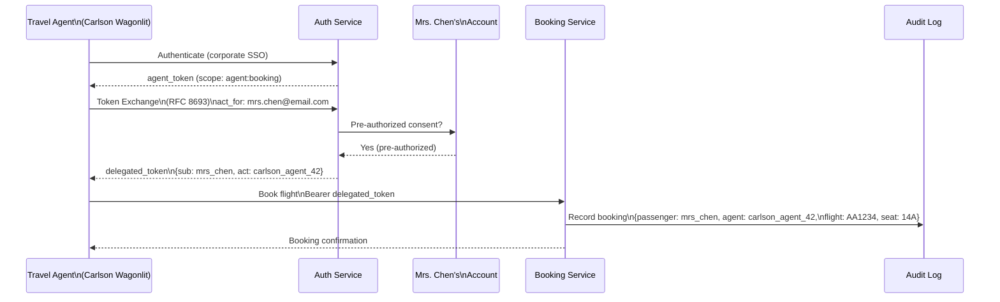

### Story Context

**Week 3 — Security incident review**

**Email — Kai Hoffmann [Security Lead] → Engineering, Monday**

```
From: Kai Hoffmann <kai.hoffmann@skyroute.com>
To: Engineering <engineering@skyroute.com>
Subject: SECURITY: Automated booking abuse — action required

Team,

We've identified systematic automated abuse of the booking API.
Summary of what we're seeing:

Attacker profile:
  - 1,247 unique IP addresses
  - Each IP sends requests at 3-7 second intervals (human-mimicking)
  - No single IP exceeds our rate limit (1,200 requests/hour per IP)
  - But combined: 1,247 IPs × 900 avg req/hour = 1.1M requests/hour
  - All requests are authenticated — they are using real account credentials

What they're doing:
  - Searching for all available seats on popular routes
  - Placing soft holds on seats (using our new soft hold API)
  - Never completing the booking
  - Holding seats prevents legitimate passengers from seeing availability
  - We call this "seat inventory harvesting"

Business impact:
  - Tuesday: Boston → New York shuttle (AA flight, 7 AM) was 0% available
    on search results for 45 minutes during the morning rush. All seats
    were held by automated accounts.
  - American Airlines flagged this as a SLA event. They may trigger
    penalty clause.

Root cause:
  - Our authentication is valid JWT-based auth. The attackers created
    real accounts, verified emails, and are using legitimate access tokens.
  - Our rate limiting is per-IP. Distributed across 1,247 IPs, they
    bypass it entirely.
  - Our soft hold API has no hold-per-user limit.

Immediate mitigation needed:
  - Maximum 5 active soft holds per user session
  - Behavioral detection: users who hold and never convert should be
    flagged and eventually banned
  - Rate limiting must move to per-account, not per-IP

Longer term:
  - Account creation must be harder (bot detection at registration)
  - Hold-to-booking conversion rate monitoring per user

Kai
```

---

**1:1 — You and Kai Hoffmann, Tuesday 2 PM**

**Kai Hoffmann**: The immediate mitigations are tactical. I want you to think
about the strategic auth redesign. Because the problem isn't just bots.
We have three distinct user populations with different auth requirements
that our current JWT system doesn't differentiate.

**You**: What are the three populations?

**Kai Hoffmann**: One — passengers. Individual travelers. They authenticate
with email/password or social login (Google, Apple). They use the booking
flow. They have low technical sophistication. They expect magic links and
SSO.

Two — travel agents. Human travel agents at companies like American Express
Travel, Carlson Wagonlit. They have corporate accounts. They make bookings
on behalf of clients. They use API access alongside the web UI. They need
to act on behalf of passengers (agent-on-behalf-of flows).

Three — GDS connectors. Global Distribution Systems — Amadeus, Sabre,
Travelport. These are automated systems, not humans. They make 10,000-50,000
API calls per minute. They book seats programmatically. They have machine-level
API credentials.

**You**: Three very different auth models.

**Kai Hoffmann**: And we're using the same JWT auth for all three.
A GDS connector gets the same access token type as a passenger.
We can't even differentiate their requests in rate limiting because
they look identical from an auth perspective.

**You**: We need account type scoping in the token itself. The JWT must
indicate: is this a passenger, a travel agent, or a GDS connector?
Different scopes → different rate limits → different behavioral rules.

**Kai Hoffmann**: And the agent-on-behalf-of flow. A travel agent books
a flight for their client, Mrs. Chen. The booking must appear in Mrs. Chen's
account history, not just the agent's. But the transaction was initiated
by the agent. How does the auth model represent that?

**You**: That's an OAuth2 delegation pattern. The agent has a token that
grants them permission to act as Mrs. Chen for booking purposes. The
token carries both the agent's identity and Mrs. Chen's identity.
The audit trail records both.

---

**Slack DM — Marcus Webb → You, Tuesday evening**

**Marcus Webb**
Third auth system. The arc:

First time (MeridianHealth, Ch. 6): HIPAA healthcare auth.
OIDC SSO for clinicians, client credentials for machine services.
Main constraint: compliance, audit attribution, MFA required.

Second time (CloudStack, Ch. 30): multi-tenant B2B SaaS.
SAML + OIDC federation for enterprise IdPs. SCIM provisioning.
Main constraint: tenant isolation, enterprise IdP diversity.

This time (SkyRoute): adversarial consumer auth.
Your threat model is not a misconfigured enterprise — it's professional
attackers with real accounts who understand your API.

What changes:
1. Adversarial sophistication: the attackers created legitimate accounts.
   They know your rate limits. They've tuned their request rates to stay
   under them. The auth system must incorporate behavioral signals,
   not just credential validity.

2. Account hierarchy: passenger → travel agent → GDS connector is not
   a flat permission model. It's a delegation chain with different
   capabilities and rate limits at each level.

3. The booking intent problem: a GDS connector with valid credentials
   making 50,000 requests/minute is different from a passenger making
   100 requests/hour, even if both authenticate the same way. The auth
   system must categorize the caller type and apply appropriate controls.

The new pattern here: OAuth2 scopes as behavioral categorization.
Not just "read:flights, write:bookings." But scopes that encode the
caller's classification: "agent:booking", "gds:inventory", "passenger:personal."
Each scope class gets different rate limits, different hold limits,
different behavioral monitoring.

---

### Problem Statement

SkyRoute's JWT-based auth system cannot differentiate between three user
populations (passengers, travel agents, GDS connectors), enabling distributed
automated abuse that bypasses per-IP rate limits using 1,247 distributed
accounts. Professional attackers created legitimate accounts to perform seat
inventory harvesting: holding all seats on popular routes without booking,
causing 0% availability windows that trigger SLA penalties from airline partners.
The auth system must be redesigned to support typed accounts with population-
specific rate limits, behavioral monitoring, and OAuth2 delegation for
agent-on-behalf-of flows.

### Explicit Requirements

1. Three account types with different auth flows: passenger (email/social SSO),
   travel agent (corporate account with delegation capabilities),
   GDS connector (machine-to-machine client credentials)
2. OAuth2 scopes must encode account type for rate limiting differentiation
3. Soft hold limit per authenticated session: 5 active holds
4. Hold-to-booking conversion monitoring per account — accounts below
   threshold flagged and reviewed
5. Agent-on-behalf-of delegation: travel agent can book for a passenger;
   audit log records both identities
6. Account creation bot detection: CAPTCHA or equivalent at registration
   for passenger accounts

### Hidden Requirements

- **Hint**: Kai said "1,247 IPs × 900 avg req/hour = 1.1M requests/hour."
  But the attackers are using REAL accounts — valid JWT tokens. Per-IP
  rate limiting doesn't help because the tokens are valid. Per-account
  rate limiting would help if each account had a rate limit. But what
  is the correct rate limit for a passenger vs a GDS connector? A GDS
  connector legitimately makes 50,000 requests/minute. A passenger
  legitimately makes 20 requests per session. If you apply a per-account
  rate limit that catches the abusive passenger accounts, does it also
  catch legitimate GDS connectors? The account type differentiation is
  what solves this — different limits for different types.

- **Hint**: "Agent-on-behalf-of delegation" is an OAuth2 Token Exchange
  flow (RFC 8693). The travel agent authenticates with their own credentials,
  then requests a delegated token for a specific passenger (with the passenger's
  consent, or with pre-authorized corporate consent). The delegated token
  has two subjects: the agent (actor) and the passenger (subject). The booking
  service records both. What is the consent model? Does Mrs. Chen need to
  explicitly authorize every travel agent booking? Or does she pre-authorize
  her corporate travel agency once? What are the security implications of each?

- **Hint**: The security incident email mentions "all requests are authenticated
  — they are using real account credentials." This means the credential
  validation layer is working correctly. The problem is the behavioral layer.
  After authentication, the system must ask: "is this legitimate behavior
  for this account type?" What signals would distinguish a seat harvesting
  bot account from a legitimate passenger account? List at least 4 behavioral
  signals that could be captured at auth/session time.

### Constraints

- **Passenger accounts**: ~180M registered users; 12M daily active
- **Travel agent accounts**: ~45,000 across 8,200 agencies
- **GDS connector accounts**: 3 major GDS (Amadeus, Sabre, Travelport);
  each makes 10,000-50,000 API calls/minute
- **Per-session hold limit**: 5 (immediate mitigation)
- **Hold-to-booking conversion threshold**: accounts below 5% conversion
  rate over 7 days are flagged
- **Account type distribution of bookings**: 35% passenger direct,
  40% travel agent, 25% GDS connector

### Your Task

Design the typed account auth system for SkyRoute: OAuth2 flows per account
type, scope encoding, per-type rate limits, agent delegation, and behavioral
detection.

### Deliverables

- [ ] **Account type auth flows** (Mermaid) — three separate flow diagrams:
  passenger (email/social), travel agent (corporate SSO + delegation),
  GDS connector (client credentials)

- [ ] **JWT scope design** — the scope set for each account type. Show example
  JWT payloads for a passenger, a travel agent, and a GDS connector.
  What claims encode the account type? What claims encode rate limit tier?

- [ ] **Per-type rate limit table** — for each account type and each API
  endpoint category (search, hold, book, cancel): the rate limit value
  and enforcement mechanism.

- [ ] **Agent delegation flow** — the OAuth2 Token Exchange flow for
  "travel agent acts on behalf of passenger." Show the token request and
  response. What does the delegated token look like? How does the
  audit log record both identities?

- [ ] **Behavioral detection design** — the signals captured per session
  and the detection rules. Define the `account_behavior_metrics` table.
  What triggers a flag? What triggers a suspension? What is the review process?

- [ ] **Bot detection at registration** — for passenger account creation:
  what friction is added? CAPTCHA, phone verification, or email verification
  only? Tradeoff: more friction → fewer bots AND fewer legitimate signups.

- [ ] **Tradeoff analysis** — minimum 3 tradeoffs:
  1. Per-account rate limiting (catches distributed bots) vs per-IP rate
     limiting (simpler, bypassed by distributed accounts)
  2. Scoped tokens per account type vs separate auth systems per account type
  3. Proactive suspension (block suspicious accounts immediately) vs
     monitoring-only with human review (lower false positive rate, slower response)

### Diagram Format


